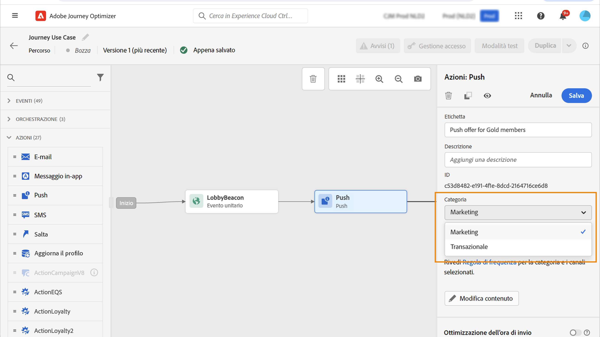
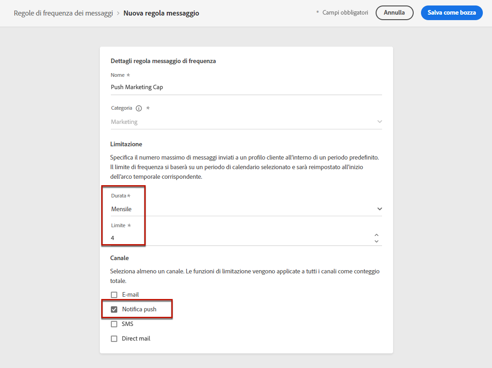

# Regole di frequenza dei messaggi {#frequency-rules}

[!DNL Journey Optimizer] consente di controllare la frequenza con cui gli utenti riceveranno un messaggio o entreranno in un percorso impostando regole cross-channel che escluderanno automaticamente i profili sollecitati eccessivamente da messaggi e azioni.

Ad esempio, per un marchio, una regola non può consistere nell’inviare più di 3 messaggi di marketing al mese ai clienti. A questo scopo, puoi utilizzare una regola di frequenza che limiterà il numero di messaggi inviati in base a uno o più canali durante un periodo di calendario mensile.

>[!NOTE]
>
>Le regole di frequenza dei messaggi sono diverse dalla gestione della rinuncia, che consente agli utenti di annullare l’abbonamento alla ricezione di comunicazioni da un brand. [Ulteriori informazioni](../privacy/opt-out.md#opt-out-management)

➡️ [Scopri questa funzione nel video](#video)

## Regole di accesso {#access-rules}

Le regole sono disponibili nella sezione **[!UICONTROL Amministrazione]** > **[!UICONTROL Regole]** menu. Vengono elencate tutte le regole, ordinate per data di modifica.

Utilizza l’icona del filtro per filtrare in base alla categoria, allo stato e/o al canale. Puoi anche eseguire ricerche sull’etichetta del messaggio.

### Autorizzazioni{#permissions-frequency-rules}

Per accedere, creare, modificare o eliminare le regole di frequenza dei messaggi, è necessario disporre del **[!UICONTROL Gestire le regole di frequenza]** autorizzazione.

Utenti con **[!UICONTROL Visualizza regole di frequenza]** Le autorizzazioni consentono di visualizzare le regole, ma non di modificarle o eliminarle.

Ulteriori informazioni sulle autorizzazioni sono disponibili in [questa sezione](../administration/high-low-permissions.md).

## Creare una regola {#create-new-rule}

>[!CONTEXTUALHELP]
>id="ajo_rules_category"
>title="Selezionare la categoria della regola del messaggio"
>abstract="Quando vengono attivate e applicate a un messaggio, tutte le regole di frequenza che corrispondono alla categoria selezionata verranno applicate automaticamente a questo messaggio. Attualmente è disponibile solo la categoria Marketing."

>[!CONTEXTUALHELP]
>id="ajo_rules_capping"
>title="Impostare i limiti per la regola"
>abstract="Specifica il numero massimo di messaggi inviati a un profilo cliente ogni mese. Il limite di frequenza sarà basato su un periodo di calendario mensile e verrà reimpostato all’inizio di ogni mese."

>[!CONTEXTUALHELP]
>id="ajo_rules_channel"
>title="Definire i canali a cui si applica la regola"
>abstract="Seleziona almeno un canale. I limiti vengo applicati a tutti i canali come conteggio totale."

Per creare una nuova regola, segui la procedura riportata di seguito.

1. Accedere a **[!UICONTROL Regole di frequenza dei messaggi]** , quindi fai clic su **[!UICONTROL Crea regola]**.

   

1. Definisci il nome della regola.

   

1. Selezionare la categoria della regola del messaggio.

   >[!NOTE]
   >
   >Attualmente solo il **[!UICONTROL Marketing]** categoria disponibile.

1. Imposta il limite per la regola, ovvero il numero massimo di messaggi che possono essere inviati mensilmente a un singolo profilo utente.

   

   >[!NOTE]
   >
   >Il limite di frequenza si basa su un periodo di calendario mensile. Viene reimpostato all’inizio di ogni mese.

1. Seleziona il canale da utilizzare per questa regola: **[!UICONTROL E-mail]** o **[!UICONTROL Notifica push]**.

   

   >[!NOTE]
   >
   >Devi selezionare almeno un canale per poter creare la regola.

1. Seleziona diversi canali se desideri applicare il limite su tutti i canali selezionati come conteggio totale.

   Ad esempio, imposta il limite su 15 e seleziona sia il canale e-mail che quello push. Se un profilo ha già ricevuto 10 e-mail marketing e 5 notifiche push marketing, verrà escluso dalla consegna successiva di eventuali e-mail marketing o notifiche push.

1. Clic **[!UICONTROL Salva come bozza]** per confermare la creazione della regola. Il messaggio viene aggiunto all’elenco di regole, con **[!UICONTROL Bozza]** stato.

   

## Attivare una regola {#activate-rule}

Una volta creata, una regola di frequenza dei messaggi presenta **[!UICONTROL Bozza]** e non influisce ancora su alcun messaggio. Per abilitarla, fai clic sui puntini di sospensione accanto alla regola e seleziona **[!UICONTROL Attiva]**.

L’attivazione di una regola influisce su tutti i messaggi a cui si applica nella successiva esecuzione. Scopri come [applicare una regola di frequenza a un messaggio](#apply-frequency-rule).

>[!NOTE]
>
>La completa attivazione di una regola può richiedere fino a 10 minuti. Non è necessario modificare i messaggi o ripubblicare i percorsi per rendere effettiva una regola.

Per disattivare una regola di frequenza dei messaggi, fai clic sui puntini di sospensione accanto alla regola e seleziona **[!UICONTROL Disattiva]**.

Lo stato della regola verrà modificato in **[!UICONTROL Inattivo]** e la regola non si applicherà alle esecuzioni future dei messaggi. Eventuali messaggi attualmente in esecuzione non saranno interessati.

>[!NOTE]
>
>La disattivazione di una regola non influisce né reimposta i conteggi sui singoli profili.

## Applicare una regola di frequenza a un messaggio {#apply-frequency-rule}

Per applicare una regola di frequenza a un messaggio, segui la procedura riportata di seguito.

1. Durante la creazione di un’ [percorso](../building-journeys/journey-gs.md), aggiungi un messaggio selezionando uno dei canali definiti per la regola.

1. Seleziona la categoria definita per il [regola creata](#create-new-rule).

   

   >[!NOTE]
   >
   >Attualmente solo il **[!UICONTROL Marketing]** La categoria è disponibile per le regole di frequenza dei messaggi.

1. Puoi fare clic su **[!UICONTROL Regola di frequenza]** per visualizzare la schermata delle regole di frequenza in una nuova scheda. [Ulteriori informazioni](#access-rules)

   Tutte le regole di frequenza corrispondenti alla categoria e ai canali selezionati verranno applicate automaticamente a questo messaggio.

   >[!NOTE]
   >
   >Messaggi in cui è selezionata la categoria **[!UICONTROL Transazionale]** non verrà valutato in base alle regole di frequenza.

1. Puoi visualizzare il numero di profili esclusi dalla consegna in [Rapporto globale](../reports/global-report.md), e nella [Rapporto live](../reports/live-report.md), in cui le regole di frequenza saranno elencate come possibile motivo per gli utenti esclusi dalla consegna.

>[!NOTE]
>
>Puoi applicare diverse regole allo stesso canale, ma una volta raggiunto il limite inferiore, il profilo verrà escluso dalle consegne successive.

## Esempio: combinare più regole {#frequency-rule-example}

Puoi combinare diverse regole di frequenza dei messaggi, come descritto nell’esempio seguente.

1. [Creare una regola](#create-new-rule) ha chiamato *Limiti di marketing complessivi*:

   * Seleziona Canali e-mail e push.
   * Imposta il limite su 12.

   

1. Per limitare ulteriormente il numero di notifiche push basate sul marketing inviate da un utente, crea una seconda regola denominata *Limite marketing push*:

   * Seleziona Canale push.
   * Imposta il limite su 4.

   

1. Salva e [attivare](#activate-rule) la regola.

1. Crea un messaggio e-mail e seleziona la **[!UICONTROL Marketing]** categoria del messaggio. [Ulteriori informazioni](../email/create-email.md)

1. Creare una notifica push e selezionare **[!UICONTROL Marketing]** categoria del messaggio. [Ulteriori informazioni](../push/create-push.md)

In questo scenario, un singolo profilo:
* può ricevere fino a 12 messaggi di marketing al mese;
* ma sarà escluso dalle notifiche push di marketing dopo aver ricevuto 4 notifiche push.

>[!NOTE]
>
>Quando si esegue il test delle regole di frequenza, si consiglia di utilizzare una nuova [profilo di test](../audience/creating-test-profiles.md), poiché una volta raggiunto il limite di frequenza di un profilo, non è possibile reimpostare il contatore fino al mese successivo. La disattivazione di una regola consente ai profili con limiti di ricevere messaggi, ma non rimuove o elimina eventuali incrementi del contatore.

## Video introduttivo {#video}

Scopri come creare, attivare, testare e creare rapporti sulle regole di frequenza.

>[!VIDEO](https://video.tv.adobe.com/v/344451?quality=12)
