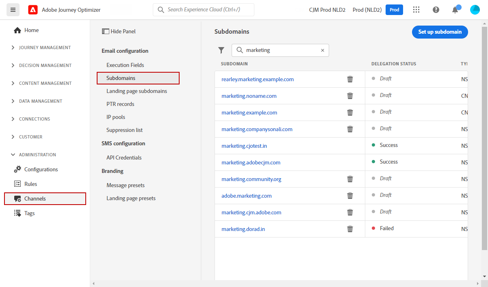

# Introduzione a [!DNL Journey Optimizer] configurazione {#start-optimizer-configuration}

Quando accedi [!DNL Journey Optimizer] per la prima volta, viene effettuato il provisioning di una sandbox di produzione e viene allocato un certo numero di IP a seconda del contratto.

Per poter creare i tuoi percorsi e inviare messaggi, devi seguire questi passaggi di configurazione:

1. **Configurare messaggi e canali**: definire predefiniti, adattare e personalizzare e-mail e messaggi push

   * Definire le impostazioni delle notifiche push in entrambi [!DNL Adobe Experience Platform] e [!DNL Adobe Experience Platform Launch]. [Ulteriori informazioni](../messages/push-gs.md)

   * Crea i predefiniti per i messaggi per configurare tutti i parametri tecnici necessari per i messaggi e-mail e per i messaggi di notifica push. [Ulteriori informazioni](message-presets.md)

   * Determina l’indirizzo e-mail da utilizzare in priorità per i destinatari quando sono disponibili più indirizzi in Adobe Experience Platform. [Ulteriori informazioni](primary-email-addresses.md)

   * Gestisci il numero di giorni durante i quali vengono eseguiti nuovi tentativi prima di inviare indirizzi e-mail all’elenco di eliminazione. [Ulteriori informazioni](manage-suppression-list.md)

   <!--
    * Understand push notification flow. [Learn more](../messages/push-gs.md)
    -->

1. **Delega sottodomini**: per utilizzare un nuovo sottodominio in Journey Optimizer, il primo passaggio consiste nel delegarlo. [Ulteriori informazioni](about-subdomain-delegation.md)

   

1. **Creare pool IP**: migliora il recapito e la reputazione delle e-mail raggruppando gli indirizzi IP forniti con la tua istanza. [Ulteriori informazioni](ip-pools.md)

   

1. **Configura percorsi**: per generare percorsi, devi configurare **[!UICONTROL Data Sources]**, **[!UICONTROL Events]** e **[!UICONTROL Actions]**. [Ulteriori informazioni](about-data-sources-events-actions.md)

   

   * La **Origine dati** La configurazione ti consente di definire una connessione a un sistema per recuperare informazioni aggiuntive che verranno utilizzate nei tuoi percorsi. Ulteriori informazioni su Origini dati in questo [sezione](../datasource/about-data-sources.md)

   * **Eventi** ti consente di attivare i tuoi percorsi singolarmente per inviare messaggi in tempo reale all’utente che entra nel percorso. Nella configurazione dell’evento, puoi configurare gli eventi previsti nei percorsi. I dati degli eventi in arrivo vengono normalizzati seguendo Adobe Experience Data Model (XDM). Gli eventi provengono dalle API Streaming Ingestion per gli eventi autenticati e non autenticati, ad esempio gli eventi SDK di Adobe Mobile. Ulteriori informazioni sugli eventi in questo [sezione](../event/about-events.md)

   * [!DNL Journey Optimizer] include funzionalità integrate per messaggi: puoi progettare il contenuto e pubblicare il messaggio. Se utilizzi un sistema di terze parti per l’invio dei messaggi, crea un **azione personalizzata**. Ulteriori informazioni sulle azioni in questo [sezione](../action/action.md)