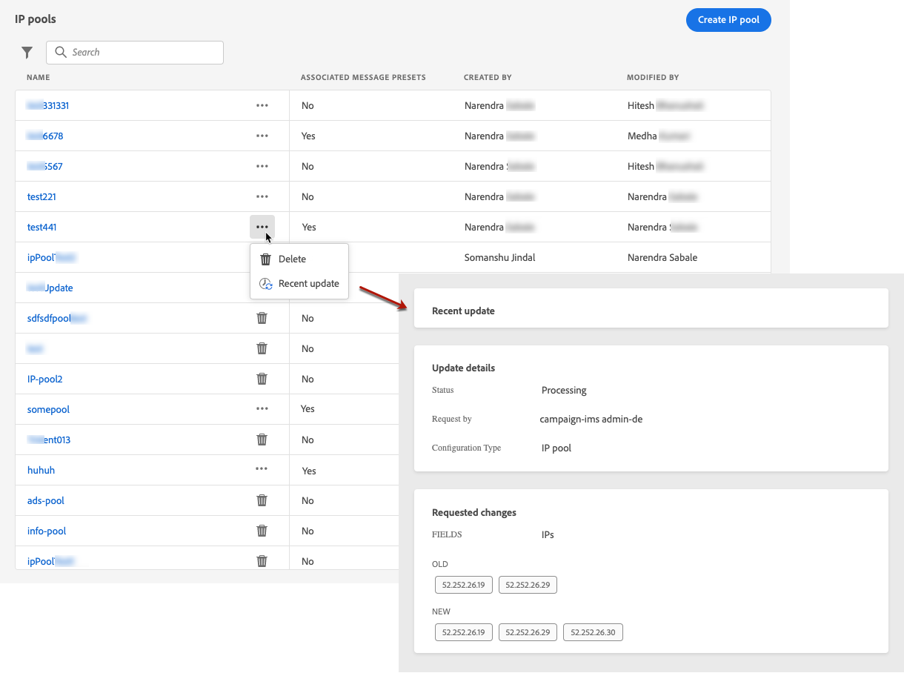

# Creare pool IP {#create-ip-pools}

## Informazioni sui pool IP {#about-ip-pools}

Con Journey Optimizer puoi creare pool IP per raggruppare gli indirizzi IP dei sottodomini.

La creazione di pool IP è vivamente consigliata per il recapito messaggi e-mail. In questo modo puoi evitare che la reputazione di un sottodominio influisca sugli altri sottodomini.

Ad esempio, una best practice consiste nell’avere un pool IP per i messaggi di marketing e un altro per i messaggi transazionali. In questo modo, se uno dei tuoi messaggi di marketing funziona correttamente e viene dichiarato come spam da un cliente, questo non influenzerà i messaggi transazionali inviati allo stesso cliente, che riceverà comunque messaggi transazionali (conferme di acquisto, messaggi di recupero password, ecc.).

## Creare un pool IP {#create-ip-pool}

Per creare un pool IP, effettua le seguenti operazioni:

1. Accedere al **[!UICONTROL Channels]** / **[!UICONTROL IP pools]** menu, quindi fai clic su **[!UICONTROL Create IP Pool]**.

   

1. Immetti un nome e una descrizione (facoltativi) per il pool IP.

   >[!NOTE]
   >
   >Il nome del sottodominio deve iniziare con una lettera (A-Z) e includere solo caratteri alfanumerici o caratteri speciali ( _, ., - ).

1. Seleziona gli indirizzi IP da includere nel pool dall’elenco a discesa, quindi fai clic su **[!UICONTROL Submit]**.

   

   >[!NOTE]
   >
   >Nell’elenco sono disponibili tutti gli indirizzi IP forniti con la tua istanza.

Il pool IP viene ora creato e visualizzato nell’elenco. Puoi selezionarlo per accedere alle relative proprietà e visualizzare il predefinito di messaggio associato. Per ulteriori informazioni su come associare un predefinito di messaggio a un pool IP, consulta [questa sezione](message-presets.md)).

## Modificare un pool IP {#edit-ip-pool}

Per modificare un pool IP:

1. Dall’elenco, fai clic sul nome del pool IP per aprirlo.

   

1. Modifica le proprietà desiderate. Puoi modificare la descrizione e aggiungere o rimuovere indirizzi IP.

   

   >[!CAUTION]
   >
   >Procedi con maggiore attenzione quando consideri l’eliminazione di un IP, in quanto questo causerà un ulteriore carico sugli altri IP e potrebbe avere gravi ripercussioni sul recapito messaggi. In caso di dubbio, contatta un esperto di recapito.

1. Salva le modifiche.

>[!NOTE]
>
>Il nome del pool IP non è modificabile. Se desideri modificarlo, devi eliminare il pool IP e crearne un altro con il nome desiderato.

L’aggiornamento ha effetto immediato o asincrono, a seconda che il pool IP sia associato a un [predefinito messaggio](message-presets.md) o no:

* Se il pool IP è **not** selezionato in un predefinito per messaggi, l’aggiornamento è istantaneo (**[!UICONTROL Success]** status).
* Se il pool IP **è** selezionato in un predefinito per messaggi, l’aggiornamento può richiedere fino a 7-10 giorni lavorativi (**[!UICONTROL Processing]** status).

Per controllare lo stato dell’aggiornamento del pool IP, fai clic sul pulsante **[!UICONTROL More actions]** e seleziona **[!UICONTROL Recent updates]**.

>[!NOTE]
>
>Una volta aggiornato correttamente un pool IP, potresti dover attendere:
>* alcuni minuti prima che sia consumata dai messaggi unitari,
>* fino al batch successivo per l&#39;efficacia del pool IP nei messaggi batch.

È inoltre possibile utilizzare **[!UICONTROL Delete]** per eliminare un pool IP. Non puoi eliminare un pool IP associato a un predefinito per messaggi.

