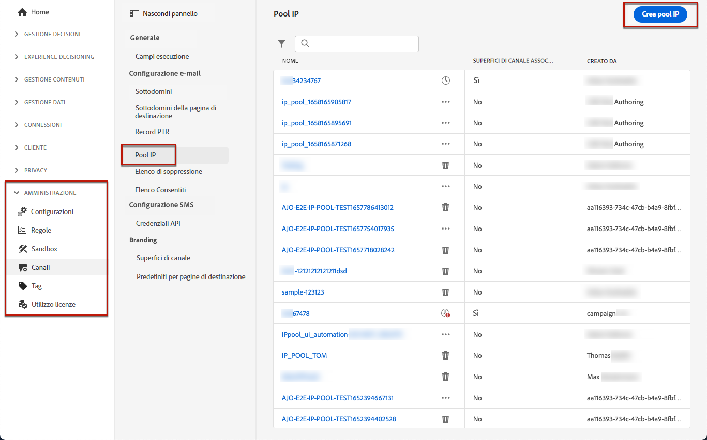

# Creare pool IP {#create-ip-pools}

>[!CONTEXTUALHELP]
>id="ajo_admin_ip_pool_header"
>title="Configurare un pool IP"
>abstract="I pool IP raccolgono gli indirizzi IP dei sottodomini per migliorare il recapito dei messaggi e-mail."

>[!CONTEXTUALHELP]
>id="ajo_admin_ip_pool"
>title="Configurare un pool IP"
>abstract="Con Journey Optimizer puoi creare pool IP per raggruppare gli indirizzi IP dei sottodomini. Questo può migliorare in modo significativo il recapito delle e-mail, evitando che la reputazione di un sottodominio influisca sugli altri sottodomini."

## Informazioni sui pool IP {#about-ip-pools}

Con [!DNL Journey Optimizer] è possibile creare pool IP per raggruppare gli indirizzi IP dei sottodomini.

La creazione di pool IP è vivamente consigliata per il recapito messaggi e-mail. In questo modo, puoi evitare che la reputazione di un sottodominio influisca sugli altri sottodomini.

Ad esempio, una best practice consiste nell’avere un pool IP per i messaggi di marketing e un altro per i messaggi transazionali. In questo modo, se uno dei messaggi di marketing non funziona correttamente e viene dichiarato come spam da un cliente, questo non influirà sui messaggi transazionali inviati allo stesso cliente, che riceverà comunque messaggi transazionali (conferme di acquisto, messaggi di recupero password, ecc.).

>[!CAUTION]
>
>La configurazione del pool IP è comune a tutti gli ambienti. Pertanto, qualsiasi creazione o modifica di pool IP influirà anche sulle sandbox di produzione.

## Creare un pool IP {#create-ip-pool}

Per creare un pool IP, eseguire la procedura seguente:

1. Accedi al menu **[!UICONTROL Amministrazione]** > **[!UICONTROL Canali]** > **[!UICONTROL Impostazioni e-mail]** > **[!UICONTROL Pool IP]**, quindi fai clic su **[!UICONTROL Crea pool IP]**.

   

1. Specifica un nome e una descrizione (facoltativa) per il pool IP.

   >[!NOTE]
   >
   >Il nome deve iniziare con una lettera (A-Z) e includere solo caratteri alfanumerici o caratteri speciali ( _, ., - ).

1. Selezionare gli indirizzi IP da includere nel pool dall&#39;elenco a discesa, quindi fare clic su **[!UICONTROL Invia]**.

   

   >[!NOTE]
   >
   >Tutti gli indirizzi IP forniti con la tua istanza sono disponibili nell’elenco.

Quando selezioni gli IP, puoi visualizzare dall’elenco i record PTR associati agli IP. Questo consente di verificare le informazioni di branding per ogni IP durante la creazione di un pool IP e di selezionare, ad esempio, gli IP con le stesse informazioni di branding. [Ulteriori informazioni sui record PTR](ptr-records.md)

>[!NOTE]
>
>Se per un IP non è configurato alcun record PTR, non è possibile selezionare tale IP. Rivolgiti al tuo rappresentante Adobe per configurare il record PTR di tale IP.<!--Now this only happens when first subdomain delegated to Adobe is with CNAME method.-->

Dopo la creazione di un pool IP, le informazioni PTR sono visibili quando si passa il mouse sugli indirizzi IP visualizzati sotto l&#39;elenco a discesa del pool IP.

Il pool IP viene ora creato e visualizzato nell’elenco. Puoi selezionarla per accedere alle relative proprietà e visualizzare la configurazione del canale associata (ossia il predefinito per messaggi). Per ulteriori informazioni su come associare una configurazione di canale a un pool IP, consulta [questa sezione](channel-surfaces.md).

## Modificare un pool IP {#edit-ip-pool}

Per modificare un pool IP, effettua le seguenti operazioni.

1. Dall’elenco, fai clic sul nome del pool IP per aprirlo.

1. Modificane le proprietà come desiderato. Puoi modificare la descrizione e aggiungere o rimuovere indirizzi IP.

   >[!NOTE]
   >
   >Impossibile modificare il nome del pool IP. Se desideri modificarlo, elimina il pool IP e creane un altro con il nome desiderato.

   

   >[!CAUTION]
   >
   >Procedi con ulteriore cautela quando consideri di eliminare un IP, in quanto questo comporterà un carico aggiuntivo sugli altri IP e potrebbe avere gravi ripercussioni sulla consegna dei messaggi. In caso di dubbi, contatta un esperto di consegna.

1. Salva le modifiche.

L&#39;aggiornamento è attivo immediatamente o in modo asincrono, a seconda che il pool IP sia associato o meno a una [configurazione canale](channel-surfaces.md):

* Se il pool IP è **not** associato ad alcuna configurazione di canale, l&#39;aggiornamento è istantaneo (**[!UICONTROL Operazione riuscita]** stato).
* Se il pool IP **è** associato a una configurazione di canale, l&#39;aggiornamento può richiedere fino a 3 ore (**[!UICONTROL Elaborazione]** stato).

>[!NOTE]
>
>Durante la [creazione di una configurazione del canale](channel-surfaces.md#create-channel-surface), se si seleziona un pool IP in corso di modifica (**[!UICONTROL Elaborazione]** stato) e non è mai stato associato al sottodominio selezionato per tale configurazione, non è possibile procedere con la creazione della configurazione. [Ulteriori informazioni](channel-surfaces.md#create-channel-surface)

Per verificare lo stato di aggiornamento del pool IP, fare clic sul pulsante **[!UICONTROL Altre azioni]** e selezionare **[!UICONTROL Aggiornamenti recenti]**.

>[!NOTE]
>
>Una volta aggiornato correttamente un pool IP, potrebbe essere necessario attendere:
>
>* pochi minuti prima di essere utilizzato dai messaggi unitari,
>* fino al successivo batch per rendere effettivo il pool IP nei messaggi batch.

È inoltre possibile utilizzare il pulsante **[!UICONTROL Elimina]** per eliminare un pool IP. Non è possibile eliminare un pool IP associato a una configurazione di canale.

