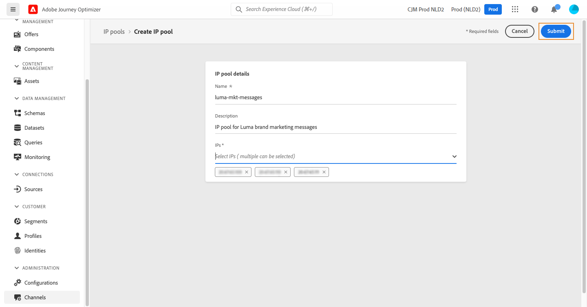

# Creare pool IP

## Informazioni sui pool IP

Con Journey Optimizer puoi creare pool IP per raggruppare gli indirizzi IP dei sottodomini.

La creazione di pool IP è vivamente consigliata per il recapito messaggi e-mail. In questo modo puoi evitare che la reputazione di un sottodominio influisca sugli altri sottodomini.

Ad esempio, una best practice consiste nell’avere un pool IP per i messaggi di marketing e un altro per i messaggi transazionali. In questo modo, se uno dei tuoi messaggi di marketing funziona correttamente e viene dichiarato come spam da un cliente, questo non influenzerà i messaggi transazionali inviati allo stesso cliente, che riceverà comunque messaggi transazionali (conferme di acquisto, messaggi di recupero password, ecc.).

## Creare un pool IP

Per creare un pool IP, effettua le seguenti operazioni:

1. Accedi al menu **[!UICONTROL Channels]** / **[!UICONTROL IP pools]**, quindi fai clic su **[!UICONTROL Create IP Pool]**.

   

1. Immetti un nome e una descrizione (facoltativi) per il pool IP.

   >[!NOTE]
   >
   >Il nome del sottodominio deve iniziare con una lettera (A-Z) e includere solo caratteri alfanumerici o caratteri speciali ( _, ., - ).

1. Seleziona gli indirizzi IP da includere nel pool dall’elenco a discesa, quindi fai clic su **[!UICONTROL Submit]**.

   

   >[!NOTE]
   >
   >Nell’elenco sono disponibili tutti gli indirizzi IP forniti con la tua istanza.

Il pool IP viene ora creato e visualizzato nell’elenco. Puoi selezionarlo per accedere alle relative proprietà e visualizzare il predefinito di messaggio associato. Per ulteriori informazioni su come associare un predefinito di messaggio a un pool IP, consulta [questa sezione](message-presets.md)).

Per modificare un pool IP, aprilo, quindi modificane le proprietà come desiderato.

>[!NOTE]
>
>Se al pool IP è stato associato un predefinito per messaggi, devi prima rimuoverlo prima di modificare il pool IP. Una volta apportate le modifiche, puoi associare nuovamente il predefinito del messaggio.
