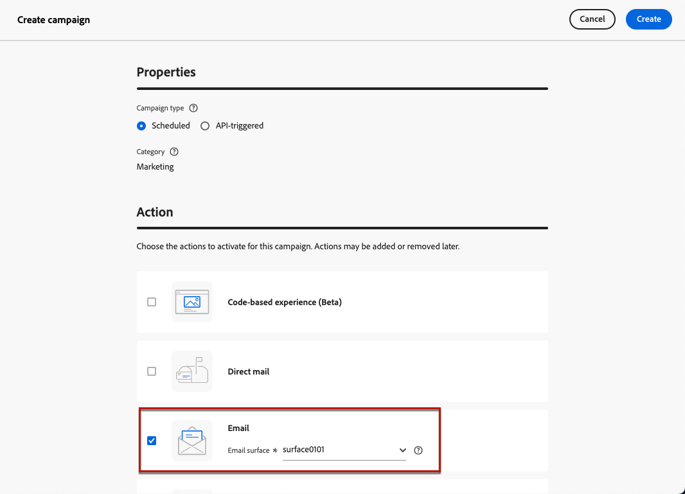

# Creare campagne di preparazione IP {#create-ip-warmup-campaign}

>[!CONTEXTUALHELP]
>id="ajo_campaign_ip_warmup"
>title="Attivare l’opzione piano di riscaldamento IP"
>abstract="Quando selezioni questa opzione, la campagna può essere utilizzata in un piano di preparazione IP. La pianificazione della campagna sarà quindi guidata dal piano di preparazione IP a cui è associata."

Prima di creare il piano di riscaldamento IP in [!DNL Journey Optimizer], è necessario creare una o più campagne progettate specificamente per l&#39;utilizzo in un piano di riscaldamento IP<!--through a dedicated option-->.

Per creare una campagna di riscaldamento IP, segui i passaggi indicati di seguito.

1. Crea un canale e-mail [configurazione](channel-surfaces.md) per il dominio e gli IP che hai identificato per il tuo piano di riscaldamento.

   Collabora con il tuo consulente di recapito messaggi per identificare il dominio e gli IP da utilizzare. Scopri come selezionarli in una configurazione e-mail in [questa sezione](../email/email-settings.md#subdomains-and-ip-pools).

   >[!CAUTION]
   >
   >Non modificare la configurazione del canale e-mail dopo l&#39;avvio del piano di riscaldamento IP [1&rbrace;.](ip-warmup-execution.md)

1. Crea una [campagna](../campaigns/create-campaign.md) di marketing pianificata e seleziona l&#39;azione [E-mail](../email/create-email.md#create-email-journey-campaign).

   <!--Select the Marketing category. The IP warmup plan activation option is only available for  marketing-type campaigns.-->

1. Seleziona la configurazione creata per il riscaldamento dell’IP.

   

   <!--You must use the same configuration as the one that will be used for the asociated IP warmup plan. [Learn how to create an IP warmup plan](#create-ip-warmup-plan)-->

1. Fai clic su **[!UICONTROL Crea]**.

1. Dalla sezione **[!UICONTROL Pianifica]**, seleziona **[!UICONTROL Attivazione del piano di riscaldamento IP]**.

   

   La [pianificazione](../campaigns/create-campaign.md#schedule) della campagna sarà guidata dal piano di riscaldamento IP a cui sarà associata, il che significa che la pianificazione non è più definita nella campagna stessa.

1. Completa i passaggi per creare una campagna e-mail, ad esempio definendo le proprietà della campagna, [pubblico](../audience/about-audiences.md)<!--best practices for IP warmup in terms of audience?--> e [contenuto](../email/get-started-email-design.md#key-steps).

   >[!IMPORTANT]
   >
   >I tipi di pubblico consentiti in una campagna di riscaldamento IP devono essere [basati su segmenti](../audience/creating-a-segment-definition.md) e creati utilizzando il [criterio di unione predefinito](https://experienceleague.adobe.com/en/docs/experience-platform/profile/merge-policies/overview#default-merge-policy){target="_blank"}.

   Per ulteriori informazioni su come configurare una campagna, consulta [questa pagina](../campaigns/get-started-with-campaigns.md).

1. [Attiva](../campaigns/review-activate-campaign.md) la campagna. Lo stato cambia in **[!UICONTROL Live]**.

   >[!NOTE]
   >
   >[Le regole business](../conflict-prioritization/rule-sets.md#apply-frequency-rule) non devono essere utilizzate nei piani di riscaldamento dell&#39;IP. L’applicazione di queste regole potrebbe ostacolare il raggiungimento del numero desiderato di profili mirati per le campagne.

   Per una campagna live con il piano di riscaldamento IP attivato, il pulsante **[!UICONTROL Elimina]** è disponibile finché non viene associato a un piano di riscaldamento IP. Una volta utilizzata in un piano, la campagna non può più essere eliminata.

1. La campagna viene visualizzata nell&#39;elenco **[!UICONTROL Campagne]**. Per recuperare facilmente tutte le campagne di riscaldamento IP create nella sandbox corrente, puoi filtrare in base all&#39;opzione **[!UICONTROL Riscaldamento IP]** della campagna.

   

Una volta pubblicata, la campagna è pronta per essere utilizzata in un piano di riscaldamento IP. [Ulteriori informazioni](ip-warmup-plan.md)

Una campagna di riscaldamento IP può essere utilizzata solo in un piano di riscaldamento IP. Tuttavia, la stessa campagna può essere utilizzata in una o più fasi dello stesso piano di riscaldamento IP. [Ulteriori informazioni](ip-warmup-plan.md#define-phases)

>[!NOTE]
>
>Quando una campagna live viene utilizzata in un piano di riscaldamento IP, dopo che il piano è [contrassegnato come completato](ip-warmup-execution.md#mark-as-completed), lo stato della campagna cambia in **[!UICONTROL Interrotto]**.

