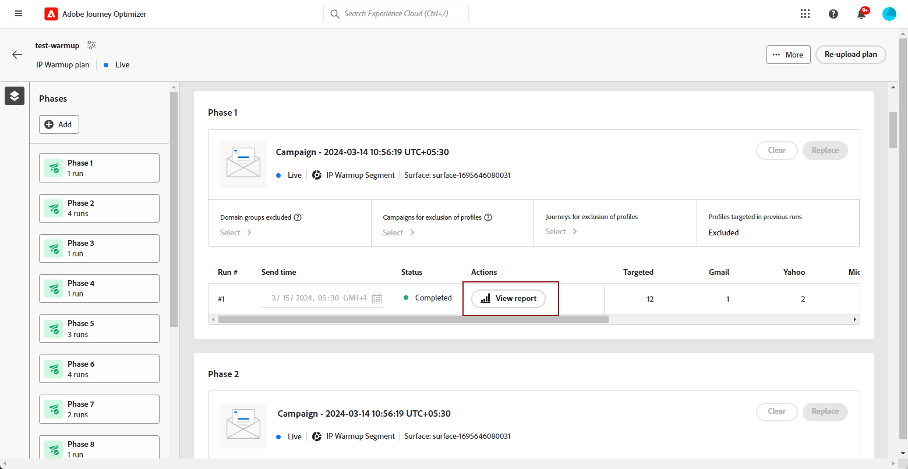

# Eseguire il piano di riscaldamento IP {#ip-warmup-running}

>[!BEGINSHADEBOX]

Cosa troverai in questa documentazione di guida:

* [Introduzione al riscaldamento dell’IP](ip-warmup-gs.md)
* [Creare campagne di riscaldamento IP](ip-warmup-campaign.md)
* [Creare un piano di riscaldamento IP](ip-warmup-plan.md)
* **[Eseguire il piano di riscaldamento IP](ip-warmup-execution.md)**

>[!ENDSHADEBOX]

Una volta che [ha creato un piano di riscaldamento IP](ip-warmup-plan.md) e caricato il file preparato con il tuo consulente del team Deliverability, puoi definire le fasi ed eseguire nel piano.

Ogni fase è composta da più esecuzioni, alle quali si assegna una singola campagna.

## Definire le fasi {#define-phases}

>[!CONTEXTUALHELP]
>id="ajo_admin_ip_warmup_campaigns_excluded"
>title="Escludere i tipi di pubblico delle campagne"
>abstract="Seleziona i tipi di pubblico da altre campagne da escludere dalla fase corrente. In questo modo, i profili contattati in precedenza da altre fasi o da altri piani di riscaldamento dell’IP non verranno nuovamente oggetto di targeting."

<!--
>[!CONTEXTUALHELP]
>id="ajo_admin_ip_warmup_domains_excluded"
>title="Exclude domain groups"
>abstract="Select the domains that you want to exclude from the current phase. Domain exclusion requires a non-executed phase, so you may have to split a running phase to add exclusions."
>additional-url="https://experienceleague.adobe.com/docs/journey-optimizer/using/configuration/implement-ip-warmup-plan/ip-warmup-running.html#split-phase" text="Split a phase"
-->

<!--You need to associate the campaign and audience at phase level and turns on some settings as needed for all runs associated with a single creative/campaign

At phase level, system ensures that previously targeted + new profiles are picked up AND at iteration level, system ensures that each run is having unique profiles and the count matches what is stated in plan-->

<!---->

1. Per ogni fase, seleziona la campagna da associare a questa fase del piano di riscaldamento IP.

   

   Tieni presente quanto segue:

   * Solo le campagne con **[!UICONTROL Attivazione del piano di riscaldamento IP]** opzione abilitata <!--and live?--> sono disponibili per la selezione. [Ulteriori informazioni](#create-ip-warmup-campaign)

   * È necessario selezionare una campagna che utilizza la stessa superficie di quella selezionata per il piano di riscaldamento IP corrente.

   * Non puoi selezionare una campagna già in uso in un’altra campagna di riscaldamento IP.

1. In **[!UICONTROL Esclusione profilo]** sezione, puoi notare che i profili delle esecuzioni precedenti di quella fase sono sempre esclusi. Ad esempio, se in #1 di esecuzione un profilo è stato coperto dalle prime 4800 persone target, il sistema si assicurerà automaticamente che lo stesso profilo non riceva l’e-mail in #2. di esecuzione

1. Dalla sezione **[!UICONTROL Pubblico della campagna escluso]** , seleziona i tipi di pubblico da un&#39;altra <!--executed/live?-->campagne che desideri escludere dalla fase corrente.

   

   Ad esempio, durante l’esecuzione della fase 1, era necessario [dividilo](#split-phase) per qualsiasi motivo. Pertanto, puoi escludere la campagna utilizzata nella fase 1 in modo che i profili contattati in precedenza dalla fase 1 non siano inclusi nella fase 2. Puoi anche escludere le campagne da altri piani di riscaldamento dell’IP.

1. Dalla sezione **[!UICONTROL Gruppi di dominio esclusi]** , selezionare i domini che si desidera escludere da tale fase.

   >[!NOTE]
   >
   >L’esclusione del dominio richiede una fase non eseguita, quindi potrebbe essere necessario [dividere una fase in esecuzione](#split-phase) per aggiungere esclusioni.

   

   Ad esempio, dopo aver eseguito il riscaldamento dell’IP per alcuni giorni, ti rendi conto che la reputazione dell’ISP con un dominio (ad Adobe) non è buona e desideri risolverla senza interrompere il piano di riscaldamento dell’IP. In questo caso, puoi escludere il gruppo di dominio Adobe.

   >[!NOTE]
   >
   >Se il dominio non è un gruppo di dominio predefinito, devi collaborare con il consulente del team Deliverability per aggiungere questo dominio al [File del piano di riscaldamento IP](ip-warmup-plan.md#prepare-file) e [ricarica](#re-upload-plan) per poter escludere tale dominio.

1. Se necessario, puoi aggiungere una fase. Verrà aggiunta dopo l&#39;ultima fase corrente.

   

1. Utilizza il **[!UICONTROL Elimina fase]** per rimuovere eventuali fasi indesiderate.

   

   >[!CAUTION]
   >
   >Non è possibile annullare **[!UICONTROL Elimina]** azione.
   >
   >Se elimini tutte le fasi dal piano di riscaldamento IP, si consiglia di ricaricare un piano. [Ulteriori informazioni](#re-upload-plan)

## Definire le esecuzioni {#define-runs}

1. Seleziona una pianificazione per ogni esecuzione.

   

1. Facoltativamente, puoi definire un intervallo di tempo durante il quale la campagna di riscaldamento dell’IP può essere eseguita in caso di ritardi nel processo di segmentazione. A tale scopo, fare clic sull&#39;icona Proprietà in alto a sinistra, accanto al nome del piano e utilizzare **[!UICONTROL Ritenta runtime]** per selezionare una durata - fino a 240 minuti (4 ore).

   

   Ad esempio, se imposti un’ora di invio in un dato giorno alle 21:00 e selezioni 120 minuti come ora di esecuzione dei nuovi tentativi, sarà possibile eseguire il processo di segmentazione in un intervallo di 2 ore.

   >[!NOTE]
   >
   >Se non viene specificata alcuna finestra temporale, l’esecuzione viene tentata al momento dell’invio e avrà esito negativo se il processo di segmentazione non viene completato.

1. Se necessario, seleziona **[!UICONTROL Modifica esecuzione]** dall’icona Altre azioni. È possibile aggiornare il numero di indirizzi in ogni colonna. È inoltre possibile aggiornare **[!UICONTROL Ultimo impegno]** campo per eseguire il targeting solo degli utenti che hanno utilizzato il tuo marchio negli ultimi 20 giorni, ad esempio.

   

1. Seleziona la **[!UICONTROL Pausa per errori]** se desideri mettere in pausa le esecuzioni in caso di errore.<!--can't see the Paused status for runs? Is it failed?-->

   

   Ad esempio, dopo l’esecuzione del processo di segmentazione, se il numero di profili target è inferiore al previsto, l’esecuzione viene annullata.

1. **[!UICONTROL Attiva]** la corsa. Assicurati di aver pianificato abbastanza tempo per consentire l’esecuzione del processo di segmentazione.

   

   >[!CAUTION]
   >
   >Ogni esecuzione deve essere attivata almeno 12 ore prima dell’ora di invio effettiva. In caso contrario, la segmentazione potrebbe non essere completata. <!--How do you know when segmentation is complete? Is there a way to prevent user from scheduling less than 12 hours before the segmentation job?-->

   <!--Sart to execute on every day basis by simply clicking the play button > for each run? do you have to come back every day to activate each run? or can you schedule them one after the other?)-->

   <!--Upon activation, when the segment evaluation happens, more segments will be created by the IP warmup service and will be leveraged in an audience composition and a new audience will be created for each run splitted into the different selected domains.-->

1. Lo stato di questa esecuzione cambia in **[!UICONTROL Live]**. I diversi stati di esecuzione sono elencati in [questa sezione](#monitor-plan). Se l’esecuzione della campagna non è stata avviata, puoi interrompere una live run.<!--why?-->

   

   >[!NOTE]
   >
   >Una volta avviata l’esecuzione della campagna, il **[!UICONTROL Interrompi]** non è più disponibile.

1. Per aggiungere un’esecuzione, seleziona **[!UICONTROL Aggiungi una sequenza di seguito]** dall’icona dei tre puntini.

   

## Gestire il piano {#manage-plan}

In qualsiasi momento, se il piano di riscaldamento dell’IP non funziona come previsto, puoi intraprendere le azioni seguenti.

### Dividere una fase {#split-phase}

Se desideri aggiungere una nuova fase a partire da un’esecuzione specifica, seleziona la **[!UICONTROL Opzione Dividi in una nuova fase]** dall’icona dei tre puntini.

Viene creata una nuova fase per le restanti esecuzioni della fase corrente.

Ad esempio, se selezioni questa opzione per Esegui #4, le esecuzioni #4 a #8 verranno spostate in una nuova fase.

Segui i passaggi [sopra](#define-phases) per definire la nuova fase.

* È possibile utilizzare **[!UICONTROL Sostituisci campagna]** per la nuova fase.

* Puoi anche escludere la campagna precedente o un dominio dalle prestazioni insoddisfacenti. Scopri come in [questa sezione](#define-phases).

<!--
You don't have to decide the campaign upfront. You can do a split later. It's a work in progress plan: you activate one run at a time with a campaign and you always have the flexibility to modify it while working on it.

But need to explain in which case you want to modify campaigns, provide examples
-->

### Contrassegna un piano come completato {#mark-as-completed}

Se le prestazioni del piano non sono sufficienti o se si desidera eliminarlo per crearne un altro, è possibile contrassegnarlo come completato.

A tale scopo, fare clic sul pulsante **[!UICONTROL Altro]** in alto a destra nel piano di riscaldamento dell&#39;IP e selezionare **[!UICONTROL Contrassegna come completato]**.

Questa opzione è disponibile solo se tutte le esecuzioni del piano sono in **[!UICONTROL Completato]** o **[!UICONTROL Bozza]** stato. Se un’esecuzione è **[!UICONTROL Live]**, l’opzione è disattivata.

I diversi stati di esecuzione sono elencati in [questa sezione](#monitor-plan).

### Ricarica un piano di riscaldamento IP {#re-upload-plan}

Se il piano di riscaldamento dell’IP non funziona come previsto (ad esempio, se alcuni ISP contrassegnano i messaggi come spam), puoi chiedere al tuo esperto di recapito messaggi di configurare un altro file di piano di riscaldamento dell’IP e ricaricarlo utilizzando il pulsante corrispondente.

Tutte le esecuzioni eseguite in precedenza verranno contrassegnate come completate. Il nuovo piano viene visualizzato sotto il primo piano.

Segui i passaggi [sopra](#define-phases) definire le fasi del nuovo piano.

>[!NOTE]
>
>I dettagli del piano di riscaldamento IP cambiano in base al file appena caricato. Non influisce sulle esecuzioni live e completate.

## Monitorare il piano {#monitor-plan}

Per misurare l’impatto del piano, puoi controllare le prestazioni delle campagne di riscaldamento IP utilizzando [!DNL Journey Optimizer] rapporti sulle campagne. A questo scopo, per ogni esecuzione completata, puoi fare clic sul pulsante **[!UICONTROL Visualizzare i rapporti]** pulsante. Ulteriori informazioni sono disponibili nel messaggio e-mail della campagna [rapporto live](../reports/campaign-live-report.md#email-live) e [rapporto globale](../reports/campaign-global-report.md##email-global).

Lo stesso piano di riscaldamento dell’IP funge anche da rapporto consolidato in un’unica posizione. Puoi controllare elementi come il numero di **[!UICONTROL Live]** o **[!UICONTROL Completato]** viene eseguito per ogni fase e visualizza l’avanzamento del piano di riscaldamento IP.

Un’esecuzione può avere i seguenti stati:

* **[!UICONTROL Bozza]** : ogni volta che viene creata un’esecuzione, quando [creazione di un nuovo piano](ip-warmup-plan.md) o [aggiunta di un&#39;esecuzione](#define-runs) dall&#39;interfaccia utente, accetta **[!UICONTROL Bozza]** stato.
* **[!UICONTROL Live]**: ogni volta che attivi un’esecuzione, vengono richiesti **[!UICONTROL Live]** stato.
* **[!UICONTROL Completato]**<!--TBC-->: l’esecuzione della campagna per questa esecuzione è completata. <!--i.e. campaign execution has started, no error happened and emails have reached users? to check with Sid-->
* **[!UICONTROL Annullato]**: a **[!UICONTROL Live]** esecuzione annullata utilizzando **[!UICONTROL Interrompi]** pulsante. Questo pulsante è disponibile solo se l’esecuzione della campagna non è stata avviata. [Ulteriori informazioni](#define-runs)
* **[!UICONTROL Non riuscito]**: il sistema ha rilevato un errore o la campagna utilizzata per la fase corrente è stata interrotta<!--what should the user do in that case?-->.
