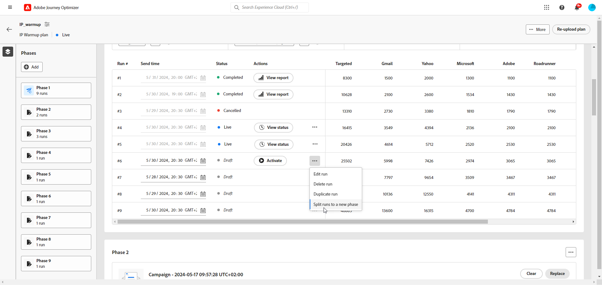

# Eseguire il piano di preparazione IP {#ip-warmup-running}

Dopo aver [creato un piano di riscaldamento IP](ip-warmup-plan.md) e aver caricato il file preparato con il tuo consulente di recapito messaggi, puoi definire le fasi ed eseguire il piano.

Ogni fase è composta da più esecuzioni, alle quali si assegna una singola campagna.

## Definire le fasi {#define-phases}

>[!CONTEXTUALHELP]
>id="ajo_admin_ip_warmup_campaigns_excluded"
>title="Escludere i tipi di pubblico delle campagne"
>abstract="Seleziona le campagne per escludere i relativi tipi di pubblico dalla fase corrente. Questo impedisce ai profili contattati in precedenza di essere nuovamente oggetto di targeting; saranno esclusi solo quelli che hanno ricevuto una comunicazione tramite il percorso."

>[!CONTEXTUALHELP]
>id="ajo_admin_ip_warmup_domains_excluded"
>title="Escludere gruppi di dominio"
>abstract="Seleziona i domini da escludere dalla fase corrente. L’esclusione del dominio richiede una fase non eseguita, quindi potrebbe essere necessario dividere una fase in esecuzione per aggiungere esclusioni."
>additional-url="https://experienceleague.adobe.com/docs/journey-optimizer/using/configuration/implement-ip-warmup-plan/ip-warmup-execution.html?lang=it#split-phase" text="Suddividere una fase"

>[!CONTEXTUALHELP]
>id="ajo_admin_ip_warmup_phases"
>title="Definire le fasi del piano"
>abstract="Ogni fase è composta da più esecuzioni, alle quali si assegna una singola campagna."

<!--You need to associate the campaign and audience at phase level and turns on some settings as needed for all runs associated with a single creative/campaign

At phase level, system ensures that previously targeted + new profiles are picked up AND at iteration level, system ensures that each run is having unique profiles and the count matches what is stated in plan-->

<!---->

1. Seleziona la campagna da associare alla prima fase del piano di riscaldamento IP.

   >[!NOTE]
   >
   >Non puoi selezionare una campagna già in uso in un altro piano di riscaldamento IP. Tuttavia, la stessa campagna può essere utilizzata in una o più fasi dello stesso piano di riscaldamento IP.

   

   >[!IMPORTANT]
   >
   >* È possibile selezionare solo le campagne con l&#39;opzione **[!UICONTROL Attivazione del piano di riscaldamento IP]** abilitata. [Ulteriori informazioni](#create-ip-warmup-campaign)
   >
   >* È possibile selezionare solo le campagne che utilizzano la stessa configurazione del piano di riscaldamento IP selezionato.

1. Una volta selezionata una campagna per la fase corrente, vengono visualizzate le sezioni per escludere profili, tipi di pubblico della campagna e gruppi di dominio.

   >[!NOTE]
   >
   >Una volta attivata un&#39;esecuzione, le esclusioni non possono più essere modificate a meno che non si [divida l&#39;esecuzione](#split-phase) in una nuova fase.

   1. Dalla sezione **[!UICONTROL Gruppi di domini esclusi]**, seleziona i domini che desideri escludere da quella fase.

      >[!NOTE]
      >
      >L&#39;esclusione del dominio richiede una fase non eseguita, quindi potrebbe essere necessario [dividere una fase in esecuzione](#split-phase) per aggiungere esclusioni.

      

      Ad esempio, dopo aver eseguito il riscaldamento dell’IP per alcuni giorni, ti rendi conto che la reputazione dell’ISP con un dominio (ad esempio, Adobe) non è buona e desideri risolverla senza interrompere il piano di riscaldamento dell’IP. In tal caso, puoi escludere il gruppo di dominio Adobe.

      >[!NOTE]
      >
      >È possibile escludere solo un gruppo di dominio personalizzato aggiunto al [modello di piano di riscaldamento IP](ip-warmup-plan.md#prepare-file). In caso contrario, aggiornare il modello con il gruppo di dominio personalizzato che si desidera escludere e [ricaricare il piano](#re-upload-plan).

      >[!CAUTION]
      >
      >Una volta eseguito il piano di riscaldamento IP, se aggiorni l&#39;[indirizzo di esecuzione](../email/email-settings.md#execution-address) nel canale e-mail [configurazione](channel-surfaces.md) utilizzato nella campagna di riscaldamento IP, l&#39;esclusione del dominio potrebbe non riuscire. Non modificare la configurazione del canale e-mail dopo l’avvio del piano di riscaldamento IP.

   1. Dalla sezione **[!UICONTROL Campagna per l&#39;esclusione di profili]**, seleziona le campagne che i tipi di pubblico desideri escludere dalla fase corrente.

      

      Ad esempio, durante l&#39;esecuzione della fase 1, è stato necessario [dividerla](#split-phase) per qualsiasi motivo. Pertanto, puoi escludere la campagna utilizzata nella fase 1 in modo che i profili contattati in precedenza dalla fase 1 non siano inclusi nella fase 2. Puoi anche escludere le campagne da altri piani di riscaldamento dell’IP.

   1. Dalla sezione **[!UICONTROL Percorsi di esclusione dei profili]**, seleziona i percorsi con i tipi di pubblico che desideri escludere dalla fase corrente.

      +++ Per utilizzare l’opzione Percorsi per l’esclusione dei profili, è necessario stabilire una relazione tra gli schemi AJO Message Feedback Event e AJO Entity Record.

      1. Crea un **Spazio dei nomi** personalizzato che fungerà da tipo di identità per i passaggi seguenti.

      1. Accedi a Adobe Experience Platform dal menu **Schemi**, seleziona il **Schema record entità di AJO**, imposta il campo **_id** come identità primaria e seleziona lo spazio dei nomi creato in precedenza come **Spazio dei nomi identità**.

      1. Dal menu **Schemi**, seleziona il **Schema evento di feedback dei messaggi di AJO** e passa al campo **_messageID**. Seleziona **Aggiungi relazione** e scegli **AJO Entity Record Schema** come **Schema di riferimento** e il namespace creato in precedenza come **Spazio dei nomi di riferimento Identità**.
      +++

   1. Nella sezione **[!UICONTROL Profili di destinazione nelle esecuzioni precedenti]**, puoi vedere che i profili delle esecuzioni precedenti di quella fase sono sempre esclusi. Ad esempio, se in #1 di esecuzione un profilo è stato coperto dalle prime 4800 persone target, il sistema si assicurerà automaticamente che lo stesso profilo non riceva l’e-mail in #2. di esecuzione

      >[!NOTE]
      >
      >Questa sezione non è modificabile.

1. Se necessario, puoi sostituire la campagna utilizzando il pulsante **[!UICONTROL Sostituisci]**. Puoi anche **[!UICONTROL Cancellare]** la campagna selezionata utilizzando il pulsante **[!UICONTROL Cancella]**. Questa azione cancella non solo la campagna ma anche le altre proprietà a livello di fase (gruppi di dominio esclusi, Campagna, Esclusione di Percorso e altri). Dopo aver cancellato, puoi scegliere una nuova campagna immediatamente o in un secondo momento.

   

   >[!NOTE]
   >
   >Questa azione è possibile solo prima di attivare la prima esecuzione della fase. Dopo l&#39;attivazione di un&#39;esecuzione, la campagna non può essere sostituita, a meno che non si [divida l&#39;esecuzione](#split-phase) in una nuova fase.

1. Se necessario, puoi aggiungere una fase. Verrà aggiunto dopo l’ultima fase.

   

1. Utilizza il pulsante **[!UICONTROL Elimina fase]** per rimuovere eventuali fasi indesiderate. Questa azione è disponibile solo se non viene eseguita alcuna esecuzione in una fase. <!--Once a run is executed, deletion is not allowed.-->

   >[!CAUTION]
   >
   >Impossibile annullare l&#39;azione **[!UICONTROL Elimina fase]**.

   

   >[!NOTE]
   >
   >Se elimini tutte le fasi dal piano di riscaldamento IP, si consiglia di ricaricare un piano. [Ulteriori informazioni](#re-upload-plan)

## Definire le esecuzioni {#define-runs}

>[!CONTEXTUALHELP]
>id="ajo_admin_ip_warmup_run"
>title="Definire ogni esecuzione"
>abstract="Definisci e attiva ogni esecuzione per tutte le fasi."

>[!CONTEXTUALHELP]
>id="ajo_admin_ip_warmup_last_engagement"
>title="Filtra in base al coinvolgimento"
>abstract="Questa colonna è un filtro che esegue il targeting solo degli utenti coinvolti con il tuo marchio negli ultimi 20 giorni, ad esempio. È inoltre possibile modificare questa impostazione tramite l’opzione **Modifica esecuzione**."

>[!CONTEXTUALHELP]
>id="ajo_admin_ip_warmup_retry"
>title="Impostare un intervallo di tempo"
>abstract="Puoi definire un intervallo di tempo durante il quale la campagna di preparaizone IP può essere eseguita in caso di ritardi nel processo di segmentazione."

>[!CONTEXTUALHELP]
>id="ajo_admin_ip_warmup_pause"
>title="Annullare esecuzioni con errori del pubblico"
>abstract="Seleziona questa opzione per annullare un’esecuzione se i profili qualificati sono inferiori ai profili di destinazione una volta che il pubblico è stato valutato per tale esecuzione."

>[!CONTEXTUALHELP]
>id="ajo_admin_ip_warmup_qualified"
>title="Visualizzazione a 360° dei profili"
>abstract="Questa colonna mostra il numero di profili qualificati. Una volta che il pubblico è stato valutato per un’esecuzione, se sono presenti più profili target rispetto ai profili qualificati, l’esecuzione viene comunque eseguita, a meno che non sia abilitata l’opzione **Annulla esecuzioni attivate in caso di errori**. In questo caso, l’esecuzione viene annullata."

Dopo aver definito le fasi del piano di riscaldamento IP, è necessario configurare le singole esecuzioni all’interno di ogni fase. Ogni esecuzione richiede una pianificazione ed è possibile configurare facoltativamente filtri di coinvolgimento, gestione degli errori e finestre di nuovi tentativi per garantire un’esecuzione ottimale. Segui questi passaggi:

1. Seleziona una pianificazione per ogni esecuzione per assicurarti che venga eseguita all’ora specificata.

   

1. Facoltativamente, puoi definire un intervallo di tempo durante il quale la campagna di riscaldamento IP può essere eseguita in caso di ritardi nella [valutazione del pubblico](https://experienceleague.adobe.com/docs/experience-platform/segmentation/home.html?lang=it#how-segmentation-works){target="_blank"}. A tale scopo, fare clic sull&#39;icona Proprietà in alto a sinistra accanto al nome del piano e utilizzare l&#39;elenco a discesa **[!UICONTROL Riprova runtime]** per selezionare una durata fino a 240 minuti (4 ore).

   >[!NOTE]
   >
   >I tentativi si verificano ogni 30 minuti fino alla fine dell’intervallo di tempo definito.

   

   Ad esempio, se imposti un’ora di invio in un dato giorno alle 9 e selezioni 120 minuti come ora di esecuzione dei nuovi tentativi, ciò consente di eseguire una finestra di opportunità di 2 ore (9:00 - 11:00) per eventuali ritardi imprevisti nella valutazione del pubblico.

   >[!NOTE]
   >
   >Se non viene specificata alcuna finestra temporale, l’esecuzione viene tentata al momento dell’invio e avrà esito negativo se la valutazione del pubblico non viene completata.

1. Se necessario, selezionare **[!UICONTROL Modifica esecuzione]** dall&#39;icona Altre azioni. È possibile aggiornare il numero di indirizzi in ogni colonna. Puoi anche aggiornare il campo **[!UICONTROL Ultimo/i interessato/i]** per eseguire il targeting solo degli utenti che hanno utilizzato il tuo marchio negli ultimi 20 giorni, ad esempio.

   >[!NOTE]
   >
   >Si consiglia di modificare questi numeri consultando il tuo esperto di recapito messaggi.

   

   >[!NOTE]
   >
   >Se non si desidera applicare alcun periodo di coinvolgimento a un&#39;esecuzione, immettere 0 nel campo **[!UICONTROL Ultimo impegno]**.

1. Seleziona l&#39;opzione **[!UICONTROL Annulla esecuzioni attivate in caso di errori]** per annullare un&#39;esecuzione se i profili qualificati sono inferiori ai profili target una volta che il pubblico è stato valutato per tale esecuzione.

   

   Nel caso in cui il numero di profili idonei non corrisponda al numero di profili target (ad esempio, 1500 indirizzi Gmail sono target nell’esecuzione, ma ci sono solo 700 profili qualificati Gmail):

   * Se l&#39;opzione è abilitata, l&#39;esecuzione non riesce e assume lo stato **[!UICONTROL Non riuscito]**. <!--You can then either choose to target less profiles in the next run, or to [split the run](#split-phase) to a new phase and select a new campaign for the new phase to target the same profiles again.-->

   * Se l’opzione non è abilitata, l’esecuzione viene eseguita, ma viene eseguito il targeting solo del numero disponibile di profili.

1. **[!UICONTROL Attiva]** l&#39;esecuzione. [Ulteriori informazioni](#activate-run)

1. Lo stato di questa esecuzione cambia in **[!UICONTROL Live]**, il che significa che il sistema ha accettato la richiesta di pianificare l&#39;esecuzione.

   >[!NOTE]
   >
   >I diversi stati di esecuzione sono elencati in [questa sezione](#monitor-plan).

1. Se l’esecuzione della campagna non è stata avviata, puoi annullare un’esecuzione live. Questa azione annulla effettivamente la pianificazione dell’esecuzione e non interrompe l’invio.

   

1. Per duplicare una bozza, un&#39;esecuzione live o un&#39;esecuzione completata, selezionare **[!UICONTROL Esecuzione duplicata]**. Al termine della duplicazione, viene visualizzato il menu Modifica esecuzione, che consente agli utenti di regolare i **[!UICONTROL Profili di destinazione totali]** e il **[!UICONTROL Tempo di invio]** in base alle esigenze.

   

## Attiva esecuzioni {#activate-run}

Per attivare un&#39;esecuzione, selezionare il pulsante **[!UICONTROL Attiva]**. Quindi puoi attivare le esecuzioni successive su base giornaliera.

Quando si eseguono più piani di riscaldamento IP simultaneamente, tutti rivolti agli stessi domini e pool IP, è fondamentale prevedere le potenziali conseguenze. Ad esempio, se un ISP applica un limite giornaliero di 100 e-mail, l’esecuzione di diversi piani destinati agli stessi domini potrebbe superare questa soglia.

Assicurati di aver pianificato abbastanza tempo per consentire l&#39;esecuzione della [valutazione del pubblico](https://experienceleague.adobe.com/docs/experience-platform/segmentation/home.html?lang=it#how-segmentation-works){target="_blank"}.

>[!CAUTION]
>
>Ogni esecuzione deve essere attivata almeno 12 ore prima dell’ora di invio effettiva. In caso contrario, la valutazione del pubblico potrebbe non essere completata.

Quando attivi un’esecuzione, vengono creati automaticamente diversi tipi di pubblico.

* Se si attiva la prima esecuzione di una fase:

   * Viene creato un [pubblico](https://experienceleague.adobe.com/docs/experience-platform/segmentation/ui/segment-builder.html?lang=it){target="_blank"} per i tipi di pubblico della campagna esclusi (se presenti), con la seguente convenzione di denominazione: `<warmupName>-Phase<phaseNo>-Audience Exclusion`.

   * Viene creato un pubblico per i gruppi di dominio esclusi (se presenti), con la seguente convenzione di denominazione: `<warmupName>-Phase<phaseNo>-Domain Exclusion`.

   * Viene creato un altro pubblico per i tipi di pubblico di percorso esclusi (se presenti), con la seguente convenzione di denominazione: `<warmupName>-Phase<phaseNo>-Journey Audience Exclusion`.

  >[!NOTE]
  >
  >I tipi di pubblico vengono puliti dopo che il piano di riscaldamento è contrassegnato come completato.
  >
  >Il percorso non crea un nuovo pubblico se non vi è alcuna modifica nei tipi di pubblico della campagna esclusi, nei tipi di pubblico di gruppo esclusi o nei gruppi di dominio per le fasi successive.

* Quando si attiva un’esecuzione:

   * Viene creato un altro pubblico per l&#39;ultimo filtro di coinvolgimento, con la seguente convenzione di denominazione: `<warmupName>-Phase<phaseNo>_Run<runNo>-Engagement Filter`.

     >[!NOTE]
     >
     >Il pubblico viene ripulito dopo che il piano di riscaldamento è contrassegnato come completato.
     >
     >Il sistema non crea un nuovo pubblico se non vi è alcuna modifica nell’ultimo filtro di coinvolgimento per le fasi successive.

   * Viene creata una [composizione pubblico](https://experienceleague.adobe.com/docs/experience-platform/segmentation/ui/audience-composition.html?lang=it){target="_blank"} corrispondente al pubblico a cui verrà inviata la campagna, con la seguente convenzione di denominazione: `<warmupName>-Phase<phaseNo>-Run<runNo>`.

     >[!NOTE]
     >
     >Per ogni esecuzione viene creata una nuova composizione di pubblico. Con un limite di 10, gli utenti che eseguono più campagne, percorsi e piani di riscaldamento IP simultaneamente utilizzando composizioni di pubblico pubblicate devono pianificare in anticipo per rimanere entro questo limite, per operazioni parallele.
     >
     >La composizione del pubblico (e quindi del pubblico di output) viene pulita quando viene attivata l’iterazione successiva.

   * Viene creato un pubblico di output con la seguente convenzione di denominazione: `IP Warmup Audience-<warmupName>-Phase<phaseNo>-Run<runNo>`.

<!--How do you know when segmentation is complete? Is there a way to prevent user from scheduling less than 12 hours before the segmentation job?-->

<!--Sart to execute on every day basis by simply clicking the play button > for each run? do you have to come back every day to activate each run? or can you schedule them one after the other?)-->

<!--Upon activation, when the segment evaluation happens, more segments will be created by the IP warmup service and will be leveraged in an audience composition and a new audience will be created for each run splitted into the different selected domains.-->

## Monitorare il piano {#monitor-plan}

Per eseguire correttamente il piano di riscaldamento IP, è necessario monitorare i rapporti, attivare le esecuzioni e verificarne lo stato su base giornaliera.

### Utilizzare la sezione Elementi di rilievo {#highlights}

Una volta attivata la prima esecuzione per una fase, viene visualizzata la sezione **[!UICONTROL Elementi di rilievo]**.

Offre una rapida panoramica dell’esecuzione corrente e di quella futura. Da questa sezione puoi anche modificare e attivare l’esecuzione successiva.

### Controllare gli stati di esecuzione {#run-statuses}

Lo stesso piano di riscaldamento dell’IP funge da rapporto consolidato in un’unica posizione. Puoi controllare elementi quali il numero di esecuzioni di **[!UICONTROL Live]** o **[!UICONTROL Completed]** per ogni fase e visualizzare l&#39;avanzamento del piano di riscaldamento IP.

>[!NOTE]
>
>Come best practice, si consiglia di monitorare il piano di riscaldamento IP su base giornaliera.

Un’esecuzione può avere i seguenti stati:

* **[!UICONTROL Bozza]**: ogni volta che viene creata un&#39;esecuzione, durante [la creazione di un nuovo piano](ip-warmup-plan.md) o [l&#39;aggiunta di un&#39;esecuzione](#define-runs) dall&#39;interfaccia utente, assume lo stato **[!UICONTROL Bozza]**.
* **[!UICONTROL Live]**: ogni volta che attivi un&#39;esecuzione, assume lo stato **[!UICONTROL Live]**. Significa che il sistema ha accettato la richiesta di pianificare l’esecuzione, non che l’invio sia iniziato. In questa fase puoi osservare lo stato dell&#39;esecuzione live facendo clic sul pulsante **[!UICONTROL Visualizza stato]** all&#39;interno della tabella. Questo consente di tenere traccia di quanti profili di destinazione sono effettivamente qualificati.
* **[!UICONTROL Completato]**: l&#39;esecuzione della campagna per questa esecuzione è stata completata. Per accedere a un report di esecuzione dettagliato, fare clic sul pulsante **[!UICONTROL Visualizza report]** nella tabella. Questa opzione consente di tenere traccia dello stato di consegna dell’e-mail, inclusi i raggruppamenti specifici dei gruppi di dominio per un monitoraggio avanzato. La campagna associata verrà impostata come Interrotta.[Ulteriori informazioni](#reports)
* **[!UICONTROL Annullato]**: un&#39;esecuzione di **[!UICONTROL Live]** è stata annullata utilizzando il pulsante **[!UICONTROL Annulla]**.[Ulteriori informazioni](#define-runs)
* **[!UICONTROL Non riuscito]**: il sistema ha rilevato un errore o la campagna utilizzata per la fase corrente è stata interrotta oppure è stata abilitata l&#39;opzione **[!UICONTROL Annulla esecuzioni attivate in caso di errori]** e si è verificato un errore. Se un’esecuzione non riesce, puoi pianificarne un’altra per il giorno successivo.

### Utilizzare i rapporti {#reports}

Più in generale, per misurare l&#39;impatto del piano, puoi controllare le prestazioni delle campagne di riscaldamento IP utilizzando i report delle campagne [!DNL Journey Optimizer]. A tale scopo, per ogni esecuzione completata, è possibile fare clic sul pulsante **[!UICONTROL Visualizza report]**. Ulteriori informazioni sull&#39;e-mail della campagna [rapporto live](../reports/campaign-live-report.md#email-live) e [rapporto Customer Journey Analytics](../reports/campaign-global-report-cja-email.md).

Puoi accedere ai report anche dal menu [Campagne](../campaigns/manage-campaigns.md#access), in quanto il piano potrebbe utilizzare campagne diverse.

## Gestire il piano {#manage-plan}

In qualsiasi momento, se il piano di riscaldamento dell’IP non funziona come previsto, puoi intraprendere le azioni seguenti.

### Suddividere una fase {#split-phase}

Se si desidera aggiungere una nuova fase a partire da un&#39;esecuzione specifica, selezionare l&#39;opzione **[!UICONTROL Dividi esecuzioni in una nuova fase]** dall&#39;icona Altre azioni.

Viene creata una nuova fase per le restanti esecuzioni della fase corrente.

Ad esempio, se selezioni questa opzione per Esegui #4, le esecuzioni #4 a #8 verranno spostate in una nuova fase subito dopo la fase corrente.

Segui i passaggi [precedenti](#define-phases) per definire la nuova fase.

* È possibile utilizzare le opzioni **[!UICONTROL Sostituisci]** o **[!UICONTROL Cancella]** per la nuova fase.

* Puoi anche escludere la campagna precedente o un dominio dalle prestazioni insoddisfacenti. Scopri come in [questa sezione](#define-phases).

<!--
You do not have to decide the campaign upfront. You can do a split later. It's a work in progress plan: you activate one run at a time with a campaign and you always have the flexibility to modify it while working on it.

But need to explain in which case you want to modify campaigns, provide examples
-->

### Ricarica un piano di riscaldamento IP {#re-upload-plan}

Se il piano di riscaldamento dell’IP non funziona come previsto (ad esempio, se alcuni ISP contrassegnano i messaggi come spam), puoi chiedere al tuo esperto di recapito messaggi di configurare un altro file di piano di riscaldamento dell’IP e ricaricarlo utilizzando il pulsante corrispondente.

Tutte le esecuzioni eseguite in precedenza saranno di sola lettura. Il nuovo piano viene visualizzato sotto il primo piano.

Segui i passaggi [precedenti](#define-phases) per definire le fasi dal nuovo piano.

>[!NOTE]
>
>I dettagli del piano di riscaldamento IP cambiano in base al file appena caricato. Le esecuzioni eseguite in precedenza (indipendentemente dal loro [stato](#monitor-plan)) non sono interessate.

Prendiamo un esempio:

* Con il piano di riscaldamento IP iniziale, la fase 2 aveva 9 esecuzioni.

* Sono state eseguite 4 esecuzioni (non importa se non riuscite, completate o annullate<!--as long as a run has been attempted, it is an executed run-->).

* Se ricarichi un nuovo piano, la fase 2 con le prime 4 esecuzioni passerà in modalità di sola lettura.

* Le restanti 5 esecuzioni (che sono in stato di bozza) vengono spostate in una nuova fase (fase 3) che viene visualizzata come nel piano appena caricato.

### Contrassegna un piano come completato {#mark-as-completed}

Se gli IP sono stati riscaldati con il volume desiderato, o se il piano non funziona abbastanza bene o se desideri rilasciarlo per crearne un altro, puoi contrassegnarlo come completato.

A tale scopo, fare clic sul pulsante **[!UICONTROL Altro]** in alto a destra del piano di riscaldamento IP e selezionare **[!UICONTROL Contrassegna come completato]**.

Questa opzione è disponibile solo se tutte le esecuzioni del piano sono in stato **[!UICONTROL Completato]** o **[!UICONTROL Bozza]**. Se un&#39;esecuzione è **[!UICONTROL Live]**, l&#39;opzione è disattivata.

I diversi stati di esecuzione sono elencati in [questa sezione](#monitor-plan).

