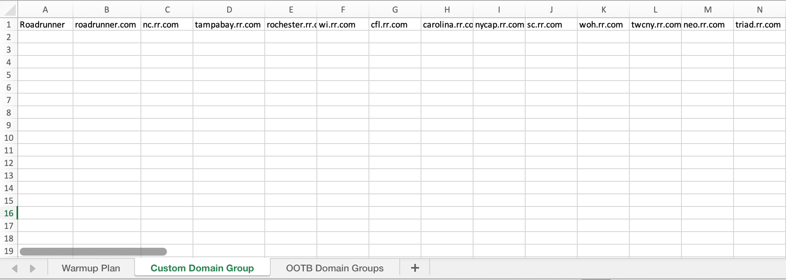

# Creare un piano di preparazione IP {#ip-warmup}

>[!BEGINSHADEBOX]

Cosa troverai in questa documentazione:

* [Introduzione ai piani di preparazione IP](ip-warmup-gs.md)
* [Creare campagne di preparazione IP](ip-warmup-campaign.md)
* **[Creare un piano di riscaldamento IP](ip-warmup-plan.md)**
* [Eseguire il piano di preparazione IP](ip-warmup-execution.md)

>[!ENDSHADEBOX]

Una volta creati uno o più [Campagne di riscaldamento IP](ip-warmup-campaign.md) con una superficie dedicata e l’opzione corrispondente abilitata, puoi iniziare a creare il piano di riscaldamento IP.

Per accedere, creare, modificare ed eliminare i piani di riscaldamento IP, è necessario disporre del **[!UICONTROL Consulente per il recapito messaggi]** autorizzazioni relative a ruoli o piani di riscaldamento IP.

+++Scopri come assegnare il ruolo di Consulente del recapito messaggi o le autorizzazioni relative ai piani di riscaldamento IP

Il controllo dell&#39;accesso a livello di oggetto consente di proteggere i dati e concedere un accesso specifico per visualizzare e gestire i piani. Se al piano di riscaldamento IP non viene assegnata alcuna etichetta, verrà aperto per la visualizzazione e la modifica da parte di tutti gli utenti.

Concessione del **[!UICONTROL Visualizza piani di riscaldamento IP]** L’autorizzazione limita l’accesso solo alla visualizzazione e alla pubblicazione, durante l’assegnazione di **[!UICONTROL Gestire i piani di riscaldamento IP]** L&#39;autorizzazione consente agli utenti di visualizzare e modificare il piano.

Per assegnare l&#39;autorizzazione corrispondente a un **[!UICONTROL Ruolo]**:

1. Dalla sezione [!DNL Permissions] prodotto, passare alla **[!UICONTROL Ruoli]** e selezionare il ruolo che si desidera aggiornare con il nuovo **[!UICONTROL Configurazioni di riscaldamento IP]** autorizzazioni.

1. Dal tuo **[!UICONTROL Ruolo]** dashboard, fai clic su **[!UICONTROL Modifica]**.

   

1. Trascina la **[!UICONTROL Configurazioni di riscaldamento IP]** risorsa per assegnare le autorizzazioni.

1. Dalla sezione **[!UICONTROL Configurazioni di riscaldamento IP]** elenco a discesa delle risorse, seleziona le autorizzazioni necessarie per l’utente: **[!UICONTROL Visualizza piani di riscaldamento IP]**, **[!UICONTROL Gestione piani di riscaldamento IP]**, e/o **[!UICONTROL Visualizza report di riscaldamento IP]**. Se necessario, puoi selezionarli tutti contemporaneamente.

   

1. Fai clic su **[!UICONTROL Salva]**.

Per assegnare il ruolo corrispondente a un **[!UICONTROL Utente]**:

1. Dalla sezione [!DNL Permissions] prodotto, passare alla **[!UICONTROL Ruoli]** e selezionare il **[!UICONTROL Consulente per il recapito messaggi]** ruolo predefinito.

1. Dal tuo **[!UICONTROL Ruolo]** , accedere al **[!UICONTROL Utenti]** scheda.

   

1. Clic **[!UICONTROL Aggiungi utente]** per assegnare **[!UICONTROL Consulente per il recapito messaggi]** ruolo predefinito.

   

1. Seleziona il **[!UICONTROL Utente]** e fai clic su **[!UICONTROL Salva]**.

   

+++

## Preparare il file del piano di preparazione IP {#prepare-file}

Il riscaldamento dell’IP è un’attività che consiste nell’aumentare gradualmente il volume di e-mail che escono dagli IP e dal dominio verso i principali provider di servizi Internet (ISP) - al fine di stabilire la tua reputazione di mittente legittimo.

Questa attività viene generalmente eseguita con l’aiuto di un esperto di recapito messaggi che aiuta a preparare un piano ben concepito basato sui domini di settore, i casi di utilizzo, le aree geografiche, gli ISP e vari altri fattori.

<!--When working with the [!DNL Journey Optimizer] IP warmup feature, this plan takes the form of an Excel file that must contain a number of predefined columns.-->

Prima di poter creare un piano di riscaldamento IP in [!DNL Journey Optimizer] è necessario compilare un modello di Excel con tutti i dati che alimenteranno il piano.

* Dall’interfaccia utente puoi scaricare il file Excel vuoto [Modello di piano di riscaldamento IP](assets/IPWarmupPlan-Template.xlsx) da compilare.

* È inoltre possibile scaricare un [esempio di piano di riscaldamento IP](assets/IPWarmupPlan-Sample.xlsx) sono già compilati con alcuni dati che puoi utilizzare come esempio.

<!--
* From the user interface you can download the blank Excel IP warmup plan template to fill in.

* You can also download a sample IP warmup plan already filled in with some data you can use as an example.
-->

>[!CAUTION]
>
>Rivolgiti al tuo consulente di recapito messaggi per assicurarti che il file del piano di riscaldamento IP sia configurato correttamente.
>
>Assicurati di utilizzare il formato fornito nel modello.

Di seguito è riportato un esempio di file contenente un piano di riscaldamento IP.

### Scheda Piano di riscaldamento IP {#ip-warmup-plan-tab}

* In questo esempio, è stato preparato un piano che si estende su 17 giorni (denominato &quot;**esecuzioni**&#39;) per raggiungere un volume target di oltre un milione di profili.

* Il piano è attuato in sei **fasi**, ciascuno contenente almeno una sequenza.

* Puoi avere tutte le colonne che desideri per i domini a cui desideri recapitare. In questo esempio, il piano è diviso in sei colonne:

   * Quattro dei quali corrispondono a **gruppi di dominio predefiniti** da utilizzare nel piano (Gmail, Microsoft, Yahoo e Orange).
   * Uno corrisponde a un gruppo di dominio personalizzato (che devi aggiungere utilizzando [Gruppo di dominio personalizzato](#custom-domain-group-tab) ).
   * La sesta colonna, **Altro**, contiene tutti gli indirizzi rimanenti da altri domini che non sono trattati esplicitamente nel piano. Questa colonna è facoltativa: se omessa, le e-mail verranno inviate solo ai domini specificati.

L’idea è quella di aumentare progressivamente il numero di indirizzi target in ogni esecuzione, riducendo al contempo il numero di esecuzioni per ogni fase.

Di seguito sono elencati i gruppi di dominio principali predefiniti che è possibile aggiungere al piano:

<!--
* Gmail
* Adobe
* WP
* Comcast
* Yahoo
* Bigpond
* Orange
* Softbank
* Docomo
* United Internet
* Microsoft
* KDDI
* Italia Online
* La Poste
* Apple
-->

+++ Gmail gmail.com;google.com;googlemail.com;googlemail.co.uk
+++

+++WP wp.pl;o2.pl
+++

+++Comcast comcast.net
+++

+++Yahoo aol.fi;games.com;cs.com;yahoo.com.in;y7mail.com;yahoo.co.uk;yahoo.hu;yahoo.co.hu;yahoo.cn;yahoogroups.com.sg;yahoogroups.com.au;aol.es;yahoo.com.au;yahoo.com.vn;yahoo.ca;aol.hk;aol.co.nz;yahoo.com.br;aolpoland.pl;aolnorge.no;yahoo.ne.jp;yahoo.fi;ymail.com;netscape.com;yahoo.com.pe;yahoo.hr;aol.cz;yahoo.ee;aol.be;aolcom.tr;yahoo.si;yahoo.co.id;aol.it;citlink.net;wmconnect.com;ahoo.es;yahoo.dk;yahoogroups.ca;yahoo.com.jp;yahoo.com.hk;aol.kr;yahoo.ie;aol.jp;aol.com.br;yahoo.lt;yahoo.co.kr;aol.nl;yahoo.com.ar;yahoo.bg;ygm.com;yahoo.co.nz;aol.se;aol.com;yahoo.de;goowy.com;rocketmail.com;frontiernet.net;yahoo.nl;aim.com;aol.dk;yahoogroups.co.in;aol.cl;netscape.net;yahoo.no;luckymail.com;yahoo.co.jp;yahoo.choz;yahoo.com.kr;yahoo o.sk;yahoo.co.za;yahoogroups.de;yahoo.gr;verizon.net;aol.com.ve;yahoo.ro;aol.com.ar;aol.com.co;yahoo.at;wild4music.com;yahoogroups.com.cn;yahoo.com.co;wow.com;aol.fr;yahoo.in;aol.in;yahoo.com;yahoo.rs;aol.de;yahooxtra.co.nz;yahoo.com.mx;yahoo.com.ph;sky.com;aol.com.mx;aol.com.au;aolchina.com;yahoo.se;myaol.jp;yahoo.com.net;yahoo.pt;yahoo.com.tw;talk21.com;yahoogrupper.dk;yahoo.fr;compuserve.com;yahoo.com.sg;aol.pl;yahoogroups.com.tw;aol.ch;yahoo.it;frontier.com;yahoo.co.in;aolpolcka.pl;yahoo.co.il;verizon.net.in;yahoogruppi.it;yahoo.com.tr;yahoo.cl;yahoogroups.com.hk;yahoogroups.co.uk;yahoo.com.biz;yahoo.com.hr;yahoo.be;aol.co.uk;ybb.ne.jp;aol.tw;yahoogroups.co.kr;yahoo.com.my;rogers.com;gte.net;yahoogroups.com;yahoo.co.th;yahoo.com.cn;love.com;bellatlantic.net;yahoo.com.ve;yahoo.com.ua;aol.ru;;;yahoo.lv;aolpolska.pl;aol.at;yahoo.pl
+++

+++Bigpond bigpond.com;bigpond.com.au;bigpond.net;telstra.com;bigpond.net.au
+++

+++Arancione voila.com;francetelecom.com;orange.com;arancione.fr;wanadoo.fr;voila.fr
+++

+++Softbank c.vodafone.ne.jp;jp-h.ne.jp;k.vodafone.ne.jp;jp-d.ne.jp;jp-c.ne.jp;t.vodafone.ne.jp;h.vodafone.ne.jp;r.vodafone.ne.jp;q.vodafone.ne.jp;jp-t.ne.jp;jp-q.ne.jp;s.vodafone.ne.jp;jp-s.ne.jp;jp-r.ne.jp;jp-k.ne.jp;n.vodafone.ne.jp;d.vodafone.ne.jp;softbank.ne.jp;jp-n.ne.jp;
+++

+++Docomo docomo.ne.jp
+++

+++United Internet gmx.de;1and1.com;gmx.fr;mail.com;1und1.de;gmx.com;gmx.net;gmx.at;web.de;gmx.ch
+++

+++Microsoft hotmail.com.tr;live.de;live.ru;live.nl;windowslive.com;live.jp;mts.net;xbox.com;hotmail.fr;hotmail.cl;hotmail.jp;live.cl;live.at;live.com.au;hotmail.co.th;live.hk;hotmail.com.au;hotmail.com;live.com.my;hotmail.co.kr;live.ie;outlook.com.br;hotmail.co.il;hotmail.dk;live.co.kr;live.co.uk;live.com.mx;outlook.ie;live.cn;hotmail.co.uk;live.com.sg;hotmail.es;live.fr;live.no;live.dhotmail.it;msn.com;live.se;hotmail.co.jp;live.be;live.co.za;live.live.in mail.se;live.com.pt;hotmail.ch;outlook.com;live.com;hotmail.gr;live.it;live.com.ar;hotmail.ca;hotmail.com.br;hotmail.com.ar;live.ca;hotmail.de
+++

+++KDDI au.com;ezweb.ne.jp;uqmobile.jp
+++

+++Italia Online inwind.it;blu.it;virgilio.it;giallo.it;iol.it;libero.it
+++

+++La Poste laposte.net
+++

+++Apple mac.com;icloud.com;apple.com;me.com
+++

### Scheda Gruppo di dominio personalizzato {#custom-domain-group-tab}

Puoi anche aggiungere più colonne al piano includendo gruppi di dominio personalizzati.

Utilizza il **[!UICONTROL Gruppo di dominio personalizzato]** per definire un nuovo gruppo di dominio. Per ogni dominio, puoi aggiungere tutti i sottodomini coperti.<!--TBC-->

Assicurati che ogni dominio sia univoco per il relativo gruppo di dominio e non si sovrapponga ad altri gruppi di dominio. Poiché i gruppi di dominio globali vengono definiti automaticamente, gli utenti devono tenerne conto durante la creazione di gruppi di dominio personalizzati.

Ad esempio, se aggiungi il dominio personalizzato Luma, vuoi includere i seguenti sottodomini: luma.com, luma.co.uk, luma.it, luma.fr, luma.de, ecc.

### Esempio {#example}

Supponiamo che tu voglia disporre di due gruppi di dominio personalizzati:

* Uno solo per i domini Hotmail.
* Uno per tutti gli altri domini del gruppo di dominio Microsoft (escludendo quindi tutti i domini Hotmail).

Tutti gli altri domini saranno raccolti nel **[!UICONTROL Altro]** colonna.

1. In **[!UICONTROL Gruppo di dominio personalizzato]** , crea il **Hotmail** gruppo di dominio.

1. Aggiungi tutti i domini Hotmail sulla stessa riga.

   È possibile [copia e incolla](#copy-paste) tutti i domini Hotmail elencati nella [Scheda Piano di riscaldamento IP](#ip-warmup-plan-tab) sezione.

1. Aggiungi un&#39;altra riga.

1. Creare **Microsoft_X** gruppo di dominio.

1. Aggiungi tutti i domini Microsoft che non sono Hotmail sulla stessa riga. Allo stesso modo, puoi copiarli e incollarli dall’elenco precedente. [Ulteriori informazioni](#copy-paste)

1. Torna a **[!UICONTROL Piano di riscaldamento IP]** scheda.

1. Crea tre colonne: una per **Hotmail**, uno per **Microsoft_X** e uno per **Altro**.

1. Compila le colonne in base alle tue esigenze.

>[!NOTE]
>
>Una volta caricato il piano di riscaldamento IP in [!DNL Journey Optimizer], non è necessario escludere i gruppi di dominio Microsoft.

<!--Only the domain groups listed in the **[!UICONTROL IP Warmup Plan]** tab will be taken into account.-->

### Copiare e incollare i domini predefiniti {#copy-paste}

Se ad esempio desideri creare un gruppo di dominio personalizzato contenente tutti i domini di Hotmail, puoi copiare e incollare i domini dall&#39;elenco predefinito fornito [sopra](#ip-warmup-plan-tab).

Quindi utilizzare lo strumento di conversione Excel per convertire il testo in colonne:

1. Seleziona **[!UICONTROL Dati]** > **[!UICONTROL Testo in colonne...]**, scegli **[!UICONTROL Delimitato]** e seleziona **[!UICONTROL Successivo]**.

1. Seleziona **[!UICONTROL Punto e virgola]**, fai clic su **[!UICONTROL Successivo]** e **[!UICONTROL Fine]**.

Ogni dominio ora viene visualizzato in una colonna diversa sulla stessa riga.

## Accesso e gestione dei piani di riscaldamento IP {#manage-ip-warmup-plans}

1. Accedere a **[!UICONTROL Amministrazione]** > **[!UICONTROL Canali]** > **[!UICONTROL Piani di riscaldamento IP]** menu. Vengono visualizzati tutti i piani di riscaldamento IP creati finora.

   

1. Puoi filtrare in base allo stato. I diversi stati sono:

   * **Non avviato**: non è stata ancora attivata alcuna esecuzione. [Ulteriori informazioni](ip-warmup-execution.md#define-runs)
   * **Live**: il piano passa a questo stato non appena la prima esecuzione nella prima fase è stata attivata correttamente. [Ulteriori informazioni](ip-warmup-execution.md#define-runs)
   * **Completato**: il piano è stato contrassegnato come completato. <!--This option is only available if all the runs in the plan are in **[!UICONTROL Completed]** or **[!UICONTROL Draft]** status (no run can be **[!UICONTROL Live]**).--> [Ulteriori informazioni](ip-warmup-execution.md#mark-as-completed)
     <!--* **Paused**: to check (user action)-->

1. Per eliminare un piano di riscaldamento IP, selezionare **[!UICONTROL Elimina]** accanto al nome di un piano e confermare l&#39;eliminazione.

   >[!NOTE]
   >
   >Solo i piani con **Non avviato** Lo stato può essere eliminato.

   

   >[!CAUTION]
   >
   >Il piano di riscaldamento IP selezionato verrà eliminato definitivamente.

## Creare un piano di preparazione IP {#create-ip-warmup-plan}

>[!CONTEXTUALHELP]
>id="ajo_admin_ip_warmup_upload"
>title="Specificare il piano di preparazione IP"
>abstract="Compila il modello Excel con tutti i dati che alimenteranno il tuo piano, ad esempio le fasi di preparazione IP e il numero di profili di destinazione, e caricalo qui."
>additional-url="https://experienceleague.adobe.com/docs/journey-optimizer/using/configuration/implement-ip-warmup-plan/ip-warmup-plan.html?lang=it#prepare-file" text="Preparare il file del piano di preparazione IP"

>[!CONTEXTUALHELP]
>id="ajo_admin_ip_warmup_surface"
>title="Selezionare una superficie marketing"
>abstract="Seleziona la stessa superficie di quella selezionata nella campagna da associare al piano di preparazione IP."
>additional-url="https://experienceleague.adobe.com/docs/journey-optimizer/using/configuration/channel-surfaces.html?lang=it" text="Impostare le superfici di canale"
>additional-url="https://experienceleague.adobe.com/docs/journey-optimizer/using/configuration/channel-surfaces.html?lang=it" text="Creare campagne di preparazione IP"

Per creare un piano di riscaldamento IP, attenersi alla procedura descritta di seguito.

1. Accedere a **[!UICONTROL Amministrazione]** > **[!UICONTROL Canali]** > **[!UICONTROL Piani di riscaldamento IP]** , quindi fai clic su **[!UICONTROL Crea piano di riscaldamento IP]**.

   

1. Compila i dettagli del piano di riscaldamento IP: fornisci un nome e una descrizione.

   

1. Seleziona la [superficie](channel-surfaces.md) che vuoi scaldare. Solo le superfici di marketing sono disponibili per la selezione. [Ulteriori informazioni sul tipo di e-mail](../email/email-settings.md#email-type)

   >[!NOTE]
   >
   >Le campagne da associare al piano di riscaldamento IP devono utilizzare la stessa superficie. [Scopri come creare una campagna di riscaldamento IP](ip-warmup-campaign.md)

1. Carica il file Excel contenente il piano di riscaldamento IP. [Ulteriori informazioni](#prepare-file)

   <!--
    You can also download the Excel template from the [!DNL Journey Optimizer] user interface and upload it after filling it with the IP warmup details.-->

   

   >[!NOTE]
   >
   >Se il caricamento non riesce, assicurati di utilizzare la formattazione e il formato di file corretti (xls o xlsx). Utilizza il [modello](assets/IPWarmupPlan-Template.xlsx) fornite dall’Adobe.

1. Fai clic su **[!UICONTROL Crea]**. Tutte le fasi, le esecuzioni, le colonne e il relativo contenuto definito nel file caricato vengono visualizzati automaticamente nel [!DNL Journey Optimizer] di rete.

   

   >[!NOTE]
   >
   >Il **[!UICONTROL Target]** mostra la somma di tutti i profili target per ogni esecuzione, ovvero tutti i profili di ciascun gruppo di dominio definito, inclusi **Altro** colonna, se presente.

Ora puoi eseguire il piano di riscaldamento IP. [Ulteriori informazioni](ip-warmup-execution.md)
