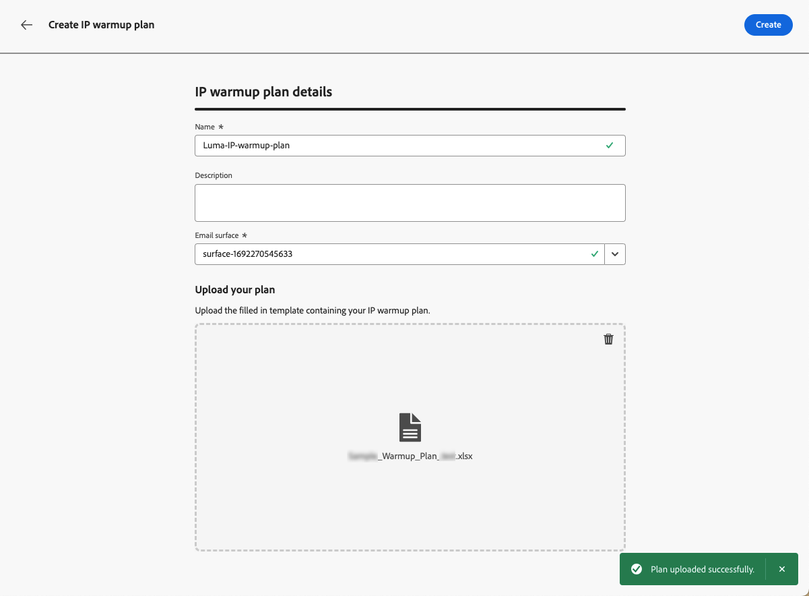

# Creare un piano di riscaldamento IP {#ip-warmup}

>[!BEGINSHADEBOX]

Cosa troverai in questa documentazione di guida:

* [Introduzione al riscaldamento dell’IP](ip-warmup-gs.md)
* [Creare campagne di riscaldamento IP](ip-warmup-campaign.md)
* **[Creare un piano di riscaldamento IP](ip-warmup-plan.md)**
* [Eseguire il piano di riscaldamento IP](ip-warmup-running.md)

>[!ENDSHADEBOX]

Una volta [ha creato una o più campagne](ip-warmup-campaign.md) con una superficie dedicata e l’opzione di riscaldamento IP abilitata, puoi iniziare a creare il piano di riscaldamento IP.

## Accesso e gestione dei piani di riscaldamento IP {#manage-ip-warmup-plans}

1. Accedere a **[!UICONTROL Amministrazione]** > **[!UICONTROL Canali]** > **[!UICONTROL Piani di riscaldamento IP]** menu. Vengono visualizzati tutti i piani di riscaldamento IP creati finora.

   

1. Puoi filtrare in base allo stato. I diversi stati sono:

   * **Non avviato**: non è avvenuta alcuna esecuzione
   * **In corso**: non appena viene avviata un’esecuzione <!--or is done?-->
   * **In pausa**
   * **Completato**: tutte le esecuzioni del piano sono completate

1. Per eliminare un piano di riscaldamento IP, selezionare **[!UICONTROL Elimina]** accanto a una voce di elenco e confermare l&#39;eliminazione.

   

   >[!CAUTION]
   >
   >Il piano di riscaldamento IP selezionato verrà eliminato definitivamente.

## Creare un piano di riscaldamento IP {#create-ip-warmup-plan}

>[!CONTEXTUALHELP]
>id="ajo_admin_ip_warmup_upload"
>title="Specificare il piano di riscaldamento IP"
>abstract="Scarica il modello CSV e compilalo con i dati per le fasi di riscaldamento IP e il numero di profili target."

>[!CONTEXTUALHELP]
>id="ajo_admin_ip_warmup_surface"
>title="Seleziona una superficie di marketing"
>abstract="Devi selezionare la stessa superficie di quella selezionata nella campagna da associare al piano di riscaldamento IP."
>additional-url="https://experienceleague.adobe.com/docs/journey-optimizer/using/configuration/channel-surfaces.html?lang=it" text="Impostare le superfici di canale"
>additional-url="https://experienceleague.adobe.com/docs/journey-optimizer/using/configuration/channel-surfaces.html?lang=it" text="Creare campagne di riscaldamento IP"

>[!CAUTION]
>
>Per creare, modificare ed eliminare i piani di riscaldamento IP, è necessario disporre del **[!UICONTROL Consulente per il recapito messaggi]** autorizzazione.
<!--Learn more on managing [!DNL Journey Optimizer] users' access rights in [this section](../administration/permissions-overview.md).-->

Quando una o più campagne live con **[!UICONTROL Attivazione del piano di riscaldamento IP]** opzione attivata, è possibile associarle a un piano di riscaldamento IP.

>[!CAUTION]
>
>Rivolgiti al tuo consulente di recapito messaggi per assicurarti che il modello di piano di riscaldamento IP sia configurato correttamente. <!--TBC-->

1. Accedere a **[!UICONTROL Amministrazione]** > **[!UICONTROL Canali]** > **[!UICONTROL Piani di riscaldamento IP]** , quindi fai clic su **[!UICONTROL Crea piano di riscaldamento IP]**.

   

1. Compila i dettagli del piano di riscaldamento IP: fornisci un nome e una descrizione.

   

1. Seleziona un [superficie](channel-surfaces.md). Solo le superfici di marketing sono disponibili per la selezione. [Ulteriori informazioni sul tipo di e-mail](../email/email-settings.md#email-type)

   >[!CAUTION]
   >
   >Devi selezionare la stessa superficie di quella selezionata nella campagna da associare al piano di riscaldamento IP. [Scopri come creare una campagna di riscaldamento IP](#create-ip-warmup-campaign)

1. Carica il file Excel contenente il tuo piano di riscaldamento IP<!--which formats are allowed?-->. Puoi utilizzare il modello fornito dal team di recapito messaggi.<!--TBC?--> [Ulteriori informazioni](#upload-plan)
   <!--
    You can also download the Excel template from the [!DNL Journey Optimizer] user interface and upload it after filling it with the IP warmup details.-->

   

1. Fai clic su **[!UICONTROL Crea]**. Il numero di fasi definite nel file caricato viene visualizzato automaticamente in tutte le esecuzioni di ogni fase. [Ulteriori informazioni](#upload-plan)

   

### Ricarica un piano di riscaldamento IP {#re-upload-plan}

Puoi ricaricare un altro piano di riscaldamento IP utilizzando il pulsante corrispondente.

>[!NOTE]
>
>I dettagli del piano di riscaldamento IP cambiano in base al file appena caricato. Non influisce sulle esecuzioni complete e attivate.

### Carica il file contenente il piano {#upload-plan}

Di seguito è riportato un esempio di file contenente un piano di riscaldamento IP.

Ogni fase corrisponde a un periodo composto da più esecuzioni, a cui si assegnerà una singola campagna.

Per ogni esecuzione, hai un determinato numero di destinatari e definirai una data in cui verrà eseguita.

Puoi avere tutte le colonne che desideri per i domini a cui desideri recapitare. In questo esempio sono disponibili tre colonne: Gmail, Adobe e Others, ovvero

L’idea è quella di avere più esecuzioni nelle prime fasi e di aumentare progressivamente il numero di indirizzi mirati, riducendo nel contempo il numero di esecuzioni.
