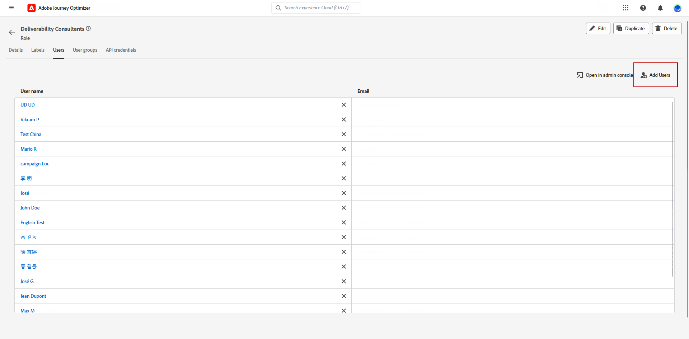
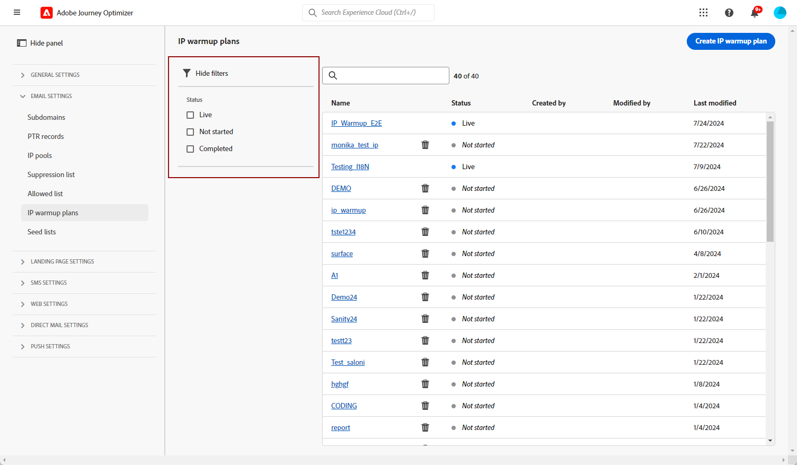

# Creare un piano di preparazione IP {#ip-warmup}

>[!BEGINSHADEBOX]

Cosa troverai in questa documentazione:

* [Introduzione alla preparazione dell’IP](ip-warmup-gs.md)
* [Creare campagne di preparazione IP](ip-warmup-campaign.md)
* **[Creare un piano di preparazione IP](ip-warmup-plan.md)**
* [Eseguire il piano di preparazione IP](ip-warmup-execution.md)

>[!ENDSHADEBOX]

Una volta creati uno o più [Campagne di riscaldamento IP](ip-warmup-campaign.md) con una superficie dedicata e l’opzione corrispondente abilitata, puoi iniziare a creare il piano di riscaldamento IP.

Per accedere, creare, modificare ed eliminare i piani di riscaldamento IP, è necessario disporre del **[!UICONTROL Consulente per il recapito messaggi]** autorizzazioni relative a ruoli o piani di riscaldamento IP.

+++Scopri come assegnare il ruolo di Consulente del recapito messaggi o le autorizzazioni relative ai piani di riscaldamento IP

Per assegnare l&#39;autorizzazione corrispondente a un **[!UICONTROL Ruolo]**:

1. Dalla sezione [!DNL Permissions] prodotto, passare alla **[!UICONTROL Ruoli]** e selezionare il ruolo che si desidera aggiornare con il nuovo **[!UICONTROL Configurazioni di riscaldamento IP]** autorizzazioni.

1. Dal tuo **[!UICONTROL Ruolo]** dashboard, fai clic su **[!UICONTROL Modifica]**.

   

1. Trascina la **[!UICONTROL Configurazioni di riscaldamento IP]** risorsa per assegnare le autorizzazioni.

1. Dalla sezione **[!UICONTROL Configurazioni di riscaldamento IP]** elenco a discesa delle risorse, seleziona le autorizzazioni necessarie per l’utente.

   

1. Fai clic su **[!UICONTROL Salva]**.

Per assegnare il ruolo corrispondente a un **[!UICONTROL Utente]**:

1. Dalla sezione [!DNL Permissions] prodotto, passare alla **[!UICONTROL Ruoli]** e selezionare il **[!UICONTROL Consulente per il recapito messaggi]** ruolo predefinito.

1. Dal tuo **[!UICONTROL Ruolo]** , accedere al **[!UICONTROL Utenti]** scheda.

   

1. Clic **[!UICONTROL Aggiungi utente]** per assegnare **[!UICONTROL Consulente per il recapito messaggi]** ruolo predefinito.

   

1. Seleziona il **[!UICONTROL Utente]** e fai clic su **[!UICONTROL Salva]**.

   

+++

## Preparare il file del piano di riscaldamento IP {#prepare-file}

Il riscaldamento dell’IP è un’attività che consiste nell’aumentare gradualmente il volume di e-mail che escono dagli IP e dal dominio verso i principali provider di servizi Internet (ISP) - al fine di stabilire la tua reputazione di mittente legittimo.

Questa attività viene tipicamente eseguita con l’aiuto di un esperto di recapito messaggi che aiuta a preparare un piano ben pensato basato sui domini del settore, sui casi d’uso, sulle aree geografiche, sugli ISP e su vari altri fattori.

<!--When working with the [!DNL Journey Optimizer] IP warmup feature, this plan takes the form of an Excel file that must contain a number of predefined columns.-->

Prima di poter creare un piano di riscaldamento IP in [!DNL Journey Optimizer] è necessario compilare un modello di Excel con tutti i dati che alimenteranno il piano.

>[!CAUTION]
>
>Rivolgiti al tuo consulente di recapito messaggi per assicurarti che il file del piano di riscaldamento IP sia configurato correttamente.
>
>Assicurati di utilizzare il formato fornito nel modello.

Di seguito è riportato un esempio di file contenente un piano di riscaldamento IP.

>[!NOTE]
>
>Per ora dovresti lasciare il **Proprietà** e **Valore** celle intatte.

### Scheda Piano di riscaldamento IP {#ip-warmup-plan-tab}

* In questo esempio, è stato preparato un piano che si estende su 17 giorni (denominato &quot;**esecuzioni**&quot;) per raggiungere un volume target di oltre un milione di profili.

* Il piano è attuato in sei **fasi**, ciascuno contenente almeno una sequenza.

* Puoi avere tutte le colonne che desideri per i domini a cui desideri recapitare. In questo esempio, il piano è diviso in sei colonne:

   * Quattro dei quali corrispondono a **gruppi di dominio predefiniti** da utilizzare nel piano (Gmail, Microsoft, Yahoo e Orange).
   * Uno corrisponde a un gruppo di dominio personalizzato (che devi aggiungere utilizzando [Gruppo di dominio personalizzato](#custom-domain-group-tab) ).
   * La sesta colonna, **Altro**, contiene tutti gli indirizzi rimanenti da altri domini che non sono trattati esplicitamente nel piano. Questa colonna è facoltativa: se omessa, le e-mail verranno inviate solo ai domini specificati.
* Il **Giorni di coinvolgimento** mostra che solo i profili coinvolti con il tuo marchio nell’ultimo periodo inserito sono oggetto di targeting.

L’idea è quella di aumentare progressivamente il numero di indirizzi target in ogni esecuzione, riducendo al contempo il numero di esecuzioni per ogni fase.

Di seguito sono elencati i gruppi di dominio principali predefiniti che è possibile aggiungere al piano:

* Gmail
* Adobe
* WP
* Comcast
* Yahoo
* Bigpond
* Arancione
* Softbank
* Docomo
* United Internet
* Microsoft
* KDDI
* Italia Online
* La Poste
* Apple

<!--
+++ Gmail
gmail.com;gmail.fr;gmail.de;gmail.co.uk;gmail.it
+++

+++ Adobe
adobe.com;adobe.fr;adobe.es
+++

+++WP
+++

+++Comcast
+++

+++Yahoo
+++

+++Bigpond
+++

+++Orange
+++

+++Softbank
+++

+++Docomo
+++

+++United Internet
+++

+++Microsoft
+++

+++KDDI
+++

+++Italia Online
+++

+++La Poste
+++
-->

### Scheda Gruppo di dominio personalizzato {#custom-domain-group-tab}

Puoi anche aggiungere più colonne al piano includendo gruppi di dominio personalizzati.

Utilizza il **[!UICONTROL Gruppo di dominio personalizzato]** per definire un nuovo gruppo di dominio. Per ogni dominio, puoi aggiungere tutti i sottodomini coperti.<!--TBC-->

Ad esempio, se aggiungi il dominio personalizzato Luma, vuoi includere i seguenti sottodomini: luma.com, luma.co.uk, luma.it, luma.fr, luma.de, ecc.

### Esempio {#example}

Supponiamo che tu voglia disporre di due gruppi di dominio personalizzati:

* Uno solo per i domini Hotmail.
* Uno per tutti gli altri domini del gruppo di dominio Microsoft (escludendo quindi tutti i domini Hotmail).

Tutti gli altri domini saranno raccolti nel **[!UICONTROL Altro]** colonna.

1. In **[!UICONTROL Gruppo di dominio personalizzato]** , crea il **Hotmail** gruppo di dominio.

1. Aggiungi tutti i domini Hotmail sulla stessa riga.

   È possibile [copia e incolla](#copy-paste) tutti i domini Hotmail elencati nella [Scheda Piano di riscaldamento IP](#ip-warmup-plan-tab) sezione.

1. Aggiungi un&#39;altra riga.

1. Creare **Microsoft_X** gruppo di dominio.

1. Aggiungi tutti i domini Microsoft che non sono Hotmail sulla stessa riga. Allo stesso modo, puoi copiarli e incollarli dall’elenco precedente. [Ulteriori informazioni](#copy-paste)

1. Torna a **[!UICONTROL Piano di riscaldamento IP]** scheda.

1. Crea tre colonne: una per **Hotmail**, uno per **Microsoft_X** e uno per **Altro**.

1. Compila le colonne in base alle tue esigenze.

>[!NOTE]
>
>Una volta caricato il piano di riscaldamento IP in [!DNL Journey Optimizer], non è necessario escludere i gruppi di dominio Microsoft.

<!--Only the domain groups listed in the **[!UICONTROL IP Warmup Plan]** tab will be taken into account.-->

### Copiare e incollare i domini predefiniti {#copy-paste}

Se ad esempio desideri creare un gruppo di dominio personalizzato contenente tutti i domini di Hotmail, puoi copiare e incollare i domini dall&#39;elenco predefinito fornito [sopra](#ip-warmup-plan-tab).

Quindi utilizzare lo strumento di conversione Excel per convertire il testo in colonne:

1. Seleziona **[!UICONTROL Dati]** > **[!UICONTROL Testo in colonne...]**, scegli **[!UICONTROL Delimitato]** e seleziona **[!UICONTROL Successivo]**.

1. Seleziona **[!UICONTROL Punto e virgola]**, fai clic su **[!UICONTROL Successivo]** e **[!UICONTROL Fine]**.

Ogni dominio ora viene visualizzato in una colonna diversa sulla stessa riga.

## Accesso e gestione dei piani di riscaldamento IP {#manage-ip-warmup-plans}

1. Accedere a **[!UICONTROL Amministrazione]** > **[!UICONTROL Canali]** > **[!UICONTROL Piani di riscaldamento IP]** menu. Vengono visualizzati tutti i piani di riscaldamento IP creati finora.

   

1. Puoi filtrare in base allo stato. I diversi stati sono:

   * **Non avviato**: non è stata ancora attivata alcuna esecuzione. [Ulteriori informazioni](ip-warmup-execution.md#define-runs)
   * **Live**: il piano passa a questo stato non appena la prima esecuzione nella prima fase è stata attivata correttamente. [Ulteriori informazioni](ip-warmup-execution.md#define-runs)
   * **Completato**: il piano è stato contrassegnato come completato. <!--This option is only available if all the runs in the plan are in **[!UICONTROL Completed]** or **[!UICONTROL Draft]** status (no run can be **[!UICONTROL Live]**).--> [Ulteriori informazioni](ip-warmup-execution.md#mark-as-completed)
     <!--* **Paused**: to check (user action)-->

1. Per eliminare un piano di riscaldamento IP, selezionare **[!UICONTROL Elimina]** accanto al nome di un piano e confermare l&#39;eliminazione.

   >[!NOTE]
   >
   >Solo i piani con **Non avviato** Lo stato può essere eliminato.

   

   >[!CAUTION]
   >
   >Il piano di riscaldamento IP selezionato verrà eliminato definitivamente.

## Creare un piano di preparazione IP {#create-ip-warmup-plan}

>[!CONTEXTUALHELP]
>id="ajo_admin_ip_warmup_upload"
>title="Specificare il piano di preparazione IP"
>abstract="Scarica il modello CSV e compilalo con i dati per le fasi di preparazione IP e il numero di profili di destinazione."

>[!CONTEXTUALHELP]
>id="ajo_admin_ip_warmup_surface"
>title="Selezionare una superficie marketing"
>abstract="Seleziona la stessa superficie di quella selezionata nella campagna da associare al piano di preparazione IP."
>additional-url="https://experienceleague.adobe.com/docs/journey-optimizer/using/configuration/channel-surfaces.html?lang=it" text="Impostare le superfici di canale"
>additional-url="https://experienceleague.adobe.com/docs/journey-optimizer/using/configuration/channel-surfaces.html?lang=it" text="Creare campagne di preparazione IP"

Per creare un piano di riscaldamento IP, attenersi alla procedura descritta di seguito.

1. Accedere a **[!UICONTROL Amministrazione]** > **[!UICONTROL Canali]** > **[!UICONTROL Piani di riscaldamento IP]** , quindi fai clic su **[!UICONTROL Crea piano di riscaldamento IP]**.

   

1. Compila i dettagli del piano di riscaldamento IP: fornisci un nome e una descrizione.

   

1. Seleziona la [superficie](channel-surfaces.md) che vuoi scaldare. Solo le superfici di marketing sono disponibili per la selezione. [Ulteriori informazioni sul tipo di e-mail](../email/email-settings.md#email-type)

   >[!NOTE]
   >
   >Le campagne da associare al piano di riscaldamento IP devono utilizzare la stessa superficie. [Scopri come creare una campagna di riscaldamento IP](ip-warmup-campaign.md)

1. Carica il file Excel contenente il piano di riscaldamento IP. [Ulteriori informazioni](#prepare-file)

   <!--
    You can also download the Excel template from the [!DNL Journey Optimizer] user interface and upload it after filling it with the IP warmup details.-->

   

   >[!NOTE]
   >
   >Se il caricamento non riesce, assicurati di utilizzare la formattazione e il formato di file corretti (xls o xlsx). Utilizza il campione fornito da Adobe.

1. Fai clic su **[!UICONTROL Crea]**. Tutte le fasi, le esecuzioni, le colonne e il relativo contenuto definito nel file caricato vengono visualizzati automaticamente nel [!DNL Journey Optimizer] di rete.

   

   >[!NOTE]
   >
   >Il **[!UICONTROL Target]** mostra la somma di tutti i profili target per ogni esecuzione, ovvero tutti i profili di ciascun gruppo di dominio definito, inclusi **Altro** colonna, se presente.

Ora puoi eseguire il piano di riscaldamento IP. [Ulteriori informazioni](ip-warmup-execution.md)
