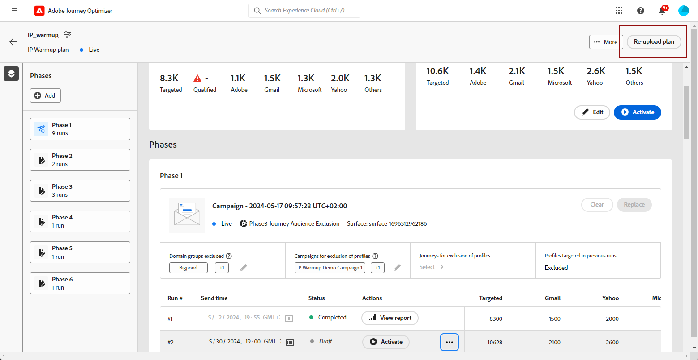

# Implementare un piano di riscaldamento IP {#ip-warmup}

<!--
>[!CONTEXTUALHELP]
>id="ajo_admin_ip_warmup_plan"
>title="Define your IP warmup plan"
>abstract="You can perform IP warmup workflows directly from the Journey Optimizer interface in a standardized and efficient way that follows the best practices for optimal deliverability."
-->

>[!AVAILABILITY]
>
>La funzione di riscaldamento IP è attualmente disponibile come versione beta solo per alcuni utenti. Per partecipare al programma beta, contatta l’Assistenza clienti Adobe.

Con [!DNL Journey Optimizer], è possibile eseguire facilmente flussi di lavoro di riscaldamento IP direttamente dall’interfaccia utente in modo standardizzato ed efficiente, seguendo le best practice per una consegna ottimale.

>[!CAUTION]
>
>Questa funzione si applica solo al canale e-mail.

Quando le e-mail vengono inviate utilizzando una nuova piattaforma, i provider di servizi Internet (ISP) sospettano che gli indirizzi IP non siano riconosciuti. Se grandi quantità di e-mail vengono inviate improvvisamente, gli ISP spesso le contrassegnano come spam.

Per evitare di essere contrassegnati come spam, puoi aumentare progressivamente il volume inviato utilizzando la funzione del piano di riscaldamento IP. Una nuova opzione nel menu Amministrazione consente di eseguire questa operazione in modo più semplice, anziché creare percorsi complessi. Ciò dovrebbe garantire un regolare sviluppo della fase di avvio e consentirti di ridurre il tasso complessivo di indirizzi non validi.

>[!NOTE]
>
>Ulteriori informazioni su come aumentare la reputazione e-mail con la preparazione degli indirizzi IP nel [Guida alle best practice per la consegna](https://experienceleague.adobe.com/docs/deliverability-learn/deliverability-best-practice-guide/additional-resources/generic-resources/increase-reputation-with-ip-warming.html).

<!--
Here are the main steps:

1. You get a deliverability plan from the deliverability consulting team.

1. Create a campaign - marketer [Learn more](#create-ip-warmup-campaign)

1. Your associated practitioner (customer's practitioner/ACS consultant/partner consultant) creates a IP warmup object in project and uploads a plan.

    The CSV manifests itself like below with numbers showing up with/without domain bifurcation. Below screen shows one phase (creative) with associated runs (The plan obviously has more such phases)

1. Practitioner associates the campaign and audience at phase level and turns on some settings as needed for all runs associated with a single creative/campaign

1. Then start to execute on every day basis by simply clicking the play button

1. Reports will continue to show up at campaign level with similar capabilities as today. NO enhancements in BETA. But the IP warmup plan also serves as a consolidated report at one single place of how many executions were done and so on

Benefits are as follows:

* No more creation of daily journeys and associated testing

* Standardization on Campaign which will be easy for practitioners too

* No more pain of creating queries, audiences and testing those as system will create the audiences. At phase level, system ensures that previously targeted + new profiles are picked up AND at iteration level, system ensures that each run is having unique profiles and the count matches what is stated in plan

* Ease of excluding domains and changing the plan with help of simple toggles to exclude OR by editing numbers inline or create new phases or reupload plan if drastic change. No more pain of editing audience definitions, journey conditions

* Single place to manage and view how IP warm is progressing.

* Consolidated report at creative/campaign level as all runs for a phase 

* There is an expectation that with this, it will ease around 30% of effort and will be much better experience for consultant/partner/practitioner - right from planning to execution to reporting
-->

I passaggi chiave per implementare un piano di riscaldamento IP sono i seguenti:

* [Creare campagne di riscaldamento IP](#create-ip-warmup-campaign)
* [Definire un piano di riscaldamento IP](#define-ip-warmup-plan)

## Creare campagne di riscaldamento IP {#create-ip-warmup-campaign}

>[!CONTEXTUALHELP]
>id="ajo_campaign_ip_warmup"
>title="Attiva l&#39;opzione del piano di riscaldamento IP"
>abstract="Selezionare l&#39;opzione di attivazione del piano di riscaldamento IP. Una volta che la campagna è attiva, può essere associata a un piano di riscaldamento IP."

Devi creare una o più campagne con un’opzione specifica abilitata, in modo che possano essere utilizzate in un piano di riscaldamento IP. Effettua le seguenti operazioni.

1. Creare un [superficie](channel-surfaces.md) per il dominio e gli IP che hai identificato per il tuo piano di riscaldamento.

1. Creare un [campagna](../campaigns/create-campaign.md) e seleziona la [E-mail](../email/create-email.md#create-email-journey-campaign) azione.

1. Selezionate la superficie creata per il riscaldamento dell&#39;IP.

   <!--You must use the same surface as the one that will be used for the asociated IP warmup plan. [Learn how to create an IP warmup plan](#create-ip-warmup-plan)-->

1. Fai clic su **[!UICONTROL Crea]**.

1. Dalla sezione **[!UICONTROL Pianificazione]** sezione, seleziona **[!UICONTROL Attivazione del piano di riscaldamento IP]**.

   

   La campagna [pianificazione](../campaigns/create-campaign.md#schedule) sarà guidata dal piano di riscaldamento IP a cui sarà associata, il che significa che la pianificazione non è più definita nella campagna stessa.

1. [Attiva](../campaigns/review-activate-campaign.md) la campagna. Una volta attivo, è pronto per l&#39;uso in un piano di riscaldamento IP.

>[!NOTE]
>
>Per una campagna live con il piano di riscaldamento IP attivato, il **[!UICONTROL Elimina]** finché non viene associato a un piano di riscaldamento IP.

Per ulteriori informazioni su come configurare una campagna, consulta [questa pagina](../campaigns/get-started-with-campaigns.md).

## Definire un piano di riscaldamento IP {#define-ip-warmup-plan}

### Gestire i piani di riscaldamento IP {#manage-ip-warmup-plans}

1. Accedere a **[!UICONTROL Amministrazione]** > **[!UICONTROL Canali]** > **[!UICONTROL Piani di riscaldamento IP]** menu. Vengono visualizzati tutti i piani di riscaldamento IP creati finora.

   

1. Puoi filtrare in base allo stato. I diversi stati sono:

   * **Non avviato**: non è avvenuta alcuna esecuzione
   * **In corso**: non appena viene avviata un’esecuzione <!--or is done?-->
   * **In pausa**
   * **Completato**: tutte le esecuzioni del piano sono completate

1. Per eliminare un piano di riscaldamento IP, selezionare **[!UICONTROL Elimina]** accanto a una voce di elenco e confermare l&#39;eliminazione.

   

   >[!CAUTION]
   >
   >Il piano di riscaldamento IP selezionato verrà eliminato definitivamente.

### Creare un piano di riscaldamento IP {#create-ip-warmup-plan}

>[!CONTEXTUALHELP]
>id="ajo_admin_ip_warmup_upload"
>title="Specificare il piano di riscaldamento IP"
>abstract="Scarica il modello CSV e compilalo con i dati per le fasi di riscaldamento IP e il numero di profili target."

>[!CONTEXTUALHELP]
>id="ajo_admin_ip_warmup_surface"
>title="Seleziona una superficie di marketing"
>abstract="Devi selezionare la stessa superficie di quella selezionata nella campagna da associare al piano di riscaldamento IP."
>additional-url="https://experienceleague.adobe.com/docs/journey-optimizer/using/configuration/channel-surfaces.html?lang=it" text="Impostare le superfici di canale"
>additional-url="https://experienceleague.adobe.com/docs/journey-optimizer/using/configuration/channel-surfaces.html?lang=it" text="Creare campagne di riscaldamento IP"

>[!CAUTION]
>
>Per creare, modificare ed eliminare i piani di riscaldamento IP, è necessario disporre del **[!UICONTROL Consulente per il recapito messaggi]** autorizzazione.
<!--Learn more on managing [!DNL Journey Optimizer] users' access rights in [this section](../administration/permissions-overview.md).-->

Quando una o più campagne live con **[!UICONTROL Attivazione del piano di riscaldamento IP]** opzione attivata, è possibile associarle a un piano di riscaldamento IP.

>[!CAUTION]
>
>Rivolgiti al tuo consulente di recapito messaggi per assicurarti che il modello di piano di riscaldamento IP sia configurato correttamente. <!--TBC-->

1. Accedere a **[!UICONTROL Amministrazione]** > **[!UICONTROL Canali]** > **[!UICONTROL Piani di riscaldamento IP]** , quindi fai clic su **[!UICONTROL Crea piano di riscaldamento IP]**.

   

1. Compila i dettagli del piano di riscaldamento IP: fornisci un nome e una descrizione.

   

1. Seleziona un [superficie](channel-surfaces.md). Solo le superfici di marketing sono disponibili per la selezione. [Ulteriori informazioni sul tipo di e-mail](../email/email-settings.md#email-type)

   >[!CAUTION]
   >
   >Devi selezionare la stessa superficie di quella selezionata nella campagna da associare al piano di riscaldamento IP. [Scopri come creare una campagna di riscaldamento IP](#create-ip-warmup-campaign)

1. Carica il file Excel contenente il tuo piano di riscaldamento IP<!--which formats are allowed?-->. Puoi utilizzare il modello fornito dal team di recapito messaggi.<!--TBC?--> [Ulteriori informazioni](#upload-plan)
   <!--
    You can also download the Excel template from the [!DNL Journey Optimizer] user interface and upload it after filling it with the IP warmup details.-->

   

1. Fai clic su **[!UICONTROL Crea]**. Il numero di fasi definite nel file caricato viene visualizzato automaticamente in tutte le esecuzioni di ogni fase. [Ulteriori informazioni](#upload-plan)

   

### Ricarica un piano di riscaldamento IP {#re-upload-plan}

Puoi ricaricare un altro piano di riscaldamento IP utilizzando il pulsante corrispondente.

>[!NOTE]
>
>I dettagli del piano di riscaldamento IP cambiano in base al file appena caricato. Non influisce sulle esecuzioni complete e attivate.

### Carica il file contenente il piano {#upload-plan}

Di seguito è riportato un esempio di file contenente un piano di riscaldamento IP.

Ogni fase corrisponde a un periodo composto da più esecuzioni, a cui si assegnerà una singola campagna.

Per ogni esecuzione, hai un determinato numero di destinatari e definirai una data in cui verrà eseguita.

Puoi avere tutte le colonne che desideri per i domini a cui desideri recapitare. In questo esempio sono disponibili tre colonne: Gmail, Adobe e Others, ovvero

L’idea è quella di avere più esecuzioni nelle prime fasi e di aumentare progressivamente il numero di indirizzi mirati, riducendo nel contempo il numero di esecuzioni.

### Definire le fasi {#define-phases}

>[!CONTEXTUALHELP]
>id="ajo_admin_ip_warmup_campaigns_excluded"
>title="Seleziona i tipi di pubblico delle campagne da escludere"
>abstract="Seleziona i tipi di pubblico da altre campagne da escludere dalla fase corrente."

>[!CONTEXTUALHELP]
>id="ajo_admin_ip_warmup_domains_excluded"
>title="Seleziona i gruppi di dominio da escludere"
>abstract="Seleziona i domini da escludere dalla fase corrente."

1. Per ogni fase, seleziona la campagna da associare a questa fase del piano di riscaldamento IP.

   

   Tieni presente quanto segue:

   * Solo le campagne con **[!UICONTROL Attivazione del piano di riscaldamento IP]** opzione abilitata <!--and live?--> sono disponibili per la selezione. [Ulteriori informazioni](#create-ip-warmup-campaign)

   * È necessario selezionare una campagna che utilizza la stessa superficie di quella selezionata per il piano di riscaldamento IP corrente.

   * Non puoi selezionare una campagna già in uso in un’altra campagna di riscaldamento IP.

1. Per ciascuna fase si applica quanto segue:

   * **[!UICONTROL Esclusione profilo]** - I profili delle esecuzioni precedenti di quella fase sono sempre esclusi. Ad esempio, se Leo è stato #1 nelle prime 6300 persone prese di mira, il sistema si assicurerà automaticamente che Leo non riceva la posta in esecuzione #2.

   * **[!UICONTROL Pubblico della campagna escluso]** - Selezionare il pubblico da un altro <!--executed/live?-->campagne che desideri escludere dalla fase corrente.

     Ad esempio, è possibile che si stia eseguendo una fase e che sia stato necessario dividerla per qualsiasi motivo. In questo caso, nella fase 2, vorresti includere in questa sezione la campagna utilizzata nella fase 1, in modo che nella fase 2 non vengano incluse le persone contattate in precedenza nella fase 1. Questo può essere fatto non solo con le campagne utilizzate nello stesso piano di riscaldamento IP, ma anche da un altro piano di riscaldamento IP troppo.

   * **[!UICONTROL Gruppi di domini esclusi]** : seleziona i domini che desideri escludere da quella fase, ad esempio Gmail. <!--??-->

     Dopo aver eseguito il riscaldamento dell&#39;IP per alcuni giorni, ti rendi conto che la reputazione dell&#39;ISP con un dominio, ad esempio hotmail, non è buona e desideri risolverla con l&#39;ISP, ma non desideri interrompere il piano di riscaldamento dell&#39;IP. In questo caso, puoi inserire l’hotmail del gruppo di dominio nella categoria esclusa.

     >[!NOTE]
     >
     >L’esclusione del dominio richiede una fase non eseguita, pertanto per aggiungere esclusioni potrebbe essere necessario dividere una fase in esecuzione. Analogamente, se il gruppo di dominio non è un gruppo di dominio OOTB, potrebbe essere necessario creare un gruppo di dominio in Excel e caricarlo e quindi escluderlo.

   

1. Se necessario, puoi aggiungere una fase, che verrà aggiunta dopo l’ultima fase corrente. Utilizza il **[!UICONTROL Elimina fase]** per rimuovere eventuali fasi indesiderate.

   

   >[!CAUTION]
   >
   >Non è possibile annullare **[!UICONTROL Elimina]** azione.
   >
   >Se elimini tutte le fasi dal piano di riscaldamento IP, si consiglia di ricaricare un piano.

### Definire le esecuzioni {#define-runs}

1. Seleziona una pianificazione per ogni esecuzione. <!--which is actually a window of opportunity. meaning? how many hours? shall we specify that to clarify?-->

   

1. Seleziona un’ora di fine, che in pratica indica la finestra all’interno della quale possiamo eseguire la campagna di riscaldamento nel caso in cui si verifichino ritardi nel lavoro di pubblico. Se non viene specificato, verrà eseguito un tentativo all&#39;ora di inizio e non verrà eseguito alcun tentativo. Se viene fornita l’ora di fine, eseguiremo l’esecuzione tra tale finestra.

1. Attiva ogni esecuzione. Assicurati di pianificare con un tempo sufficiente per consentire l’esecuzione del processo di segmentazione. <!--explain how you can evaluate a proper time-->

   >[!CAUTION]
   >
   >Ogni esecuzione deve essere attivata almeno 12 ore prima dell’ora di invio effettiva. In caso contrario, la segmentazione potrebbe non essere completata. <!--How do you know when segmentation is complete? Is there a way to prevent user from scheduling less than 12 hours before the segmentation job?-->

1. Se l’esecuzione della campagna non è stata avviata, puoi interrompere un’esecuzione.

   Una volta avviata l’esecuzione della campagna, il **[!UICONTROL Interrompi]** non è più disponibile. <!--TBC in UI-->

   

1. Per aggiungere un’esecuzione, seleziona **[!UICONTROL Aggiungi una sequenza di seguito]** dall’icona dei tre puntini.

   

1. In qualsiasi momento, se desideri utilizzare una campagna diversa a partire da un’esecuzione specifica, seleziona la **[!UICONTROL Opzione Dividi in una nuova fase]** dall’icona dei tre puntini. Viene creata una nuova fase per le restanti esecuzioni della fase corrente. Segui i passaggi [sopra](#define-phases) per definire la nuova fase.

   Ad esempio, se selezioni questa opzione per #4 di esecuzione, le esecuzioni #4 a #8 verranno spostate in una nuova fase.

<!--
You don't have to decide the campaign upfront. You can do a split later. It's a work in progress plan: you activate one run at a time with a campaign and you always have the flexibility to modify it while working on it.

But need to explain in which case you want to modify campaigns, provide examples
-->

Un’esecuzione può avere i seguenti stati<!--TBC with Medha-->:

* **[!UICONTROL Completato]**:
* **[!UICONTROL Non riuscito]**:
* **[!UICONTROL Annullato]**: l’esecuzione è stata interrotta prima dell’avvio dell’esecuzione della campagna.

