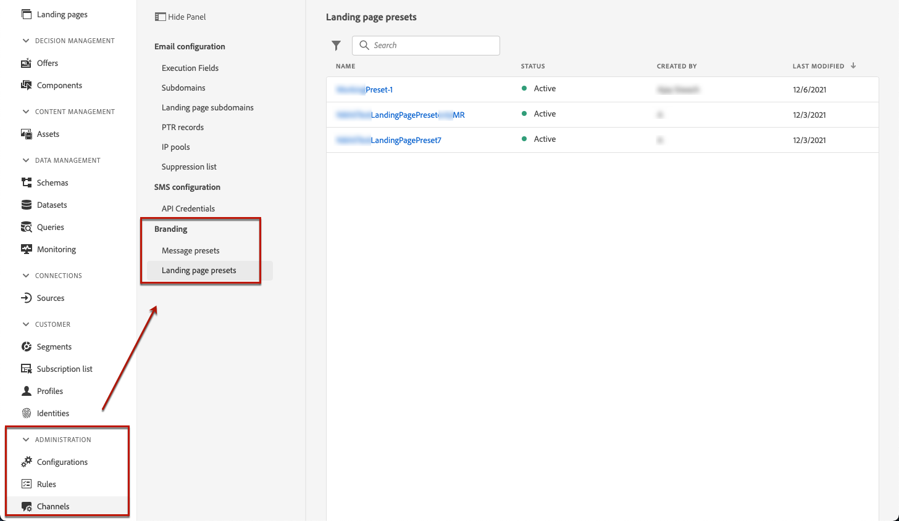

# Configura le pagine di destinazione {#lp-configuration}

## Configurare i sottodomini della pagina di destinazione {#lp-subdomains}

>[!CONTEXTUALHELP]
>id="ajo_admin_config_lp_subdomain"
>title="Creare un predefinito per pagina di destinazione"
>abstract="Per creare un predefinito per pagina di destinazione, accertati di aver configurato in precedenza almeno un sottodominio della pagina di destinazione da selezionare dall’elenco dei nomi del sottodominio."

Essere in grado di [creare predefiniti pagina di destinazione](#lp-create-preset), devi impostare i sottodomini che userai per le pagine di destinazione.

Puoi utilizzare un sottodominio già delegato ad Adobe oppure configurare un altro sottodominio. Ulteriori informazioni sulla delega dei sottodomini ad Adobe in [questa sezione](delegate-subdomain.md).

### Utilizzare un sottodominio esistente {#lp-use-existing-subdomain}

Per utilizzare un sottodominio già delegato ad Adobe, segui i passaggi seguenti.

1. Accedere al **[!UICONTROL Administration]** > **[!UICONTROL Channels]** quindi seleziona **[!UICONTROL Email configuration]** > **[!UICONTROL Landing page subdomains]**.

   

1. Fai clic su **[!UICONTROL Set up subdomain]**.

   

1. Seleziona **[!UICONTROL Use delegated domain]** dal **[!UICONTROL Configuration type]** sezione .

   

1. Immetti il prefisso che verrà visualizzato nell’URL della pagina di destinazione.

   >[!NOTE]
   >
   >Sono consentiti solo caratteri alfanumerici e trattini.

1. Seleziona un sottodominio delegato dall’elenco.

   >[!NOTE]
   >
   >Non puoi selezionare un sottodominio già utilizzato come sottodominio della pagina di destinazione.

   

   >[!CAUTION]
   >
   >Se selezioni un dominio delegato ad Adobe utilizzando [metodo CNAME](delegate-subdomain.md#cname-subdomain-delegation), devi creare il record DNS sulla piattaforma di hosting. Per generare il record DNS, il processo è lo stesso di quando configuri un nuovo sottodominio della pagina di destinazione. Scopri come in [questa sezione](#lp-configure-new-subdomain).

1. Fai clic su **[!UICONTROL Submit]**.

1. Dopo l’invio, il sottodominio viene visualizzato nell’elenco con la **[!UICONTROL Processing]** stato. Per ulteriori informazioni sugli stati dei sottodomini, consulta [questa sezione](access-subdomains.md).<!--Same statuses?-->

   

   >[!NOTE]
   >
   >Prima di poter utilizzare quel sottodominio per inviare messaggi, è necessario attendere che Adobe esegua i controlli richiesti, che possono richiedere fino a 4 ore.<!--Learn more in [this section](delegate-subdomain.md#subdomain-validation).-->

1. Una volta eseguiti i controlli, il sottodominio ottiene il **[!UICONTROL Success]** stato. È pronto per essere utilizzato per creare i predefiniti per le pagine di destinazione.

### Configurare un nuovo sottodominio {#lp-configure-new-subdomain}

Per configurare un nuovo sottodominio, effettua le seguenti operazioni.

1. Accedere al **[!UICONTROL Administration]** > **[!UICONTROL Channels]** quindi seleziona **[!UICONTROL Email configuration]** > **[!UICONTROL Landing page subdomains]**.

1. Fai clic su **[!UICONTROL Set up subdomain]**.

1. Seleziona **[!UICONTROL Add your own domain]** dal **[!UICONTROL Configuration type]** sezione .

   

1. Specifica il sottodominio da delegare.

   >[!CAUTION]
   >
   >Non puoi utilizzare un sottodominio della pagina di destinazione esistente.

   Delega di un sottodominio non valido ad Adobe non consentita. Assicurati di inserire un sottodominio valido di proprietà della tua organizzazione, ad esempio marketing.yourcompany.com.

   I sottodomini a più livelli come &#39;email.marketing.yourcompany.com&#39; al momento non sono supportati.

1. Viene visualizzato il record da inserire nei server DNS. Copia questo record o scarica un file CSV, quindi accedi alla tua soluzione di hosting del dominio per generare il record DNS corrispondente.

1. Assicurati che il record DNS sia stato generato nella tua soluzione di hosting del dominio. Se tutto è configurato correttamente, seleziona la casella &quot;Confermo...&quot;, quindi fai clic su **[!UICONTROL Submit]**.

   

   >[!NOTE]
   >
   >Quando configuri un nuovo sottodominio della pagina di destinazione, questo punta sempre a un record CNAME.

1. Una volta inviata la delega del sottodominio, il sottodominio viene visualizzato nell’elenco con la **[!UICONTROL Processing]** stato. Per ulteriori informazioni sugli stati dei sottodomini, consulta [questa sezione](access-subdomains.md).<!--Same statuses?-->

   >[!NOTE]
   >
   >Prima di poter utilizzare quel sottodominio per inviare messaggi, è necessario attendere che Adobe esegua i controlli richiesti, che possono richiedere fino a 4 ore.<!--Learn more in [this section](#subdomain-validation).-->

1. Una volta eseguiti i controlli, il sottodominio ottiene il **[!UICONTROL Success]** stato. È pronto per essere utilizzato per creare i predefiniti per le pagine di destinazione.

   Il sottodominio verrà contrassegnato come **[!UICONTROL Failed]** se non riesci a creare il record di convalida nella soluzione di hosting.

## Definire i predefiniti per le pagine di destinazione {#lp-define-preset}

Quando [creazione di una pagina di destinazione](../landing-pages/create-lp.md#create-a-lp), devi selezionare un predefinito per la pagina di destinazione per creare la pagina di destinazione e sfruttarla **[!DNL Journey Optimizer]**.

### Accedere ai predefiniti della pagina di destinazione {#lp-presets}

Per accedere ai predefiniti della pagina di destinazione, effettua le seguenti operazioni.

1. Accedere al **[!UICONTROL Administration]** > **[!UICONTROL Channels]** menu.

1. Seleziona **[!UICONTROL Branding]** > **[!UICONTROL Landing page presets]**.

   

1. Fai clic su un’etichetta preimpostata per accedere ai dettagli del predefinito della pagina di destinazione.

   

### Creare un predefinito per pagina di destinazione {#lp-create-preset}

Per creare un predefinito per una pagina di destinazione, segui i passaggi riportati di seguito.

>[!NOTE]
>
>Per creare un predefinito, accertati di aver configurato in precedenza almeno un sottodominio della pagina di destinazione. [Scopri come](#lp-subdomains)

1. Accedere al **[!UICONTROL Administration]** > **[!UICONTROL Channels]** quindi seleziona **[!UICONTROL Branding]** > **[!UICONTROL Landing page presets]**.

1. Seleziona **[!UICONTROL Create landing page preset]**.

   

1. Immetti un nome e una descrizione per il predefinito.

   >[!NOTE]
   >
   > I nomi devono iniziare con una lettera (A-Z). Può contenere solo caratteri alfanumerici. È inoltre possibile utilizzare il carattere di sottolineatura `_`, punto`.` e trattino `-` caratteri.

1. Seleziona un sottodominio della pagina di destinazione dall’elenco a discesa.

   

   >[!NOTE]
   >
   >Per selezionare un sottodominio, accertati di aver configurato in precedenza almeno un sottodominio della pagina di destinazione. [Scopri come](#lp-subdomains)

   Vengono visualizzate le impostazioni corrispondenti al sottodominio selezionato.

1. Se desideri selezionare il sottodominio della pagina di destinazione come URL di tracciamento, controlla la **[!UICONTROL Same as landing page subdomain]** opzione . [Ulteriori informazioni sul tracciamento](../design/message-tracking.md)

   

   Ad esempio, se l’URL della pagina di destinazione è &quot;pages.mail.luma.com&quot; e l’URL di tracciamento è &quot;data.mail.luma.com&quot;, puoi scegliere &quot;pages.mail.luma.com&quot; da utilizzare come sottodominio di tracciamento.

1. Fai clic su **[!UICONTROL Submit]** per confermare la creazione del predefinito della pagina di destinazione. Puoi anche salvare il predefinito come bozza e ripristinarne la configurazione in un secondo momento.

   

1. Una volta creato il predefinito della pagina di destinazione, questo viene visualizzato nell’elenco con **[!UICONTROL Active]** stato. È pronto per essere utilizzato per le pagine di destinazione.

   

Ora è pronto per [creare pagine di destinazione](../landing-pages/create-lp.md) in [!DNL Journey Optimizer].

>[!NOTE]
>
>Scopri come creare i predefiniti per i messaggi per le notifiche push e le e-mail in [questa sezione](message-presets.md).

**Argomenti correlati**:

* [Introduzione alle pagine di destinazione](../landing-pages/get-started-lp.md)
* [Creare una pagina di destinazione](../landing-pages/create-lp.md#create-a-lp)
