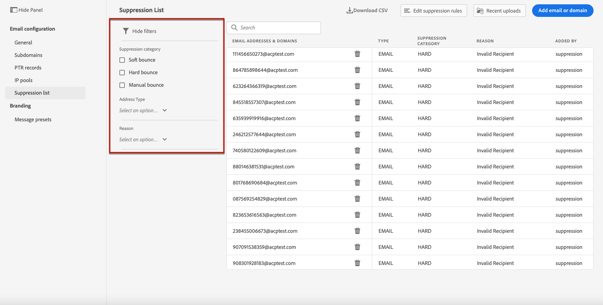

# Gestire l’elenco di soppressione {#manage-suppression-list}

Con [!DNL Journey Optimizer] puoi monitorare tutti gli indirizzi e-mail che vengono automaticamente esclusi dall’invio in un percorso, ad esempio:

* Indirizzi non validi (non recapitati rigidi) o non recapitati in modo coerente e che potrebbero influenzare negativamente la reputazione delle e-mail se continui a includerli nelle consegne.
* Destinatari che emettono una denuncia di spam di qualche tipo contro uno dei tuoi messaggi e-mail.

<!--Profiles who unsubscribe from your sendings. Learn more on [opting-out](../consent.md). NOT TRUE as confirmed by eng.: "Subscribe and Unsubscribe are handled by the Consent/Subscription service. A user that opts out will not make it to the suppression list – we won’t send them emails."-->

Tali indirizzi e-mail vengono raccolti automaticamente nell&#39;elenco di eliminazione di Journey Optimizer ****. [Ulteriori informazioni](../suppression-list.md).

## Accedere all&#39;elenco di soppressione {#access-suppression-list}

Per accedere all’elenco dettagliato degli indirizzi e-mail esclusi, apri il menu **[!UICONTROL Channels]** > **[!UICONTROL Email configuration]** > **[!UICONTROL General]**, quindi fai clic sul collegamento **[!UICONTROL View suppression lists]** .

Sono disponibili filtri che consentono di sfogliare l’elenco.

<!--suppression date,  category and reason, but on staging, only creation date filter is available-->

<!--You can also download the list as a CSV file for analysis and reporting purpose. Won't be available.-->

## Categorie e motivi di soppressione {#suppression-categories-and-reasons}

Quando un messaggio non viene recapitato a un indirizzo e-mail, Journey Optimizer determina il motivo per cui la consegna non è riuscita e lo associa a una categoria di eliminazione.

Le categorie di soppressione sono le seguenti:

* **Rigido**: L’indirizzo e-mail viene inviato immediatamente all’elenco di eliminazione.

* **Morbido**: Gli errori morbidi inviano un indirizzo all’elenco di soppressione quando il contatore degli errori raggiunge la soglia limite. [Ulteriori informazioni sui nuovi tentativi](retries.md)

* **Ignorato**:
   * Quando l’errore si è verificato per un indirizzo e-mail valido ma è noto come temporaneo, ad esempio un tentativo di connessione non riuscito o un problema tecnico temporaneo, l’indirizzo e-mail viene aggiunto all’elenco di soppressione una volta che il contatore degli errori raggiunge la soglia limite. [Ulteriori informazioni sui nuovi tentativi](retries.md).
   * Quando l&#39;errore è il risultato di un reclamo di spam, l&#39;indirizzo e-mail del destinatario che ha emesso il reclamo viene inviato immediatamente all&#39;elenco di soppressione.

<!--**Manual**: You can also manually add an email address to the suppression list. => Manual category will be available when manually adding an address to the suppression list (via API)-->

>[!NOTE]
>
>Ulteriori informazioni sui mancati recapiti e i mancati recapiti nella sezione [Tipi di errori di consegna](../suppression-list.md#delivery-failures) .

Per ogni indirizzo e-mail elencato, puoi anche controllare la **[!UICONTROL Reason]** per escluderlo e la data/ora in cui è stato aggiunto all’elenco di soppressione.

<!--to replace with suppression-list.png when Manual category is available (through API)-->

I possibili motivi di un errore di consegna sono:

| Motivo | Descrizione | Categoria di soppressione |
| --- | --- | --- |
| **[!UICONTROL Undetermined]** | Impossibile identificare il motivo di mancato recapito ricevuto dall&#39;agente di trasferimento messaggi del dominio destinatario. | Ignorato |
| **[!UICONTROL Invalid Recipient]** | Il destinatario non è valido o non esiste. | Duro |
| **[!UICONTROL Soft Bounce]** | Il messaggio è stato rimbalzato per un motivo diverso dagli errori soft elencati in questa tabella, ad esempio quando si invia la velocità consentita consigliata da un ISP. | Morbido |
| **[!UICONTROL DNS Failure]** | Messaggio rimbalzato a causa di un errore DNS. | Morbido |
| **[!UICONTROL Mailbox Full]** | Il messaggio è stato rimbalzato perché la casella di posta del destinatario era piena e non poteva accettare altri messaggi. | Morbido |
| **[!UICONTROL Too Large]** | Messaggio non recapitato perché troppo grande per il destinatario.  Verranno eseguiti nuovi tentativi: puoi modificare le dimensioni del messaggio e inserirlo nuovamente per la consegna. | Ignorato |
| **[!UICONTROL Timeout]** | Timeout del messaggio, ovvero messaggio non recapitato e raggiunto il limite di tentativi del messaggio (3,5 giorni). | Ignorato |
| **[!UICONTROL Admin Failure]** | Messaggio non riuscito in base ai criteri configurati dall&#39;amministratore del sistema di invio. <!--For example, if emails are blackholed at the global, domain or binding level using the "blackhole" directive, this bounce code is used.--> | Ignorato |
| **[!UICONTROL Generic Bounce: No RCPT]** | Impossibile determinare alcun destinatario per il messaggio. | Ignorato |
| **[!UICONTROL Generic Bounce]** | Messaggio non riuscito per motivi non specificati. | Ignorato |
| **[!UICONTROL Mail Block]** | Il messaggio è stato bloccato dal destinatario (ad es. MTA del destinatario). | Ignorato |
| **[!UICONTROL Spam Block]** | Il messaggio è stato bloccato dal destinatario perché proveniente da una fonte di spam nota. Ad esempio, potrebbe trattarsi di un blocco IP di invio. | Ignorato |
| **[!UICONTROL Spam Content]** | Il contenuto del messaggio è stato bloccato dal destinatario (MTA destinatario) come spam. | Ignorato |
| **[!UICONTROL Prohibited Attachment]** | Il messaggio è stato bloccato dal destinatario perché conteneva un allegato. | Ignorato |
| **[!UICONTROL Relaying Denied]** | Il messaggio è stato bloccato dal destinatario perché l&#39;invio non è consentito. | Morbido |
| **[!UICONTROL Auto-Reply]** | Il messaggio è un messaggio di risposta/vacanza automatica. | Ignorato |
| **[!UICONTROL Transient Failure]** | La trasmissione del messaggio è stata temporaneamente ritardata. | Ignorato |
| **[!UICONTROL Challenge-Response]** | Il messaggio è una sonda di risposta alla sfida. | Morbido |

>[!NOTE]
>
>Gli utenti non abbonati non ricevono e-mail da [!DNL Journey Optimizer], pertanto i loro indirizzi e-mail non possono essere inviati all’elenco di soppressione. La loro scelta viene gestita a livello di Experience Platform. Ulteriori informazioni su [rinuncia](../consent.md).

<!--
Removed from the table provided by SparkPost/Momentum:
| **[!UICONTROL Subscribe]** | The message is a subscribe request. | Ignored |
| **[!UICONTROL Unsubscribe]** | The message is an unsubscribe request. | Hard |
-->

<!--Note to add eventually: If a user is subscribed and [!DNL Journey Optimizer] fails to send emails to their subscribed email address, they will get added to the suppression list. (not sure it's possible to subscribe through AJO or need to find reference to Experience Platform doc?)-->

