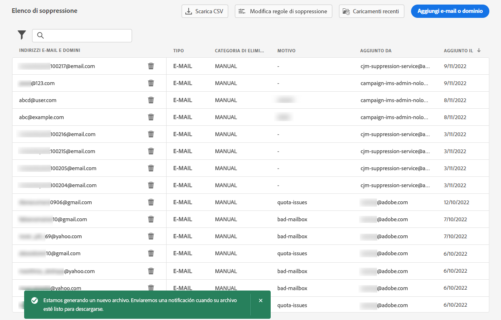

# Gestire l’elenco di soppressione {#manage-suppression-list}

Con [!DNL Journey Optimizer], puoi monitorare tutti gli indirizzi e-mail che vengono automaticamente esclusi dall’invio in un percorso o in una campagna, ad esempio messaggi non recapitati rigidi, messaggi non recapitati e reclami relativi a spam.

Tali indirizzi e-mail vengono raccolti automaticamente in Journey Optimizer **elenco a discesa**. Un elenco di soppressione è costituito da indirizzi e domini da escludere dal pubblico. Raccoglie indirizzi e-mail e domini soppressi in tutti gli invii in un unico ambiente client, il che significa specifici per un ID organizzazione associato a un ID sandbox.

Ulteriori informazioni sul concetto e sull&#39;utilizzo dell&#39;elenco di soppressione in [questa sezione](../reports/suppression-list.md).


## Accedere all&#39;elenco di soppressione {#access-suppression-list}

Per accedere all’elenco dettagliato degli indirizzi e-mail e dei domini esclusi, individua **[!UICONTROL Amministrazione]** > **[!UICONTROL Canali]** > **[!UICONTROL Configurazione e-mail]**, quindi seleziona **[!UICONTROL Elenco di eliminazione]**.


>[!CAUTION]
>
>Le autorizzazioni per visualizzare, esportare e gestire l’elenco di soppressione sono limitate a [Amministratori di percorso](../administration/ootb-product-profiles.md#journey-administrator). Ulteriori informazioni sulla gestione [!DNL Journey Optimizer] diritti di accesso degli utenti in [questa sezione](../administration/permissions-overview.md).


Sono disponibili filtri che consentono di sfogliare l’elenco.


Puoi filtrare il **[!UICONTROL Categoria di soppressione]**, **[!UICONTROL Tipo di indirizzo]** oppure **[!UICONTROL Motivo]**. Seleziona una o più opzioni per ciascun criterio. Una volta selezionato, puoi cancellare ogni filtro o tutti i filtri visualizzati in cima all’elenco.


## Comprendere i motivi dell’errore {#suppression-categories-and-reasons}

Quando un messaggio non viene recapitato a un indirizzo e-mail, [!DNL Journey Optimizer] determina il motivo per cui la consegna non è riuscita e la associa a un **[!UICONTROL Categoria di soppressione]**.

Le categorie di soppressione sono le seguenti:

* **Duro**: Un messaggio non recapitato indica un indirizzo e-mail non valido (ovvero un indirizzo e-mail inesistente). Questo comporta un messaggio non recapitato dal server e-mail ricevente che indica esplicitamente che l’indirizzo non è valido. L’indirizzo e-mail viene inviato immediatamente all’elenco di eliminazione.

   Quando l&#39;errore è il risultato di un reclamo di spam, rientra anche nella **Duro** categoria. L&#39;indirizzo e-mail del destinatario che ha emesso il reclamo viene inviato immediatamente all&#39;elenco di soppressione.

* **Morbido**: Un messaggio non recapitato è un messaggio non recapitato temporaneo che si è verificato per un indirizzo e-mail valido. L’indirizzo e-mail viene aggiunto all’elenco di soppressione dopo diversi tentativi. Gli errori morbidi inviano un indirizzo all’elenco di soppressione quando il contatore degli errori raggiunge la soglia limite. [Ulteriori informazioni sui nuovi tentativi](retries.md)

* **Manuale**: Gli errori manuali sono stati aggiunti manualmente all’elenco di soppressione. [Ulteriori informazioni](#add-addresses-and-domains)

Per ogni indirizzo e-mail elencato, puoi anche controllare il **[!UICONTROL Tipo]** (e-mail o dominio), **[!UICONTROL Motivo]** per escluderlo, chi l’ha aggiunto e la data/ora in cui è stato aggiunto all’elenco di soppressione.


Possibili motivi di un errore di consegna:

| Motivo | Descrizione | Categoria |
| --- | --- | --- |
| **[!UICONTROL Destinatario non valido]** | Il destinatario non è valido o non esiste. | Duro |
| **[!UICONTROL Rimbalzo morbido]** | Il messaggio è stato rimbalzato per un motivo diverso dagli errori soft elencati in questa tabella, ad esempio quando si invia la velocità consentita consigliata da un ISP. | Morbido |
| **[!UICONTROL Errore DNS]** | Messaggio rimbalzato a causa di un errore DNS. | Morbido |
| **[!UICONTROL Cassetta postale completa]** | Il messaggio è stato rimbalzato perché la casella di posta del destinatario era piena e non poteva accettare altri messaggi. | Morbido |
| **[!UICONTROL Rimesso negato]** | Il messaggio è stato bloccato dal destinatario perché l&#39;invio non è consentito. | Morbido |
| **[!UICONTROL Sfida-risposta]** | Il messaggio è una sonda di risposta alla sfida. | Morbido |
| **[!UICONTROL Denuncia di spam]** | Il messaggio è stato bloccato perché contrassegnato come spam dal destinatario. | Duro |

>[!NOTE]
>
>Gli utenti non abbonati non ricevono e-mail da [!DNL Journey Optimizer], pertanto i loro indirizzi e-mail non possono essere inviati all’elenco di soppressione. La loro scelta viene gestita a livello di Experience Platform. [Ulteriori informazioni sulla rinuncia](../privacy/opt-out.md)


### Regole di eliminazione  {#suppression-rules}

Da **[!UICONTROL Elenco di eliminazione]** visualizza, puoi anche modificare il parametro di nuovo tentativo associato alle regole di soppressione dal **[!UICONTROL Modificare le regole di eliminazione]** pulsante . Utilizza questa opzione per aggiornare la soglia dei tentativi per la sandbox corrente. [Ulteriori informazioni sui nuovi tentativi](retries.md).


## Aggiungi indirizzi e domini all’elenco di soppressione{#add-addresses-and-domains}

>[!CONTEXTUALHELP]
>id="ajo_admin_suppression_list_header"
>title="Aggiungi e-mail o domini all’elenco di soppressione"
>abstract="Puoi compilare manualmente l’elenco di soppressione di Journey Optimizer al fine di escludere specifici indirizzi e-mail e/o domini dall’invio."

>[!CONTEXTUALHELP]
>id="ajo_admin_suppression_list"
>title="Aggiungi e-mail o domini all’elenco di soppressione"
>abstract="Per compilare l’elenco di soppressione, puoi aggiungere manualmente indirizzi e-mail o domini: uno alla volta o in modalità collettiva tramite un caricamento di file CSV. Questi indirizzi e/o domini e-mail specifici saranno esclusi dall’invio."

Quando un messaggio non viene recapitato a un indirizzo e-mail, questo viene aggiunto automaticamente all’elenco di soppressione in base alla regola di soppressione o al conteggio dei messaggi non recapitati definiti.

Tuttavia, puoi anche compilare manualmente il [!DNL Journey Optimizer] elenco di soppressione per escludere specifici indirizzi e-mail e/o domini dall’invio.

>[!NOTE]
>
>Può richiedere fino a 60 minuti per [!DNL Journey Optimizer] tenere conto degli indirizzi soppressi nelle e-mail in uscita.

Puoi aggiungere indirizzi e-mail o domini [una per volta](#add-one-address-or-domain)oppure [in modalità collettiva](#upload-csv-file) tramite caricamento di file CSV.

### Aggiungi un indirizzo o un dominio {#add-one-address-or-domain}

>[!CONTEXTUALHELP]
>id="ajo_admin_suppression_list_address"
>title="Aggiungi un elemento all&#39;elenco di soppressione"
>abstract="Puoi compilare l’elenco di soppressione aggiungendo indirizzi e/o domini e-mail uno per uno."

Per aggiungere un indirizzo e-mail o un dominio all’elenco di eliminazione, segui i passaggi seguenti:

1. Seleziona la **[!UICONTROL Aggiungi e-mail o dominio]** pulsante .

   

1. Scegli la **[!UICONTROL Uno ad uno]** opzione .

   

1. Selezionare il tipo di indirizzo: **[!UICONTROL E-mail]** o **[!UICONTROL Dominio]**.

1. Immetti l’indirizzo e-mail o il dominio da escludere dall’invio.

   >[!NOTE]
   >
   >Assicurati di inserire un indirizzo e-mail valido (ad esempio abc@company.com) o un dominio (ad esempio abc.company.com).

1. (Facoltativo) Immetti un motivo. In questo campo sono consentiti tutti i caratteri ASCII stampabili compresi tra 32 e 126.

1. Utilizza la **[!UICONTROL Invia]** per confermare.

### Caricare un file CSV {#upload-csv-file}

>[!CONTEXTUALHELP]
>id="ajo_admin_suppression_list_csv"
>title="Carica CSV per aggiungere elementi all&#39;elenco di soppressione"
>abstract="Puoi compilare l’elenco di soppressione caricando un file CSV compilato con gli indirizzi e-mail/domini da escludere."

Per aggiungere un gruppo di indirizzi e-mail o un gruppo di domini all’elenco di eliminazione, segui i passaggi seguenti:

1. Seleziona la **[!UICONTROL Aggiungi e-mail o dominio]** pulsante .
1. Scegli la **[!UICONTROL Carica CSV]** opzione .

   

1. Scarica il modello CSV da utilizzare, che include le colonne e il formato seguenti:

   ```
   TYPE,VALUE,COMMENT
   EMAIL,abc@somedomain.com,Comment
   DOMAIN,somedomain.com,Comment
   ```

1. Compila il modello CSV con gli indirizzi e-mail e/o i domini da aggiungere all’elenco di soppressione. Tutti i caratteri stampabili ASCII compresi tra 32 e 126 sono consentiti nella variabile **COMMENTO** colonna.

   >[!CAUTION]
   >
   >Non modificare il nome delle colonne nel modello CSV.
   >
   >La dimensione del file non deve superare 1 MB.

1. Una volta completato, trascina e rilascia il file CSV e utilizza il **[!UICONTROL Invia]** per confermare.

   

Al termine del caricamento, puoi controllarne lo stato dal [Caricamenti recenti](#recent-uploads) , come descritto di seguito.

### Verifica lo stato dei caricamenti {#recent-uploads}

Utilizza la **[!UICONTROL Caricamenti recenti]** per controllare lo stato degli ultimi file CSV caricati.


Gli stati possibili sono:

* **[!UICONTROL In sospeso]**: Elaborazione del caricamento del file in corso.
* **[!UICONTROL Errore]**: Il processo di caricamento dei file non è riuscito a causa di un problema tecnico o di un errore di formato del file.
* **[!UICONTROL Completa]**: Il processo di caricamento dei file è stato completato.

Durante il caricamento, se alcuni indirizzi non sono nel formato corretto, non vengono aggiunti al [!DNL Journey Optimizer] elenco di soppressione.

In tal caso, al termine del caricamento, il report viene associato a un report. Puoi scaricarlo per verificare gli errori rilevati<!-- and understand why they were not added to the suppression list-->.


Di seguito è riportato un esempio del tipo di voci che si possono trovare nel rapporto di errore:

```
type,value,comments,failureReason
Email,examplemail.com,MANUAL,Invalid format for value: examplemail.com
Email,examplemail,MANUAL,Invalid format for value: examplemail
Email,example@mail,MANUAL,Invalid format for value: example@mail
Domain,example,MANUAL,Invalid format for value: example
Domain,example.!com,MANUAL,Invalid format for value: example.!com
Domain,!examplecom,MANUAL,Invalid format for value: !examplecom
```

## Rimuovere un indirizzo dall&#39;elenco di soppressione{#remove-from-suppression-list}

È possibile aggiornare manualmente l’elenco di soppressione. La rimozione di un indirizzo e-mail dalla quarantena è un’operazione sensibile e può influenzare i tassi di reputazione e recapito dei dati IP. Assicurati di procedere con cautela.

Quando si elimina un indirizzo e-mail o un dominio dall’elenco di eliminazione, Adobe Journey Optimizer può iniziare di nuovo a consegnare a questo indirizzo o dominio.  Ulteriori informazioni sul recapito messaggi in [questa sezione](../reports/deliverability.md).

Per rimuovere un indirizzo dall&#39;elenco di soppressione, utilizzare il **[!UICONTROL Elimina]** pulsante .


>[!NOTE]
>
>Procedi con molta attenzione quando consideri di eliminare qualsiasi indirizzo e-mail o dominio. In caso di dubbio, contatta un esperto di recapito.


Ad esempio, nel caso di un’interruzione di Internet Service Provider (ISP), le e-mail possono essere contrassegnate erroneamente come messaggi non recapitati perché non possono essere recapitate correttamente al destinatario. Questi indirizzi e-mail devono essere rimossi dall’elenco di soppressione.

A questo scopo, filtra l’elenco di soppressione per visualizzare gli indirizzi e-mail o i domini interessati. Ad esempio, se si è verificata un’interruzione dell’ISP dall’11 novembre 2022 al 13 novembre 2022 sul **test.com** , filtra gli indirizzi aggiunti all’elenco di soppressione in tale arco temporale, come segue:


È inoltre necessario aggiungere un filtro per il tipo di rimbalzo, a seconda dei dettagli dell’interruzione. Questi dettagli vengono forniti dall&#39;ISP, ad esempio l&#39;esatto codice di errore restituito al mittente. Ad esempio: `550 <email address> recipient rejected` o `550 5.1.1 ‘email address’: user lookup success but no user record found`.

Una volta identificati, questi indirizzi possono essere rimossi manualmente dall’elenco di soppressione utilizzando **[!UICONTROL Elimina]** pulsante . Questi indirizzi possono quindi essere inclusi nelle campagne e-mail future.

## Scaricare l&#39;elenco di soppressione {#download-suppression-list}

<!--
>[!CONTEXTUALHELP]
>id="ajo_admin_suppression_list_download"
>title="Export the list as a CSV file"
>abstract="To download the suppression list, you can either export the current list by generating a new file, or download the file that was previously generated."
-->

Per esportare l’elenco di soppressione come file CSV, segui la procedura seguente:

1. Seleziona la **[!UICONTROL Scarica CSV]** pulsante .

   

1. Attendi che il file sia generato.

   

   >[!NOTE]
   >
   >Il tempo di download dipende dalla dimensione del file, ovvero dal numero di indirizzi nell’elenco di eliminazione.
   >
   >È possibile elaborare una richiesta di download alla volta per una data sandbox.

1. Una volta generato il file, riceverai una notifica. Fare clic sull&#39;icona della campana in alto a destra dello schermo per visualizzarla.

1. Fai clic sulla notifica stessa per scaricare il file.

   

   >[!NOTE]
   >
   >Il collegamento è valido per 24 ore.

<!--When downloading the CSV file, you can choose to either:

* Download the file that was previously generated by another user or yourself.

* Generate a new file in order to export the current suppression list.-->