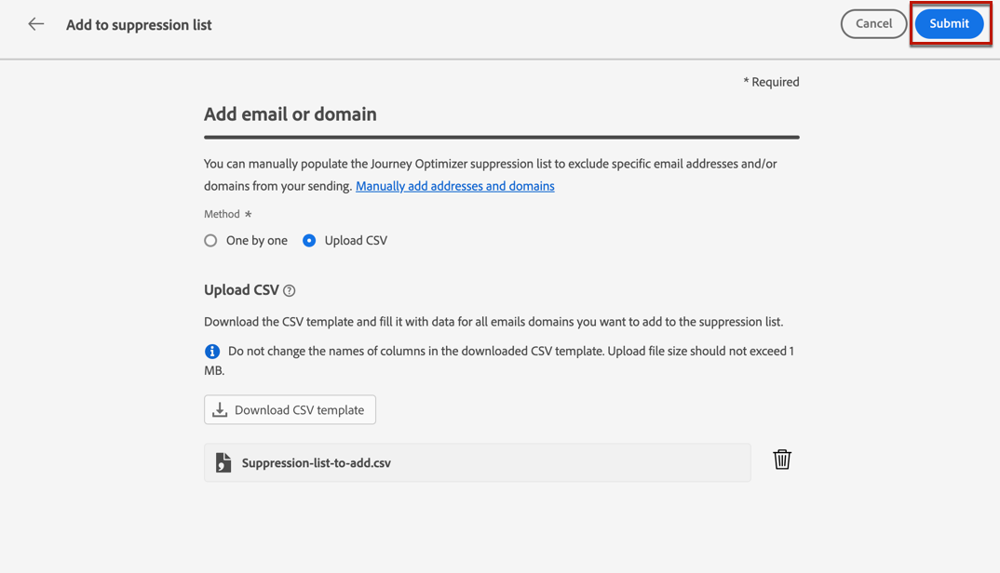
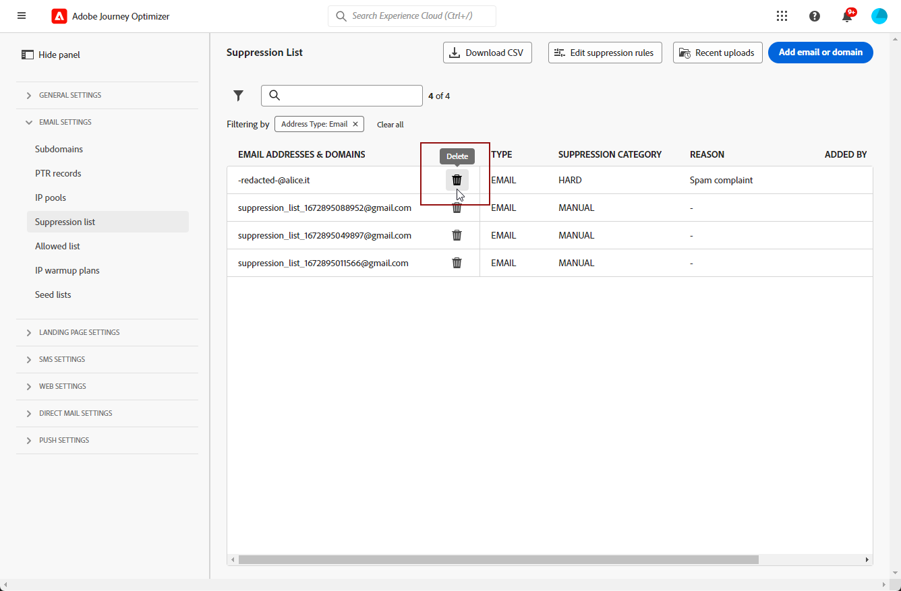
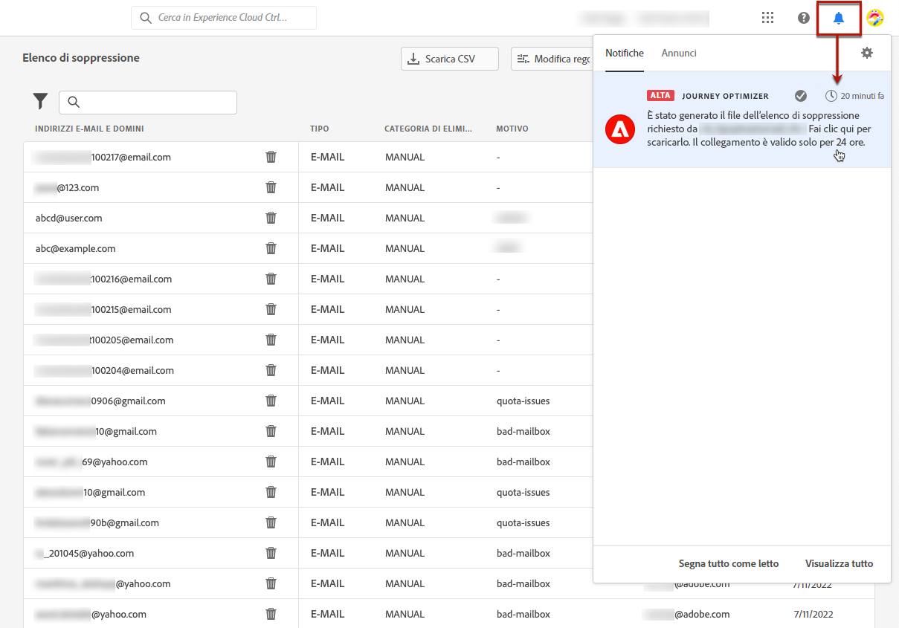

# Gestire l’elenco di soppressione {#manage-suppression-list}

Con [!DNL Journey Optimizer] puoi monitorare tutti gli indirizzi e-mail che vengono automaticamente esclusi dall&#39;invio in un percorso o in una campagna, ad esempio mancati recapiti permanenti, mancati recapiti non permanenti e segnalazioni di posta indesiderata.

Tali indirizzi di posta elettronica vengono raccolti automaticamente nell&#39;**elenco di soppressione** di Journey Optimizer. Un elenco di soppressione è costituito da indirizzi e domini da escludere dai tipi di pubblico. Raccoglie indirizzi e-mail e domini che vengono soppressi in tutte le comunicazioni in un unico ambiente client, il che significa specifico per un ID organizzazione associato a un ID sandbox.

Ulteriori informazioni sul concetto e sull&#39;utilizzo dell&#39;elenco di soppressione in [questa sezione](../reports/suppression-list.md).

>[!NOTE]
>
>Adobe mantiene un elenco aggiornato degli indirizzi non validi noti che si sono dimostrati dannosi per il coinvolgimento e la reputazione della posta e garantisce che le e-mail non vengano inviate a tali utenti. Tale elenco viene gestito in un elenco di soppressione globale comune a tutti i clienti di Adobe. Gli indirizzi e i nomi di dominio contenuti nell’elenco di soppressione globale sono nascosti. Nei rapporti sulle consegne è indicato solo il numero di destinatari esclusi.

Inoltre, puoi sfruttare l&#39;API REST **Soppression** di Journey Optimizer per controllare i messaggi in uscita utilizzando gli elenchi consentiti e la soppressione. [Scopri come utilizzare l’API REST di soppressione](https://developer.adobe.com/journey-optimizer-apis/references/suppression/){target="_blank"}

## Accedere all’elenco di soppressione {#access-suppression-list}

Per accedere all&#39;elenco dettagliato degli indirizzi e dei domini e-mail esclusi, passa a **[!UICONTROL Amministrazione]** > **[!UICONTROL Canali]** > **[!UICONTROL Impostazioni e-mail]** e seleziona **[!UICONTROL Elenco di soppressione]**.


>[!CAUTION]
>
>Le autorizzazioni per visualizzare, esportare e gestire l&#39;elenco di soppressione sono limitate a [amministratori di Percorso](../administration/ootb-product-profiles.md#journey-administrator). Ulteriori informazioni sulla gestione dei diritti di accesso degli utenti [!DNL Journey Optimizer] in [questa sezione](../administration/permissions-overview.md).


Sono disponibili alcuni filtri che consentono di sfogliare l’elenco.


Puoi filtrare in base alla **[!UICONTROL categoria di soppressione]**, al **[!UICONTROL tipo di indirizzo]** o al **[!UICONTROL motivo]**. Seleziona una o più opzioni per ciascun criterio. Una volta selezionati, puoi cancellare ogni filtro o tutti i filtri visualizzati sopra l’elenco.


## Comprendere i motivi degli errori {#suppression-categories-and-reasons}

Quando un messaggio non viene recapitato a un indirizzo e-mail, [!DNL Journey Optimizer] determina il motivo per cui la consegna non è riuscita e lo associa a una **[!UICONTROL categoria di eliminazione]**.

Le categorie di soppressione sono le seguenti:

* **Rigido**: un messaggio non recapitato indica un indirizzo e-mail non valido, ovvero un indirizzo e-mail inesistente. Ciò comporta un messaggio di mancato recapito dal server e-mail ricevente che indica esplicitamente che l’indirizzo non è valido. L’indirizzo e-mail viene inviato immediatamente all’elenco di soppressione.

  Quando l&#39;errore è il risultato di un reclamo spam, rientra anche nella categoria **Hard**. L’indirizzo e-mail del destinatario che ha emesso il reclamo viene inviato immediatamente all’elenco di soppressione.

* **Non recapitato**: un non recapitato non recapitato è un messaggio di posta elettronica temporaneo che si è verificato per un indirizzo e-mail valido. L’indirizzo e-mail viene aggiunto all’elenco di soppressione dopo diversi tentativi. Gli errori soft inviano un indirizzo all’elenco di soppressione una volta che il contatore di errori raggiunge la soglia limite. [Ulteriori informazioni sui nuovi tentativi](retries.md)

* **Manuale**: gli errori manuali sono stati aggiunti manualmente all&#39;elenco di soppressione. [Ulteriori informazioni](#add-addresses-and-domains)

Per ogni indirizzo e-mail elencato, puoi anche controllare il **[!UICONTROL Tipo]** (e-mail o dominio), **[!UICONTROL Motivo]** per escluderlo, chi l&#39;ha aggiunto e la data/ora in cui è stato aggiunto all&#39;elenco di soppressione.

I possibili motivi di un errore di consegna sono:

| Motivo | Descrizione | Categoria |
| --- | --- | --- |
| **[!UICONTROL Destinatario non valido]** | L&#39;indirizzo del destinatario non è valido o non esiste. | Rigido |
| **[!UICONTROL Mancato recapito non permanente]** | Messaggio non recapitato per un motivo diverso dagli errori non permanenti elencati in questa tabella, ad esempio durante l’invio della frequenza consentita consigliata da un ISP. | Morbido |
| **[!UICONTROL Errore DNS]** | Messaggio non recapitato a causa di un errore DNS. | Morbido |
| **[!UICONTROL Cassetta postale piena]** | Messaggio non recapitato perché la cassetta postale del destinatario è piena e non è in grado di accettare altri messaggi. | Morbido |
| **[!UICONTROL Inoltro negato]** | Il messaggio è stato bloccato dal destinatario perché l&#39;inoltro non è consentito. | Morbido |
| **[!UICONTROL Risposta al problema]** | Il messaggio è un probe challenge-response. | Morbido |
| **[!UICONTROL Reclamo spam]** | Il messaggio è stato bloccato perché contrassegnato come spam dal destinatario. | Rigido |

>[!NOTE]
>
>Gli utenti non iscritti non ricevono e-mail da [!DNL Journey Optimizer], pertanto i loro indirizzi e-mail non possono essere inviati all&#39;elenco di soppressione. La loro scelta viene gestita a livello di Experience Platform. [Ulteriori informazioni sulla rinuncia](../privacy/opt-out.md)


### Regole di eliminazione  {#suppression-rules}

Dalla visualizzazione **[!UICONTROL Elenco di soppressione]**, è inoltre possibile modificare il parametro dei tentativi associato alle regole di soppressione dal pulsante **[!UICONTROL Modifica regole di soppressione]**. Utilizza questa opzione per aggiornare la soglia dei tentativi per la sandbox corrente. [Ulteriori informazioni sui nuovi tentativi](retries.md).


## Aggiungere indirizzi o domini all’elenco di soppressione{#add-addresses-and-domains}

>[!CONTEXTUALHELP]
>id="ajo_admin_suppression_list_header"
>title="Aggiungere e-mail o domini all’elenco di soppressione"
>abstract="Puoi popolare manualmente l’elenco di soppressione di Journey Optimizer al fine di escludere specifici indirizzi e-mail e/o domini dall’invio."

>[!CONTEXTUALHELP]
>id="ajo_admin_suppression_list"
>title="Aggiungere e-mail o domini all’elenco di soppressione"
>abstract="Per popolare l’elenco di soppressione, puoi aggiungere manualmente indirizzi e-mail o domini: uno alla volta oppure in blocco tramite il caricamento di un file CSV. Tali indirizzi e-mail e/o domini saranno esclusi dall’invio."

Quando un messaggio non viene recapitato a un indirizzo e-mail, questo viene aggiunto automaticamente all’elenco di soppressione in base alla regola di eliminazione o al conteggio dei mancati recapiti definito.

Tuttavia, puoi anche compilare manualmente l&#39;elenco di soppressione di [!DNL Journey Optimizer] per escludere specifici indirizzi e-mail e/o domini dall&#39;invio.

>[!NOTE]
>
>Possono essere necessari fino a 60 minuti affinché [!DNL Journey Optimizer] tenga conto degli indirizzi eliminati nelle e-mail in uscita.

È possibile aggiungere indirizzi e-mail o domini [uno alla volta](#add-one-address-or-domain) oppure [in blocco](#upload-csv-file) tramite il caricamento di un file CSV.

### Aggiungi un indirizzo o un dominio {#add-one-address-or-domain}

>[!CONTEXTUALHELP]
>id="ajo_admin_suppression_list_address"
>title="Aggiungere un elemento all’elenco di soppressione"
>abstract="Puoi popolare l’elenco di soppressione aggiungendo indirizzi e-mail e/o domini uno alla volta."

Per aggiungere un indirizzo e-mail o un dominio all’elenco di soppressione, effettua le seguenti operazioni:

1. Selezionare il pulsante **[!UICONTROL Aggiungi e-mail o dominio]**.

   

1. Scegliere l&#39;opzione **[!UICONTROL Uno per uno]**.

   

1. Selezionare il tipo di indirizzo: **[!UICONTROL E-mail]** o **[!UICONTROL Dominio]**.

1. Inserisci l’indirizzo e-mail o il dominio che desideri escludere dall’invio.

   >[!NOTE]
   >
   >Assicurati di inserire un indirizzo e-mail valido (ad esempio abc@company.com) o un dominio (ad esempio abc.company.com).

1. (facoltativo) Inserisci un motivo. In questo campo sono consentiti tutti i caratteri stampabili ASCII compresi tra 32 e 126.

1. Utilizza il pulsante **[!UICONTROL Invia]** per confermare.

### Caricare un file CSV {#upload-csv-file}

>[!CONTEXTUALHELP]
>id="ajo_admin_suppression_list_csv"
>title="Caricare un CSV per aggiungere elementi all’elenco di soppressione"
>abstract="Puoi popolare l’elenco di soppressione caricando un file CSV compilato con gli indirizzi e-mail e i domini da escludere."

Per aggiungere un gruppo di indirizzi e-mail o un dominio all’elenco di soppressione, effettua le seguenti operazioni:

1. Selezionare il pulsante **[!UICONTROL Aggiungi e-mail o dominio]**.
1. Scegliere l&#39;opzione **[!UICONTROL Carica CSV]**.

   

1. Scarica il modello CSV da utilizzare, che include le colonne e il formato seguenti:

   ```
   TYPE,VALUE,COMMENT
   EMAIL,abc@somedomain.com,Comment
   DOMAIN,somedomain.com,Comment
   ```

1. Inserisci nel modello CSV gli indirizzi e-mail e/o i domini da aggiungere all’elenco di soppressione. Tutti i caratteri stampabili ASCII compresi tra 32 e 126 sono consentiti nella colonna **COMMENT**.

   >[!CAUTION]
   >
   >Non modificare il nome delle colonne nel modello CSV.
   >
   >La dimensione del file non deve superare 1 MB.
   >

1. Al termine, trascina e rilascia il file CSV e utilizza il pulsante **[!UICONTROL Invia]** per confermare.

   

Al termine del caricamento, puoi controllarne lo stato dal pulsante [Caricamenti recenti](#recent-uploads), come descritto di seguito.

### Verifica stato dei caricamenti {#recent-uploads}

Utilizza il pulsante **[!UICONTROL Caricamenti recenti]** per verificare lo stato dei file CSV caricati più di recente.


Gli stati possibili sono:

* **[!UICONTROL In sospeso]**: il caricamento del file è in elaborazione.
* **[!UICONTROL Errore]**: il processo di caricamento dei file non è riuscito a causa di un problema tecnico o di un errore di formato del file.
* **[!UICONTROL Completato]**: il processo di caricamento del file è stato completato.

Durante il caricamento, se alcuni indirizzi non sono nel formato corretto, non vengono aggiunti all&#39;elenco di soppressione [!DNL Journey Optimizer].

In tal caso, una volta completato il caricamento, viene associato a un rapporto. Puoi scaricarlo per verificare gli errori rilevati<!-- and understand why they were not added to the suppression list-->.


Di seguito è riportato un esempio del tipo di voci che è possibile trovare nel rapporto errori:

```
type,value,comments,failureReason
Email,examplemail.com,MANUAL,Invalid format for value: examplemail.com
Email,examplemail,MANUAL,Invalid format for value: examplemail
Email,example@mail,MANUAL,Invalid format for value: example@mail
Domain,example,MANUAL,Invalid format for value: example
Domain,example.!com,MANUAL,Invalid format for value: example.!com
Domain,!examplecom,MANUAL,Invalid format for value: !examplecom
```

## Rimuovere un indirizzo dall’elenco di soppressione {#remove-from-suppression-list}

È possibile aggiornare manualmente l’elenco di soppressione. La rimozione di un indirizzo e-mail dalla quarantena è un’operazione delicata e può influire sulla reputazione dell’IP e sulle percentuali di recapito messaggi. Assicurati di procedere con cautela.

Quando elimini un indirizzo e-mail o un dominio dall’elenco di soppressione, Adobe Journey Optimizer può ricominciare a consegnare a questo indirizzo o dominio.  Ulteriori informazioni sul recapito messaggi in [questa sezione](../reports/deliverability.md).

Per rimuovere un indirizzo dall&#39;elenco di soppressione, utilizzare il pulsante **[!UICONTROL Elimina]**.




>[!NOTE]
>
>Procedi con ulteriore cautela quando consideri di eliminare qualsiasi indirizzo e-mail o dominio. In caso di dubbi, contatta un esperto di consegna.

Ad esempio, in caso di interruzione del servizio di un provider di servizi Internet (ISP), le e-mail vengono erroneamente contrassegnate come mancati recapiti permanenti perché non possono essere consegnate correttamente al destinatario. Questi indirizzi e-mail devono essere rimossi dall’elenco di soppressione.

Per recuperare tali indirizzi, esegui una query specifica con parametri personalizzati, in base al contesto dell’interruzione. [Ulteriori informazioni in questo esempio](../data/datasets-query-examples.md#isp-outage-query).

Una volta identificati gli indirizzi e-mail interessati, filtra l’elenco di soppressione per visualizzarli. Ad esempio, se si è verificata un’interruzione del servizio ISP dall’11 novembre 2022 al 13 novembre 2022 sul dominio **test.com**, filtra gli indirizzi aggiunti all’elenco di soppressione in tale arco temporale, come segue:

Puoi quindi rimuovere gli indirizzi e-mail in quarantena dall&#39;elenco di soppressione utilizzando il pulsante **[!UICONTROL Elimina]**.

## Scaricare l’elenco di soppressione {#download-suppression-list}

<!--
>[!CONTEXTUALHELP]
>id="ajo_admin_suppression_list_download"
>title="Export the list as a CSV file"
>abstract="To download the suppression list, Qou can either export the current list by generating a new file, or download the file that was previously generated."
-->

Per esportare l’elenco di soppressione come file CSV, effettua le seguenti operazioni:

1. Selezionare il pulsante **[!UICONTROL Scarica CSV]**.

   

1. Attendi che il file venga generato.

   >[!NOTE]
   >
   >Il tempo di download dipende dalla dimensione del file, ovvero dal numero di indirizzi presenti nell’elenco di soppressione.
   >
   >È possibile elaborare una richiesta di download alla volta per una determinata sandbox.

1. Una volta generato il file, riceverai una notifica. Fai clic sull’icona a forma di campana in alto a destra dello schermo per visualizzarla.

1. Fai clic sulla notifica stessa per scaricare il file.

   

   >[!NOTE]
   >
   >Il collegamento è valido per 24 ore.

<!--When downloading the CSV file, you can choose to either:

* Download the file that was previously generated by another user or yourself.

* Generate a new file in order to export the current suppression list.-->

