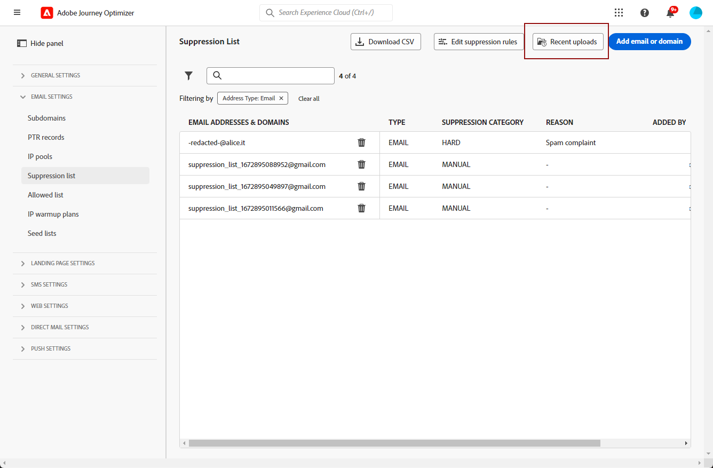

# Gestire l’elenco di soppressione {#manage-suppression-list}

Con [!DNL Journey Optimizer], puoi monitorare tutti gli indirizzi e-mail che vengono automaticamente esclusi dall’invio in un percorso, ad esempio:

* Indirizzi non validi (rimbalzi rigidi).
* Gli indirizzi non recapitati in modo coerente e possono influenzare negativamente la reputazione delle e-mail se continui a includerli nelle consegne.
* Destinatari che emettono una denuncia di spam di qualche tipo contro uno dei tuoi messaggi e-mail.

Tali indirizzi e-mail vengono raccolti automaticamente in Journey Optimizer **elenco a discesa**. Ulteriori informazioni sul concetto e sull&#39;utilizzo dell&#39;elenco di soppressione in [questa sezione](../reports/suppression-list.md).

È inoltre possibile [**manuale** aggiungere un indirizzo o un dominio](#add-addresses-and-domains) all&#39;elenco di soppressione.

>[!NOTE]
>
>Ci vorranno da 0 a 60 minuti [!DNL Journey Optimizer] tenere conto degli indirizzi soppressi nelle e-mail in uscita.

## Accedere all&#39;elenco di soppressione {#access-suppression-list}

Per accedere all’elenco dettagliato degli indirizzi e-mail esclusi, vai a **[!UICONTROL Administration]** > **[!UICONTROL Channels]** > **[!UICONTROL Email configuration]**, quindi seleziona **[!UICONTROL Suppression list]**.

>[!CAUTION]
>
>Le autorizzazioni per visualizzare, esportare e gestire l’elenco di soppressione sono limitate a [Amministratori di percorso](../administration/ootb-product-profiles.md#journey-administrator). Ulteriori informazioni sulla gestione [!DNL Journey Optimizer] diritti di accesso degli utenti in [questa sezione](../administration/permissions-overview.md).


Sono disponibili filtri che consentono di sfogliare l’elenco.


Puoi filtrare il **[!UICONTROL Suppression category]**, **[!UICONTROL Address type]** oppure **[!UICONTROL Reason]**. Seleziona le opzioni desiderate per ciascun criterio. Una volta selezionato, puoi cancellare ogni filtro o tutti i filtri visualizzati in cima all’elenco.


Se aggiungi manualmente un indirizzo e-mail o un dominio per errore, la **[!UICONTROL Delete]** consente di rimuovere tale voce.

>[!CAUTION]
>
>Non utilizzare mai il **[!UICONTROL Delete]** per rimuovere gli indirizzi e-mail o i domini soppressi.


Se elimini un indirizzo e-mail o un dominio dall&#39;elenco di soppressione significa che inizierai di nuovo a consegnare a questo indirizzo o dominio. Di conseguenza, questo può avere gravi ripercussioni sulla consegna e sulla reputazione dell’IP, il che potrebbe comportare il blocco dell’indirizzo IP o del dominio di invio. Ulteriori informazioni sull&#39;importanza di mantenere un elenco di soppressione in [questa sezione](../reports/suppression-list.md).

>[!NOTE]
>
>Procedi con molta attenzione quando consideri di eliminare qualsiasi indirizzo e-mail o dominio. In caso di dubbio, contatta un esperto di recapito.

Da **[!UICONTROL Suppression list]** puoi anche modificare le regole di soppressione. [Ulteriori informazioni](retries.md)

Per esportare l’elenco di soppressione come file CSV, seleziona il **[!UICONTROL Download CSV]** pulsante .


## Categorie e motivi di soppressione {#suppression-categories-and-reasons}

Quando un messaggio non viene recapitato a un indirizzo e-mail, [!DNL Journey Optimizer] determina il motivo per cui la consegna non è riuscita e la associa a un **[!UICONTROL Suppression category]**.

Le categorie di soppressione sono le seguenti:

* **Duro**: L’indirizzo e-mail viene inviato immediatamente all’elenco di eliminazione.

   >[!NOTE]
   >
   >Quando l&#39;errore è il risultato di un reclamo di spam, rientra anche nella **Duro** categoria. L&#39;indirizzo e-mail del destinatario che ha emesso il reclamo viene inviato immediatamente all&#39;elenco di soppressione.

* **Morbido**: Gli errori morbidi inviano un indirizzo all’elenco di soppressione quando il contatore degli errori raggiunge la soglia limite. [Ulteriori informazioni sui nuovi tentativi](retries.md)

* **Manuale**: Puoi anche aggiungere manualmente un indirizzo e-mail o un dominio all’elenco di eliminazione. [Ulteriori informazioni](#add-addresses-and-domains)

>[!NOTE]
>
>Ulteriori informazioni sui rimbalzi morbidi e i rimbalzi duri nel [Tipi di errori di consegna](../reports/suppression-list.md#delivery-failures) sezione .

Per ogni indirizzo e-mail elencato, puoi anche controllare il **[!UICONTROL Type]** (e-mail o dominio), **[!UICONTROL Reason]** per escluderlo, chi l’ha aggiunto e la data/ora in cui è stato aggiunto all’elenco di soppressione.


I possibili motivi di un errore di consegna sono:

| Motivo | Descrizione | Categoria di soppressione |
| --- | --- | --- |
| **[!UICONTROL Invalid Recipient]** | Il destinatario non è valido o non esiste. | Duro |
| **[!UICONTROL Soft Bounce]** | Il messaggio è stato rimbalzato per un motivo diverso dagli errori soft elencati in questa tabella, ad esempio quando si invia la velocità consentita consigliata da un ISP. | Morbido |
| **[!UICONTROL DNS Failure]** | Messaggio rimbalzato a causa di un errore DNS. | Morbido |
| **[!UICONTROL Mailbox Full]** | Il messaggio è stato rimbalzato perché la casella di posta del destinatario era piena e non poteva accettare altri messaggi. | Morbido |
| **[!UICONTROL Relaying Denied]** | Il messaggio è stato bloccato dal destinatario perché l&#39;invio non è consentito. | Morbido |
| **[!UICONTROL Challenge-Response]** | Il messaggio è una sonda di risposta alla sfida. | Morbido |
| **[!UICONTROL Spam Complaint]** | Il messaggio è stato bloccato perché contrassegnato come spam dal destinatario. | Duro |

>[!NOTE]
>
>Gli utenti non abbonati non ricevono e-mail da [!DNL Journey Optimizer], pertanto i loro indirizzi e-mail non possono essere inviati all’elenco di soppressione. La loro scelta viene gestita a livello di Experience Platform. [Ulteriori informazioni sulla rinuncia](../messages/consent.md)

## Aggiungere manualmente indirizzi e domini {#add-addresses-and-domains}

>[!CONTEXTUALHELP]
>id="ajo_admin_suppression_list"
>title="Aggiungi e-mail o domini all’elenco di soppressione"
>abstract="Puoi compilare manualmente l’elenco di soppressione di Journey Optimizer per escludere specifici indirizzi e-mail e/o domini dall’invio."

Quando un messaggio non viene recapitato a un indirizzo e-mail, questo viene aggiunto automaticamente all’elenco di soppressione in base alla regola di soppressione o al conteggio dei messaggi non recapitati definiti.

Tuttavia, puoi anche compilare manualmente il [!DNL Journey Optimizer] elenco di soppressione per escludere specifici indirizzi e-mail e/o domini dall’invio.

Puoi aggiungere indirizzi e-mail o domini [una per volta](#add-one-address-or-domain)oppure [in modalità collettiva](#upload-csv-file) tramite caricamento di file CSV.

A questo scopo, seleziona la **[!UICONTROL Add email or domain]** quindi seguire uno dei metodi seguenti.


### Aggiungi un indirizzo o un dominio {#add-one-address-or-domain}

>[!CONTEXTUALHELP]
>id="ajo_admin_suppression_list_address"
>title="Aggiungi un elemento all&#39;elenco di soppressione"
>abstract="Puoi compilare l’elenco di soppressione aggiungendo indirizzi e/o domini e-mail uno per uno."

1. Seleziona l&#39;opzione **[!UICONTROL One by one]**.

   

1. Scegli il tipo di indirizzo: **[!UICONTROL Email address]** o **[!UICONTROL Domain address]**.

1. Immetti l’indirizzo e-mail o il dominio da escludere dall’invio.

   >[!NOTE]
   >
   >Assicurati di inserire un indirizzo e-mail valido (ad esempio abc@company) o un dominio (ad esempio abc.company.com).

1. Se necessario, specifica un motivo.

   >[!NOTE]
   >
   >Tutti i caratteri ASCII compresi tra 32 e 126 sono consentiti nella variabile **[!UICONTROL Reason]** campo . L&#39;elenco completo è disponibile all&#39;indirizzo [questa pagina](https://en.wikipedia.org/wiki/Wikipedia:ASCII#ASCII_printable_characters){target=&quot;_blank&quot;} per esempio.

1. Fai clic su **[!UICONTROL Submit]**.

### Caricare un file CSV {#upload-csv-file}

>[!CONTEXTUALHELP]
>id="ajo_admin_suppression_list_csv"
>title="Carica CSV per aggiungere elementi all&#39;elenco di soppressione"
>abstract="Puoi compilare l’elenco di soppressione caricando un file CSV compilato con gli indirizzi e-mail/domini da escludere."

1. Seleziona l&#39;opzione **[!UICONTROL Upload CSV]**.

   

1. Scarica il modello CSV da utilizzare, che include le colonne e il formato seguenti:

   ```
   TYPE,VALUE,COMMENT
   EMAIL,abc@somedomain.com,Comment
   DOMAIN,somedomain.com,Comment
   ```
   >[!NOTE]
   >
   >Tutti i caratteri ASCII compresi tra 32 e 126 sono consentiti nella variabile **Commento** colonna. L&#39;elenco completo è disponibile all&#39;indirizzo [questa pagina](https://en.wikipedia.org/wiki/Wikipedia:ASCII#ASCII_printable_characters){target=&quot;_blank&quot;} per esempio.

   Puoi anche scaricare questo modello dal **[!UICONTROL Suppression list]** vista principale.

   >[!CAUTION]
   >
   >Non modificare i nomi delle colonne nel modello CSV.
   >
   >La dimensione del file non deve superare 1 MB.

1. Compila il modello CSV con gli indirizzi e-mail e/o i domini che desideri aggiungere all’elenco di soppressione.

1. Al termine, trascina e rilascia il file CSV, quindi fai clic su **[!UICONTROL Upload file]**.

   

1. Fai clic su **[!UICONTROL Submit]**.

>[!NOTE]
>
>Al termine del caricamento, accertati che sia stato eseguito correttamente controllandone lo stato dall’interfaccia. [Scopri come](#recent-uploads)

### Controlla lo stato dei caricamenti recenti {#recent-uploads}

Puoi controllare l’elenco dei file CSV più recenti caricati.

Per fare questo, dal **[!UICONTROL Suppression list]** visualizzazione, fai clic su **[!UICONTROL Recent uploads]** pulsante .



Vengono visualizzati gli ultimi caricamenti inviati e i relativi stati corrispondenti.

Se un report di errore è associato a un file, puoi scaricarlo per verificare gli errori rilevati.


Di seguito è riportato un esempio del tipo di voci che si possono trovare nel rapporto di errore:

```
type,value,comments,failureReason
Email,examplemail.com,MANUAL,Invalid format for value: examplemail.com
Email,examplemail,MANUAL,Invalid format for value: examplemail
Email,example@mail,MANUAL,Invalid format for value: example@mail
Domain,example,MANUAL,Invalid format for value: example
Domain,example.!com,MANUAL,Invalid format for value: example.!com
Domain,!examplecom,MANUAL,Invalid format for value: !examplecom
```
