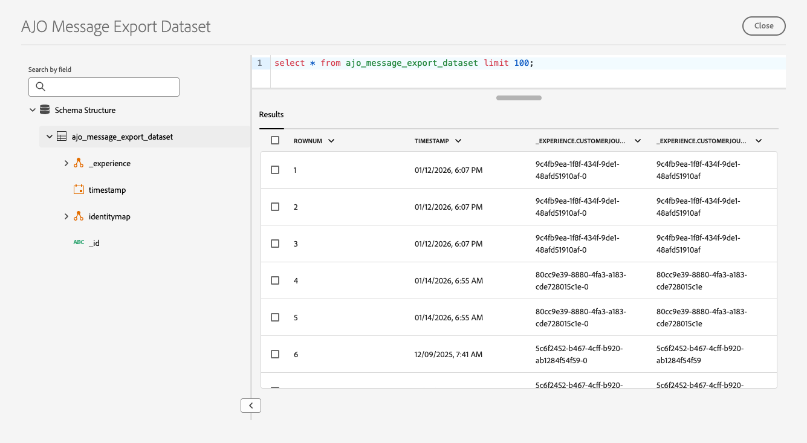

# Esportare il contenuto del messaggio {#message-export}

>[!CONTEXTUALHELP]
>id="ajo_admin_msg_export"
>title="Conservare ed esportare i contenuti inviati"
>abstract="Selezionando questa opzione è possibile scrivere il contenuto dei messaggi e-mail o SMS inviati utilizzando questa configurazione in un set di dati [!DNL Experience Platform]. I record vengono conservati per 7 giorni di calendario dall’acquisizione, durante i quali puoi esportarli nel tuo archivio."

>[!AVAILABILITY]
>
>Questa funzionalità è disponibile solo per i canali e-mail e SMS, per le organizzazioni che hanno acquistato il componente aggiuntivo per l’esportazione dei messaggi. Per ulteriori informazioni, contatta il tuo rappresentante Adobe.

**Esportazione messaggi** consente di trasferire il contenuto dei messaggi e-mail e SMS inviati da [!DNL Journey Optimizer] al proprio archivio tramite [!DNL Adobe Experience Platform] destinazioni, che consentono di inviare dati da [!DNL Experience Platform] agli endpoint esterni. [Ulteriori informazioni](https://experienceleague.adobe.com/it/docs/experience-platform/destinations/home){target="_blank"}

Con questa funzione, il contenuto dei messaggi e-mail e SMS inviati tramite [!DNL Journey Optimizer] che sono stati contrassegnati per l&#39;esportazione viene scritto nel [!DNL Experience Platform] **set di dati di esportazione messaggi di AJO**. [Ulteriori informazioni sui set di dati](../data/get-started-datasets.md)

I record vengono quindi conservati nel set di dati per sette giorni di calendario dall’acquisizione, durante i quali puoi esportarli nel sistema esterno desiderato.

## Guardrail

* Questa funzionalità supporta solo i canali **Email** e **SMS**.
* I record nel set di dati di esportazione dei messaggi di AJO vengono conservati **per sette giorni di calendario dall&#39;acquisizione**.
* Il backfill non è supportato per i messaggi inviati prima di abilitare l’esportazione dei messaggi come descritto di seguito.

## Abilita esportazione messaggi {#enable-message-export}

Il processo di onboarding per la funzione Esportazione messaggi è costituito da due passaggi:

1. [Imposta il flusso di dati di esportazione](#set-up-export-dataflow) in [!DNL Experience Platform];
1. [Abilita esportazione messaggi](#config-message-export) nella configurazione del canale in [!DNL Journey Optimizer].

>[!WARNING]
>
>Verranno visualizzati solo i nuovi record dopo l’abilitazione delle esportazioni e l’invio dei messaggi. I backfill per il contenuto prima di impostare il processo di esportazione e di abilitare l’opzione Esporta messaggio non sono supportati.

### Configurare il flusso di dati di esportazione {#set-up-export-dataflow}

Prima di poter esportare i dati, è necessario impostare il processo di esportazione definendo la destinazione [!DNL Experience Platform] e il set di dati che verrà utilizzato. Segui i passaggi seguenti.

>[!NOTE]
>
>Questa configurazione deve essere configurata per ogni sandbox.

1. Scegli un tipo di destinazione [Experience Platform](https://experienceleague.adobe.com/en/docs/experience-platform/destinations/destination-types){target="_blank"}. Un elenco delle piattaforme di destinazione disponibili pronte per la ricezione dei dati è disponibile in [questa pagina](https://experienceleague.adobe.com/en/docs/experience-platform/destinations/catalog/overview){target="_blank"}.

1. In [!DNL Experience Platform], configura la destinazione definendo credenziali, bucket/contenitore, prefisso percorso e opzioni di sicurezza. [Scopri come](https://experienceleague.adobe.com/en/docs/experience-platform/destinations/ui/activate/export-datasets){target="_blank"}

1. Crea un flusso di esportazione di set di dati utilizzando i seguenti dati:

   * Set di dati di Source: seleziona **Set di dati esportazione messaggi di AJO**.
   * Formato file: seleziona JSON o Parquet (scegli uno in base agli strumenti a valle).
   * Pianificazione: assicurati che venga eseguito entro l’intervallo di conservazione di 7 giorni.

### Abilitare l’esportazione dei messaggi nella configurazione del canale {#config-message-export}

Per applicare l’esportazione dei messaggi alle campagne e ai percorsi, devi abilitare l’opzione dedicata a livello di configurazione del canale. Segui i passaggi seguenti.

1. In [!DNL Journey Optimizer], modificare o creare la configurazione del [canale](channel-surfaces.md#create-channel-surface) e-mail o SMS desiderata.

1. Selezionare l&#39;opzione **[!UICONTROL Abilita esportazione messaggi]**.

   

1. Salva le modifiche e invia la configurazione del canale.

Dopo aver inviato messaggi tramite campagne o percorsi utilizzando questa configurazione di canale, i messaggi e-mail e SMS vengono scritti nel **set di dati di esportazione messaggi di AJO**. Potrai quindi [accedere ai record](#access-exported-data) nel set di dati ed esportarli nella destinazione di archiviazione selezionata in base al flusso di dati di esportazione definito.

>[!NOTE]
>
>Se si disabilita l&#39;opzione **[!UICONTROL Abilita esportazione messaggi]**, i nuovi record per questa configurazione del canale non verranno acquisiti nel set di dati. I record esistenti rimangono fino alla scadenza della conservazione.

## Accedere ai dati dei messaggi esportati {#access-exported-data}

Dopo aver inviato i messaggi utilizzando una configurazione di canale con Esportazione messaggi abilitata, puoi accedere ai dati esportati e rivederli nel **Set di dati di esportazione messaggi di AJO**.

Per visualizzare i dati del messaggio esportato:

1. In [!DNL Journey Optimizer], passa a **[!UICONTROL Gestione dati]** > **[!UICONTROL Set di dati]** nell&#39;area di navigazione a sinistra. [Ulteriori informazioni sui set di dati](../data/get-started-datasets.md)

1. Assicurati di visualizzare i set di dati generati dal sistema.

1. Selezionare il **set di dati di esportazione messaggi di AJO** dall&#39;elenco.

   

1. Nella pagina dei dettagli del set di dati fare clic su **[!UICONTROL Anteprima set di dati]** per visualizzare i record più recenti.

   

Il set di dati contiene informazioni complete per ogni messaggio inviato tramite la configurazione del canale con Esportazione messaggi abilitata, tra cui: oggetto, corpo del messaggio, indirizzo e-mail o numero di telefono del destinatario, indirizzo del mittente o numero di telefono, data e ora di invio, dati di personalizzazione e altro ancora.

Tutti i record nel set di dati vengono conservati per **sette giorni di calendario dall&#39;acquisizione**. Durante questo periodo di conservazione, è possibile accedere ai dati per i controlli di conformità, le indagini legali o esportarli nel proprio sistema di storage tramite la destinazione Experience Platform configurata.

