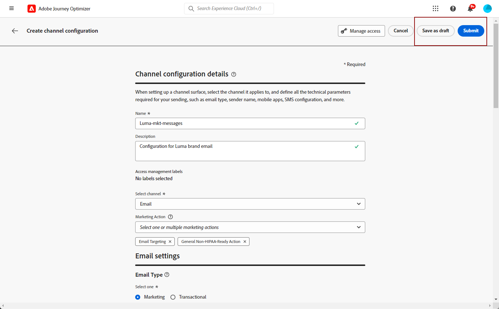

# Configurare i predefiniti per i messaggi {#message-presets-creation}

Con [!DNL Journey Optimizer], puoi impostare i predefiniti per i messaggi che definiscono tutti i parametri tecnici necessari per i messaggi e-mail e di notifica push: tipo di e-mail, indirizzo e-mail e nome del mittente, app mobile e altro ancora.

>[!CAUTION]
>
> * Per creare, modificare ed eliminare i predefiniti per i messaggi, è necessario disporre dei [Gestire i predefiniti per i messaggi](../administration/high-low-permissions.md#manage-message-presets).
>
> * Devi eseguire [Configurazione e-mail](#configure-email-settings) e [Configurazione push](../configuration/push-configuration.md) prima di creare i predefiniti per messaggi.

Una volta configurati i predefiniti per i messaggi, potrai selezionarli al momento della creazione dei messaggi dal **[!UICONTROL Presets]** elenco.

➡️ [Scopri come creare e utilizzare i predefiniti e-mail in questo video](#video-presets)

## Creare un predefinito per messaggi {#create-message-preset}

>[!CONTEXTUALHELP]
>id="ajo_admin_message_presets"
>title="Dettagli e impostazioni del predefinito del messaggio"
>abstract="Impostando un predefinito per messaggi puoi selezionare il canale a cui si applica e definire tutti i parametri tecnici necessari per i messaggi, ad esempio il tipo di e-mail, il sottodominio da utilizzare, il nome del mittente, le app mobile e così via."

Per creare un predefinito per messaggi, effettua le seguenti operazioni:

1. Accedere al **[!UICONTROL Channels]** > **[!UICONTROL Branding]** > **[!UICONTROL Message presets]** menu, quindi fai clic su **[!UICONTROL Create Message preset]**.

   

1. Immetti un nome e una descrizione (facoltativi) per il predefinito, quindi seleziona i canali da configurare.

   

   >[!NOTE]
   >
   > I nomi devono iniziare con una lettera (A-Z). Può contenere solo caratteri alfanumerici. È inoltre possibile utilizzare il carattere di sottolineatura `_`, punto`.` e trattino `-` caratteri.

1. Configura le **email** impostazioni. [Ulteriori informazioni](#configure-email-settings)

1. Configura le **notifica push** impostazioni. [Ulteriori informazioni](#configure-push-settings)

   <!--Configure SMS settings. [Learn more](#configure-sms-settings) -->

1. Una volta configurati tutti i parametri, fai clic su **[!UICONTROL Submit]** per confermare. Puoi anche salvare il predefinito del messaggio come bozza e ripristinarne la configurazione in un secondo momento.

   

   >[!NOTE]
   >
   >Impossibile procedere con la creazione dei predefiniti mentre il pool IP selezionato è in [edizione](ip-pools.md#edit-ip-pool) (**[!UICONTROL Processing]** e non è mai stato associato al sottodominio selezionato. [Ulteriori informazioni](#subdomains-and-ip-pools)
   >
   >Salva il predefinito come bozza e attendi che il pool IP disponga del **[!UICONTROL Success]** stato per riprendere la creazione dei predefiniti.

1. Una volta creato il predefinito del messaggio, questo viene visualizzato nell’elenco con la **[!UICONTROL Processing]** stato.

   Durante questo passaggio, verranno eseguiti diversi controlli per verificare che sia stato configurato correttamente. Il tempo di elaborazione è intorno **48 ore - 72 ore** e può richiedere **7-10 giorni lavorativi**.

   Questi controlli includono la configurazione e i test tecnici eseguiti dal team di Adobe:

   * Convalida SPF
   * Convalida DKIM
   * Convalida record MX
   * Controlla la inserire nell&#39;elenco Bloccati degli IP
   * Controllo host Helo
   * Verifica del pool IP
   * Record A/PTR, verifica del sottodominio t/m/res

   >[!NOTE]
   >
   >Se i controlli non hanno esito positivo, ulteriori informazioni sui possibili motivi di errore in [questa sezione](#monitor-message-presets).

1. Una volta eseguiti i controlli, il predefinito del messaggio ottiene il **[!UICONTROL Active]** stato. È pronto per essere utilizzato per inviare messaggi.

   

## Configurare le impostazioni e-mail {#configure-email-settings}

Le impostazioni e-mail sono definite in una sezione dedicata della configurazione del predefinito del messaggio.

Configura le impostazioni come descritto in [questa sezione](email-settings.md).

## Configurare le impostazioni push {#configure-push-settings}

Le impostazioni push sono definite in una sezione dedicata della configurazione del predefinito per messaggi.

Per definire le impostazioni push associate al predefinito per messaggi, segui la procedura seguente:

1. Seleziona almeno una piattaforma: **iOS** e/o **Android**.

1. Seleziona le applicazioni mobili da utilizzare per ogni piattaforma.

Per ulteriori informazioni su come configurare l’ambiente per l’invio di notifiche push, consulta [questa sezione](../configuration/push-gs.md).

<!--
## Configure SMS settings {#configure-sms-settings}

1. Select the **[!UICONTROL SMS Type]** that will be sent with the preset: **[!UICONTROL Transactional]** or **[!UICONTROL Marketing]**.

    
    
1. Select the **[!UICONTROL SMS configuration]** to associate with the preset.
        
    For more on how to configure your environment to send SMS messages, refer to [this section](sms-configuration.md).

1. Enter the **[!UICONTROL Sender number]** ​you want to use for your communications.
-->

## Monitorare i predefiniti per messaggi {#monitor-message-presets}

Tutti i predefiniti per messaggi vengono visualizzati nella **[!UICONTROL Channels]** > **[!UICONTROL Message presets]** menu. Sono disponibili filtri per aiutarti a sfogliare l’elenco (tipo di canale, utente, stato).

Una volta creati, i predefiniti per messaggi possono avere i seguenti stati:

* **[!UICONTROL Draft]**: Il predefinito del messaggio è stato salvato come bozza e non è ancora stato inviato. Apri per riprendere la configurazione.
* **[!UICONTROL Processing]**: Il predefinito del messaggio è stato inviato e sta attraversando diverse fasi di verifica.
* **[!UICONTROL Active]**: Il predefinito del messaggio è stato verificato e può essere selezionato per creare i messaggi.
* **[!UICONTROL Failed]**: Uno o più controlli non sono riusciti durante la verifica del predefinito del messaggio.
* **[!UICONTROL Deactivated]**: Il predefinito del messaggio è disattivato. Non può essere utilizzato per creare nuovi messaggi.

Se la creazione di un predefinito di messaggio non riesce, di seguito sono descritti i dettagli di ciascun possibile motivo di errore.

Se si verifica uno di questi errori, contatta [Adobe Customer Care](https://helpx.adobe.com/it/enterprise/admin-guide.html/enterprise/using/support-for-experience-cloud.ug.html){target=&quot;_blank&quot;} per ottenere assistenza.

* **Convalida SPF non riuscita**: SPF (Sender Policy Framework) è un protocollo di autenticazione e-mail che consente di specificare gli IP autorizzati che possono inviare e-mail da un determinato sottodominio. Un errore di convalida SPF indica che gli indirizzi IP nel record SPF non corrispondono agli indirizzi IP utilizzati per l’invio di e-mail ai provider di cassette postali.

* **Convalida DKIM non riuscita**: DKIM (DomainKeys Identified Mail) consente al server destinatario di verificare che il messaggio ricevuto sia stato inviato dal mittente originale del dominio associato e che il contenuto del messaggio originale non sia stato modificato. Un errore di convalida DKIM indica che i server di posta riceventi non sono in grado di verificare l’autenticità del contenuto del messaggio e la sua associazione al dominio di invio:

* **Convalida record MX non riuscita**: Un errore di convalida del record MX (Mail eXchange) indica che i server di posta elettronica responsabili dell’accettazione di e-mail in entrata per conto di un determinato sottodominio non sono configurati correttamente.

* **Configurazioni del recapito messaggi non riuscite**: Un errore di configurazione del recapito messaggi può verificarsi a causa di uno dei motivi seguenti:
   * Inserire nell&#39;elenco Bloccati degli IP allocati
   * Non valido `helo` name
   * E-mail inviate da IP diversi da quelli specificati nel pool IP del predefinito corrispondente
   * Impossibile inviare e-mail alle caselle in entrata dei principali ISP come Gmail e Yahoo

## Modificare un predefinito di messaggio {#edit-message-preset}

Per modificare un predefinito per messaggi, segui i passaggi riportati di seguito.

>[!NOTE]
>
>Non è possibile modificare il **[!UICONTROL Push notification settings]**. Se un predefinito per messaggi è configurato solo per il canale di notifica push, non è modificabile.

1. Nell’elenco, fai clic sul nome di un predefinito per messaggi per aprirlo.

   

1. Modifica le proprietà desiderate.

   >[!NOTE]
   >
   >Se un predefinito di messaggio ha **[!UICONTROL Active]** lo stato **[!UICONTROL Name]**, **[!UICONTROL Select channel]** e **[!UICONTROL Subdomain]** i campi sono disattivati e non possono essere modificati.

1. Fai clic su **[!UICONTROL Submit]** per confermare le modifiche.

   

   >[!NOTE]
   >
   >Puoi anche salvare il predefinito del messaggio come bozza e riprendere l’aggiornamento in un secondo momento.

Una volta inviate le modifiche, il predefinito del messaggio eseguirà un ciclo di convalida simile a quello in atto quando [creazione di un predefinito](#create-message-preset).

>[!NOTE]
>
>Se si modifica solo il **[!UICONTROL Description]**, **[!UICONTROL Email type]** e/o **[!UICONTROL Email retry parameters]** campi, l&#39;aggiornamento è istantaneo.

Per i predefiniti per messaggi con **[!UICONTROL Active]** puoi controllare i dettagli dell’aggiornamento. Per eseguire questa operazione:

* Fai clic sul pulsante **[!UICONTROL Recent update]** accanto al nome del predefinito attivo.

   

* Durante l’aggiornamento è inoltre possibile accedere ai dettagli dell’aggiornamento da un predefinito di messaggio attivo.

   

Sulla **[!UICONTROL Recent update]** è possibile visualizzare informazioni quali lo stato dell’aggiornamento e l’elenco delle modifiche richieste.

### Aggiorna stati {#update-statuses}

Un aggiornamento predefinito per messaggi può presentare i seguenti stati:

* **[!UICONTROL Processing]**: L&#39;aggiornamento del predefinito del messaggio è stato inviato ed è in corso una serie di verifiche.
* **[!UICONTROL Success]**: Il predefinito del messaggio aggiornato è stato verificato e può essere selezionato per creare i messaggi.
* **[!UICONTROL Failed]**: Uno o più controlli non sono riusciti durante la verifica dell&#39;aggiornamento del predefinito del messaggio.

Ogni stato è descritto di seguito.

### Elaborazione

Verranno eseguiti diversi controlli di recapito per verificare che il predefinito sia stato aggiornato correttamente.

>[!NOTE]
>
>Se si modifica solo il **[!UICONTROL Description]**, **[!UICONTROL Email type]** e/o **[!UICONTROL Email retry parameters]** campi, l&#39;aggiornamento è istantaneo.

Il tempo di elaborazione è intorno **48 ore - 72 ore** e può richiedere **7-10 giorni lavorativi**. Ulteriori informazioni sui controlli eseguiti durante il ciclo di convalida in [questa sezione](#create-message-preset).

Se modifichi un predefinito già attivo:

* Il suo status rimane invariato **[!UICONTROL Active]** mentre il processo di convalida è in corso.

* La **[!UICONTROL Recent update]** accanto al nome del predefinito viene visualizzata nell’elenco dei predefiniti per messaggi .

* Durante il processo di convalida, i messaggi configurati utilizzando questo predefinito utilizzano ancora la versione precedente del predefinito.

>[!NOTE]
>
>Non puoi modificare un predefinito di messaggio mentre è in corso l’aggiornamento. È comunque possibile fare clic sul suo nome, ma tutti i campi sono disattivati. Le modifiche verranno applicate solo dopo il completamento dell&#39;aggiornamento.

### Operazione riuscita {#success}

Quando il processo di convalida ha esito positivo, la nuova versione del predefinito viene utilizzata automaticamente in tutti i messaggi che utilizzano questo predefinito. Tuttavia, potrebbe essere necessario attendere:
* alcuni minuti prima che sia consumata dai messaggi unitari,
* fino al batch successivo per l&#39;efficacia della preimpostazione nei messaggi batch.

### Non riuscito {#failed}

Se il processo di convalida non riesce, verrà comunque utilizzata la versione precedente del predefinito.

Ulteriori informazioni sui possibili motivi di errore in [questa sezione](#monitor-message-presets).

Quando l&#39;aggiornamento non riesce, il predefinito diventa nuovamente modificabile. È possibile fare clic sul suo nome e aggiornare le impostazioni che devono essere corrette.

## Disattiva un predefinito messaggio {#deactivate-preset}

Per creare un **[!UICONTROL Active]** predefinito messaggio non disponibile per creare nuovi messaggi, puoi disattivarlo. Tuttavia, i messaggi pubblicati che utilizzano questo predefinito non saranno interessati e continueranno a funzionare.

>[!NOTE]
>
>Non puoi disattivare un predefinito di messaggio durante l’elaborazione di un aggiornamento. Attendere il completamento dell&#39;aggiornamento oppure l&#39;operazione non è riuscita. Ulteriori informazioni su [modifica dei predefiniti per messaggi](#edit-message-preset) e [aggiorna stati](#update-statuses).

1. Accedi all’elenco dei predefiniti per i messaggi .

1. Per il predefinito attivo desiderato, fai clic sul pulsante **[!UICONTROL More actions]** pulsante .

1. Seleziona **[!UICONTROL Deactivate]**.

   

>[!NOTE]
>
>I predefiniti per messaggi disattivati non possono essere eliminati per evitare problemi nei percorsi che utilizzano questi predefiniti per inviare messaggi.

Non puoi modificare direttamente un predefinito per messaggi disattivati. Tuttavia, puoi duplicarla e modificare la copia per creare una nuova versione da utilizzare per creare nuovi messaggi. È inoltre possibile attivarlo nuovamente e attendere che l&#39;aggiornamento abbia esito positivo per modificarlo.

## Video introduttivo{#video-presets}

Scopri come creare i predefiniti per messaggi, come utilizzarli e come delegare un sottodominio e creare un pool IP.

>[!VIDEO](https://video.tv.adobe.com/v/334343?quality=12)
