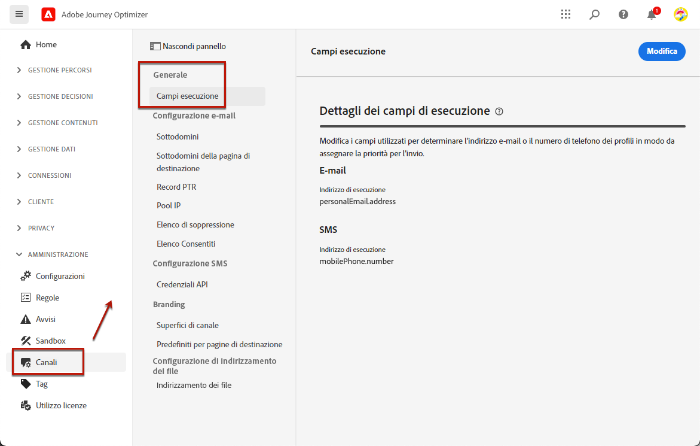
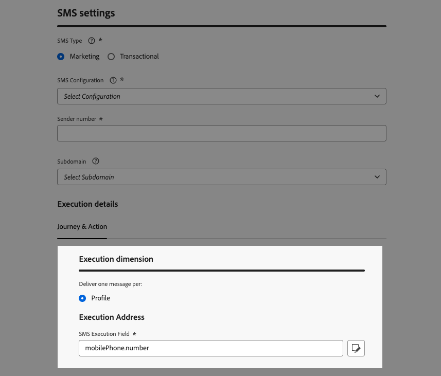
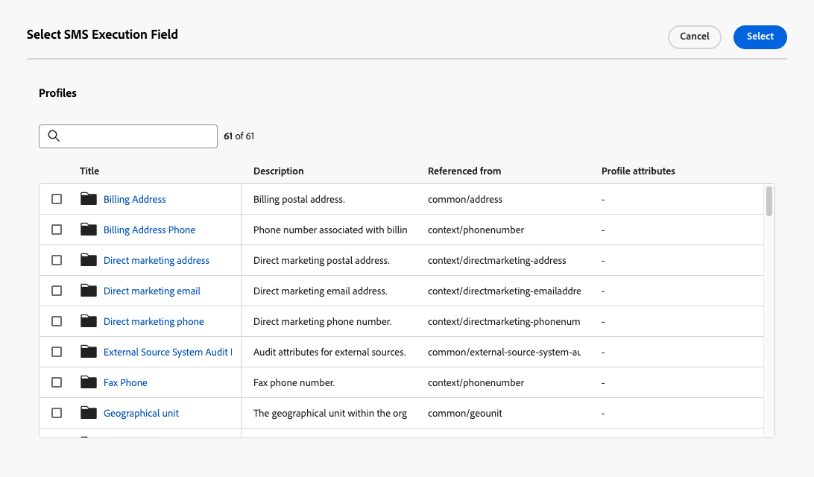

# Modificare gli indirizzi di esecuzione {#change-primary-email}

>[!CONTEXTUALHELP]
>id="ajo_admin_execution_address"
>title="Definire l’indirizzo da utilizzare"
>abstract="Quando nel database sono disponibili diversi indirizzi e-mail o numeri di telefono (personali, professionali, ecc.), puoi scegliere a quale assegnare la priorità per l’invio."

>[!CONTEXTUALHELP]
>id="ajo_admin_execution_address_header"
>title="Definire l’indirizzo da utilizzare"
>abstract="Modifica i campi utilizzati per determinare l’indirizzo e-mail o il numero di telefono del profilo in modo da assegnare la priorità per l’invio."

Quando esegui il targeting di un profilo, nel database potrebbero essere disponibili diversi indirizzi e-mail o numeri di telefono (indirizzo e-mail professionale, numero di telefono personale, ecc.).

In tal caso, [!DNL Journey Optimizer] utilizza **[!UICONTROL Campi di esecuzione]** per determinare quale indirizzo e-mail o numero di telefono utilizzare dal servizio del profilo come priorità.

Per verificare i campi attualmente utilizzati per impostazione predefinita, accedi al menu **[!UICONTROL Amministrazione]** > **[!UICONTROL Canali]** > **[!UICONTROL Impostazioni generali]** > **[!UICONTROL Campi di esecuzione]**.

{width=90%}

>[!NOTE]
>
>I campi di esecuzione sono disponibili per i canali E-mail, SMS e WhatsApp.

I valori correnti vengono utilizzati per tutte le consegne a livello di sandbox. Se necessario, puoi aggiornare questi campi.

Nella maggior parte dei casi, modificherai un campo di esecuzione a livello globale e definirai un valore da utilizzare per tutti i messaggi e-mail, SMS o WhatsApp.

## Aggiornare le impostazioni di amministrazione {#admin-settings}

Per modificare globalmente i campi di esecuzione a livello di sandbox, segui i passaggi indicati di seguito.

1. Accedi al menu **[!UICONTROL Canali]** > **[!UICONTROL Impostazioni generali]** > **[!UICONTROL Campi di esecuzione]**.

1. Fai clic su **[!UICONTROL Modifica]** per modificare i valori predefiniti.

   {width=70%}

1. Fai clic sul campo corrente desiderato o sull’icona di modifica per selezionare un nuovo campo.

   {width=70%}

1. Viene visualizzato l’elenco dei campi XDM di tipo e-mail disponibili. Seleziona il campo da utilizzare.

   {width=90%}

1. Fai clic su **[!UICONTROL Salva]** per confermare la scelta.

Il campo di esecuzione viene aggiornato e verrà ora utilizzato come indirizzo principale.

<!--1. You can also select an additional field to use as secondary email address. This allows you to determine which field to use if the primary field is empty for a profile. -->

## Sostituisci il campo di esecuzione predefinito nei parametri di percorso {#override-execution-address-journey}

>[!CONTEXTUALHELP]
>id="ajo_journey_execution_address"
>title="Definire un valore personalizzato"
>abstract="In alcuni casi specifici, puoi sostituire l’indirizzo di esecuzione predefinito. Utilizza l’icona **Abilita sovrasccrittura parametro** a destra del campo per definire un indirizzo primario personalizzato."
>additional-url="https://experienceleague.adobe.com/it/docs/journey-optimizer/using/configuration/primary-email-addresses#journey-parameters" text="Informazioni sull’indirizzo di esecuzione"

Per casi d’uso specifici, puoi sovrascrivere il campo di esecuzione impostato globalmente e definire un valore diverso a livello di percorso.

L’override di questo valore può essere utile, ad esempio, per:

* Verifica la consegna. Puoi aggiungere il tuo indirizzo e-mail o numero di telefono: dopo aver pubblicato il percorso, ti viene inviato il messaggio e-mail, SMS o WhatsApp.
* Invia un messaggio agli abbonati di un elenco. Per ulteriori informazioni, consulta [questo caso d’uso](../building-journeys/message-to-subscribers-uc.md).

Quando si aggiunge un&#39;azione **[!UICONTROL E-mail]**, **[!UICONTROL SMS]** o **[!UICONTROL WhatsApp]** a un [percorso](../email/create-email.md#create-email-journey-campaign), l&#39;indirizzo e-mail principale o il numero di telefono viene visualizzato nei parametri avanzati del percorso.

Sostituisci questo valore utilizzando l&#39;icona **[!UICONTROL Abilita sostituzione parametro]** a destra del campo.

{width=85%}

>[!CAUTION]
>
>La sostituzione dell’indirizzo e-mail o del numero di telefono deve essere utilizzata solo per casi d’uso specifici. Nella maggior parte dei casi, non è necessario modificarlo, perché il valore definito come indirizzo principale nei **[!UICONTROL campi di esecuzione]** a livello di sandbox è quello che deve essere utilizzato.

## Sostituisci il campo di esecuzione predefinito nella configurazione del canale {#override-execution-address-channel-config}

>[!CONTEXTUALHELP]
>id="ajo_email_config_execution_address"
>title="Sovrascrivere l’indirizzo di esecuzione predefinito da utilizzare"
>abstract="Quando nel database sono disponibili diversi indirizzi e-mail o numeri di telefono (personali, professionali, ecc.), puoi scegliere quale dare priorità all’invio. L’indirizzo principale è definito a livello di sandbox, ma in questo caso puoi sovrascrivere l’impostazione predefinita per questa configurazione di canale specifica."

Puoi modificare l&#39;indirizzo di esecuzione predefinito per una configurazione di [canale](channel-surfaces.md) specifica per e-mail, SMS o WhatsApp.

A questo scopo, vai alla sezione **[!UICONTROL Dimensione di esecuzione]** e modifica il campo dedicato in **[!UICONTROL Indirizzo di esecuzione]**.

>[!NOTE]
>
>Per il [canale WhatsApp](../whatsapp/whatsapp-configuration.md#whatsapp-configuration), il **[!UICONTROL campo di esecuzione WhatsApp]** si trova nella sezione **[!UICONTROL Impostazioni WhatsApp]**.

{width=85%}

Quindi seleziona un elemento dall’elenco dei campi XDM di tipo e-mail disponibili.

Il campo di esecuzione viene aggiornato e viene quindi utilizzato come indirizzo principale per le campagne o i percorsi che utilizzano questa configurazione di canale. Sostituisce l&#39;[impostazione generale](#admin-settings) definita a livello di sandbox.

<!--[Learn more on the execution address in the email configuration ](../email/email-settings.md#execution-address)-->
