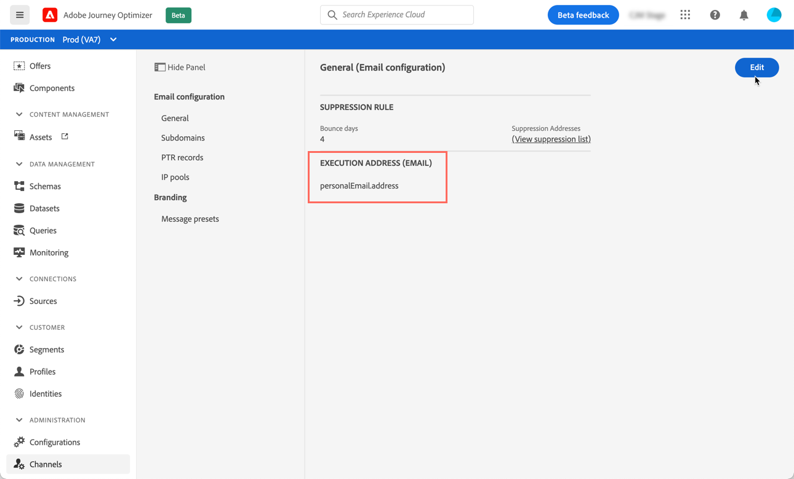
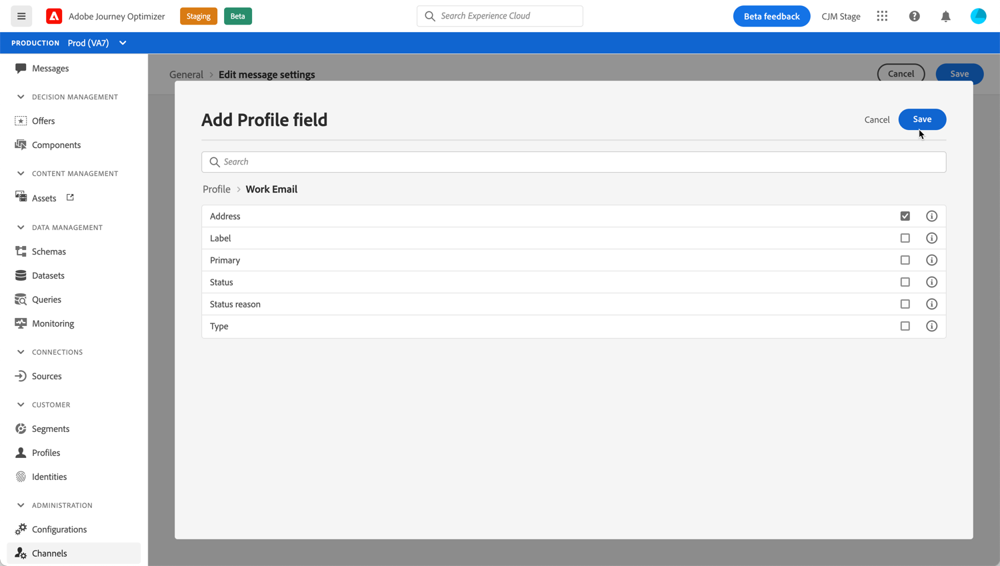

# Modificare gli indirizzi e-mail principali

Quando esegui il targeting di un profilo, diversi indirizzi e-mail possono essere disponibili nel database (personale, indirizzo e-mail professionale, ecc.).

Con Journey Optimizer, puoi determinare quale indirizzo e-mail utilizzare dal servizio di profilo e assegnare una priorità quando sono disponibili più indirizzi. Per farlo, esegui questi passaggi:

1. Accedi al menu **[!UICONTROL Channels]** `>` **[!UICONTROL General]** .
1. Il campo attualmente utilizzato per impostazione predefinita per determinare gli indirizzi e-mail dei profili viene visualizzato in questa schermata. Fare clic su **[!UICONTROL Edit]** per modificarlo.

   

1. Fai clic sul pulsante modifica per selezionare il nuovo campo da utilizzare come indirizzo e-mail principale.

   

1. Viene visualizzato l’elenco dei campi XDM di tipo e-mail disponibili. Seleziona il campo da utilizzare, quindi fai clic su **[!UICONTROL Save]**.

   

<!--1. You can also select an additional field to use as secondary email address. This allows you to determine which field to use if the primary field is empty for a profile. >> will be done later on-->
