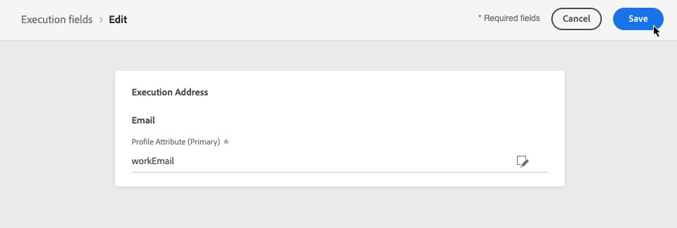

# Modificare gli indirizzi e-mail principali {#change-primary-email}

>[!CONTEXTUALHELP]
>id="ajo_admin_execution_address"
>title="Definire l’indirizzo da utilizzare"
>abstract="Puoi scegliere quale indirizzo e-mail assegnare la priorità all’invio quando nel database sono disponibili più indirizzi (personali, professionali, ecc.)."

Quando esegui il targeting di un profilo, diversi indirizzi e-mail possono essere disponibili nel database (personale, indirizzo e-mail professionale, ecc.).

Con [!DNL Journey Optimizer], puoi determinare quale indirizzo e-mail utilizzare dal servizio di profilo e assegnare una priorità quando sono disponibili più indirizzi. Per farlo, segui la procedura indicata di seguito.

1. Accedi al menu **[!UICONTROL Channels]** > **[!UICONTROL General]** > **[!UICONTROL Executions fields]**.

   

1. Il campo attualmente utilizzato per impostazione predefinita per determinare gli indirizzi e-mail dei profili viene visualizzato in questa schermata. Fai clic su **[!UICONTROL Edit]** per cambiarlo.

   

1. Fai clic sul campo corrente o sull’icona di modifica per selezionare un nuovo campo.

   

1. Viene visualizzato l’elenco dei campi XDM di tipo e-mail disponibili. Seleziona il campo da utilizzare.

   

1. Fai clic su **[!UICONTROL Save]** per confermare la scelta.

   

   Il campo di esecuzione viene aggiornato e verrà ora utilizzato come indirizzo principale.

<!--1. You can also select an additional field to use as secondary email address. This allows you to determine which field to use if the primary field is empty for a profile. -->
