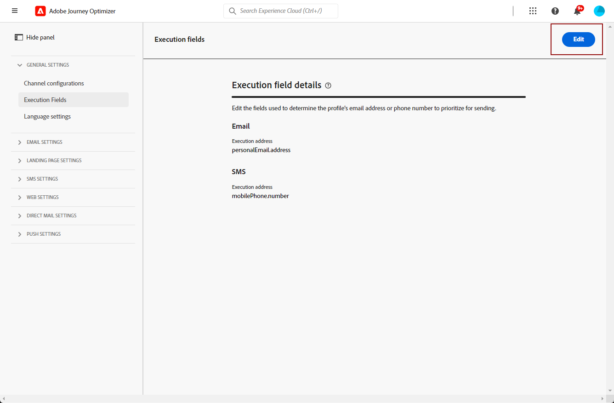

# Modificare gli indirizzi di esecuzione {#change-primary-email}

>[!CONTEXTUALHELP]
>id="ajo_admin_execution_address"
>title="Definire l’indirizzo da utilizzare"
>abstract="Quando nel database sono disponibili diversi indirizzi e-mail o numeri di telefono (personali, professionali, ecc.), puoi scegliere a quale assegnare la priorità per l’invio."

>[!CONTEXTUALHELP]
>id="ajo_admin_execution_address_header"
>title="Definire l’indirizzo da utilizzare"
>abstract="Modifica i campi utilizzati per determinare l’indirizzo e-mail o il numero di telefono del profilo in modo da assegnare la priorità per l’invio."

Quando esegui il targeting di un profilo, nel database potrebbero essere disponibili diversi indirizzi e-mail o numeri di telefono (indirizzo e-mail professionale, numero di telefono personale, ecc.).

In tal caso, [!DNL Journey Optimizer] utilizza **[!UICONTROL Campi di esecuzione]** per determinare quale indirizzo e-mail o numero di telefono utilizzare dal servizio del profilo come priorità.

Per verificare i campi attualmente utilizzati per impostazione predefinita, accedi al menu **[!UICONTROL Amministrazione]** > **[!UICONTROL Canali]** > **[!UICONTROL Impostazioni generali]** > **[!UICONTROL Campi di esecuzione]**.

I valori correnti vengono utilizzati per tutte le consegne a livello di sandbox. Se necessario, puoi aggiornare questi campi.

Nella maggior parte dei casi, modificherai un campo di esecuzione a livello globale e definirai un valore da utilizzare per tutti i messaggi e-mail o SMS. <!--[Learn how](#admin-settings)-->

<!--In some specific use cases only, you can override the value set globally and define a different value at the journey level. [Learn more](#journey-parameters)-->

## Aggiornare le impostazioni di amministrazione {#admin-settings}

Per modificare globalmente i campi di esecuzione a livello di sandbox, segui i passaggi indicati di seguito.

1. Accedi al menu **[!UICONTROL Canali]** > **[!UICONTROL Impostazioni generali]** > **[!UICONTROL Campi di esecuzione]**.

1. Fai clic su **[!UICONTROL Modifica]** per modificare i valori predefiniti.

   

1. Fai clic sul campo corrente desiderato o sull’icona di modifica per selezionare un nuovo campo.

   

1. Viene visualizzato l’elenco dei campi XDM di tipo e-mail disponibili. Seleziona il campo da utilizzare.

   

1. Fai clic su **[!UICONTROL Salva]** per confermare la scelta.

Il campo di esecuzione viene aggiornato e verrà ora utilizzato come indirizzo principale.

<!--1. You can also select an additional field to use as secondary email address. This allows you to determine which field to use if the primary field is empty for a profile. -->

## Sostituisci il campo di esecuzione predefinito {#override-default-execution-address}

>[!CONTEXTUALHELP]
>id="ajo_journey_execution_address"
>title="Definisci un valore personalizzato"
>abstract="In alcuni casi specifici, puoi sovrascrivere l’indirizzo di esecuzione predefinito. Utilizza l&#39;icona **Abilita sostituzione parametro** a destra del campo per definire un indirizzo primario personalizzato."
>additional-url="https://experienceleague.adobe.com/it/docs/journey-optimizer/using/configuration/primary-email-addresses#journey-parameters" text="Informazioni sull’indirizzo di esecuzione"

Per casi d’uso specifici, puoi sovrascrivere il campo di esecuzione impostato globalmente e definire un valore diverso a livello di configurazione e-mail o di percorso.

L’override di questo valore può essere utile, ad esempio, per:

* Test di un’e-mail. Puoi aggiungere il tuo indirizzo e-mail: dopo aver pubblicato il percorso, l’e-mail ti viene inviata.
* Invia un messaggio e-mail agli abbonati di un elenco. Per ulteriori informazioni, consulta [questo caso d’uso](../building-journeys/message-to-subscribers-uc.md).

### Nella configurazione e-mail

Puoi modificare il campo di esecuzione predefinito impostato nelle [impostazioni generali](#admin-settings) durante la definizione di una configurazione del canale e-mail. [Ulteriori informazioni](../email/email-settings.md#execution-address)

Quando un indirizzo di esecuzione viene definito nella configurazione e-mail, viene utilizzato come indirizzo principale e sostituisce l’impostazione generale a livello di sandbox.

### Nei parametri del percorso {#journey-parameters}

Quando si aggiunge un&#39;azione **[!UICONTROL E-mail]** o **[!UICONTROL SMS]** a un [percorso](../email/create-email.md#create-email-journey-campaign), l&#39;indirizzo e-mail principale viene visualizzato nei parametri avanzati del percorso.

In alcuni contesti specifici, è possibile sostituire questo valore utilizzando l&#39;icona **[!UICONTROL Abilita sostituzione parametro]** a destra del campo.

>[!CAUTION]
>
>La sostituzione dell’indirizzo e-mail deve essere utilizzata solo per casi d’uso specifici. Nella maggior parte dei casi, non è necessario modificare l&#39;indirizzo e-mail perché il valore definito come indirizzo principale nei **[!UICONTROL campi di esecuzione]** è quello che deve essere utilizzato.

