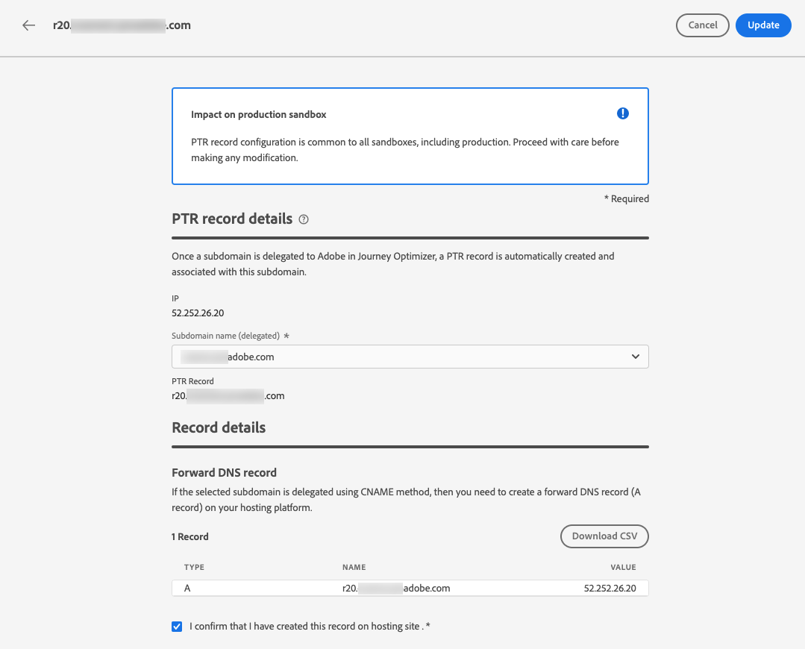

# Creare e modificare i record PTR {#ptr-records}

>[!CONTEXTUALHELP]
>id="ajo_admin_ptr_record"
>title="Record PTR dei sottodomini"
>abstract="Un record puntatore (PTR) è un tipo di record DNS che fornisce il nome di dominio collegato a un indirizzo IP, in modo che i server di posta riceventi possano verificare gli indirizzi IP dei mittenti. Modifica un record PTR solo dopo le dovute considerazioni e dopo averne parlato con chi si occupa della recapitabilità dei messaggi."

>[!CONTEXTUALHELP]
>id="ajo_admin_ptr_record_header"
>title="Record PTR dei sottodomini"
>abstract="Una volta che il primo sottodominio è stato delegato ad Adobe in Journey Optimizer, i record PTR vengono creati automaticamente."

## Informazioni sui record PTR {#about-ptr-records}

Un record puntatore (PTR) è un tipo di record DNS (Domain Name System) che fornisce il nome di dominio collegato a un indirizzo IP.

Con i record PTR, i server di posta di ricezione possono verificare l&#39;autenticità dei server di posta di invio identificando se i loro indirizzi IP corrispondono ai nomi a cui si connettono i server.

## Accedere ai record PTR dei sottodomini {#access-ptr-records}

Una volta [delegato](delegate-subdomain.md) il tuo primo sottodominio ad Adobe in [!DNL Journey Optimizer], i record PTR vengono creati automaticamente per i tuoi IP. Puoi accedervi dal menu **[!UICONTROL Amministrazione]** > **[!UICONTROL Canali]** > **[!UICONTROL Impostazioni e-mail]** > **[!UICONTROL Record PTR]**.

L&#39;elenco mostra i record PTR generati utilizzando la sintassi seguente:

* &quot;r&quot; per la registrazione,
* &quot;xx&quot; per le ultime due cifre dell’indirizzo IP,
* nome del sottodominio.

Puoi aprire un record PTR dall’elenco per visualizzare il nome del sottodominio e l’indirizzo IP associati.

## Modificare un record PTR {#edit-ptr-record}

In [!DNL Journey Optimizer] non è possibile creare manualmente record PTR. Al contrario, una volta [delegato](delegate-subdomain.md) il tuo primo sottodominio ad Adobe, i record PTR vengono creati automaticamente per i tuoi IP.

Ogni IP riceve un singolo record PTR. Tutti i record PTR hanno il formato seguente: &#39;rxx.subdomain&#39;, dove &#39;subdomain&#39; è il primo sottodominio delegato in [!DNL Journey Optimizer].

Quando crei altri sottodomini, devi modificare uno o più record PTR e assegnare loro i nuovi sottodomini. A questo scopo, segui i passaggi riportati qui sotto.

>[!CAUTION]
>
>I record PTR sono comuni a tutti gli ambienti. Pertanto, qualsiasi modifica apportata a un record PTR influirà anche sulle sandbox di produzione.
>
>Procedi con particolare attenzione durante la modifica dei record PTR. In caso di dubbi, contatta un esperto di consegna.

### Sottodomini completamente delegati {#fully-delegated-subdomains}

Per modificare un record PTR con un sottodominio [completamente delegato](delegate-subdomain.md#full-subdomain-delegation) ad Adobe, effettua le seguenti operazioni.

1. Nell&#39;elenco fare clic sul nome di un record PTR per aprirlo.

   

1. Seleziona dall&#39;elenco un sottodominio [completamente delegato](delegate-subdomain.md#full-subdomain-delegation) ad Adobe.

   

1. Fai clic su **[!UICONTROL Salva]** per confermare le modifiche.

>[!NOTE]
>
>Impossibile modificare i campi **[!UICONTROL IP]** e **[!UICONTROL Record PTR]**.

### Sottodomini delegati tramite il metodo CNAME {#edit-ptr-subdomains-cname}

Per modificare un record PTR con un sottodominio delegato ad Adobe utilizzando il metodo [CNAME](delegate-subdomain.md#cname-subdomain-setup), effettua le seguenti operazioni.

1. Nell&#39;elenco fare clic sul nome di un record PTR per aprirlo.

   

1. Selezionare un sottodominio delegato ad Adobe utilizzando il metodo [CNAME](delegate-subdomain.md#cname-subdomain-setup) dall&#39;elenco.

   

1. Devi creare un nuovo record DNS di inoltro sulla piattaforma di hosting. A questo scopo, copia il record generato da Adobe. Al termine, seleziona la casella &quot;Confermo...&quot;.

   

   >[!NOTE]
   >
   >Se ricevi questo messaggio: &quot;Crea prima il DNS di inoltro e poi riprova&quot;, segui i passaggi seguenti:
   >   * Verificare nel provider DNS che il record DNS di inoltro sia stato creato correttamente.
   >   * I record nel DNS potrebbero non essere sincronizzati immediatamente. Attendere alcuni minuti e riprovare.

1. Fai clic su **[!UICONTROL Salva]** per confermare le modifiche.

>[!NOTE]
>
>Impossibile modificare i campi **[!UICONTROL IP]** e **[!UICONTROL Record PTR]**.

## Controlla dettagli aggiornamento record PTR {#check-ptr-record-update}

Dopo aver confermato la modifica del record PTR, l&#39;icona **[!UICONTROL Elaborazione]** viene visualizzata accanto al nome del record PTR nell&#39;elenco.

>[!NOTE]
>
>L&#39;[elaborazione aggiornamento](#processing) può richiedere fino a 3 ore.

Per verificare i dettagli dell&#39;aggiornamento del record PTR, fare clic sull&#39;icona accanto. Ulteriori informazioni sugli stati associati alle diverse icone in [questa sezione](#ptr-record-update-statuses).

Puoi visualizzare informazioni quali lo stato di aggiornamento e le modifiche richieste.

## Stati di aggiornamento record PTR {#ptr-record-update-statuses}

Un aggiornamento del record PTR può avere i seguenti stati:

*  **[!UICONTROL Elaborazione]**: l&#39;aggiornamento del record PTR è stato inviato ed è in corso un processo di verifica.
*  **[!UICONTROL Operazione riuscita]**: il record PTR aggiornato è stato verificato e il nuovo sottodominio è ora associato all&#39;indirizzo IP.
*  **[!UICONTROL Non riuscito]**: uno o più controlli non sono riusciti durante la verifica dell&#39;aggiornamento del record PTR.

### Elaborazione {#processing}

Verranno eseguiti diversi controlli di recapito per verificare che il nuovo sottodominio da associare all’indirizzo IP sia valido. Questa operazione può richiedere fino a 3 ore.

>[!NOTE]
>
>Impossibile modificare un record PTR mentre è in corso l&#39;aggiornamento. Puoi comunque fare clic sul nome, ma il campo **[!UICONTROL Sottodominio]** è disattivato. Le modifiche verranno applicate solo dopo il completamento dell&#39;aggiornamento.

Durante il processo di convalida, il vecchio sottodominio è ancora associato all’indirizzo IP.

### Operazione riuscita {#success}

Una volta completato correttamente il processo di convalida, il nuovo sottodominio viene associato automaticamente all’indirizzo IP.

### Non riuscito {#failes}

Se il processo di convalida non riesce, viene visualizzato il record PTR precedente. Il sottodominio valido precedentemente associato all’indirizzo IP rimane invariato.

I possibili tipi di errore di aggiornamento sono i seguenti:

* Impossibile creare un nuovo DNS di inoltro per il record PTR
* Impossibile aggiornare il record
* Impossibile ripetere l’onboarding delle affinità

Se l&#39;aggiornamento non riesce, il record PTR diventa nuovamente modificabile. Puoi fare clic sul nome e aggiornare nuovamente il sottodominio.
