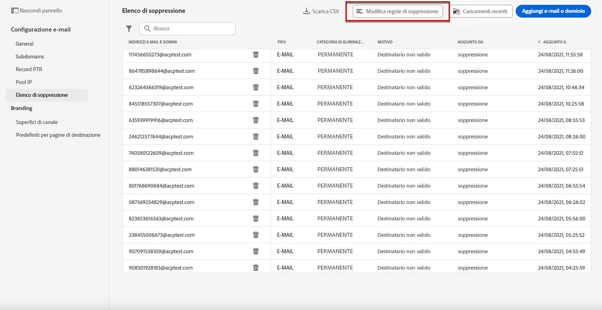

# Nuovi tentativi {#retries}

Quando un messaggio e-mail non riesce a causa di un errore **Mancato recapito temporaneo** per un determinato indirizzo, vengono eseguiti diversi tentativi. Ogni errore incrementa un contatore di errori. Quando questo contatore raggiunge la soglia limite, l’indirizzo e-mail viene aggiunto all’elenco di soppressione.

>[!NOTE]
>
>Ulteriori informazioni sui tipi di errori nella sezione [Tipi di errori di consegna](../reports/suppression-list.md#delivery-failures).

Nella configurazione predefinita, la soglia è impostata su 5 errori.

* Per la stessa consegna, al quinto errore riscontrato entro il periodo di tempo di [nuovi tentativi](#retry-duration), l&#39;indirizzo è soppresso.

* Se sono presenti consegne diverse e due errori si verificano almeno a 24 ore di distanza, il contatore degli errori viene incrementato a ogni errore e anche l’indirizzo viene eliminato al quinto tentativo. Gli errori sono cumulativi per ogni indirizzo.

Se una consegna ha esito positivo dopo un nuovo tentativo, il contatore di errori dell’indirizzo viene reinizializzato.

Ad esempio:

* Hai inviato un’e-mail lunedì con un periodo di tempo di esecuzione dei nuovi tentativi impostato su 24 ore. Impossibile recapitare l&#39;indirizzo `emma.jones@mail.com`. L’e-mail viene ritentata fino a tre volte e smette di ritentare quando raggiunge il periodo di 24 ore.

* Mercoledì spedisci un’altra e-mail. Anche `emma.jones@mail.com`, che presenta già un conteggio di tre errori, è sottoposto a targeting e di nuovo non riesce a essere recapitato - due volte. Vengono contabilizzati altri due errori.

Se tra queste due e-mail non è stata tentata e non si è verificato alcun altro tentativo di consegna, l&#39;indirizzo `emma.jones@mail.com` viene aggiunto all&#39;elenco di soppressione in base all&#39;impatto cumulativo di 3 + 2 errori.

## Edizione soglia di ripetizione {#edit-retry-threshold}

>[!CONTEXTUALHELP]
>id="ajo_admin_suppression_list_bounces"
>title="Aggiornare la soglia dei tentativi"
>abstract="Se il valore predefinito non soddisfa le tue esigenze, puoi modificare il numero consentito di mancati recapiti non permanenti consecutivi. Quando il contatore dei tentativi raggiunge la soglia di errore per un indirizzo e-mail specifico, questo indirizzo viene aggiunto all’elenco di soppressione."
<!--
>additional-url="https://experienceleague.adobe.com/docs/journey-optimizer/using/reporting/deliverability/suppression-list.html" text="Understand the suppresion list"-->

Nel caso in cui il valore predefinito 5 non soddisfi le tue esigenze, puoi modificare la soglia di errore seguendo la procedura riportata di seguito.

1. Vai a **[!UICONTROL Canali]** > **[!UICONTROL Impostazioni e-mail]** > **[!UICONTROL Elenco di soppressione]**.

1. Selezionare il pulsante **[!UICONTROL Modifica regole di soppressione]**.

   

1. Modifica il numero consentito di mancati recapiti non permanenti consecutivi in base alle tue esigenze.

   

   È necessario immettere un numero intero compreso tra 1 e 20, il che significa che il numero minimo di tentativi è 1 e il numero massimo è 20.

   >[!CAUTION]
   >
   >Inserire nell&#39;elenco Bloccati Un valore superiore a 10 può causare problemi di reputazione del recapito dei messaggi, nonché la limitazione o la degli IP da parte degli ISP. [Ulteriori informazioni sulla consegna](../reports/deliverability.md)

## Periodo di tempo per i tentativi {#retry-duration}

Il periodo di tempo **per i tentativi** è l&#39;intervallo di tempo in cui verrà ritentato qualsiasi messaggio e-mail della consegna che ha rilevato un errore temporaneo o un messaggio non recapitato.

Per impostazione predefinita, i nuovi tentativi verranno eseguiti per **3,5 giorni** (o **84 ore**) dal momento in cui il messaggio è stato aggiunto alla coda e-mail.

Tuttavia, per evitare che i nuovi tentativi vengano eseguiti quando non è più necessario, è possibile modificare questa impostazione in base alle proprie esigenze durante la creazione o la modifica di una [configurazione del canale](channel-surfaces.md) applicabile al canale e-mail.

Ad esempio, puoi impostare il periodo di esecuzione dei nuovi tentativi su 24 ore per un’e-mail transazionale relativa alla reimpostazione della password e contenente un collegamento valido solo per un giorno. Allo stesso modo, per una vendita di mezzanotte, puoi definire un periodo di esecuzione di un nuovo tentativo di 6 ore.

>[!NOTE]
>
>Il periodo di esecuzione dei nuovi tentativi non può superare le 84 ore. Il periodo minimo di nuovi tentativi è di 6 ore per le e-mail di marketing e di 10 minuti per le e-mail transazionali.

Scopri come regolare i parametri dei tentativi e-mail durante la creazione di una configurazione del canale in [questa sezione](../email/email-settings.md#email-retry).

