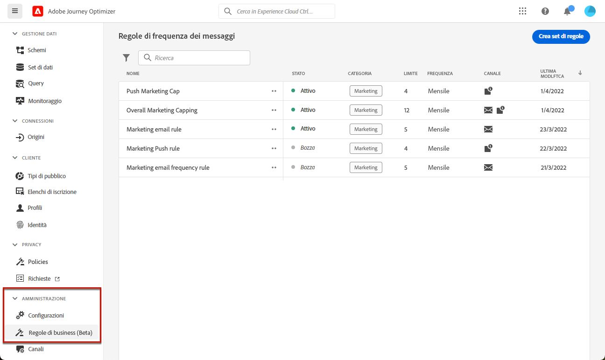

# Utilizzare i set di regole {#rule-sets}

>[!CONTEXTUALHELP]
>id="ajo_business_rules_rule_sets"
>title="Set di regole"
>abstract="Utilizza i set di regole per applicare la quota limite a diversi tipi di comunicazioni di marketing. Ad esempio, puoi creare un set di regole per limitare il numero di **comunicazioni promozionali** inviate alla clientela e creare un altro set di regole per limitare il numero di **newsletter** inviate."

>[!AVAILABILITY]
>
>I set di regole sono attualmente disponibili come versione beta solo per gli utenti selezionati. Contatta il rappresentante del tuo Adobe per essere incluso in Beta.

## Introduzione ai set di regole {#gs}

### Cosa sono i set di regole? {#what}

Oltre alle regole aziendali globali che limitano il numero di volte in cui gli utenti ricevono messaggi su uno o più canali, i set di regole ti consentono di **raggruppare più regole in set di regole** e applicarle alle campagne di tua scelta. Ciò offre una maggiore granularità per controllare la frequenza con cui gli utenti riceveranno un messaggio, a seconda del tipo di comunicazione.

Ad esempio, puoi creare un set di regole per limitare il numero di **comunicazioni promozionali** inviate ai clienti e un altro set di regole per limitare il numero di **newsletter** inviate. A seconda del tipo di campagna che si sta creando, è possibile scegliere di applicare la comunicazione promozionale o il set di regole newsletter.

### Set di regole globali e personalizzati {#global-custom}

Quando si accede ai set di regole per la prima volta dal menu **[!UICONTROL Amministrazione]** > **[!UICONTROL Regole aziendali (Beta)]**, viene creato e attivato un set di regole predefinito: **Set di regole predefinito globale**.

Questo set di regole contiene regole globali che è possibile applicare per controllare la frequenza con cui gli utenti ricevono messaggi in uno o più canali, in modo analogo al funzionamento delle regole business correnti. Tutte le regole definite in questo set di regole si applicano a tutti i canali selezionati, indipendentemente dal fatto che le comunicazioni vengano inviate da un percorso o da una campagna. [Scopri come utilizzare le regole business](frequency-rules.md)

Oltre a questo set di regole predefinito globale, puoi creare **set di regole personalizzati** che puoi applicare a qualsiasi campagna per limitare il numero di messaggi inviati all&#39;interno della campagna. [Scopri come creare set di regole personalizzati](#create)

>[!IMPORTANT]
>
>Per il momento, i set di regole personalizzati possono essere applicati solo alle **campagne**. Solo le regole definite nel set di regole &quot;Set di regole predefinito globale&quot; sono applicabili sia alle comunicazioni di percorsi che a quelle di campagne.

### Regole di limitazione di canale e percorsi {#domain}

Durante la creazione di un set di regole, è necessario specificare se le regole all’interno del set di regole applicheranno regole di limitazione specifiche per i canali di comunicazione o per i percorsi.

Questa operazione viene eseguita selezionando un dominio di canale o di Percorso per il set di regole durante la sua creazione. [Scopri come creare un set di regole]

* Dominio **Canale**: applica regole di limitazione per i canali di comunicazione. Ad esempio, non inviare più di 1 comunicazione e-mail o SMS al giorno.
* Dominio **Percorso**: applica le regole di limitazione della concorrenza e delle voci a un percorso. Ad esempio, non inserire profili in più di un percorso contemporaneamente.

## Creare il primo set di regole personalizzato {#create-rule-set}

### Crea il set di regole e selezionane il dominio {#create}

Per creare un set di regole, segui la procedura riportata di seguito.

>[!NOTE]
>
>Puoi creare fino a 3 set di regole personalizzati.

1. Accedi all&#39;elenco **[!UICONTROL Set di regole]**, quindi fai clic su **[!UICONTROL Crea set di regole]**.

   

1. Definisci un nome univoco per il set di regole e aggiungi una descrizione.

1. Seleziona il dominio del set di regole. Il dominio consente di specificare se il set di regole conterrà regole di limitazione di utilizzo specifiche per i canali di comunicazione o i percorsi:

   * **Canale**: applica regole di limitazione per i canali di comunicazione. Ad esempio, non inviare più di 1 comunicazione e-mail o SMS al giorno.
   * **Percorso**: applica a un percorso le regole di limite di concorrenza e di immissione. Ad esempio, non inserire profili in più di un percorso contemporaneamente.

   

1. Fai clic su **[!UICONTROL Salva]**.

1. Ora puoi [definire le regole](#create-new-rule) da aggiungere a questo set di regole.

### Aggiungere regole al set di regole {#create-new-rule}

>[!CONTEXTUALHELP]
>id="ajo_rule_sets_category"
>title="Selezionare la categoria della regola del messaggio"
>abstract="Quando vengono attivate e applicate a un messaggio, tutte le regole di frequenza che corrispondono alla categoria selezionata verranno applicate automaticamente a questo messaggio. Attualmente è disponibile solo la categoria Marketing."

>[!CONTEXTUALHELP]
>id="ajo_rule_sets_capping"
>title="Impostare i limiti per la regola"
>abstract="Specifica il numero massimo di messaggi inviati a un profilo cliente nell’arco temporale definito. La quota limite si baserà sul periodo di calendario selezionato e verrà reimpostata all’inizio dell’arco temporale corrispondente."

>[!CONTEXTUALHELP]
>id="ajo_rule_sets_channel"
>title="Definire i canali a cui si applica la regola"
>abstract="Seleziona almeno un canale. Le funzioni di limitazione vengono applicate a tutti i canali come conteggio totale."

>[!CONTEXTUALHELP]
>id="ajo_rule_sets_duration"
>title="Selezionare la categoria della regola del messaggio"
>abstract="Quando vengono attivate e applicate a un messaggio, tutte le regole di frequenza che corrispondono alla categoria selezionata verranno applicate automaticamente a questo messaggio. Attualmente è disponibile solo la categoria Marketing."

Per aggiungere una regola a un set di regole, accedere al set di regole e fare clic su **[!UICONTROL Aggiungi regola]**.

I parametri disponibili per la regola dipendono dal dominio del set di regole selezionato al momento della creazione.

+++Configurare le regole di limitazione dei canali (dominio **Canale**)

1. Definisci un nome univoco per la regola.

1. Il campo **Categoria** specifica la categoria del messaggio a cui si applica la regola. Per il momento, questo campo è di sola lettura perché è disponibile solo la categoria **[!UICONTROL Marketing]**.

1. Dall&#39;elenco a discesa **[!UICONTROL Durata]**, selezionare se si desidera applicare il limite ogni mese, ogni settimana o ogni giorno. La quota limite si basa sul periodo di calendario selezionato. Viene reimpostato all’inizio dell’arco temporale corrispondente.

   

   La scadenza del contatore per ciascun periodo è la seguente:

   * **[!UICONTROL Mensile]**: la quota limite è valida fino all’ultimo giorno del mese alle 23:59:59 UTC. Ad esempio, la scadenza mensile di gennaio è il 31/01 alle 23:59:59 UTC.

   * **[!UICONTROL Settimanale]**: la quota limite è valida fino alle 23:59:59 UTC del sabato di tale settimana, poiché la settimana di calendario inizia la domenica. La scadenza è indipendente dalla creazione della regola. Ad esempio, se la regola viene creata il giovedì, è valida fino a sabato alle 23:59:59.

   * **[!UICONTROL Giornaliero]**: il limite di frequenza giornaliero è valido per il giorno fino alle 23:59:59 UTC e viene reimpostato su 0 all&#39;inizio del giorno successivo.

     >[!CAUTION]
     >
     >Per garantire la precisione delle regole di quota limite giornaliera, è obbligatorio l&#39;utilizzo di [segmentazione streaming](https://experienceleague.adobe.com/docs/experience-platform/segmentation/ui/streaming-segmentation.html?lang=it){target="_blank"}. Ulteriori informazioni sui metodi di valutazione del pubblico sono disponibili in [questa sezione](../audience/about-audiences.md#evaluation-method-in-journey-optimizer).

   Il valore del contatore dei profili viene aggiornato una volta consegnata la comunicazione. Tieni presente questo aspetto quando invii grandi volumi di comunicazioni, in quanto la velocità effettiva potrebbe far sì che il destinatario riceva l’e-mail pochi minuti o anche alcune ore dopo l’inizio della comunicazione (nel caso in cui invii milioni di comunicazioni simultaneamente).

   Ciò è importante nel caso in cui un destinatario riceva due comunicazioni in stretta collaborazione. Si consiglia di distanziare le comunicazioni di almeno due ore, se possibile, per dare al destinatario il tempo sufficiente per ricevere la comunicazione e aggiornare di conseguenza il valore del contatore.

1. Imposta il limite per la regola, ovvero il numero massimo di messaggi che possono essere inviati a un singolo profilo utente ogni mese, settimana o giorno, in base alla selezione precedente.

1. Seleziona il canale da utilizzare per questa regola: **[!UICONTROL E-mail]**, **[!UICONTROL SMS]**, **[!UICONTROL Notifica push]** o **[!UICONTROL Direct mail]**.

   >[!NOTE]
   >
   >Per poter creare il messaggio, devi selezionare almeno un canale.

1. Se desideri applicare il limite come conteggio totale su tutti i canali selezionati, seleziona diversi canali.

   Ad esempio, imposta il limite su 5 e seleziona sia il canale e-mail che quello sms. Se un profilo ha già ricevuto 3 e-mail di marketing e 2 sms di marketing per il periodo selezionato, verrà escluso dalla consegna successiva di eventuali e-mail di marketing o sms.

+++

+++Configura regole limite percorso (**dominio Percorso**)

1. Specifica un nome univoco per la regola.

1. Nell&#39;elenco a discesa **[!UICONTROL Tipo di regola]**, specificare il tipo di limite per la regola.

   * **[!UICONTROL Limite Percorso di ingresso]**: limita il numero di ingressi nel percorso in un determinato periodo per un profilo.
   * **[!UICONTROL Limite di concorrenza Percorso]**: limita il numero di percorsi in cui è possibile iscrivere contemporaneamente un profilo.

1. Informazioni dettagliate su come configurare le regole di limitazione di percorso sono disponibili nella sezione [Limitazione di Percorso e arbitrato](../test-approve/journey-capping.md).

+++

1. Fai clic su **[!UICONTROL Salva]** per confermare la creazione della regola. Il messaggio viene aggiunto al set di regole con lo stato **[!UICONTROL Bozza]**.

   

1. Ripeti i passaggi precedenti per aggiungere al set di regole tutte le regole necessarie.

Ora devi attivare ogni regola prima che possa essere applicata a qualsiasi messaggio. [Ulteriori informazioni](#activate-rule)

### Attivare le regole e il set di regole {#activate-rule}

Al momento della creazione, una regola ha lo stato **[!UICONTROL Bozza]** e non influisce ancora su alcun messaggio. Per abilitarla, fai clic sul pulsante **[!UICONTROL Altre azioni]** accanto alla regola e seleziona **[!UICONTROL Attiva]**.

Devi anche attivare il set di regole per potervi accedere in campagne/percorsi e applicarlo ai messaggi.

>[!NOTE]
>
>La completa attivazione di una regola o di un set di regole può richiedere fino a 10 minuti. Non è necessario modificare i messaggi o ripubblicare i percorsi per rendere effettiva una regola.

<!--Currently, once a rule set is activated, no more rules can be added to that rule set.-->

Per disattivare una regola o un set di regole, fare clic sul pulsante **[!UICONTROL Altre azioni]** accanto all&#39;elemento desiderato e selezionare **[!UICONTROL Disattiva]**.

Lo stato verrà modificato in **[!UICONTROL Inattivo]** e la regola non verrà applicata alle esecuzioni future dei messaggi. Eventuali messaggi attualmente in esecuzione non saranno interessati.

>[!NOTE]
>
>La disattivazione di una regola o di un set di regole non influisce né reimposta i conteggi sui singoli profili.

## Accedere e gestire i set di regole {#access-rule-sets}

Tutti i set di regole creati vengono visualizzati nel menu **[!UICONTROL Amministrazione]** > **[!UICONTROL Regole aziendali (Beta)]**. Vengono ordinati in base alla data dell’ultima modifica.

Fai clic sul nome di un set di regole per visualizzarne e modificarne il contenuto. Sono elencate tutte le regole incluse in tale set di regole. Il menu contestuale in alto a destra consente di:

* Modifica il nome e la descrizione del set di regole
* Attiva il set di regole - [ulteriori informazioni](#activate-rule)
* Elimina il set di regole

Per ogni regola nel set di regole, il pulsante **[!UICONTROL Altre azioni]** consente di:

* Modifica la regola
* Attiva la regola [ulteriori informazioni](#activate-rule)
* Elimina la regola

<!--### Permissions{#permissions-frequency-rules}

To access, create, edit or delete message frequency rules, you must have the **[!UICONTROL Manage frequency rules]** permission. 

Users with the **[!UICONTROL View frequency rules]** permission are able to view rules, but not to modify or delete them.

Learn more about permissions in [this section](../administration/high-low-permissions.md).-->

## Applicare i set di regole a un messaggio o a un percorso {#apply-frequency-rule}

Puoi applicare un set di regole a un messaggio o a un percorso, a seconda del dominio selezionato durante la creazione del set di regole. Per ulteriori informazioni, espandi le sezioni seguenti.

+++ Applicare un set di regole a un messaggio

1. Durante la creazione di una [campagna](../campaigns/create-campaign.md), seleziona uno dei canali definiti per il set di regole e modifica il contenuto del messaggio.

1. Nella schermata dell&#39;edizione del contenuto, fare clic sul pulsante **[!UICONTROL Aggiungi regola business]**.

1. Seleziona il [set di regole creato](#create-rule-set).

   

   >[!NOTE]
   >
   >Nell&#39;elenco vengono visualizzati solo i set di regole [attivati](#activate-rule).

   <!--Messages where the category selected is **[!UICONTROL Transactional]** will not be evaluated against business rules.-->

1. Prima di attivare la campagna, assicurati di pianificarne l’esecuzione per almeno 10 minuti nel futuro.

   In questo modo sarà possibile popolare i valori dei contatori nel profilo per la regola business selezionata. Se attivi immediatamente la campagna, i valori dei contatori del set di regole non verranno inseriti nei profili dei destinatari e il messaggio non verrà conteggiato per le regole del limite di frequenza per i set di regole personalizzati.

   

1. Puoi visualizzare il numero di profili esclusi dalla consegna nel [rapporto Customer Journey Analytics](../reports/report-gs-cja.md) e nel [rapporto live](../reports/live-report.md), dove le regole di frequenza verranno elencate come possibile motivo per gli utenti esclusi dalla consegna.

>[!NOTE]
>
>Puoi applicare diverse regole allo stesso canale, ma una volta raggiunto il limite inferiore, il profilo verrà escluso dalle consegne successive.

<!--
## Example: combine several rules {#frequency-rule-example}

You can combine several message frequency rules, such as described in the example below.

1. [Create a rule](#create-new-rule) called *Overall Marketing Capping*:

   * Select all channels.
   * Set capping to 12 monthly.

   

1. To further restrict the number of marketing-based push notifications that a user is sent, create a second rule called *Push Marketing Cap*:

   * Select Push channel.
   * Set capping to 4 monthly.

   

1. Save and [activate](#activate-rule) the rule.

1. [Create a message](../building-journeys/journeys-message.md) for every channel you want to communicate through and select the **[!UICONTROL Marketing]** category for each message. [Learn how to apply a frequency rule](#apply-frequency-rule)

   

In this scenario, an individual profile:
* can receive up to 12 marketing messages per month;
* but will be excluded from marketing push notifications after they have received 4 push notifications.-->

Durante il test delle regole di frequenza, si consiglia di utilizzare un [profilo di test](../audience/creating-test-profiles.md) appena creato, perché una volta raggiunto il limite di frequenza di un profilo, non è possibile reimpostare il contatore fino al periodo successivo. La disattivazione di una regola consente ai profili con limiti di ricevere messaggi, ma non rimuove o elimina eventuali incrementi del contatore.

+++

+++ Applicare un set di regole a un percorso

Per applicare una regola di limite a un percorso, accedere al percorso e aprirne le proprietà. Nel menu a discesa **[!UICONTROL Regole di limitazione]**, seleziona il set di regole pertinente.

>[!IMPORTANT]
>
>Se un percorso viene attivato immediatamente, potrebbero essere necessari fino a 15 minuti per iniziare a eliminare i clienti. È possibile pianificare l&#39;inizio del percorso per almeno 15 minuti per evitare che ciò si verifichi.

+++
