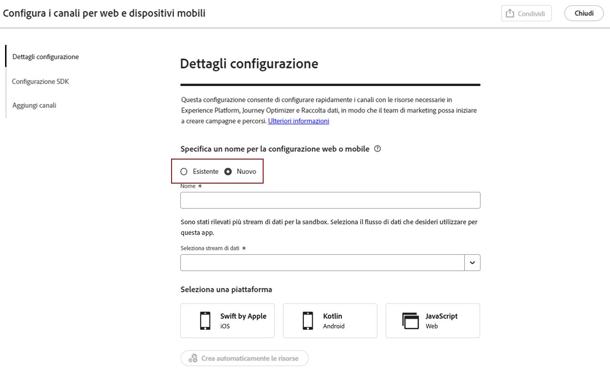
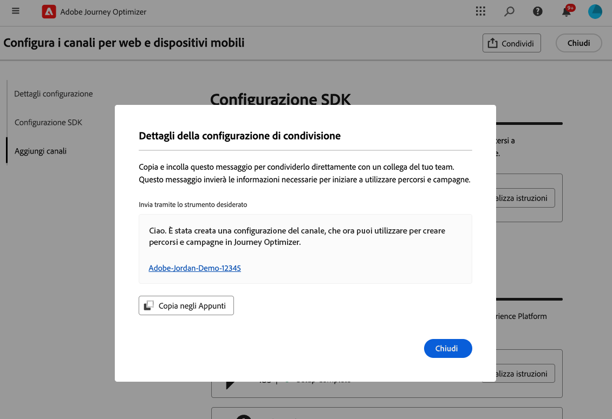

# Configurare la configurazione di Android per dispositivi mobili {#set-mobile-android}

>[!IMPORTANT]
>
>Per garantire compatibilità e prestazioni ottimali, assicurati di utilizzare le seguenti versioni SDK:
>
> * Core 3.1.0 o versione successiva
> * Messaggistica 3.1.0 o successiva

Questa configurazione di Android semplifica la configurazione rapida dei canali di marketing, garantendo che tutte le risorse necessarie siano facilmente accessibili all’interno delle app Experience Platform, Journey Optimizer e Data Collection. In questo modo il team marketing può iniziare immediatamente a creare campagne e percorsi.

## Creare una nuova configurazione di Android {#new-setup-android}

1. Dalla home page di Journey Optimizer, fai clic su **[!UICONTROL Inizia]** dalla scheda **[!UICONTROL Configura canali Web e mobili]**.

   

1. Crea una configurazione **[!UICONTROL New]**.

   Se disponi già di configurazioni esistenti, puoi sceglierne una o crearne una nuova.

   

1. Immetti un **[!UICONTROL Nome]** per la nuova configurazione e seleziona o crea il **[!UICONTROL Stream di dati]**. **[!UICONTROL Name]** verrà utilizzato per ogni risorsa creata automaticamente.

1. Se la tua organizzazione dispone di più flussi di dati, selezionane uno dalle opzioni esistenti. Se non disponi di uno stream di dati, ne verrà creato uno automaticamente.

1. Seleziona la piattaforma Android da configurare e fai clic su **[!UICONTROL Creazione automatica risorse]**.

   

1. Per semplificare il processo di configurazione, vengono create automaticamente le risorse necessarie per iniziare. Ciò include la creazione di una nuova **[!UICONTROL proprietà tag mobile]** e l&#39;installazione di estensioni.

   Di seguito è riportato un elenco completo di tutte le risorse generate automaticamente:

+++ Risorse create

   <table>
    <thead>
    <tr>
    <th><strong>Soluzione</strong></th>
    <th><strong>Risorse create automaticamente</strong></th>
    </tr>
    </thead>
    <tbody>
    <tr>
    <td>
    
Journey Optimizer

    </td>
    <td>
    <ul>
    <li>Configurazione canale</li>
    <li>Credenziali push (solo messaggi push per dispositivi mobili)</li>
    </ul>
    </td>
    </tr>
    <tr>
    <td>
    
Tag

    </td>
    <td>
    <ul>
    <li>Mobile Tag, proprietà</li>
    <li>Regole</li>
    <li>Elementi dati</li>
    <li>Libreria</li>
    <li>Ambienti (staging, produzione, sviluppo)</li>
    </ul>
    </td>
    </tr>
    <tr>
    <td>
    
Estensioni tag

    </td>
    <td>
    <ul>
    <li>Edge Network Adobe Experience Platform</li>
    <li>Adobe Journey Optimizer</li>
    <li>AEP Assurance</li>
    <li>Consenso (con i criteri di consenso predefiniti abilitati)</li>
    <li>Identità (con ECID predefinito, con regole di unione predefinite)</li>
    <li>Core mobile</li>
    </ul>
    </td>
    </tr>
    <tr>
    <td>
    
Assurance

    </td>
    <td>
    
Sessione Assurance

    </td>
    </tr>
    <tr>
    <td>
    
Stream di dati

    </td>
    <td>
    
Stream di dati con servizi

    </td>
    </tr>
    <tr>
    <td>
    
Experience Platform

    </td>
    <td>
    <ul>
    <li>Set di dati</li>
    <li>Schema</li>
    </ul>
    </td>
    </tr>
    </tbody>
    </table>

+++

1. Al termine della generazione delle risorse, fai clic su **[!UICONTROL Configura]** per iniziare a configurare l&#39;SDK.

   

1. Devi innanzitutto aggiungere e importare le dipendenze come descritto nell’interfaccia utente. [Ulteriori informazioni](https://experienceleague.adobe.com/en/docs/platform-learn/implement-mobile-sdk/app-implementation/install-sdks).

1. Copia e incolla il codice seguente nel metodo onCreate() dell&#39;applicazione.

1. Per convalidare l&#39;SDK direttamente sull&#39;app mobile, è sufficiente aprire l&#39;app mobile e consentire l&#39;accesso a [Adobe Assurance](https://experienceleague.adobe.com/en/docs/experience-platform/assurance/home). Assurance è uno strumento potente che consente di testare e convalidare in modo approfondito l’implementazione, garantendo il corretto funzionamento di tutto.

   Una volta connesso, il dispositivo verrà automaticamente rilevato ed elencato nel menu a discesa **[!UICONTROL Dispositivo disponibile]**, che consente di monitorare e risolvere i problemi di installazione in tempo reale.

   

1. Fai clic su **[!UICONTROL Connetti]**.

1. Ora puoi configurare i tuoi [canali in-app](#inapp-channel) e/o [push](#push-channel).

1. Al termine della configurazione, condividi la **[!UICONTROL Configurazione canale]** generata automaticamente con i membri del team responsabili della creazione di Percorsi e campagne.

   È necessario fare riferimento alla **[!UICONTROL Configurazione canale]** nell&#39;interfaccia Campagne o Percorsi per consentire una connessione senza soluzione di continuità tra la configurazione e l&#39;esecuzione di percorsi e campagne mirati per il pubblico.

   

## Modificare una configurazione esistente {#reconnect}

Dopo aver creato la configurazione, è possibile rivisitarla in qualsiasi momento per aggiungere altri canali o apportare ulteriori modifiche in base alle proprie esigenze

1. Dalla home page di Journey Optimizer, fai clic su **[!UICONTROL Inizia]** dalla scheda **[!UICONTROL Configura canali Web e mobili]**.

   

1. Seleziona **[!UICONTROL Esistente]** e scegli la tua **[!UICONTROL proprietà tag]** esistente dal menu a discesa.

   

1. Quando accedi alla configurazione esistente, devi riconnetterti con Adobe Assurance. Dal menu di configurazione dell&#39;SDK, fare clic su **[!UICONTROL Riconnetti]**.

1. Seleziona il tuo dispositivo dal menu a discesa **[!UICONTROL Dispositivi disponibili]** e fai clic su **[!UICONTROL Connetti]**.

1. Ora puoi aggiornare la configurazione in base alle esigenze.

## Configurare il canale in-app {#inapp-channel}

<!--
>[!CONTEXTUALHELP]
>id="ajo_mobile_web_setup_inapp_tag_property"
>title="Choose your tag property"
>abstract="TBC"
-->

Il canale in-app non richiede alcuna configurazione aggiuntiva. Per verificare che la configurazione sia accurata, puoi inviare facilmente un messaggio di test utilizzando la funzione Assurance. In questo modo verrà fornito un feedback immediato sulla disponibilità del sistema a distribuire messaggi in-app in modo efficace.

A tale scopo, fare clic su **[!UICONTROL Visualizza messaggio in-app]**.

Per semplificare il processo di configurazione, vengono create automaticamente le risorse necessarie per iniziare. Ciò include la creazione di una configurazione del canale.

Ora puoi inviare messaggi in-app utilizzando la **[!UICONTROL Configurazione canale]** configurata in precedenza. [Scopri come creare messaggi in-app](../in-app/create-in-app.md)

## Configurare il canale push {#push-channel}

>[!CONTEXTUALHELP]
>id="ajo_mobile_web_setup_push_token"
>title="Recuperare il token del dispositivo"
>abstract="Per garantire la corretta sincronizzazione del token push del dispositivo con il profilo Adobe Experience Platform, è necessario incorporare il seguente codice nell’applicazione. Questa integrazione è essenziale per mantenere capacità di comunicazione aggiornate e garantire un&#39;esperienza utente fluida."

>[!CONTEXTUALHELP]
>id="ajo_mobile_web_setup_push_xcode"
>title="Avviare l’applicazione da Xcode."
>abstract="Per ottenere il token push, avvia innanzitutto l’applicazione utilizzando Xcode. Dopo l&#39;avvio dell&#39;applicazione, riavviarla per assicurarsi che il processo di convalida sia stato completato. Adobe fornirà quindi il token push come parte dei risultati della convalida. Questo token è essenziale per abilitare le notifiche push e verrà visualizzato una volta convalidata correttamente la configurazione."

>[!CONTEXTUALHELP]
>id="ajo_mobile_web_push_certificate_fcm"
>title="Fornire un certificato push"
>abstract="Trascina e rilascia il file della chiave privata .json. Questo file contiene le informazioni di autenticazione necessarie per l&#39;integrazione sicura e la comunicazione tra l&#39;applicazione e il server."

1. Una volta configurato l&#39;SDK di Mobile, fai clic su **[!UICONTROL Aggiungi]** dalla scheda di notifica push.

1. Recuperare il token dispositivo inserendo il codice fornito nella funzione di callback `FireBaseMessaging.getInstance.getToken ()` nell&#39;interfaccia utente.

1. Registra il servizio di messaggistica aggiungendo il codice fornito nell&#39;interfaccia utente al file `AndroidManifest.xml`.

1. Trascina e rilascia il file della chiave privata .json.

1. Per verificare che la configurazione sia accurata, puoi inviare facilmente un messaggio di test utilizzando la funzione Assurance. Questo fornirà un feedback immediato sulla preparazione del sistema per distribuire le notifiche push in modo efficace.

   A tale scopo, fare clic su **[!UICONTROL Invia messaggio push]**.

Per semplificare il processo di configurazione, vengono create automaticamente le risorse necessarie per iniziare. Ciò include la creazione di una **[!UICONTROL Configurazione canale]** e di **[!UICONTROL Credenziali push]**.

Ora puoi inviare notifiche push utilizzando la **[!UICONTROL Configurazione canale]** configurata in precedenza. [Scopri come creare una notifica push](../push/create-push.md)
