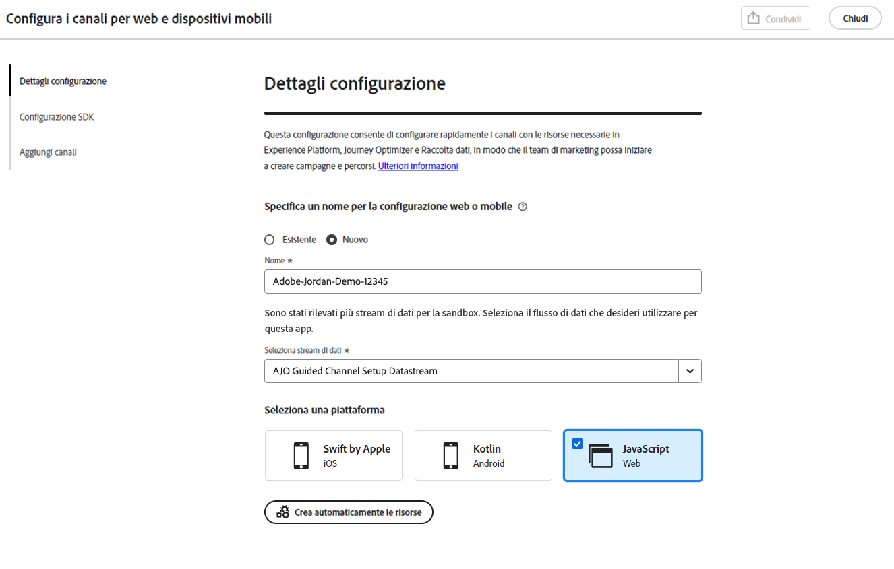
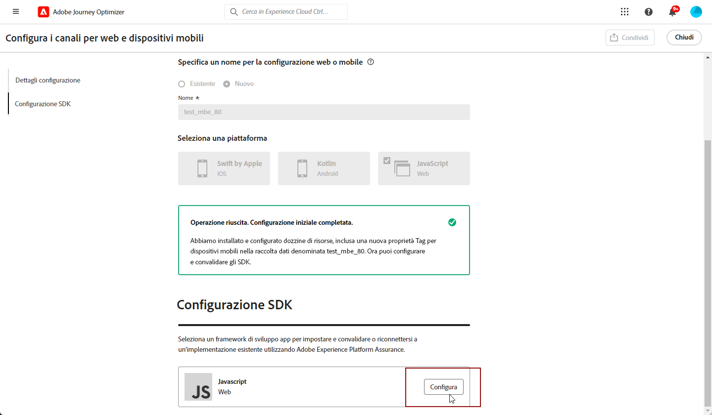
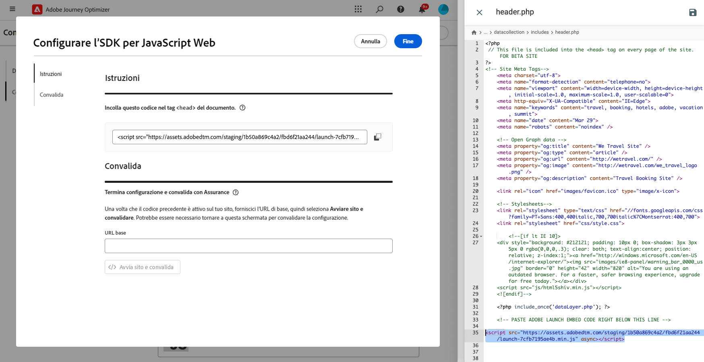
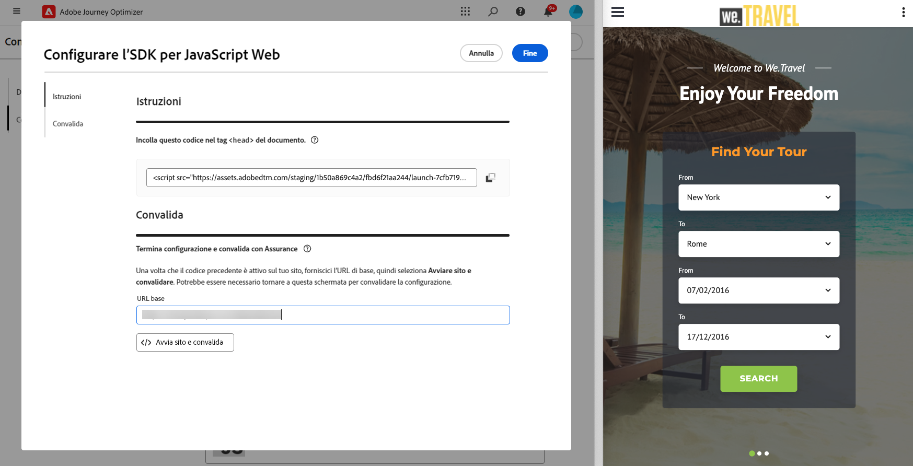
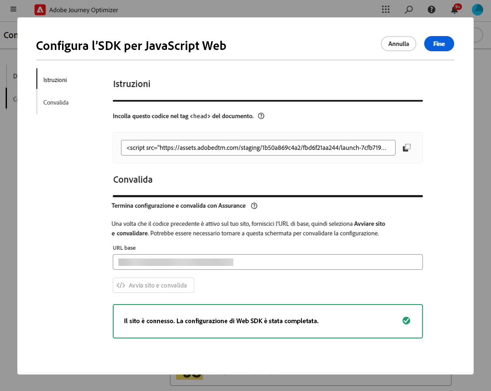
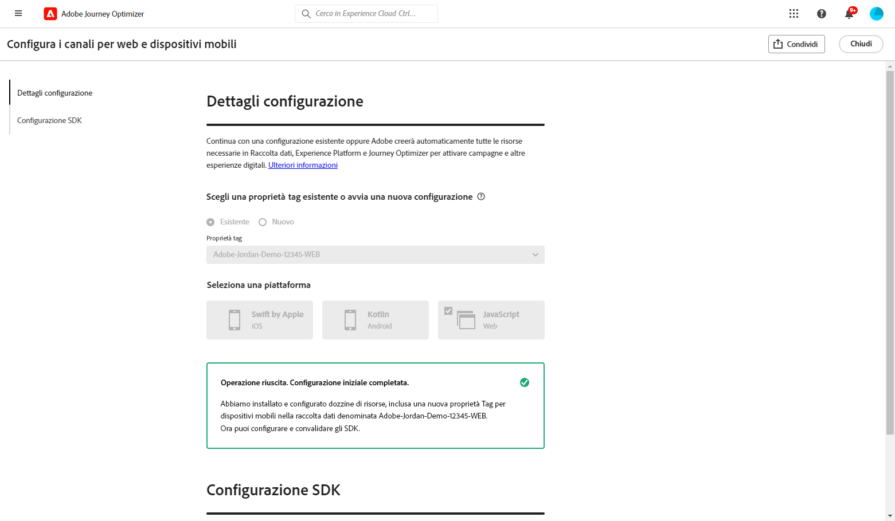

# Configurare la configurazione web {#set-mobile-web}

>[!CONTEXTUALHELP]
>id="ajo_mobile_web_setup_javascript_code"
>title="Codice JavaScript"
>abstract="DA CONFERMARE"

>[!CONTEXTUALHELP]
>id="ajo_mobile_web_setup_javascript_site"
>title="Avviare il sito e convalidare"
>abstract="DA CONFERMARE"

Questa configurazione facilita la configurazione rapida dei canali di marketing, garantendo che tutte le risorse richieste siano prontamente disponibili in Experience Platform, Journey Optimizer e Data Collection. Questo consente al team marketing di iniziare immediatamente con la creazione di campagne e percorsi.

## Crea una nuova configurazione Web {#new-setup}

1. Dalla home page di Journey Optimizer, fai clic su **[!UICONTROL Inizia]** dalla scheda **[!UICONTROL Configura canali Web e mobili]**.

   

1. Crea una configurazione **[!UICONTROL New]**.

   Se disponi già di configurazioni esistenti, puoi sceglierne una o crearne una nuova.

   

1. Immetti un **[!UICONTROL Nome]** per la nuova configurazione e seleziona o crea il **[!UICONTROL Stream di dati]**. **[!UICONTROL Name]** verrà utilizzato per ogni risorsa creata automaticamente.

1. Se la tua organizzazione dispone di più flussi di dati, selezionane uno dalle opzioni esistenti. Se non disponi di uno stream di dati, ne verrà creato uno automaticamente.

1. Selezionare la piattaforma Web e fare clic su **[!UICONTROL Creazione automatica risorse]**.

   

1. Per semplificare il processo di configurazione, vengono create automaticamente le risorse necessarie per iniziare.

   Di seguito è riportato un elenco completo di tutte le risorse generate automaticamente:

+++ Risorse create

   <table>
    <thead>
    <tr>
    <th><strong>Soluzione</strong></th>
    <th><strong>Risorse create automaticamente</strong></th>
    </tr>
    </thead>
    <tbody>
    <tr>
    </tr>
    <tr>
    <td>
    
Tag

    </td>
    <td>
    <ul>
    <li>Mobile Tag, proprietà</li>
    <li>Regole</li>
    <li>Elementi dati</li>
    <li>Libreria</li>
    <li>Ambienti (staging, produzione, sviluppo)</li>
    </ul>
    </td>
    </tr>
    <tr>
    <td>
    
Estensioni tag

    </td>
    <td>
    <ul>
    <li>Edge Network Adobe Experience Platform</li>
    <li>Adobe Journey Optimizer</li>
    <li>AEP Assurance</li>
    <li>Consenso (con i criteri di consenso predefiniti abilitati)</li>
    <li>Identità (con ECID predefinito, con regole di unione predefinite)</li>
    <li>Core mobile</li>
    </ul>
    </td>
    </tr>
    <tr>
    <td>
    
Assurance

    </td>
    <td>
    
Sessione Assurance

    </td>
    </tr>
    <tr>
    <td>
    
Stream di dati

    </td>
    <td>
    
Stream di dati con servizi

    </td>
    </tr>
    <tr>
    <td>
    
Experience Platform

    </td>
    <td>
    <ul>
    <li>Set di dati</li>
    <li>Schema</li>
    </ul>
    </td>
    </tr>
    </tbody>
    </table>

+++

1. Al termine della generazione delle risorse, fai clic su **[!UICONTROL Configura]** per iniziare a configurare l&#39;SDK.

   

1. Incollare il codice visualizzato sullo schermo nel tag `<head>` del documento.

   {zoomable="yes"}

1. Per convalidare l’SDK direttamente sull’app mobile, è sufficiente incollare l’URL di base.

   {zoomable="yes"}

1. Seleziona **[!UICONTROL Avvia sito e convalida]** per connettere il sito.

   {zoomable="yes"}

1. Dopo aver completato la configurazione, condividi la **[!UICONTROL proprietà Web mobile generata automaticamente]** con i membri del team responsabili della creazione di Percorsi e campagne.

   È necessario fare riferimento alla **[!UICONTROL proprietà Web mobile]** nell&#39;interfaccia Campagne o Percorsi per consentire una connessione senza soluzione di continuità tra la configurazione e l&#39;esecuzione di percorsi e campagne mirati per il pubblico.

   

È ora possibile creare pagine Web utilizzando la **[!UICONTROL Proprietà Web mobile]** configurata in precedenza. [Scopri come creare la pagina Web](../web/create-web.md)

## Modificare una configurazione esistente {#reconnect}

Dopo aver creato la configurazione, è possibile rivisitarla in qualsiasi momento per aggiungere altri canali o apportare ulteriori modifiche in base alle proprie esigenze

1. Dalla home page di Journey Optimizer, fai clic su **[!UICONTROL Inizia]** dalla scheda **[!UICONTROL Configura canali Web e mobili]**.

   

1. Seleziona **[!UICONTROL Esistente]** e scegli la tua **[!UICONTROL proprietà tag]** esistente dal menu a discesa.

   

1. Ora puoi aggiornare la configurazione in base alle esigenze.
