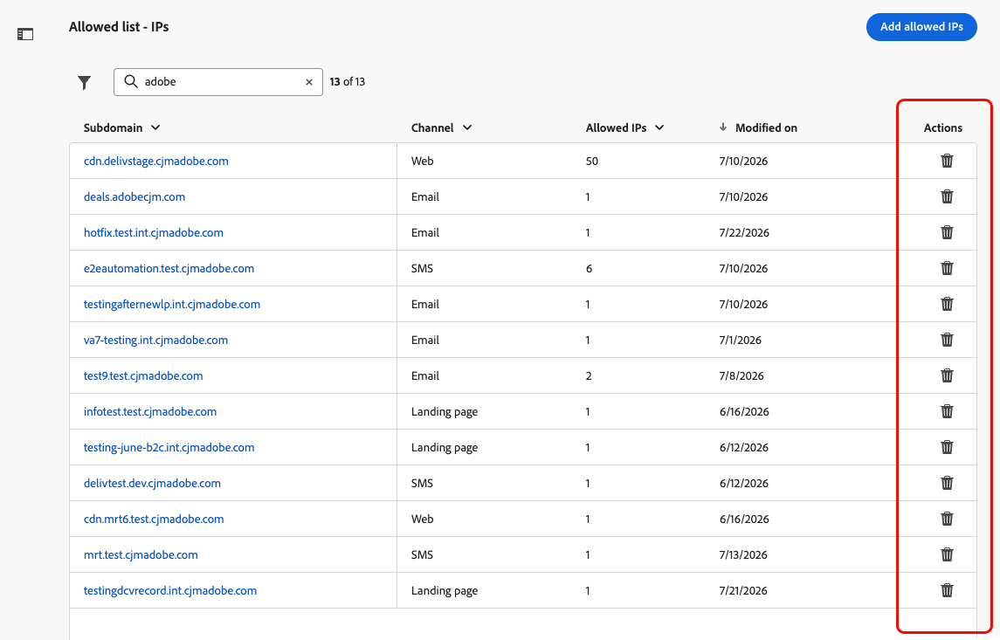

# Gestire gli IP consentiti {#waf-ip-allowlist}

>[!BEGINSHADEBOX]

**In questa pagina:** Aggiungi e gestisci gli IP in uscita del Firewall applicazione Web (WAF) per sottodominio delegato direttamente in [!DNL Journey Optimizer], in modo che solo il traffico instradato attraverso il firewall possa raggiungere i collegamenti ospitati da [!DNL Journey Optimizer].

>[!ENDSHADEBOX]

Le organizzazioni con requisiti di sicurezza di rete rigidi, ad esempio quelle del settore finanziario, possono richiedere che tutte le richieste ai collegamenti ospitati da [!DNL Adobe Journey Optimizer] debbano passare attraverso un **Firewall applicazione Web** (WAF) gestito dal cliente prima di raggiungere la rete Adobe. Qualsiasi richiesta che bypassi il firewall deve essere rifiutata.

[!DNL Journey Optimizer] consente agli amministratori di configurare, per sottodominio delegato, gli IP pubblici in uscita del proprio WAF. Una volta impostato, solo il traffico proveniente da tali IP può raggiungere il sottodominio corrispondente. Tutte le altre richieste in entrata, comprese quelle dirette che ignorano il firewall, vengono rifiutate.

## Come funziona {#waf-ip-allowlist-how-it-works}

L’abilitazione del routing solo WAF per un sottodominio richiede due passaggi come descritto di seguito.

1. **Nuovo puntamento DNS**: i record DNS del sottodominio devono essere aggiornati per instradare il traffico al WAF dell&#39;organizzazione anziché direttamente al server Edge di rete di Adobe.
1. **Dichiarazione IP in uscita WAF**: l&#39;organizzazione fornisce gli IP in uscita pubblici del WAF in [!DNL Journey Optimizer]. Si tratta degli IP da cui il firewall invia le richieste ad Adobe.

Una volta che entrambi sono in posizione, il flusso di traffico funziona come segue:

1. Un destinatario fa clic su un collegamento in una comunicazione [!DNL Adobe Journey Optimizer].
1. La richiesta raggiunge il WAF della tua organizzazione, che lo esamina e lo filtra in base ai criteri di sicurezza.
1. WAF inoltra la richiesta al server Edge di rete di Adobe da uno degli IP in uscita dichiarati.
1. [!DNL Journey Optimizer] controlla l&#39;IP di origine della richiesta in ingresso rispetto all&#39;elenco Consentiti del sottodominio.
   - **Corrispondenze IP** → la richiesta è stata elaborata normalmente tramite il → WAF.
   - **L&#39;IP non corrisponde** → la richiesta ha ignorato il → di WAF **rifiutato con errore 403 Forbidden**. Il destinatario visualizza un collegamento interrotto.

Le richieste di sottodomini senza IP consentiti configurati non vengono influenzate e continuano a funzionare come prima.

## Guardrail e vincoli {#waf-ip-allowlist-guardrails}

| Controllo | Dettaglio |
| --- | --- |
| **Formato IP** | Intervalli IPv4, IPv6 e CIDR accettati. I valori non validi vengono rifiutati in linea prima del salvataggio. |
| **Prevenzione duplicata** | Nessun IP duplicato nello stesso sottodominio. Lo stesso IP può essere utilizzato in diversi sottodomini. |
| **Avviso intervallo riservato** | Viene visualizzato un avviso non di blocco quando si inseriscono intervalli privati/riservati (gli IP in uscita da WAF sono normalmente pubblici). |
| **Solo sottodomini delegati** | È possibile selezionare solo i sottodomini delegati e verificati. |
| **Limite per sottodominio** | Massimo **50 voci IP** per sottodominio. |
| **Protezione di blocco** | Tipo per confermare la rimozione completa; avvisi espliciti ogni volta che un’azione riapre un sottodominio a tutto il traffico. |

>[!CAUTION]
>
>Una configurazione errata interrompe immediatamente tutti i collegamenti sul sottodominio interessato.

Se gli IP in uscita di WAF non corretti vengono salvati, [!DNL Journey Optimizer] rifiuterà ogni richiesta in ingresso per quel sottodominio, inclusi quelli legittimi di destinatari reali che fanno clic sui collegamenti nelle comunicazioni e che riceveranno una pagina di errore 403.

Prima di salvare, conferma sempre gli IP in uscita esatti con il team di sicurezza e, se possibile, testa prima un sottodominio non di produzione.

## Accedere e gestire gli IP consentiti {#waf-ip-allowlist-access}

>[!NOTE]
>
>Per accedere e gestire l&#39;elenco Consentiti IP, è necessario disporre dell&#39;autorizzazione **[!UICONTROL Visualizza IP consentiti]** e **[!UICONTROL Gestisci IP consentiti]**. [Ulteriori informazioni](../administration/ootb-permissions.md)

Per accedere all&#39;elenco dei sottodomini per i quali sono stati consentiti gli IP per il firewall dell&#39;applicazione Web, passare a **[!UICONTROL Amministrazione]** > **[!UICONTROL Canali]** > **[!UICONTROL Impostazioni generali]** e selezionare **[!UICONTROL Elenco Consentiti - IP]**.

La pagina di inventario elenca tutti i sottodomini con almeno un IP WAF consentito, per tutti i tipi di canale (e-mail, pagina di destinazione, SMS, web). Ulteriori informazioni sui sottodomini in [questa sezione](about-subdomain-delegation.md).

L’elenco mostra il numero di IP consentiti per sottodominio e l’autore dell’ultima modifica.

Puoi filtrare l’inventario per tipo di canale e cercare per nome di sottodominio.

## Aggiungere IP all’elenco Consentiti {#waf-ip-allowlist-add}

>[!CONTEXTUALHELP]
>id="ajo_waf_allowed_ips"
>title="Immetti gli IP consentiti da WAF per il sottodominio selezionato"
>abstract="Seleziona un sottodominio delegato e immetti gli IP in uscita pubblici del firewall dell’applicazione web. Una volta salvato, [!DNL Journey Optimizer] rifiuterà qualsiasi richiesta in entrata a tale sottodominio che non provenga da uno degli IP dichiarati. Prima di salvare, conferma sempre gli IP in uscita esatti con il tuo team di sicurezza."

Per aggiungere gli IP del firewall dell&#39;applicazione Web all&#39;elenco Consentiti per un determinato sottodominio, eseguire la procedura seguente.

1. Dall&#39;inventario **[!UICONTROL Elenco Consentiti - IP]**, fare clic sul pulsante **[!UICONTROL Aggiungi IP consentiti]**.

1. Selezionare il sottodominio di destinazione dall&#39;elenco a discesa **[!UICONTROL Sottodominio]**. Sono elencati solo [sottodomini delegati](delegate-subdomain.md), per tutti i tipi di canale supportati: e-mail, pagina di destinazione, SMS e Web.

1. Nel campo **[!UICONTROL Indirizzo IP]**, immetti gli IP pubblici in uscita del tuo WAF. Gli intervalli IPv4, IPv6 e CIDR sono supportati (ad esempio, `203.0.113.42`, `2001:db8::1`, `203.0.113.0/24`).

   Ogni voce non duplicata valida viene convalidata in linea prima di essere aggiunta. È possibile aggiungere fino a **50 voci IP per sottodominio**.

   

   >[!IMPORTANT]
   >
   >Viene visualizzato un avviso quando si inseriscono intervalli IP privati o riservati (RFC 1918, loopback, link-local). Gli IP in uscita da WAF sono normalmente indirizzi pubblici.

1. Se necessario, è possibile rimuovere un IP dall&#39;elenco facendo clic sull&#39;icona **✕** sul relativo chip.

1. Fai clic su **[!UICONTROL Salva]**. L&#39;elenco Consentiti viene applicato e propagato al bordo. Il sottodominio viene visualizzato nell’inventario e i relativi IP vengono applicati immediatamente.

Ora tutte le richieste a questo sottodominio da qualsiasi IP non presente in questo elenco verranno rifiutate.

>[!CAUTION]
>
>Assicurati di aver confermato questi IP con il tuo team di sicurezza: valori errati interromperanno tutti i collegamenti in questo sottodominio.

## Modifica IP consentiti {#waf-ip-allowlist-edit}

Per aggiornare gli IP consentiti per un sottodominio esistente, fai clic sul nome del sottodominio nell’inventario.

Il campo **Sottodominio** è di sola lettura <!--as well as the Channel field--> e non può essere modificato dopo la creazione.

Aggiungere nuovi IP utilizzando il campo di input oppure rimuovere gli IP esistenti facendo clic sull&#39;icona **✕** su ciascun chip.

>[!IMPORTANT]
>
>La rimozione dell’ultimo IP da un sottodominio lo riapre a tutto il traffico in entrata.

## Rimuovi IP consentiti {#waf-ip-allowlist-remove}

Per rimuovere tutti gli IP dall’elenco Consentiti di un sottodominio, utilizza l’icona Elimina nella colonna Azioni dell’inventario. Questo elimina completamente la restrizione WAF per quel sottodominio.

Viene visualizzata una finestra a comparsa di conferma. Digitare il nome esatto del sottodominio da confermare, quindi fare clic su **[!UICONTROL Rimuovi]**.

{width="80%"}

>[!WARNING]
>
>Al momento della conferma, questa azione rimuove tutti gli IP di elenco Consentiti per il sottodominio immesso. Il traffico in entrata verrà nuovamente accettato da qualsiasi origine, incluse le richieste che ignorano il firewall dell’applicazione Web. Questa operazione non può essere annullata. Per ripristinare la restrizione, è necessario reinserire gli IP.

Dopo aver rimosso tutti gli IP, il sottodominio non viene più visualizzato nell’inventario. Puoi riconfigurarlo in qualsiasi momento aggiungendo nuovamente IP per questo sottodominio.
