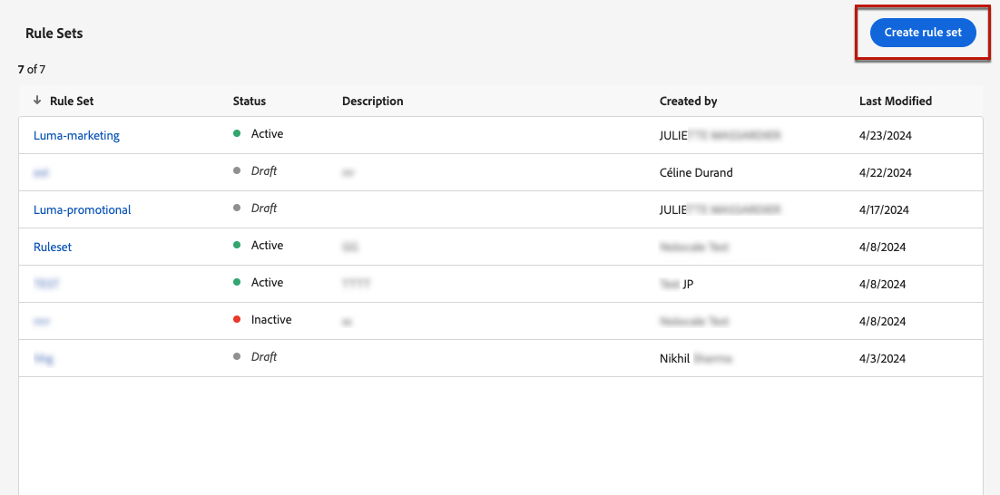

# Quota limite per tipo di comunicazione e canale {#rule-sets}

I set di regole **Canale** applicano regole di limitazione ai canali di comunicazione. Ad esempio, non inviare più di 1 comunicazione e-mail o SMS al giorno.

L’utilizzo dei set di regole di canale consente di impostare i limiti di frequenza per tipo di comunicazione per evitare di sovraccaricare i clienti con messaggi simili. Ad esempio, puoi creare un set di regole per limitare il numero di **comunicazioni promozionali** inviate ai clienti e un altro set di regole per limitare il numero di **newsletter** inviate. A seconda del tipo di campagna che si sta creando, è possibile scegliere di applicare la comunicazione promozionale o il set di regole newsletter.

>[!IMPORTANT]
>
>Per garantire il corretto funzionamento della limitazione a livello di canale, assicurati di scegliere lo spazio dei nomi con priorità più elevata durante la creazione di una campagna o di un percorso. Ulteriori informazioni sulla priorità dello spazio dei nomi sono disponibili nella [guida di Platform Identity Service](https://experienceleague.adobe.com/it/docs/experience-platform/identity/features/identity-graph-linking-rules/namespace-priority){target="_blank"}

## Creare una regola di limitazione del canale

>[!CONTEXTUALHELP]
>id="ajo_rule_sets_channel"
>title="Definire i canali a cui si applica la regola"
>abstract="Seleziona almeno un canale. Le funzioni di limitazione vengono applicate a tutti i canali come conteggio totale."

Per creare un set di regole del canale, effettua le seguenti operazioni:

>[!NOTE]
>
>Puoi creare fino a 10 set di regole locali attivi per ciascun dominio di canale e per il dominio di percorso.

1. Accedi all&#39;elenco **[!UICONTROL Set di regole]**, quindi fai clic su **[!UICONTROL Crea set di regole]**.

   

1. Selezionare il set di regole in cui si desidera aggiungere la regola di limite o creare un nuovo set di regole:

   * Per utilizzare un set di regole esistente, selezionarlo dall&#39;elenco. Le regole di limitazione dei canali possono essere aggiunte solo ai set di regole con il dominio &quot;channel&quot;. Puoi controllare queste informazioni negli elenchi dei set di regole, nella colonna **[!UICONTROL Dominio]**.

     

   * Per creare la regola di limitazione in un nuovo set di regole, fai clic su **[!UICONTROL Crea set di regole]**, specifica un nome univoco per il set di regole e seleziona &quot;Canale&quot; dal menu a discesa **[!UICONTROL Dominio set di regole]**, quindi fai clic su **[!UICONTROL Salva]**.

     

1. Nella schermata del set di regole, fai clic sul pulsante **[!UICONTROL Aggiungi regola]** e definisci un nome univoco per la regola.

1. Il campo **Categoria** specifica la categoria del messaggio a cui si applica la regola. Per il momento, questo campo è di sola lettura perché è disponibile solo la categoria **[!UICONTROL Marketing]**.

   

1. Nel campo **[!UICONTROL Conteggio limite]**, imposta il limite per la regola, ovvero il numero massimo di messaggi che possono essere inviati a un singolo profilo utente ogni mese, settimana, giorno o ora, in base alla selezione effettuata nei campi seguenti.

1. Dall&#39;elenco a discesa **[!UICONTROL Reimposta frequenza limite]**, selezionare se si desidera applicare il limite su base oraria, giornaliera, settimanale o mensile. La quota limite si basa sul periodo di calendario selezionato. Viene reimpostato all’inizio dell’arco temporale corrispondente.

   La scadenza del contatore per ciascun periodo è la seguente:

   * **[!UICONTROL Ora]** - Il limite di frequenza è valido per il numero di ore selezionato. Il contatore viene reimpostato automaticamente all&#39;inizio di ogni finestra temporale. Per un limite di frequenza di 1 ora, viene ripristinato ogni ora, in coincidenza con la fine di un’ora UTC.
   * **[!UICONTROL Giornaliero]** - Il limite di frequenza giornaliero è valido per il giorno fino alle 23:59:59 UTC e viene reimpostato su 0 all&#39;inizio del giorno successivo.
   * **[!UICONTROL Settimanale]** - Il limite di frequenza è valido fino a sabato 23:59:59 UTC di quella settimana. La data di scadenza si applica indipendentemente da quando è stata creata la regola. Ad esempio, se la regola viene creata il giovedì, è valida fino a sabato alle 23:59:59.
   * **[!UICONTROL Mensile]** - Il limite di frequenza è valido fino all&#39;ultimo giorno del mese alle 23:59:59 UTC. Ad esempio, la scadenza mensile di gennaio è il 31/01 alle 23:59:59 UTC.

   >[!IMPORTANT]
   >
   >* Per garantire precisione, assicurati di scegliere lo spazio dei nomi con priorità più elevata durante la creazione di una campagna o di un percorso. Ulteriori informazioni sulla priorità dello spazio dei nomi sono disponibili nella [guida di Platform Identity Service](https://experienceleague.adobe.com/it/docs/experience-platform/identity/features/identity-graph-linking-rules/namespace-priority){target="_blank"} 
   >
   >* Il valore del contatore dei profili viene aggiornato una volta consegnata la comunicazione. Tieni presente questo aspetto quando invii grandi volumi di comunicazioni, in quanto la velocità effettiva potrebbe far sì che il destinatario riceva l’e-mail pochi minuti o anche alcune ore dopo l’inizio della comunicazione (nel caso in cui invii milioni di comunicazioni simultaneamente). Ciò è importante nel caso in cui un destinatario riceva due comunicazioni in stretta collaborazione. Si consiglia di distanziare le comunicazioni di almeno due ore, se possibile, per dare al destinatario il tempo sufficiente per ricevere la comunicazione e aggiornare di conseguenza il valore del contatore.

1. Il campo **[!UICONTROL Ogni]** consente di ripetere le regole di limitazione della frequenza in più ore, giorni, settimane o mesi, a seconda della durata specificata. Esempio: applica la regola del limite di frequenza per 2 settimane.

   Assicurati di immettere un valore che corrisponda al tipo di durata selezionato: 1-23 per Ogni ora, 1-30 per Ogni giorno, 1-4 per Ogni settimana e 1-3 per Ogni mese.

   Il contatore viene reimpostato automaticamente su 0 quando inizia una nuova finestra temporale. Per un limite di frequenza di 2 giorni, questo si reimposta ogni due giorni alla mezzanotte UTC.

1. Seleziona il canale da utilizzare per questa regola: **[!UICONTROL E-mail]**, **[!UICONTROL SMS]**, **[!UICONTROL Notifica push]** o **[!UICONTROL Direct mail]**.

1. Se desideri applicare il limite come conteggio totale su tutti i canali selezionati, seleziona diversi canali.

   Ad esempio, imposta il limite su 5 e seleziona sia il canale e-mail che quello sms. Se un profilo ha già ricevuto 3 e-mail di marketing e 2 sms di marketing per il periodo selezionato, verrà escluso dalla consegna successiva di eventuali e-mail di marketing o sms.

1. Fai clic su **[!UICONTROL Salva]** per confermare la creazione della regola. Il messaggio viene aggiunto al set di regole con lo stato **[!UICONTROL Bozza]**.

   

1. Ripeti i passaggi precedenti per aggiungere al set di regole tutte le regole necessarie.

1. Quando la regola di limite è pronta per essere applicata ai messaggi, attiva il set di regole e la regola in cui è stata aggiunta. [Scopri come attivare i set di regole](../conflict-prioritization/rule-sets.md#Create)

## Applicare i set di regole a un messaggio {#apply-frequency-rule}

Per applicare un set di regole a un messaggio, effettua le seguenti operazioni:

1. Durante la creazione di un messaggio di percorso o di campagna, seleziona uno dei canali definiti per il set di regole e modifica il contenuto del messaggio

1. Nella schermata dell&#39;edizione del contenuto, fare clic sul pulsante **[!UICONTROL Aggiungi regola business]**.

1. Seleziona il set di regole creato.

   

   >[!NOTE]
   >
   >Nell&#39;elenco vengono visualizzati solo i set di regole [attivati](#activate-rule).

   <!--Messages where the category selected is **[!UICONTROL Transactional]** will not be evaluated against business rules.-->

1. Prima di attivare il percorso o la campagna, assicurati di pianificarne l’esecuzione per almeno 10 minuti nel futuro.

   In questo modo sarà possibile popolare i valori dei contatori nel profilo per la regola business selezionata. Se attivi immediatamente la campagna, i valori dei contatori del set di regole non verranno inseriti nei profili dei destinatari e il messaggio non verrà conteggiato per le regole del limite di frequenza per i set di regole personalizzati. Inoltre, il limite potrebbe non funzionare correttamente per percorsi e campagne attivati immediatamente e per campagne attivate tramite API.

   

1. Puoi visualizzare il numero di profili esclusi dalla consegna nel [rapporto Customer Journey Analytics](../reports/report-gs-cja.md) e nel [rapporto live](../reports/live-report.md), dove le regole di frequenza verranno elencate come possibile motivo per gli utenti esclusi dalla consegna.

>[!NOTE]
>
>Puoi applicare diverse regole allo stesso canale, ma una volta raggiunto il limite inferiore, il profilo verrà escluso dalle consegne successive.

Durante il test delle regole di frequenza, si consiglia di utilizzare un [profilo di test](../audience/creating-test-profiles.md) appena creato, perché una volta raggiunto il limite di frequenza di un profilo, non è possibile reimpostare il contatore fino al periodo successivo. La disattivazione di una regola consente ai profili con limiti di ricevere messaggi, ma non rimuove o elimina eventuali incrementi del contatore.

>[!CAUTION]
>
>Le regole di limite di frequenza si applicano anche quando si inviano [bozze](../content-management/proofs.md). Se un profilo di test ha già raggiunto il limite di frequenza, le bozze verranno visualizzate come completate, ma non verrà consegnata alcuna e-mail.

<!--add a new section for default priority namespace.-->

<!--
## Example: combine several rules {#frequency-rule-example}

You can combine several message frequency rules, such as described in the example below.

1. [Create a rule](#create-new-rule) called *Overall Marketing Capping*:

   * Select all channels.
   * Set capping to 12 monthly.

   

1. To further restrict the number of marketing-based push notifications that a user is sent, create a second rule called *Push Marketing Cap*:

   * Select Push channel.
   * Set capping to 4 monthly.

   

1. Save and [activate](#activate-rule) the rule.

1. [Create a message](../building-journeys/journeys-message.md) for every channel you want to communicate through and select the **[!UICONTROL Marketing]** category for each message. [Learn how to apply a frequency rule](#apply-frequency-rule)

   

In this scenario, an individual profile:
* can receive up to 12 marketing messages per month;
* but will be excluded from marketing push notifications after they have received 4 push notifications.-->

## Video dimostrativo {#video}

>[!VIDEO](https://video.tv.adobe.com/v/3444734?captions=ita&quality=12)
