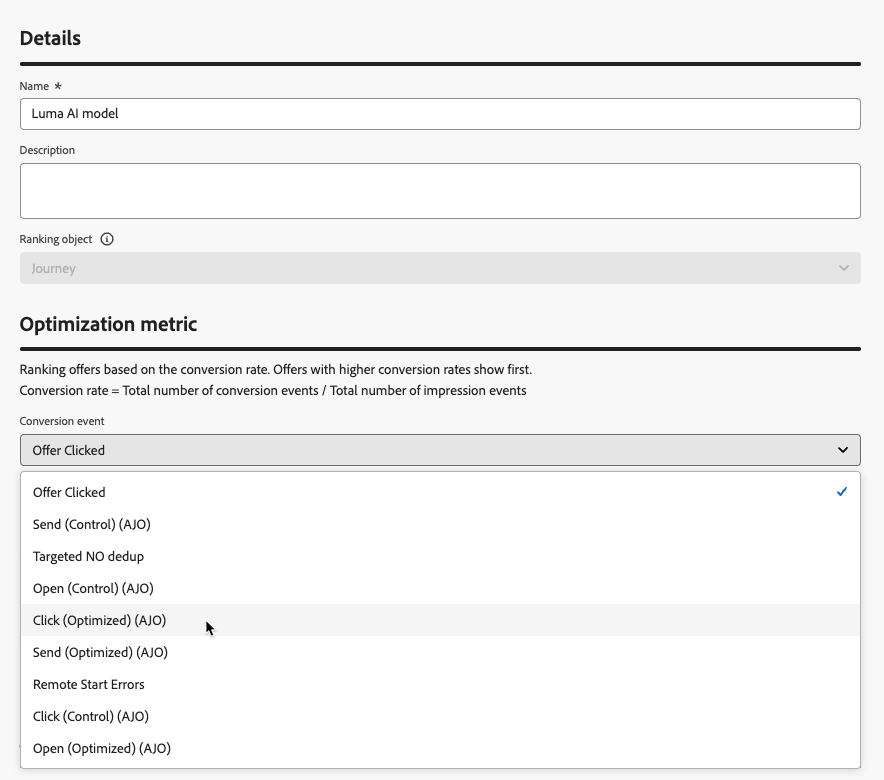

# Utilizzare i modelli AI per classificare i percorsi {#journey-ai-models}

>[!AVAILABILITY]
>
>Questa funzione è attualmente disponibile in modo limitato. Per ottenere l’accesso, contatta il rappresentante Adobe.

[!DNL Adobe Journey Optimizer] consente di controllare i percorsi che un profilo può inserire quando sono idonei per un numero maggiore di quello consentito dal sistema. A tale scopo, è possibile utilizzare [set di regole](rule-sets.md) per definire i limiti per l&#39;immissione o la concorrenza nel percorso. Quando un profilo è idoneo per un numero di percorsi superiore a quello consentito dal limite, la priorità assegnata a ciascun percorso determina quali percorsi sono selezionati.

Anziché utilizzare la priorità, è inoltre possibile utilizzare **modelli AI** nelle formule di classificazione per classificare dinamicamente i percorsi in base ai punteggi dei modelli addestrati.

## Creare un modello IA {#create-ai-model}

<!--
Do you need specific permissions to create AI models?
>[!CAUTION]
>
>To create, edit, or delete AI models, you must have the **Manage Ranking Strategies** permission. [Learn more](../administration/high-low-permissions.md#manage-ranking-strategies)
-->

Per creare un modello di intelligenza artificiale per la classificazione del percorso, segui i passaggi indicati di seguito.

1. Crea un set di dati in cui verranno raccolti gli eventi di conversione. [Scopri come](../experience-decisioning/data-collection/create-dataset.md)

1. Accedi alla sezione **[!UICONTROL Classificazione orchestrazione]**, quindi seleziona la scheda **[!UICONTROL Modelli AI]**. Viene visualizzato l’elenco dei modelli AI creati in precedenza.

1. Fare clic su **[!UICONTROL Crea modello di IA]**.

1. Specifica un nome univoco e, se necessario, una descrizione per il modello di IA.

   {width="85%"}

   >[!NOTE]
   >
   >L’oggetto di classificazione è l’entità a cui verrà applicata la formula di classificazione. Per impostazione predefinita, l&#39;oggetto di classificazione è impostato su **[!UICONTROL Percorso]**.

<!--
1. Select the type of AI model you want to create:

    * **[!UICONTROL Auto-optimization]** optimizes based on past performance. [Learn more](../experience-decisioning/ranking/auto-optimization-model.md)
    * **[!UICONTROL Personalized optimization]** optimizes and personalizes based on audiences and performance. [Learn more](../experience-decisioning/ranking/personalized-optimization-model.md)
-->

1. Nella sezione **[!UICONTROL Metrica di ottimizzazione]**, tutte le metriche della [!DNL Customer Journey Analytics] [visualizzazione dati](https://experienceleague.adobe.com/en/docs/analytics-platform/using/cja-dataviews/data-views){target="_blank"} predefinita vengono visualizzate nell&#39;elenco. Seleziona la metrica su cui desideri ottimizzare il modello.

   {width="70%"}

   [!DNL Journey Optimizer] classifica in base al **tasso di conversione** (tasso di conversione = numero totale di eventi di conversione / numero totale di eventi di impression). Il tasso di conversione è calcolato utilizzando:

   * **Eventi di impression** (elementi visualizzati)
   * **Eventi di conversione** (elementi che determinano clic o conversioni)

   Questi eventi vengono acquisiti automaticamente tramite Web SDK o Mobile SDK. Ulteriori informazioni sono disponibili nella panoramica di [Adobe Experience Platform Web SDK](https://experienceleague.adobe.com/docs/experience-platform/edge/home.html?lang=it).

1. Seleziona i set di dati in cui vengono raccolti gli eventi di conversione e di impression. Scopri come creare tali set di dati in [questa sezione](../experience-decisioning/data-collection/create-dataset.md).

   {width="85%"}

   >[!CAUTION]
   >
   >Nell&#39;elenco a discesa vengono visualizzati solo i set di dati creati da schemi associati al gruppo di campi **[!UICONTROL Evento esperienza - Interazioni proposta]**. Puoi selezionare fino a 5 set di dati.

1. &#x200B;<!--If you are creating a **[!UICONTROL Personalized optimization]** AI model, -->Seleziona i segmenti da utilizzare per addestrare il modello di intelligenza artificiale.

   >[!NOTE]
   >
   >Puoi selezionare fino a 50 tipi di pubblico.

1. Salva e attiva il modello di intelligenza artificiale.

Il modello di IA è ora disponibile per la selezione quando crei una formula di classificazione.

## Fare riferimento al modello di IA in una formula per classificare i percorsi {#reference-ai-model}

Ora puoi impostare il modello di IA come riferimento per creare una formula di classificazione, quindi assegnare la formula a un set di regole e applicare il set di regole ai tuoi percorsi. A questo scopo, segui i passaggi riportati qui sotto.

1. Crea una formula di classificazione. [Scopri come](journey-ranking-formulas.md#create-journey-ranking-formula)

1. Utilizzare il pulsante **[!UICONTROL Seleziona modello di IA]** per selezionare il modello di IA che si desidera utilizzare nella formula.

   {width="80%"}

1. In almeno una delle sezioni **[!UICONTROL Criterio]**, definisci una condizione e seleziona **[!UICONTROL Punteggio modello di IA]** come metodo di classificazione. Ad esempio, se il percorso ha un tag &quot;Promo&quot;, il punteggio di classificazione è il punteggio del modello AI.

   {width="60%"}

1. Fai clic su **[!UICONTROL Crea]** per completare la formula di classificazione.

1. Creare un set di regole e selezionare la formula creata come metodo di classificazione. [Scopri come](journey-ranking-formulas.md#assign-formula-to-ruleset)

1. Crea le regole di limite di percorso e salva il set di regole.

1. Applica il set di regole ai percorsi desiderati e salvali. [Scopri come](journey-ranking-formulas.md#assign-rule-set-to-journey)

   >[!NOTE]
   >
   >È possibile applicare un solo set di regole a un percorso alla volta.

Tutti i percorsi che utilizzano questo set di regole vengono classificati con la formula che fa riferimento al modello di IA selezionato quando viene applicato il limite.
