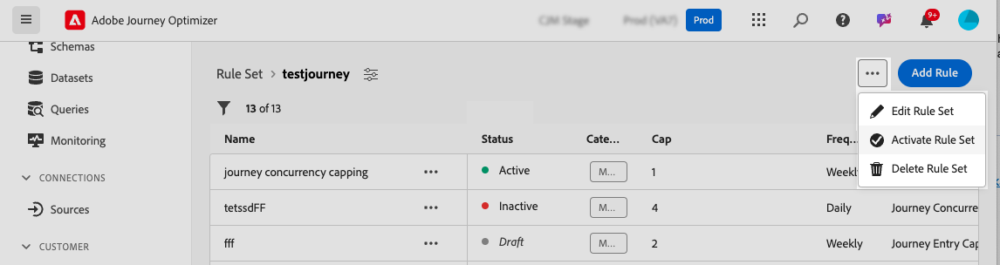

# Limitazione del percorso e arbitrato {#journey-capping}

>[!AVAILABILITY]
>
>Le funzionalità relative ai conflitti e all’assegnazione delle priorità sono attualmente in disponibilità limitata per un gruppo selezionato della clientela. Tenere presente che queste funzioni verranno gradualmente implementate per più utenti in futuro. Se lo desideri, puoi rivolgerti al team del tuo account per l’inserimento nella lista d’attesa per queste funzioni.

La limitazione dei percorsi consente di limitare il numero di percorsi in cui un profilo può essere iscritto, evitando il sovraccarico di comunicazione. In Journey Optimizer, puoi impostare due tipi di regole per i limiti:

* **Limite di voci** limita il numero di voci di percorso in un determinato periodo per un profilo.
* **Il limite di concorrenza** limita il numero di percorsi in cui un profilo può essere iscritto contemporaneamente.

Entrambi i tipi di limite di percorso sfruttano i punteggi di priorità per arbitrare le voci.

>[!AVAILABILITY]
>
>I set di regole di dominio **Percorso** sono disponibili solo per un gruppo limitato di utenti (disponibilità limitata). Per ottenere l’accesso, contatta il tuo rappresentante Adobe.

➡️ [Guarda il video su questa funzione](#video)

## Creare una regola di limitazione del percorso {#create-rule}

>[!CONTEXTUALHELP]
>id="ajo_rule_set_concurrency_prioritization"
>title="Periodo per prioritizzazione"
>abstract=" Se viene programmato un percorso con priorità più alta entro il periodo di tempo specificato qui, al cliente verrà impedito di accedere a questo percorso. Per le situazioni in cui desideri che i percorsi vengano inseriti secondo il criterio in base all’ordine di avvio, consigliamo di scegliere il periodo di visualizzazione giornaliero e di assicurarsi che il punteggio di priorità di qualsiasi altro percorso in tale giornata sia inferiore al punteggio di priorità per il percorso. Assegnare un punteggio di priorità pari a 100 a un percorso garantirebbe, inoltre, che questo venga selezionato."

>[!CONTEXTUALHELP]
>id="ajo_rule_set_rule_type"
>title="Tipo di regola"
>abstract="Specifica il tipo di limitazione per la regola. Il **[!UICONTROL Limite di ingresso al percorso]** limita il numero di ingressi nel percorso per un profilo in un determinato periodo, mentre il **[!UICONTROL Limite di simultaneità del percorso]** limita il numero di percorsi in cui un profilo può essere iscritto contemporaneamente."

Per creare una regola di limite di percorso, effettuare le seguenti operazioni:

1. Passa al menu **[!UICONTROL Regole aziendali]** per accedere all&#39;inventario dei set di regole.

1. Selezionare il set di regole in cui si desidera aggiungere la regola di limite o creare un nuovo set di regole:

   * Per utilizzare un set di regole esistente, selezionarlo dall&#39;elenco. Le regole di limite di percorso possono essere aggiunte solo ai set di regole con il dominio &quot;percorso&quot;. Puoi controllare queste informazioni negli elenchi dei set di regole, nella colonna **[!UICONTROL Dominio]**.

     

   * Per creare la regola di limitazione all&#39;interno di un nuovo set di regole, fai clic su **[!UICONTROL Crea set di regole]**, specifica un nome univoco per il set di regole e seleziona &quot;Percorso&quot; dal menu a discesa **[!UICONTROL Dominio set di regole]**, quindi fai clic su **[!UICONTROL Salva]**.

     

1. Nella schermata del set di regole, fai clic sul pulsante **[!UICONTROL Aggiungi regola]**, quindi configura la regola in base alle tue esigenze:

   

   * Specifica un nome univoco per la regola.

   * Nell&#39;elenco a discesa **[!UICONTROL Tipo di regola]**, specificare il tipo di limite per la regola.

      * **[!UICONTROL Limite Percorso di ingresso]**: limita il numero di ingressi nel percorso in un determinato periodo per un profilo.
      * **[!UICONTROL Limite di concorrenza Percorso]**: limita il numero di percorsi in cui è possibile iscrivere contemporaneamente un profilo.

   * Espandi le sezioni seguenti per scoprire come configurare ogni tipo di limite:

     +++Configurare una regola di limitazione delle voci di percorso

      1. Nel campo **[!UICONTROL Limitazione]**, imposta il numero massimo di percorsi che un profilo può immettere.
      1. Nel campo **[!UICONTROL Durata]**, definisci il periodo di tempo da considerare. La durata si basa sul fuso orario UTC. Ad esempio, il limite giornaliero verrà reimpostato alla mezzanotte UTC.

     >[!AVAILABILITY]
     >
     >La durata &quot;Giornaliera&quot; è disponibile solo per un set di organizzazioni (disponibilità limitata). Per ottenere l’accesso, contatta il tuo rappresentante Adobe.

     In questo esempio, vogliamo impedire ai profili di immettere più di &quot;5&quot; percorsi in un mese.

     

     >[!NOTE]
     >
     >Il sistema prenderà in considerazione la priorità dei prossimi percorsi pianificati a cui verrà applicata la stessa regola.
     >
     >In questo esempio, se l’addetto marketing ha già inserito 4 percorsi ed è previsto un altro percorso pianificato questo mese con priorità maggiore, ai clienti verrà impedito di accedere al percorso con priorità inferiore.

     +++

     +++Configurare una regola di limitazione della concorrenza di percorso

      1. Nel campo **[!UICONTROL Limitazione]**, imposta il numero massimo di percorsi in cui un profilo può essere iscritto contemporaneamente.

      1. Utilizza il campo **[!UICONTROL Prioritization look ahead]** per determinare le voci di percorso in base ai punteggi di priorità in un periodo scelto (ad esempio, 1 giorno, 7 giorni, 30 giorni). Questo consente di dare priorità all’ingresso in percorsi di valore superiore se un profilo è idoneo a più percorsi.

     In questo esempio, vogliamo impedire ai profili di entrare nel percorso se sono già iscritti a un altro percorso contenente lo stesso set di regole. Se un altro percorso entro i prossimi 7 giorni ha un punteggio di priorità più alto, il profilo non entrerà in questo percorso.

     {width="50%" zommable="yes"}

     +++

1. Quando la regola di limite è pronta per essere applicata ai percorsi, attivala facendo clic sul pulsante con i puntini di sospensione accanto al nome.

   

1. Attiva l’intero set di regole facendo clic sul pulsante con i puntini di sospensione accanto al pulsante Aggiungi regola nell’angolo superiore destro dello schermo.

   

## Applicare le regole di limitazione ai percorsi {#apply-capping}

>[!CONTEXTUALHELP]
>id="ajo_journey_capping_rule"
>title="Applicare un set di regole ai percorsi"
>abstract="Applica un set di regole per escludere questo percorso a una parte del pubblico in base alle regole della quota limite."

Per applicare una regola di limite a un percorso, accedere al percorso e aprirne le proprietà. Nel menu a discesa **[!UICONTROL Regole di limitazione]**, seleziona il set di regole pertinente. Dopo l’attivazione del percorso, diventano effettive le regole di limitazione definite nel set di regole.

>[!IMPORTANT]
>
>Se un percorso viene attivato immediatamente, potrebbero essere necessari fino a 20 minuti per iniziare a eliminare i clienti. È possibile pianificare l&#39;inizio del percorso per almeno 20 minuti nel futuro per evitare questa eventualità.

Una volta che il percorso è attivo, puoi controllare nel report percorso se il set di regole ha portato a un&#39;esclusione dal percorso, nella tabella **[!UICONTROL Esclusioni Percorso]**. [Scopri come utilizzare i report di percorso](../reports/journey-global-report-cja.md)

## Video dimostrativo {#video}

>[!VIDEO](https://video.tv.adobe.com/v/3435530?quality=12)
