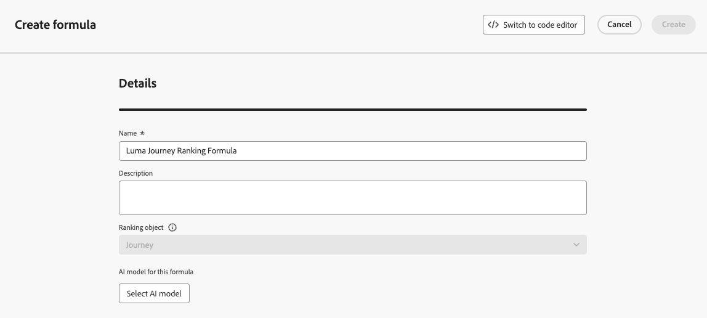
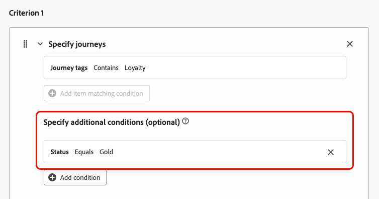
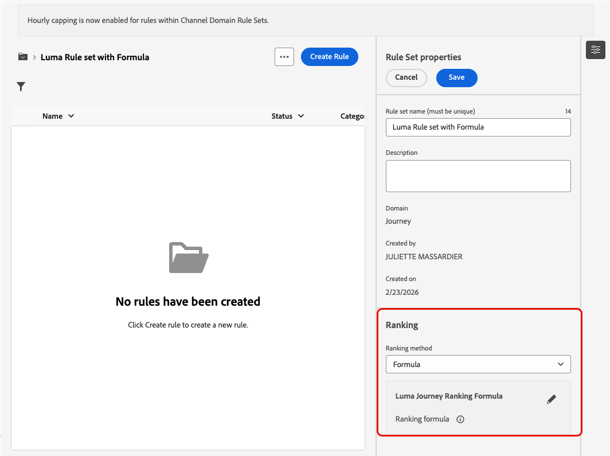

# Utilizzare le formule per classificare i percorsi {#journey-ranking-formulas}

>[!AVAILABILITY]
>
>Questa funzione è attualmente disponibile in modo limitato. Per ottenere l’accesso, contatta il rappresentante Adobe.

[!DNL Adobe Journey Optimizer] consente di controllare i percorsi che un profilo può inserire quando sono idonei per un numero maggiore di quello consentito dal sistema. A tale scopo, è possibile utilizzare [set di regole](rule-sets.md) per definire i limiti per l&#39;immissione o la concorrenza nel percorso. Quando un profilo è idoneo per un numero di percorsi superiore a quello consentito dal limite, la priorità assegnata a ciascun percorso determina quali percorsi sono selezionati.

Anziché utilizzare la priorità, è inoltre possibile utilizzare **formule di classificazione** per regolare dinamicamente la classificazione dei percorsi in base agli attributi di percorso, agli attributi di profilo o ai punteggi dei modelli di IA.

Le formule offrono maggiore flessibilità rispetto alla priorità statica. Ad esempio, puoi promuovere un percorso per i membri fidelizzati.

<!--
>[!NOTE]
>
>Journey ranking formulas follow the same guardrails as decisioning ranking formulas (nesting depth, rule string size). [Learn more about Decisioning guardrails & limitations](../experience-decisioning/decisioning-guardrails.md#ranking-formulas).-->

## Creare una formula di classificazione {#create-journey-ranking-formula}

Per creare una formula di classificazione per i percorsi, effettua le seguenti operazioni.

1. Accedi alla sezione **[!UICONTROL Classificazione orchestrazione]**, quindi seleziona la scheda **[!UICONTROL Formule di classificazione]**. Viene visualizzato l&#39;elenco delle formule create in precedenza.

1. Fare clic su **[!UICONTROL Crea formula]**.

1. Specificare il nome della formula e aggiungere una descrizione, se necessario.

   {width="80%"}

   >[!NOTE]
   >
   >L’oggetto di classificazione è l’entità a cui verrà applicata la formula di classificazione. Per impostazione predefinita, l&#39;oggetto di classificazione è impostato su **[!UICONTROL Percorso]**.

   <!--
    Selecting a formula entity specifies which type of item—such as journeys or other entities—the ranking formula will apply to. This determines the context in which the formula operates, allowing you to define rules that influence how those items are ranked.-->

1. Facoltativamente, fai clic su **[!UICONTROL Seleziona modello di IA]** per impostare il modello che verrà utilizzato come riferimento per creare la formula di classificazione.

<!--
    >[!NOTE]
    >
    >[Personalized optimization models](../experience-decisioning/ranking/personalized-optimization-model.md) using continuous metrics are not supported with the AI formula builder.

    Every time you refer to a model score when defining your formula below, the AI model that you selected will be used. [Learn more on AI models](../experience-decisioning/ranking/ai-models.md)-->

1. Nella sezione **[!UICONTROL Criterio 1]**, specificare i percorsi a cui si desidera applicare un punteggio di classificazione eseguendo le operazioni seguenti:

   * selezionare un [attributo di percorso](../building-journeys/journey-properties.md) (ad esempio il nome del percorso, i tag, la priorità o altre proprietà di percorso);
   * selezionare un operatore logico;
   * aggiungi una condizione corrispondente: puoi digitare/selezionare un valore o scegliere un attributo di profilo.

   {width="70%"}

1. Facoltativamente, puoi specificare elementi aggiuntivi per perfezionare le condizioni di corrispondenza affinché i criteri siano veri.

   {width="70%"}

   Ad esempio, hai definito *il criterio 1*, ad esempio *tag Percorso*, contiene *Fedeltà*. Inoltre, puoi aggiungere un&#39;altra condizione, ad esempio se lo *stato fedeltà* è uguale a *Oro*, allora *il criterio 1* è vero.

1. Crea un’espressione che assegnerà un punteggio di classificazione ai percorsi che soddisfano la condizione definita sopra. È possibile fare riferimento a uno dei seguenti elementi:
   * una variabile:
      * la priorità del percorso, che è un valore manuale assegnato al percorso durante [la creazione di un percorso](../building-journeys/journey-gs.md);
      * il punteggio ottenuto dal modello di IA selezionato facoltativamente in precedenza;
   * un attributo:
      * qualsiasi attributo che potrebbe risiedere nel profilo, ad esempio qualsiasi punteggio di propensione derivato esternamente;
      * un attributo percorso;
   * un valore statico che puoi assegnare in un formato libero;
   * una combinazione di tutti i precedenti.

   {width="70%"}

1. Fai clic su **[!UICONTROL Aggiungi criterio]** per aggiungere uno o più criteri il numero di volte necessario. La logica è la seguente:
   * Se il primo criterio è vero per un determinato elemento di decisione, ha la precedenza su quelli successivi.
   * Se non è vero, il motore decisionale passa al secondo criterio e così via.

1. Dopo aver definito tutti i criteri, nell’ultimo campo puoi creare un’espressione che verrà assegnata a tutti i percorsi che non soddisfano i criteri di cui sopra.

   {width="70%"}

1. Fai clic su **[!UICONTROL Crea]** per completare la formula di classificazione.

È ora possibile selezionare questa formula dall&#39;elenco per visualizzarne i dettagli e modificarla o eliminarla. È quindi disponibile quando configuri un set di regole. [Scopri come](#assign-formula-to-ruleset)

### Esempi di formule di classificazione {#journey-ranking-formula-example}

Prendi in considerazione gli esempi seguenti.

+++Esempio 1: utilizzare la priorità del percorso o il punteggio di IA in base ai tag del percorso

{width="60%"}

Se il percorso ha un tag &quot;Marketing&quot;, il punteggio di classificazione è la priorità del percorso.

{width="60%"}

Se il percorso ha un tag &quot;Promo&quot;, il punteggio di classificazione è il punteggio del modello di intelligenza artificiale.

+++

+++Esempio 2: aumentare i percorsi fedeltà per stato del profilo

{width="60%"}

Se il percorso ha un tag &quot;Loyalty&quot; e lo stato di fedeltà del profilo è Gold, il punteggio di classificazione utilizzato è la priorità del percorso più 5.

{width="60%"}

Se il percorso ha un tag di &quot;Fedeltà&quot; e lo stato di fedeltà del profilo è Argento, il punteggio di classificazione è la priorità del percorso più 2.

Se nessuna delle condizioni di cui sopra è soddisfatta, il punteggio di classificazione utilizzato è la priorità del percorso.

+++

### Utilizzare l’editor di codice {#journey-ranking-formula-code-editor}

Per esprimere le formule di classificazione in **sintassi PQL**, passa all&#39;editor di codice utilizzando il pulsante dedicato in alto a destra dello schermo. Per ulteriori informazioni su come utilizzare la sintassi PQL, consulta la [documentazione dedicata](https://experienceleague.adobe.com/docs/experience-platform/segmentation/pql/overview.html?lang=it).

>[!CAUTION]
>
>Questa azione ti impedirà di tornare alla vista predefinita del generatore per questa formula.

Puoi quindi sfruttare gli attributi di percorso, gli attributi di profilo e i valori statici per creare la formula di classificazione.

<!--The code editor is similar to the one used in Decisioning ranking formulas. [Learn more](../experience-decisioning/ranking/ranking-formulas.md#ranking-code-editor)-->

## Assegnare la formula a un set di regole {#assign-formula-to-ruleset}

Per utilizzare una formula per classificare i percorsi, è necessario assegnarla a un set di regole.

>[!NOTE]
>
>Le formule vengono assegnate a livello di set di regole, non su singoli percorsi.

1. Creare un set di regole da utilizzare per l&#39;arbitraggio di percorso dal menu **[!UICONTROL Regole aziendali]**. [Scopri come](rule-sets.md#Create)

1. Assicurarsi di selezionare il dominio **[!UICONTROL Percorso]**.

   {width="60%"}

1. Nelle proprietà del set di regole, impostare il metodo di classificazione **&#x200B;**&#x200B;su **[!UICONTROL Formula]** (anziché il metodo predefinito **[!UICONTROL Priorità]**).

1. Seleziona la formula di classificazione creata dall’elenco a discesa.

   {width="60%"}

1. Creare le regole di limite di percorso da aggiungere al set di regole. [Scopri come](journey-capping.md#create-rule)

1. Salva il set di regole.

Ora la formula viene assegnata al set di regole. Puoi quindi applicare il set di regole ai tuoi percorsi.

## Applicare il set di regole a un percorso {#assign-rule-set-to-journey}

Per assegnare il set di regole a un percorso, effettua le seguenti operazioni.

1. Creare o aprire il percorso a cui si desidera assegnare il set di regole. [Scopri come creare un percorso](../building-journeys/journey-gs.md)

1. Nelle proprietà del percorso, seleziona il set di regole dall’elenco a discesa.  [Scopri come](journey-capping.md#apply-capping).

   >[!NOTE]
   >
   >È possibile applicare un solo set di regole a un percorso alla volta.

1. Salvare il percorso.

Tutti i percorsi che utilizzano questo set di regole vengono classificati con la formula selezionata quando viene applicato il limite.

Per monitorare il funzionamento dei set di regole e delle formule di classificazione, vedere la sezione [Limitazioni di Percorsi e conflitti](../reports/channel-report-cja.md#rule-sets) nel rapporto Panoramica.

<!--
## Reporting {#reporting}

Reporting for journey arbitration helps you understand how rule sets and ranking formulas perform:

* **Exclusions** – Whether journeys were excluded from users and which rule set (and reason) prevented entry.
* **Rule set performance** – For each rule set, metrics such as journey enters, journey exclusions, journey engagement, and other optimization metrics.
* **Cross-journey view** – Time-based view of profiles across journeys (e.g. journey enters, failures, exclusions) to see the impact of capping and ranking.

Use these reports to validate that your formulas and caps are behaving as intended and to tune ranking logic over time.-->

