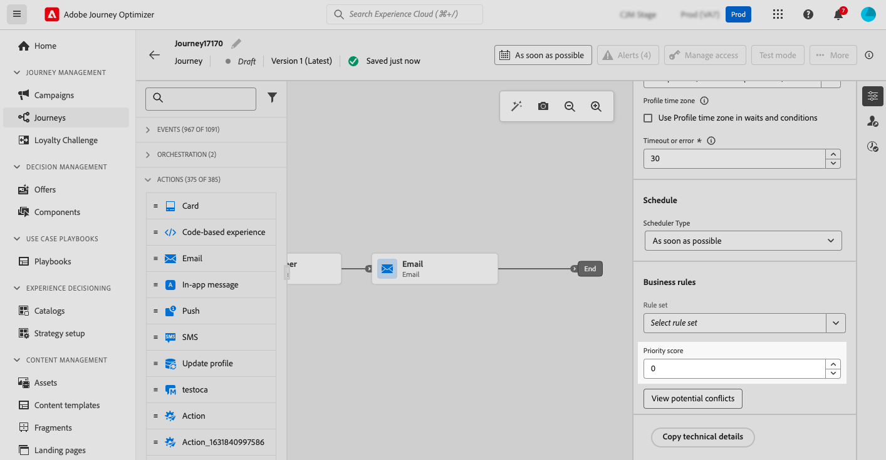
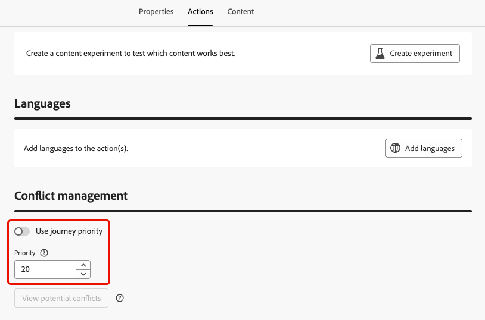

# Assegnare punteggi di priorità {#priority}

Journey Optimizer ti consente di assegnare un punteggio di priorità a un percorso, a una campagna o a un&#39;azione del canale in entrata all&#39;interno dell&#39;attività **[!UICONTROL Azione]** del percorso.

La priorità è essenziale per assegnare la priorità a un percorso, una campagna o un’azione in presenza di un vincolo imposto (ad esempio un limite di frequenza).

In situazioni in cui un cliente si qualifica per molti percorsi, campagne o comunicazioni e desideri essere selettivo in merito al quale deve entrare e ricevere, utilizza questo campo.

## Assegnare punteggi di priorità a percorsi e campagne {#priority-journey-campaign}

>[!CONTEXTUALHELP]
>id="ajo_campaigns_campaign_priority"
>title="Priorità"
>abstract="Assegna un punteggio di priorità alla campagna. La priorità è essenziale per dare precedenza a un percorso in presenza di un vincolo imposto, ad esempio un limite di frequenza. Immetti un valore numerico (da 0 a 100). Tieni presente che più alto è il numero, maggiore è la priorità. In situazioni dove due campagne hanno lo stesso punteggio di priorità, la campagna attivata verrà visualizzata per prima."

>[!CONTEXTUALHELP]
>id="ajo_journey_priority"
>title="Priorità"
>abstract="Assegna un punteggio di priorità al percorso. La priorità è essenziale per dare precedenza a un percorso in presenza di un vincolo imposto, ad esempio un limite di frequenza. Immetti un valore numerico (da 0 a 100). Tieni presente che più alto è il numero, maggiore è la priorità. In situazioni dove due percorsi hanno lo stesso punteggio di priorità, il percorso attivato verrà visualizzato per primo."

➡️ [Scopri questa funzione nel video](#video)

L’assegnazione di un punteggio di priorità è fondamentale per le comunicazioni in entrata, ad esempio web, mobile e in-app. Se disponi di più campagne che utilizzano la stessa configurazione di canale (ad esempio, un banner nella parte superiore della pagina web), ciò potrebbe rappresentare un problema in quanto è possibile visualizzare facilmente solo il contenuto di una campagna. Il punteggio di priorità è il punto in cui inserirai la tua preferenza per la campagna da mostrare quando il destinatario può qualificarsi per più di una campagna.

>[!NOTE]
>
>Nelle campagne, il punteggio di priorità è disponibile solo per i canali in entrata web, in-app e basati su codice.

Per assegnare un punteggio di priorità a un percorso o a una campagna, immettere un valore numerico (da 0 a 100) nel campo **[!UICONTROL Punteggio di priorità]** incluso nelle proprietà del percorso o della campagna. Maggiore è il numero, maggiore è la priorità.

Se stavi creando questa campagna e volessi essere certo che il contenuto della campagna sia visualizzato, gli daresti un punteggio di 100.

>[!IMPORTANT]
>
>Se due percorsi o campagne hanno lo stesso punteggio di priorità, il sistema non ha un meccanismo di interruzione dei tempi. Assicurati che i punteggi di priorità siano univoci per evitare conflitti.

## Assegnare punteggi di priorità alle azioni del canale in entrata {#priority-action}

>[!CONTEXTUALHELP]
>id="ajo_journey_action_priority"
>title="Priorità"
>abstract="Assegna un punteggio di priorità all’azione del percorso. La priorità è essenziale per dare precedenza a un’azione in entrata in presenza di più azioni di percorso o campagne che utilizzano la stessa configurazione di canale. Immetti un valore numerico (da 0 a 100). Tieni presente che più alto è il numero, maggiore è la priorità. Per impostazione predefinita, il punteggio di priorità per l’azione viene ereditato da quello complessivo relativo al percorso."

Journey Optimizer consente inoltre di assegnare un punteggio di priorità alle azioni del canale in entrata all&#39;interno dell&#39;attività [Azione](../building-journeys/journey-action.md).

Ciò ti consente di assegnare la priorità a un’azione in entrata quando sono presenti più azioni di percorso o campagne che utilizzano la stessa configurazione di canale.

>[!NOTE]
>
>Nell&#39;attività **[!UICONTROL Azione]**, il punteggio di priorità è disponibile solo per i canali in entrata Web, in-app e basati su codice.

Nella sezione **[!UICONTROL Gestione dei conflitti]**, l&#39;opzione **[!UICONTROL Usa priorità percorso]** è selezionata per impostazione predefinita, il che significa che il punteggio di priorità per l&#39;azione è ereditato dal punteggio di priorità complessivo per il percorso.

Per assegnare un punteggio di priorità alle azioni in entrata definite nell&#39;attività **[!UICONTROL Azione]**, deselezionare l&#39;opzione **[!UICONTROL Usa priorità percorso]** e immettere un valore numerico (da 0 a 100) nel campo **[!UICONTROL Priorità]**. Maggiore è il numero, maggiore è la priorità.

{width=70%}

## Video introduttivo {#video}

>[!VIDEO](https://video.tv.adobe.com/v/3445009?captions=ita&quality=12)
