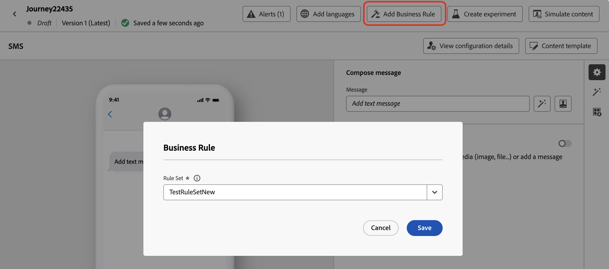

# Impostare le ore di silenzio {#quiet-hours}

## Cosa sono le ore non interattive

**Ore tranquille** ti consente di definire esclusioni basate sul tempo per **Canali E-mail**, **SMS**, **Push** e **WhatsApp**. Garantiscono che non vengano inviati messaggi in specifici periodi di tempo, aiutandoti a rispettare le preferenze dei clienti e i requisiti di conformità.

Puoi applicare le ore non interattive tramite **set di regole**, che possono essere assegnate a singole azioni in campagne o percorsi per un controllo preciso.

Semplificando questi processi è possibile migliorare la customer experience, risparmiare tempo e garantire la conformità alle regole di comunicazione:

* **Non svegliare il cliente** - *Il cliente giusto, il canale giusto, l&#39;ora esatta* è il mantra di molti addetti al marketing, quindi ha senso che la tempistica sia una parte critica del percorso del cliente. Impostando una regola di orario non interattivo, i brand hanno un maggiore controllo su quando i contatti ricevono i messaggi, garantendo che li ricevano quando è più probabile che intervengano sul messaggio.
* **Comodità**: intercetta facilmente le comunicazioni tra campagne e percorsi quando devi impedire a un pubblico di ricevere un messaggio senza dover interrompere l&#39;intero percorso o la campagna.
* **Risparmio di tempo** - Gestisci le esclusioni in un&#39;unica posizione creando una **regola basata sul tempo**, invece di aggiungere più nodi condizione con espressioni personalizzate.\
  <!--* **Extra Safeguard** - Benefit from an extra safeguard in case audience criteria or time-window configurations were incorrectly set, ensuring individuals are still excluded when they should be.-->

>[!AVAILABILITY]
>
>Le regole di orario non interattivo sono attualmente disponibili solo per un set di organizzazioni (disponibilità limitata).  Saranno disponibili progressivamente per tutta la clientela nelle prossime versioni.

➡️ [Scopri questa funzione nel video](#video)

## Guardrail e limitazioni

* **Canali supportati** - E-mail, SMS, push e WhatsApp.
  <!--* **Custom actions** – For custom actions, only quiet hours rules are enforced. If a rule set also includes other rules (e.g., frequency capping), those rules are ignored.-->
* **Ritardo di propagazione** - Gli aggiornamenti a una regola relativa alle ore non interattive possono richiedere fino a 12 ore per essere applicati alle azioni del canale che utilizzano già tale regola.
  <!--* **Pre-suppression window** – The system begins suppressing communications 30 minutes before quiet hours start, ensuring that no messages are delivered once the quiet period begins.-->
* **Latenza per volumi elevati** - In caso di comunicazioni di volumi elevati, il sistema potrebbe impiegare più tempo per iniziare ad applicare correttamente la soppressione delle ore non interattive.

## Creare regole per le ore non interattive

Per impostare le ore non interattive, crea una regola all’interno di un set di regole personalizzato. Segui questi passaggi:

1. Passare a **[!UICONTROL Regole aziendali]** per accedere all&#39;inventario dei set di regole.

1. Scegli un set di regole personalizzato esistente o creane uno nuovo:

   +++Creare una regola di ore non interattive in un set di regole esistente

   Seleziona il set di regole dall’inventario. Le regole di orario non interattivo possono essere aggiunte solo ai set di regole con il dominio &quot;channel&quot;. È possibile controllare queste informazioni nella colonna **[!UICONTROL Dominio]**.

   

   +++

   +++Creare una regola di ore non interattive in un nuovo set di regole

   Fai clic su **[!UICONTROL Crea set di regole]**, immetti un nome univoco e seleziona &quot;Canale&quot; dal menu a discesa **[!UICONTROL Dominio set di regole]**.

   

   +++

   >[!NOTE]
   >
   >Le ore non interattive possono essere definite solo in **set di regole personalizzati**. Il set di regole globale non supporta la configurazione delle ore non interattive.

1. Nella schermata del set di regole, fai clic su **[!UICONTROL Aggiungi regola]** e specifica un nome univoco per la regola.

1. Il campo **Categoria** specifica la categoria del messaggio a cui si applica la regola. Per il momento, questo campo è di sola lettura e il valore predefinito è **[!UICONTROL Marketing]**.

1. Nel menu a discesa **[!UICONTROL Tipo di regola]**, seleziona **[!UICONTROL Ore non interattive]**.

   

1. Nella sezione **[!UICONTROL Date e ore]**, definisci quando applicare le ore non interattive:

   1. Scegli il **[!UICONTROL fuso orario]** da utilizzare:

      * **[!UICONTROL UTC/GMT]** - Applica una finestra temporale GMT standard a tutti i destinatari nel pubblico, indipendentemente dal loro fuso orario individuale.
      * **[!UICONTROL Usa fuso orario locale dei destinatari]** - Utilizza il campo del fuso orario di ciascun profilo. [Ulteriori informazioni sulla gestione del fuso orario nei percorsi](../building-journeys/timezone-management.md#timezone-from-profiles)

        >[!IMPORTANT]
        >
        >Se un profilo non ha un valore per il fuso orario, le ore non interattive non vengono applicate per quel profilo.

   1. Specifica il periodo di tempo in cui applicare le ore non interattive.

      * **[!UICONTROL Settimanale]** - Scegli giorni specifici della settimana e una fascia oraria. Puoi anche applicare la regola **[!UICONTROL Tutto il giorno]** (questa opzione è disponibile solo per un massimo di 3 giorni consecutivi).

        

      * **[!UICONTROL Data personalizzata]** - Scegli date specifiche nel calendario e una sequenza temporale. Puoi anche applicare la regola **[!UICONTROL Tutto il giorno]** (questa opzione è disponibile solo per un massimo di 3 giorni consecutivi).

        

   1. Fai clic sul pulsante **[!UICONTROL Aggiungi altre date]** per aggiungere fino a 5 periodi separati.

      

1. Nella sezione **[!UICONTROL Gestione delle azioni durante le ore non interattive]**, scegliere il modo in cui i messaggi vengono trattati durante il periodo di tempo selezionato:

   

   * **[!UICONTROL Messaggio coda]** - I messaggi vengono inviati al completamento del periodo di sospensione a meno che non si trovi nello stato In pausa.

     >[!NOTE]
     >
     >Questa opzione è disponibile solo per le azioni di percorso. Se applicata a un&#39;azione della campagna, si comporta come se si selezionasse l&#39;opzione **[!UICONTROL Elimina messaggio]**.

   * **[!UICONTROL Elimina messaggio]** - I messaggi non vengono mai inviati. Se si desidera che il percorso o la campagna che contiene il messaggio termini con l&#39;annullamento dell&#39;invio, selezionare **[!UICONTROL Elimina ed esci dal percorso o dalla campagna]**.

## Applicare ore di pausa a percorsi e campagne {#apply}

Una volta salvata la regola e attivato il set di regole, puoi applicarla alle azioni in percorsi e campagne. Canali supportati: **E-mail, SMS, push, WhatsApp**. Sfoglia le schede qui sotto per ulteriori dettagli.

>[!BEGINTABS]

>[!TAB Applica azioni del canale ore non interattive nei percorsi]

1. Apri il percorso, seleziona un&#39;[azione canale](../building-journeys/journeys-message.md) e modifica il contenuto del messaggio.
1. Fai clic sul pulsante **[!UICONTROL Aggiungi regola business]** e seleziona il set di regole contenente la regola Quiet hours.

   

   >[!NOTE]
   >
   >Nell&#39;elenco vengono visualizzati solo i set di regole [attivati](#activate-rule).

1. Attiva il percorso.

>[!TAB Applica ore non interattive alle azioni della campagna]

1. Modifica la campagna e accedi alla scheda **[!UICONTROL Azioni]**.
1. Nella sezione **[!UICONTROL Regole aziendali]**, selezionare il set di regole contenente la regola Ore non interattive.

   

   >[!NOTE]
   >
   >Nell&#39;elenco vengono visualizzati solo i set di regole [attivati](#activate-rule).

1. Attiva la campagna.

>[!ENDTABS]

## Passaggi successivi

Dopo l&#39;attivazione e l&#39;esecuzione del percorso o delle campagne, puoi visualizzare il numero di profili esclusi dalla comunicazione nel [report Customer Journey Analytics](../reports/report-gs-cja.md) e nel [report Live](../reports/live-report.md), in cui le regole delle ore non interattive saranno elencate come possibile motivo per gli utenti esclusi dalla consegna.

<!--

>[!TAB Apply Quiet hours to custom actions]

1. Open your journey and add or select a custom action in the canvas.

1. In the **[!UICONTROL Business rules]** section, select the rule set containing the Quiet hours rule.

   

   >[!NOTE]
   >
   >Only [activated](#activate-rule) rule sets display in the list.

1. Activate your journey.

-->

## Video dimostrativo {#video}

Scopri come utilizzare la funzione per le ore non interattive in Adobe Journey Optimizer.

>[!VIDEO](https://video.tv.adobe.com/v/3475851?quality=12)
