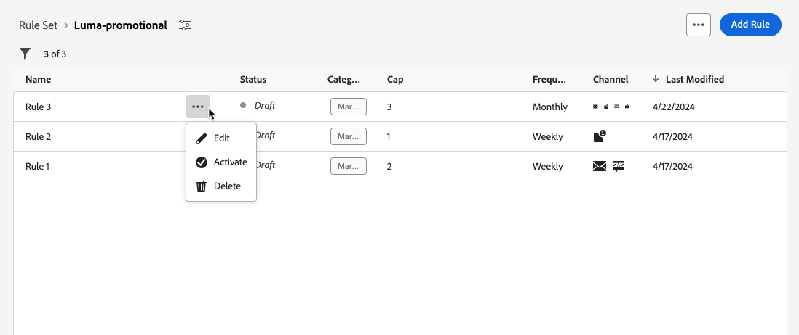

# Utilizzare i set di regole {#rule-sets}

>[!CONTEXTUALHELP]
>id="ajo_business_rules_rule_sets"
>title="Set di regole"
>abstract="Utilizza i set di regole per applicare le regole relative al limite di frequenza o alle ore non interattive a diversi tipi di comunicazioni di marketing. Puoi anche creare set di regole per escludere percorsi a una parte del pubblico in base alle regole della quota limite."

## Introduzione ai set di regole {#gs}

### Cosa sono i set di regole? {#what}

I set di regole consentono di **raggruppare più regole in set di regole** e di applicarle ai percorsi e alle campagne desiderate. Questo fornisce una maggiore granularità ed è utile per limitare la frequenza e il numero di percorsi a cui una persona può accedere entro un determinato arco temporale o per controllare la frequenza con cui gli utenti ricevono un messaggio a seconda del tipo di comunicazione.

Puoi creare due tipi di set di regole:

* I set di regole **Canale** applicano regole ai canali di comunicazione. Consentono di impostare:

   * **Regole di quota limite** - *Non inviare più di 1 e-mail o SMS al giorno.*
   * **Regole per le ore non interattive** (disponibilità limitata) - *Non inviare messaggi e-mail al di fuori della fascia oraria dalle 8.00 alle 21.00.*

* I set di regole **Percorso** applicano a un percorso le regole dei limiti di concorrenza e di immissione. Ad esempio, non inserire profili in più di un percorso contemporaneamente.

➡️ [Scopri questa funzione nel video](#video)

### Autorizzazioni {#permissions-frequency-rules}

Per utilizzare le regole business, è necessario disporre delle seguenti autorizzazioni:

* **[!UICONTROL Visualizza regole di frequenza]**: consente di accedere e visualizzare le regole business.
* **[!UICONTROL Gestisci regole di frequenza]**: crea, modifica o elimina regole business.

Ulteriori informazioni sulle autorizzazioni sono disponibili in [questa sezione](../administration/high-low-permissions.md).

### Set di regole globali e personalizzati {#global-custom}

Quando si accede ai set di regole per la prima volta dal menu **[!UICONTROL Amministrazione]** > **[!UICONTROL Regole aziendali]**, viene creato e attivato un set di regole predefinito: **Set di regole predefinito globale**.

Questo set di regole contiene regole globali che è possibile applicare per controllare la frequenza con cui gli utenti ricevono messaggi su uno o più canali. Tutte le regole definite in questo set di regole si applicano a tutti i canali selezionati, indipendentemente dal fatto che le comunicazioni vengano inviate da un percorso o da una campagna.

Oltre a questo set di regole predefinito globale, puoi creare **set di regole** da applicare a qualsiasi percorso o campagna per applicare regole di limitazione specifiche. [Scopri come creare set di regole personalizzati](#create)

## Creare e attivare set di regole {#Create}

>[!CONTEXTUALHELP]
>id="ajo_rule_set_domain"
>title="Dominio set di regole"
>abstract="Durante la creazione di un set di regole, è necessario specificare se le regole all’interno del set di regole applicheranno regole di limitazione specifiche per i canali di comunicazione o per i percorsi."

>[!CONTEXTUALHELP]
>id="ajo_rule_sets_category"
>title="Selezionare la categoria della regola del messaggio"
>abstract="Quando vengono attivate e applicate a un messaggio, tutte le regole di frequenza che corrispondono alla categoria selezionata verranno applicate automaticamente a questo messaggio. Attualmente è disponibile solo la categoria Marketing."

<!--NOT USED?
[!CONTEXTUALHELP]
>id="ajo_rule_sets_capping"
>title="Set the capping for your rule"
>abstract="Specify the maximum number of messages sent to a customer profile within the chosen time frame. The frequency cap will be based on the selected calendar period and will be reset at the beginning of the corresponding time frame."-->

>[!CONTEXTUALHELP]
>id="ajo_rule_type"
>title="Tipo di regola"
>abstract="Seleziona il tipo di regola desiderato per il set di regole di canale: utilizza il tipo **Limitazione di frequenza** per applicare le regole di limitazione ai canali di comunicazione. Ad esempio, non inviare più di 1 comunicazione e-mail o SMS al giorno. Selezionare **Ore non interattive** (disponibile in Disponibilità limitata) per definire esclusioni basate sul tempo in modo da garantire che non vengano inviati messaggi durante specifici periodi di tempo&quot;."

>[!CONTEXTUALHELP]
>id="ajo_rule_sets_duration"
>title="Selezionare la categoria della regola del messaggio"
>abstract="Quando vengono attivate e applicate a un messaggio, tutte le regole di frequenza che corrispondono alla categoria selezionata verranno applicate automaticamente a questo messaggio. Attualmente è disponibile solo la categoria Marketing."

>[!CONTEXTUALHELP]
>id="ajo_rule_set_rule_capping"
>title="Limitazione delle regole"
>abstract="Imposta la limitazione della regola. A seconda del dominio del set di regole e della selezione nel campo Tipo di regola, questo campo può definire il numero massimo di messaggi che possono essere inviati a un profilo o il numero massimo di percorsi in cui il profilo può entrare o essere iscritto contemporaneamente."

>[!CONTEXTUALHELP]
>id="ajo_journey_business_rules"
>title="Set di regole"
>abstract="Seleziona il set di regole da applicare all’azione personalizzata."

Per creare un set di regole, segui la procedura riportata di seguito.

>[!NOTE]
>
>Puoi creare fino a 10 set di regole locali attivi per ciascun dominio di canale e per il dominio di percorso.

1. Accedi all&#39;elenco **[!UICONTROL Set di regole]**, quindi fai clic su **[!UICONTROL Crea set di regole]**.

   

1. Definisci un nome univoco per il set di regole e aggiungi una descrizione.

1. Seleziona il dominio del set di regole e fai clic su **[!UICONTROL Salva]**.

   * Dominio **Canale**: applica regole di limitazione o di sospensione attività ai canali di comunicazione.
   * Dominio **Percorso**: applica le regole di limitazione della concorrenza e delle voci a un percorso.

   

1. Definisci le regole da aggiungere a questo set di regole. Per eseguire questa operazione, accedere al set di regole e fare clic su **[!UICONTROL Aggiungi regola]**.

1. Configura i parametri della regola in base alle tue esigenze. I parametri disponibili per la regola dipendono dal dominio del set di regole selezionato al momento della creazione.

   Informazioni dettagliate su come configurare le regole di percorso e di canale sono disponibili nelle sezioni seguenti:

   * [Limitazione Percorsi](../conflict-prioritization/journey-capping.md)
   * [Quota limite per tipo di comunicazione e canale](../conflict-prioritization/channel-capping.md)
   * [Ore non interattive](../conflict-prioritization/quiet-hours.md) (disponibile con disponibilità limitata)

1. Fai clic su **[!UICONTROL Salva]** per confermare la creazione della regola. Il messaggio viene aggiunto al set di regole con lo stato **[!UICONTROL Bozza]**.

   

1. Ripeti i passaggi precedenti per aggiungere al set di regole tutte le regole necessarie.

1. Al momento della creazione, una regola ha lo stato **[!UICONTROL Bozza]** e non influisce ancora su alcun messaggio. Per abilitarla, fai clic sul pulsante **[!UICONTROL Altre azioni]** accanto alla regola e seleziona **[!UICONTROL Attiva]**.

   

1. Attiva il set di regole per poterlo applicare ai tuoi percorsi e messaggi.

   

   >[!NOTE]
   >
   >La completa attivazione di una regola o di un set di regole può richiedere fino a 10 minuti. Non è necessario modificare i messaggi o ripubblicare i percorsi per rendere effettiva una regola.

<!--Currently, once a rule set is activated, no more rules can be added to that rule set.-->

1. Puoi applicare un set di regole a un messaggio o a un percorso, a seconda del dominio selezionato durante la creazione del set di regole.

   Informazioni dettagliate su come applicare il set di regole sono disponibili in queste sezioni:

   * [Applicare un set di regole a un percorso](../conflict-prioritization/journey-capping.md#apply-capping)
   * [Applicare regole di limitazione alle azioni di percorso e campagna](../conflict-prioritization/channel-capping.md#apply)
   * [Applicare regole di orario non interattivo a percorso e campagna](../conflict-prioritization/quiet-hours.md#apply)

## Accedere e gestire i set di regole {#access-rule-sets}

Tutti i set di regole creati vengono visualizzati nel menu **[!UICONTROL Amministrazione]** > **[!UICONTROL Regole aziendali]**. Vengono ordinati in base alla data dell’ultima modifica.

Fai clic sul nome di un set di regole per visualizzarne e modificarne il contenuto. Sono elencate tutte le regole incluse in tale set di regole. Il menu contestuale in alto a destra consente di modificare il nome e la descrizione del set di regole, attivarlo ed eliminarlo.

Per ogni regola nel set di regole, il pulsante **[!UICONTROL Altre azioni]** consente di modificare la regola, attivarla ed eliminarla.

Per disattivare una regola o un set di regole, fare clic sul pulsante **[!UICONTROL Altre azioni]** accanto all&#39;elemento desiderato e selezionare **[!UICONTROL Disattiva]**.

Lo stato verrà modificato in **[!UICONTROL Inattivo]** e la regola non verrà applicata alle esecuzioni future dei messaggi. Eventuali messaggi attualmente in esecuzione non saranno interessati.

>[!NOTE]
>
>La disattivazione di una regola o di un set di regole non influisce né reimposta i conteggi sui singoli profili.

## Video dimostrativo {#video}

>[!VIDEO](https://video.tv.adobe.com/v/3435531?quality=12)
