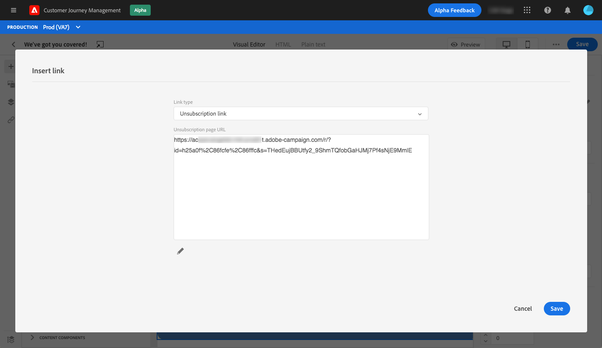

# Gestire l’opt-out {#consent}

Utilizza [!DNL Journey Optimizer] per tenere traccia del consenso dei destinatari alla comunicazione e capire in che modo desiderano interagire con il tuo marchio gestendo le preferenze e gli abbonamenti. <!--Their preferences and subscriptions are handled through Consent management.-->

Regolamenti come il GDPR stabiliscono che si devono soddisfare requisiti specifici prima di poter utilizzare le informazioni degli interessati. Inoltre, gli interessati dovrebbero poter modificare il loro consenso in qualsiasi momento.

**Perché è importante?**

* Il mancato rispetto di queste normative introduce rischi legali normativi per il tuo marchio.
* Ti aiuta a evitare l’invio di comunicazioni non richieste ai destinatari, in modo che queste non vengano contrassegnate come spam danneggiando la tua reputazione.

Ulteriori informazioni sulla gestione della privacy e sulle normative applicabili in [Documentazione di Experience Platform](https://experienceleague.adobe.com/docs/experience-platform/privacy/home.html?lang=it){target=&quot;_blank&quot;}.

<!--* Recipients should be able to opt-in/opt-out from receiving electronic communication through one or more channel
* Recipients expect the brand to offer preference centre capability that controls how brand should engage with them (example: channel of communication, invasive and non-invasive tracking etc). This helps to fulfil regulatory obligations and also facilitates quality engagement with recipient. 
* The third category is the capability to offer subscription to recipients (newsletter, etc)-->

## Gestione degli opt-out {#opt-out-management}

Come requisito legale, è necessario dare ai destinatari la possibilità di annullare l’iscrizione alla ricezione di comunicazioni da un marchio. Ulteriori informazioni sulla legislazione applicabile nel [Documentazione di Experience Platform](https://experienceleague.adobe.com/docs/experience-platform/privacy/regulations/overview.html#regulations){target=&quot;_blank&quot;}.

Pertanto, devi sempre includere un **collegamento per l’annullamento dell’iscrizione** in ogni e-mail inviata ai destinatari:

* Facendo clic su questo collegamento, i destinatari verranno indirizzati a una pagina di destinazione contenente un pulsante per confermare l’opt-out.
* Facendo clic sul pulsante di opt-out, viene effettuata una chiamata Adobe I/O per aggiornare i dati del profilo con queste informazioni. [Ulteriori informazioni](#consent-service-api).

### Aggiungi un collegamento per annullare l’abbonamento {#add-unsubscribe-link}

Per aggiungere un collegamento per l’annullamento dell’iscrizione, effettua le seguenti operazioni:

1. Crea la pagina di destinazione per l’annullamento dell’iscrizione.
1. Ospita la pagina di destinazione nel sistema di terze parti desiderato.
1. [Crea un messaggio ](../../help/using/create-message.md) in [!DNL Journey Optimizer].

   <!--The link to your landing page should contain a static URL and the profile ID.-->

1. Seleziona il testo nel contenuto e inserisci un collegamento utilizzando la barra degli strumenti contestuale.

   

1. Seleziona **[!UICONTROL Unsubscription link]** dall’elenco a discesa **[!UICONTROL Link type]**.

   

1. In **[!UICONTROL Link]** incolla il collegamento alla pagina di destinazione.

   

1. Fai clic su **[!UICONTROL Save]**.

1. Salva il contenuto e [pubblica il messaggio](../../help/using/publish-manage-message.md).

   >[!NOTE]
   >
   >L’URL della pagina di destinazione di terze parti includerà tre parametri che verranno utilizzati per aggiornare le preferenze dei profili tramite una chiamata di Adobe I/O. [Ulteriori informazioni](#consent-service-api).

1. Invia il messaggio con il collegamento alla pagina di destinazione tramite un [percorso](building-journeys/journey.md).

1. Una volta ricevuto il messaggio, se il destinatario fa clic sul collegamento di annullamento dell’iscrizione, viene visualizzata la pagina di destinazione.

   

1. Se il destinatario fa clic sul pulsante di opt-out nella pagina di destinazione (qui, il pulsante **Annulla iscrizione**), i dati del profilo vengono aggiornati tramite una chiamata di [Adobe I/O](#opt-out-api).

   Il destinatario che ha scelto l’opt-out viene quindi reindirizzato a una schermata con un messaggio di conferma che indica che la rinuncia è avvenuta con successo.

   

   L’utente non riceverà più comunicazioni dal tuo marchio, a meno che non acconsenta nuovamente.

Per verificare che la scelta del profilo corrispondente sia stata aggiornata, passa ad Experience Platform e accedi al profilo selezionando uno spazio dei nomi di identità e un valore di identità corrispondente. Ulteriori informazioni nel [Documentazione di Experience Platform](https://experienceleague.adobe.com/docs/experience-platform/profile/ui/user-guide.html#getting-started){target=&quot;_blank&quot;}.


Nella scheda **[!UICONTROL Attributes]**, puoi vedere che il valore di **[!UICONTROL choice]** è stato modificato in **[!UICONTROL no]**.

<!--The opt-out URL is resolved upon each recipient receiving the message. It is then personalized with the relevant encrypted parameters (profile ID, profile name, journey ID, sandbox ID, and message execution ID).-->

### Chiamata API per opt-out {#opt-out-api}

Una volta che il destinatario ha rinunciato facendo clic sul collegamento di annullamento dell’iscrizione, viene effettuata una chiamata API di Adobe I/O <!--Consent service API to capture the encrypted data and--> per aggiornare le preferenze del profilo corrispondente.

La chiamata Adobe I/O POST è la seguente:

Endpoint: cjm.adobe.io/imp/consent/preferences

Parametri query:

* **parametri**: contiene il payload crittografato
* **sig**: signature <!--which signature?-->
* **pid**: ID profilo crittografato

Questi parametri sono disponibili dal collegamento di annullamento dell’iscrizione inviato al destinatario, ovvero l’URL che consnete di aprire la pagina di destinazione di terze parti per un determinato destinatario:


<!--QUESTION: How do you get the URL built for each recipient? Do you have to wait until each targeted recipient receives the unsubscribe link or can you deduce it in advance? Is it done automatically upon the API call or do you have to do something manually for each profile? In other words will the LP automatically include the 3 parameters or do you have to insert something manually? Still not completely clear-->

Requisiti dell’intestazione:

* x-api-key
* x-gw-ims-org-id
* x-sandbox-name
* autorizzazione (token utente dal tuo account tecnico) <!--How do you find this information? And other header elements?-->

Corpo della richiesta:

```
{
   "marketing": [
       {
            "type": "email",           
            "choice": "no",          
            "scope": "channel"       
        }
    ],
 
}
```

<!--The Consent service /-->[!DNL Journey Optimizer] will <!--decrypt and-->use these parameters to update the corresponding profile's choice.
<!--and provide an answer back to the landing page.-->

## Rinuncia con un clic {#one-click-opt-out}

Poiché molti clienti cercano un processo più semplice per annullare l’iscrizione, puoi anche aggiungere un collegamento di rinuncia con un solo clic al contenuto dell’e-mail. Questo collegamento consentirà ai destinatari di annullare rapidamente l’iscrizione alle comunicazioni senza essere reindirizzati a una pagina di destinazione in cui devono confermare la rinuncia.

Scopri come aggiungere un collegamento di rinuncia al contenuto del messaggio in [questa sezione](message-tracking.md#one-click-opt-out-link).

Una volta inviato il messaggio tramite un [percorso](building-journeys/journey.md), se un destinatario fa clic sul collegamento di rinuncia, il suo profilo viene immediatamente escluso.

## Collegamento per annullare l’abbonamento nell’intestazione {#unsubscribe-email}

Se il client e-mail dei destinatari supporta la visualizzazione di un collegamento di annullamento all’abbonamento nell’intestazione e-mail, le e-mail inviate con [!DNL Journey Optimizer] includono automaticamente questo collegamento.

Ad esempio, il collegamento per annullare l’abbonamento verrà visualizzato in Gmail in questo modo:


A seconda del client e-mail, facendo clic sul collegamento per annullare l’abbonamento dall’intestazione si verifica uno dei seguenti impatti:

* Il profilo corrispondente viene immediatamente escluso e questa scelta viene aggiornata in Experience Platform. Ulteriori informazioni nel [Documentazione di Experience Platform](https://experienceleague.adobe.com/docs/experience-platform/profile/ui/user-guide.html#getting-started){target=&quot;_blank&quot;}.

* Ha lo stesso effetto di fare clic sul collegamento per annullare l’abbonamento dal contenuto dell’e-mail: il destinatario viene reindirizzato a una pagina di destinazione con un pulsante per confermare la rinuncia. Ulteriori informazioni sulla gestione delle rinunce sono disponibili in [questa sezione](#opt-out-management).

## Gestione degli opt-out per notifiche push {#push-opt-out-management}

I destinatari delle notifiche push possono annullare l’iscrizione dai propri dispositivi.

Ad esempio, al momento del download o dell’utilizzo dell’app, possono scegliere di interrompere le notifiche. Analogamente, possono modificare le impostazioni di notifica tramite il sistema operativo mobile.
