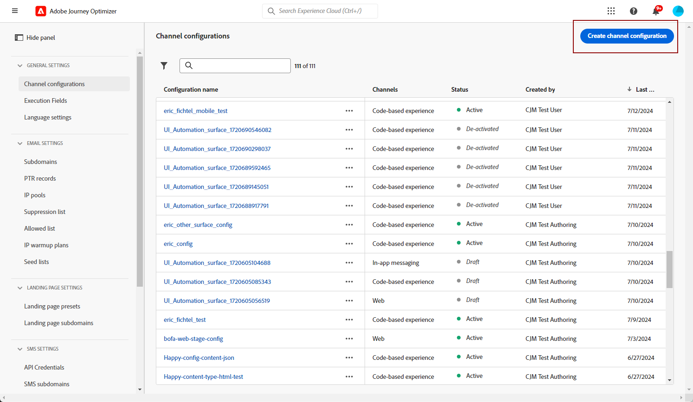
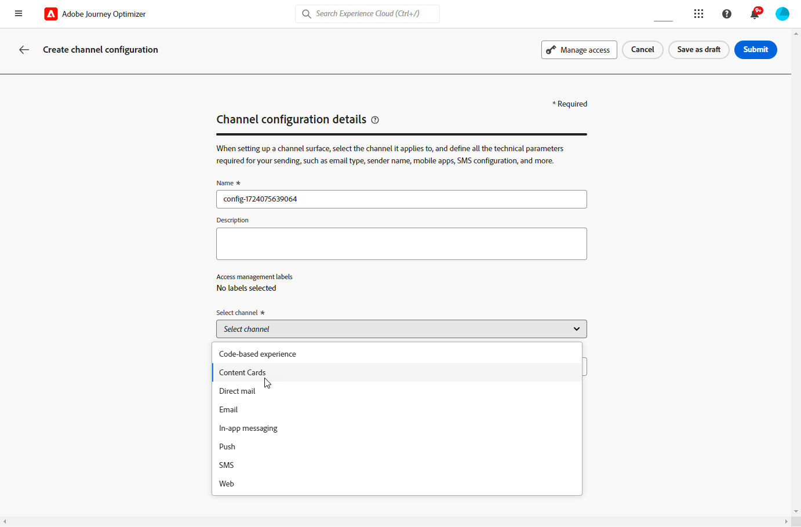
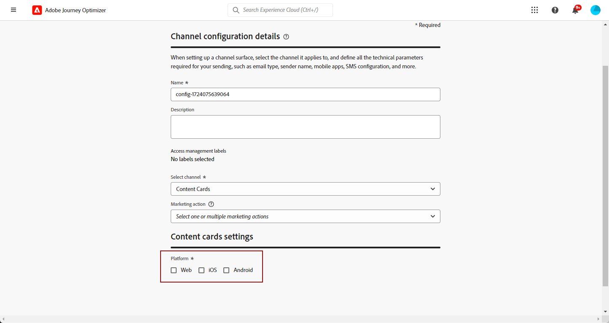

# Configurare le schede di contenuto {#content-card-configuration}

## Che cos’è una configurazione? {#surface-definition}

Una **configurazione esperienza scheda contenuto** è qualsiasi entità progettata per l&#39;interazione utente o di sistema, identificata in modo univoco da un **URI**.

In altre parole, una superficie può essere vista come un contenitore a qualsiasi livello gerarchico con un’entità (punto di contatto) esistente.

* Può essere una pagina web, un&#39;app mobile, un&#39;app desktop, una posizione di contenuto specifica all&#39;interno di un&#39;entità più grande (ad esempio `div`) o un modello di visualizzazione non standard (ad esempio un chiosco o un banner di un&#39;app desktop).

* Può anche estendersi a contenitori di contenuto specifici per scopi non di visualizzazione o visualizzazione astratta (ad esempio, BLOB JSON consegnati ai servizi).

* Può anche essere una superficie con caratteri jolly che corrisponde a una varietà di definizioni di superficie client (ad esempio, la posizione di un’immagine hero su ogni pagina del sito web potrebbe tradursi in un URI di superficie come: web://mydomain.com/*#hero_image).

Fondamentalmente, un URI di superficie è composto da più sezioni:

1. **Tipo**: web, app mobile, sportello bancomat, chiosco, tvcd, servizio ecc.
1. **Proprietà**: URL pagina o pacchetto di app
1. **Contenitore**: posizione nell’attività pagina/app

La tabella seguente elenca alcuni esempi di definizione di URI di superficie per vari dispositivi.

**Web e dispositivi mobili**

| Tipo | URI | Descrizione |
| --------- | ----------- | ------- |
| Web | `web://domain.com/path/page.html#element` | Rappresenta un singolo elemento all’interno di una pagina specifica di un dominio specifico, dove un elemento può essere un’etichetta come negli esempi seguenti: hero_banner, top_nav, menu, piè di pagina, ecc. |
| App iOS | `mobileapp://com.vendor.bundle/activity#element` | Rappresenta un elemento specifico all’interno dell’attività di un’app nativa, ad esempio un pulsante o un altro elemento della vista. |
| App Android | `mobileapp://com.vendor.bundle/#element` | Rappresenta un elemento specifico di un’app nativa. |

**Altri tipi di dispositivi**

| Tipo | URI | Descrizione |
| --------- | ----------- | ------- |
| Desktop | `desktop://com.vendor.bundle/#element` | Rappresenta un elemento specifico all’interno di un’applicazione, ad esempio un pulsante, un menu, un banner hero e così via. |
| App TV | `tvcd://com.vendor.bundle/#element` | Rappresenta un elemento specifico all’interno di un bundle di app per dispositivi collegati a smart TV o TV. |
| Servizio | `service://servicename/#element` | Rappresenta un processo lato server o altra entità manuale. |
| Chiosco | `kiosk://location/screen#element` | Esempio di possibili ulteriori tipi di superficie che possono essere aggiunti facilmente. |
| ATM | `atm://location/screen#element` | Esempio di possibili ulteriori tipi di superficie che possono essere aggiunti facilmente. |

**Superfici jolly**

| Tipo | URI | Descrizione |
| --------- | ----------- | ------- |
| Web jolly | `wildcard:web://domain.com/*#element` | Superficie jolly: rappresenta un singolo elemento in ciascuna pagina in un dominio specifico. |
| Web jolly | `wildcard:web://*domain.com/*#element` | Superficie jolly: rappresenta un singolo elemento in ciascuna pagina di tutti i domini che finiscono con “domain.com”. |

## Creare una configurazione di scheda di contenuto {#create-config}

1. Accedi al menu **[!UICONTROL Canali]** > **[!UICONTROL Impostazioni generali]** > **[!UICONTROL Configurazioni canale]**, quindi fai clic su **[!UICONTROL Crea configurazione canale]**.

   

1. Immetti un nome e una descrizione (facoltativa) per la configurazione.

   >[!NOTE]
   >
   > I nomi devono iniziare con una lettera (A-Z). Può contenere solo caratteri alfanumerici. È inoltre possibile utilizzare i caratteri trattino basso `_`, punto `.` e trattino `-`.

1. Per assegnare etichette di utilizzo dei dati personalizzate o di base alla configurazione, è possibile selezionare **[!UICONTROL Gestisci accesso]**. [Ulteriori informazioni sul controllo degli accessi a livello di oggetto](../administration/object-based-access.md).

1. Seleziona il canale **[!UICONTROL Scheda contenuto]**.

   

1. Seleziona **[!UICONTROL Azione di marketing]** per associare i criteri di consenso ai messaggi utilizzando questa configurazione. Tutti i criteri di consenso associati all’azione di marketing vengono utilizzati per rispettare le preferenze dei clienti. [Ulteriori informazioni](../action/consent.md#surface-marketing-actions)

1. Seleziona la piattaforma per la quale verrà applicata l’esperienza della scheda di contenuto.

   

1. Per il Web:

   * Specifica un **[!UICONTROL URL pagina]** per applicare le modifiche esclusivamente a una singola pagina.

   * In alternativa, crea una **[!UICONTROL regola di corrispondenza pagine]** per eseguire il targeting di più URL che corrispondono alla regola specificata. Ad esempio, potrebbe essere utilizzato per applicare modifiche universalmente a un sito web, ad esempio per aggiornare un banner hero in tutte le pagine o aggiungere un’immagine superiore da visualizzare su ogni pagina di prodotto. [Ulteriori informazioni](../web/web-configuration.md)

1. Per iOS e Android:

   * Immetti o seleziona il tuo **[!UICONTROL ID app]**, **[!UICONTROL Posizione o percorso all&#39;interno dell&#39;app]** e **[!UICONTROL URL anteprima]**.

1. Invia le modifiche.

Ora puoi selezionare la tua configurazione durante la creazione dell’esperienza con la scheda Contenuto.
