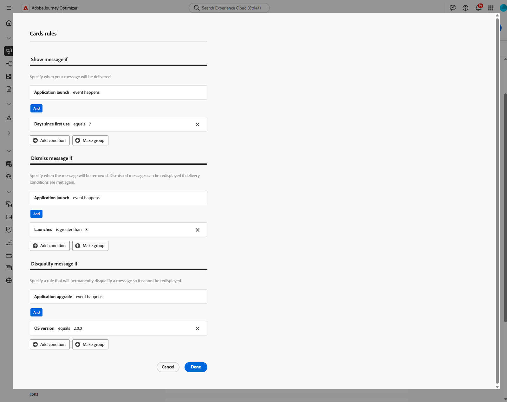

# Creare schede contenuto {#create-content-card}

>[!IMPORTANT]
>
>Per impostazione predefinita, il pulsante Chiudi nasconde la scheda. Per aggiungere ulteriori funzionalità, è possibile definire manualmente regole di revoca o squalifica.

>[!BEGINTABS]

>[!TAB Aggiungi schede di contenuto a un percorso]

Per aggiungere una scheda Contenuto a un percorso, eseguire la procedura seguente:

1. Apri il percorso, quindi trascina e rilascia un&#39;attività **[!UICONTROL Card]** dalla sezione **[!UICONTROL Actions]** della palette.

   

1. Immetti un **[!UICONTROL Etichetta]** e una **[!UICONTROL Descrizione]** per il messaggio.

1. Scegli la [configurazione scheda di contenuto](content-card-configuration.md) da utilizzare.

   

1. Ora puoi iniziare a progettare il contenuto con il pulsante **[!UICONTROL Modifica contenuto]**. [Ulteriori informazioni](design-content-card.md)

1. Abilita l&#39;opzione **[!UICONTROL Abilita regole di consegna aggiuntive]**, quindi seleziona **[!UICONTROL Modifica regole]** per definire quando il messaggio deve essere visualizzato, chiuso o definitivamente nascosto.

   

   1. Fai clic su **[!UICONTROL Aggiungi condizione]** per selezionare l&#39;evento.

      +++Vedi Evento disponibile.

      | Pacchetto | Trigger | Definizione |
      |---|---|---|
      | Inviare dati a Platform | Dati inviati a Platform | Attivazione quando l’app mobile genera un evento di esperienza Edge per inviare dati a Adobe Experience Platform. Di solito la chiamata API [sendEvent](https://developer.adobe.com/client-sdks/documentation/edge-network/api-reference/#sendevent) dall&#39;estensione AEP Edge. |
      | Tracciamento di base | Azione di tracciamento | Attivazione quando viene chiamata la funzionalità legacy offerta nell&#39;API del codice mobile [trackAction](https://developer.adobe.com/client-sdks/documentation/mobile-core/api-reference/#trackaction). |
      | Tracciamento di base | Tracciare lo stato | Attivazione quando viene chiamata la funzionalità legacy offerta nell&#39;API del codice mobile [trackState](https://developer.adobe.com/client-sdks/documentation/mobile-core/api-reference/#trackstate). |
      | Tracciamento di base | Raccogli PII | Attivazione quando viene chiamata la funzionalità legacy offerta nell&#39;API del codice mobile [collectPII](https://developer.adobe.com/client-sdks/documentation/mobile-core/api-reference/#collectpii). |
      | Ciclo di vita dell&#39;applicazione | Avvio applicazione | Attivazione a ogni esecuzione, comprese quelle a seguito di arresti anomali e installazioni. Questa metrica viene attivata anche in seguito alla ripresa dal background oltre il tempo di timeout della sessione del ciclo di vita. |
      | Ciclo di vita dell&#39;applicazione | Installazione applicazione | Attivazione alla prima esecuzione dopo l&#39;installazione o reinstallazione. |
      | Ciclo di vita dell&#39;applicazione | Aggiornamento applicazione | Attivazione alla prima esecuzione dopo un aggiornamento o quando cambia il numero di versione. |
      | Ciclo di vita dell&#39;applicazione | Chiusura applicazione | Attivazione quando l’applicazione viene chiusa. |
      | Ciclo di vita dell&#39;applicazione | Arresto anomalo dell’applicazione | Attivazione quando l&#39;applicazione non viene messa in background prima della chiusura. L&#39;evento viene inviato all&#39;avvio dell&#39;applicazione dopo l&#39;arresto anomalo. La reportistica di Adobe Mobile sugli arresti anomali non implementa un handler globale per eccezioni non rilevate. |

      +++

   1. Scegli la condizione **[!UICONTROL Or]** se desideri aggiungere altri **[!UICONTROL Triggers]** per espandere ulteriormente la regola.

   1. Scegli la condizione **[!UICONTROL And]** se desideri aggiungere **[!UICONTROL Caratteristiche]** e perfezionare meglio la regola.

      +++Consulta Caratteristiche disponibili.

      | Pacchetto | Caratteristiche | Definizione |
      |---|---|---|
      | Informazioni dispositivo | Nome gestore | Attivazione quando viene soddisfatto uno dei nomi dei gestori dell&#39;elenco. |
      | Informazioni dispositivo | Nome dispositivo | Attivazione quando viene raggiunto uno dei nomi di dispositivo. |
      | Informazioni dispositivo | Lingua | Attivazione quando viene soddisfatta una delle lingue dell’elenco. |
      | Informazioni dispositivo | Versione sistema operativo | Attivazione quando viene soddisfatta una delle versioni del sistema operativo specificate. |
      | Informazioni dispositivo | Versione precedente del sistema operativo | Attivazione quando viene soddisfatta una delle versioni del sistema operativo precedente specificate. |
      | Informazioni dispositivo | Modalità di esecuzione | Attivazione se la modalità di esecuzione è un&#39;applicazione o un&#39;estensione. |
      | Ciclo di vita dell&#39;applicazione | ID app | Attivazione quando viene soddisfatto l&#39;ID app specificato. |
      | Ciclo di vita dell&#39;applicazione | Giorno della settimana | Attivazione quando viene raggiunto il giorno della settimana specificato. |
      | Ciclo di vita dell&#39;applicazione | Giorno dal primo utilizzo | Attivazione quando viene raggiunto il numero di giorni specificato dal primo utilizzo. |
      | Ciclo di vita dell&#39;applicazione | Giorno dall’ultimo utilizzo | Attivazione quando viene raggiunto il numero di giorni specificato dall&#39;ultimo utilizzo. |
      | Ciclo di vita dell&#39;applicazione | Giorno dall&#39;aggiornamento | Attivazione quando viene raggiunto il numero di giorni specificato dall&#39;ultimo aggiornamento. |
      | Ciclo di vita dell&#39;applicazione | Data di installazione | Attivazione quando viene soddisfatta la data di installazione specificata. |
      | Ciclo di vita dell&#39;applicazione | Lanci | Attivazione quando viene raggiunto il numero specificato di avvii. |
      | Ciclo di vita dell&#39;applicazione | Ora del giorno | Attivazione quando viene soddisfatta l’ora specificata. |

      +++

   1. Fai clic su **[!UICONTROL Crea gruppo]** per raggruppare i trigger.

1. Se necessario, completa il flusso di percorso trascinando altre azioni o eventi. [Ulteriori informazioni](../building-journeys/about-journey-activities.md)

1. Quando la scheda Contenuto è pronta, finalizza la configurazione e pubblica il percorso per attivarla.

Per ulteriori informazioni su come configurare un percorso, consultare [questa pagina](../building-journeys/journey-gs.md).

>[!TAB Aggiungere schede di contenuto a una campagna]

Per iniziare a creare le schede di contenuto tramite una campagna, segui i passaggi indicati di seguito.

1. Creare una campagna. [Ulteriori informazioni](../campaigns/create-campaign.md)

1. Seleziona il tipo di campagna da eseguire

   * **[!UICONTROL Pianificato - Marketing]**: esegui la campagna immediatamente o in una data specificata. Le campagne pianificate hanno lo scopo di inviare **messaggi di marketing**. Vengono configurati ed eseguiti dall’interfaccia utente di.

   * **[!UICONTROL Attivato da API - Marketing/Transazionale]**: esegui la campagna utilizzando una chiamata API. Le campagne attivate da API hanno lo scopo di inviare **messaggi di marketing** o **messaggi transazionali**, ovvero messaggi inviati in seguito a un&#39;azione eseguita da un individuo: reimpostazione della password, acquisto del carrello, ecc. [Scopri come attivare una campagna utilizzando le API](../campaigns/api-triggered-campaigns.md)

   

1. Nella sezione **[!UICONTROL Proprietà]**, specifica un nome e una descrizione per la campagna.

1. Nella sezione **Pubblico**, fai clic sul pulsante **[!UICONTROL Seleziona pubblico]** per visualizzare l&#39;elenco dei tipi di pubblico di Adobe Experience Platform disponibili. [Ulteriori informazioni sui tipi di pubblico](../audience/about-audiences.md)

1. Nel campo **[!UICONTROL Spazio dei nomi identità]**, scegli lo spazio dei nomi da utilizzare per identificare i singoli utenti dal segmento selezionato. [Ulteriori informazioni sugli spazi dei nomi](../event/about-creating.md#select-the-namespace)

1. Selezionare l&#39;azione **[!UICONTROL Scheda contenuto]**.

   

1. Seleziona o crea una nuova [Configurazione scheda di contenuto](content-card-configuration.md).

1. Per verificare il contenuto del messaggio, fare clic su **[!UICONTROL Crea esperimento]**. Questo consente di testare più variabili di una consegna su popolazioni campione per determinare quale trattamento ha il maggiore impatto sul pubblico target. [Ulteriori informazioni sull&#39;esperimento sui contenuti](../content-management/content-experiment.md).

1. Abilita l&#39;opzione **[!UICONTROL Abilita regole di consegna aggiuntive]**, quindi seleziona **[!UICONTROL Modifica regole]** per definire quando il messaggio deve essere visualizzato, chiuso o definitivamente nascosto.

   Utilizza i generatori di regole per impostare condizioni specifiche che attivano queste azioni.

   1. Fai clic su **[!UICONTROL Aggiungi condizione]** per selezionare l&#39;evento.

      +++Vedi Evento disponibile.

      | Pacchetto | Trigger | Definizione |
      |---|---|---|
      | Inviare dati a Platform | Dati inviati a Platform | Attivazione quando l’app mobile genera un evento di esperienza Edge per inviare dati a Adobe Experience Platform. Di solito la chiamata API [sendEvent](https://developer.adobe.com/client-sdks/documentation/edge-network/api-reference/#sendevent) dall&#39;estensione AEP Edge. |
      | Tracciamento di base | Azione di tracciamento | Attivazione quando viene chiamata la funzionalità legacy offerta nell&#39;API del codice mobile [trackAction](https://developer.adobe.com/client-sdks/documentation/mobile-core/api-reference/#trackaction). |
      | Tracciamento di base | Tracciare lo stato | Attivazione quando viene chiamata la funzionalità legacy offerta nell&#39;API del codice mobile [trackState](https://developer.adobe.com/client-sdks/documentation/mobile-core/api-reference/#trackstate). |
      | Tracciamento di base | Raccogli PII | Attivazione quando viene chiamata la funzionalità legacy offerta nell&#39;API del codice mobile [collectPII](https://developer.adobe.com/client-sdks/documentation/mobile-core/api-reference/#collectpii). |
      | Ciclo di vita dell&#39;applicazione | Avvio applicazione | Attivazione a ogni esecuzione, comprese quelle a seguito di arresti anomali e installazioni. Questa metrica viene attivata anche in seguito alla ripresa dal background oltre il tempo di timeout della sessione del ciclo di vita. |
      | Ciclo di vita dell&#39;applicazione | Installazione applicazione | Attivazione alla prima esecuzione dopo l&#39;installazione o reinstallazione. |
      | Ciclo di vita dell&#39;applicazione | Aggiornamento applicazione | Attivazione alla prima esecuzione dopo un aggiornamento o quando cambia il numero di versione. |
      | Ciclo di vita dell&#39;applicazione | Chiusura applicazione | Attivazione quando l’applicazione viene chiusa. |
      | Ciclo di vita dell&#39;applicazione | Arresto anomalo dell’applicazione | Attivazione quando l&#39;applicazione non viene messa in background prima della chiusura. L&#39;evento viene inviato all&#39;avvio dell&#39;applicazione dopo l&#39;arresto anomalo. La reportistica di Adobe Mobile sugli arresti anomali non implementa un handler globale per eccezioni non rilevate. |

      +++

   1. Scegli la condizione **[!UICONTROL Or]** se desideri aggiungere altri **[!UICONTROL Triggers]** per espandere ulteriormente la regola.

   1. Scegli la condizione **[!UICONTROL And]** se desideri aggiungere **[!UICONTROL Caratteristiche]** e perfezionare meglio la regola.

      +++Consulta Caratteristiche disponibili.

      | Pacchetto | Caratteristiche | Definizione |
      |---|---|---|
      | Informazioni dispositivo | Nome gestore | Attivazione quando viene soddisfatto uno dei nomi dei gestori dell&#39;elenco. |
      | Informazioni dispositivo | Nome dispositivo | Attivazione quando viene raggiunto uno dei nomi di dispositivo. |
      | Informazioni dispositivo | Lingua | Attivazione quando viene soddisfatta una delle lingue dell’elenco. |
      | Informazioni dispositivo | Versione sistema operativo | Attivazione quando viene soddisfatta una delle versioni del sistema operativo specificate. |
      | Informazioni dispositivo | Versione precedente del sistema operativo | Attivazione quando viene soddisfatta una delle versioni del sistema operativo precedente specificate. |
      | Informazioni dispositivo | Modalità di esecuzione | Attivazione se la modalità di esecuzione è un&#39;applicazione o un&#39;estensione. |
      | Ciclo di vita dell&#39;applicazione | ID app | Attivazione quando viene soddisfatto l&#39;ID app specificato. |
      | Ciclo di vita dell&#39;applicazione | Giorno della settimana | Attivazione quando viene raggiunto il giorno della settimana specificato. |
      | Ciclo di vita dell&#39;applicazione | Giorno dal primo utilizzo | Attivazione quando viene raggiunto il numero di giorni specificato dal primo utilizzo. |
      | Ciclo di vita dell&#39;applicazione | Giorno dall’ultimo utilizzo | Attivazione quando viene raggiunto il numero di giorni specificato dall&#39;ultimo utilizzo. |
      | Ciclo di vita dell&#39;applicazione | Giorno dall&#39;aggiornamento | Attivazione quando viene raggiunto il numero di giorni specificato dall&#39;ultimo aggiornamento. |
      | Ciclo di vita dell&#39;applicazione | Data di installazione | Attivazione quando viene soddisfatta la data di installazione specificata. |
      | Ciclo di vita dell&#39;applicazione | Lanci | Attivazione quando viene raggiunto il numero specificato di avvii. |
      | Ciclo di vita dell&#39;applicazione | Ora del giorno | Attivazione quando viene soddisfatta l’ora specificata. |

      +++

   1. Fai clic su **[!UICONTROL Crea gruppo]** per raggruppare i trigger.

   

1. Puoi pianificare la campagna a una data specifica o impostarla per la ricorrenza a intervalli regolari. [Ulteriori informazioni](../campaigns/create-campaign.md#schedule)

1. Ora puoi iniziare a progettare il contenuto con **[!UICONTROL Modifica contenuto]**. [Ulteriori informazioni](design-content-card.md)

   

>[!ENDTABS]
