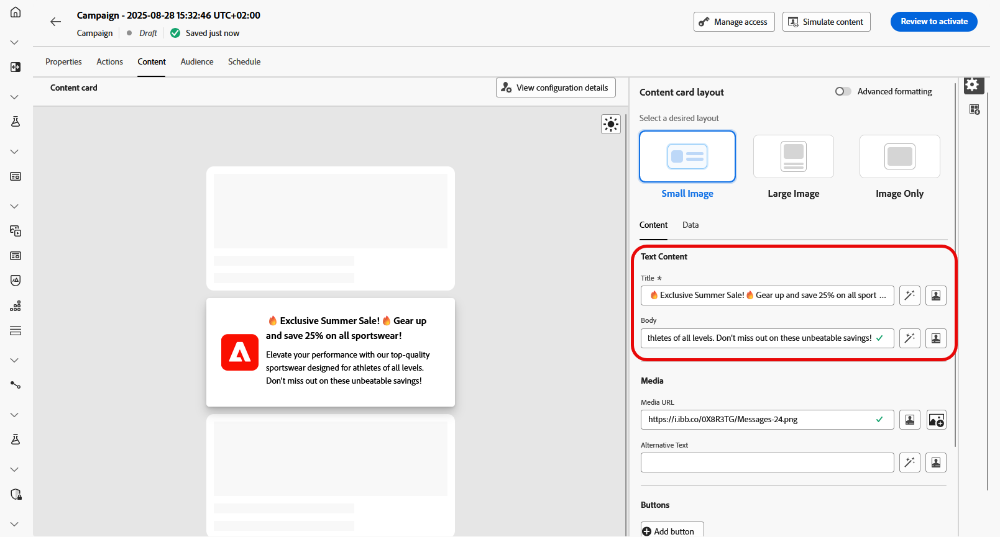
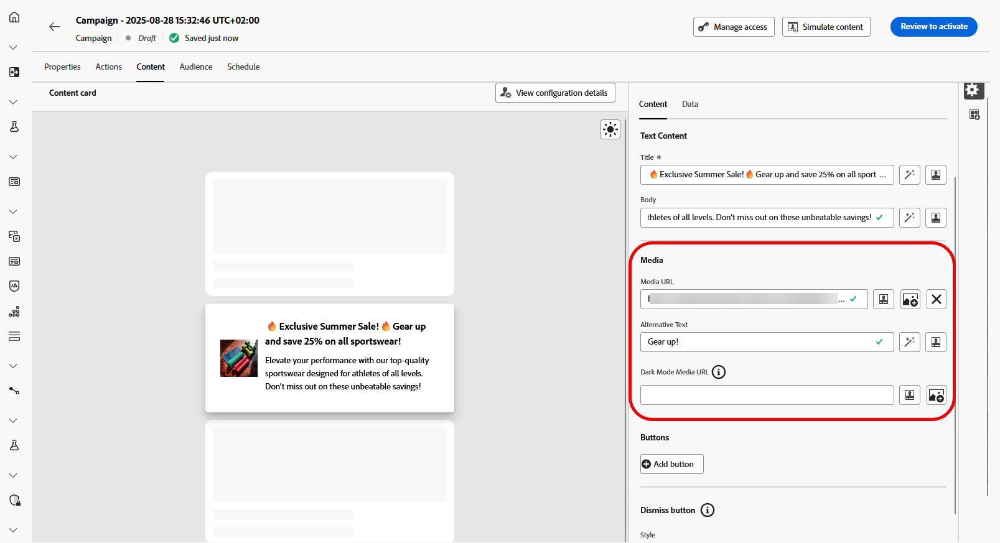

# Progettare i contenuti delle schede di contenuto {#design-content-card}

Il costrutto di authoring per le schede fornisce un’esperienza di authoring basata su moduli che fornisce agli addetti al marketing input di base che possono essere utilizzati per il rendering da parte dello sviluppatore.

Una volta definito e personalizzato il contenuto, puoi rivederlo e attivarlo. La campagna verrà inviata in base alla pianificazione impostata. [Ulteriori informazioni su questa pagina](../campaigns/review-activate-campaign.md).

## Scheda Contenuto {#content-tab}

Dalla scheda **[!UICONTROL Contenuto]**, puoi personalizzare le schede di contenuto definendone sia il contenuto che la struttura del pulsante **[!UICONTROL Chiudi]**. Inoltre, puoi migliorare i contenuti con i file multimediali e aggiungere pulsanti di azione direttamente da questa scheda.

### Chiudi pulsante {#close-button}

Scegli lo **[!UICONTROL stile]** per il **[!UICONTROL pulsante Chiudi]** per personalizzarne l&#39;aspetto.

Puoi scegliere uno dei seguenti stili:

* **[!UICONTROL Nessuno]**
* **[!UICONTROL Semplice]**
* **[!UICONTROL Cerchio]**

### Contenuto {#title-body}

Per comporre il messaggio, immetti il testo nei campi **[!UICONTROL Titolo]** e **[!UICONTROL Corpo]**.

Se desideri personalizzare ulteriormente il messaggio, utilizza l&#39;icona **[!UICONTROL Personalization]** per aggiungere elementi personalizzati. Per istruzioni dettagliate su come utilizzare le funzionalità di personalizzazione, consulta [questa sezione](../personalization/personalize.md).

<!--
+++More options with advanced formatting

If the **[!UICONTROL Advanced formatting mode]** is switched on, you can choose for your **[!UICONTROL Header]** and **[!UICONTROL Body]**:

* the **[!UICONTROL Font]**
* the **[!UICONTROL Pt size]**
* the **[!UICONTROL Font Color]**
* the **[!UICONTROL Alignment]**
+++
-->

### Media {#add-media}

Il campo **[!UICONTROL Media]** consente di migliorare le schede di contenuto aggiungendo supporti, il che può rendere la presentazione più coinvolgente per gli utenti finali.

Per includere i file multimediali, digita l&#39;URL del file multimediale che desideri utilizzare o fai clic sull&#39;icona **[!UICONTROL Seleziona Assets]** per scegliere tra le risorse memorizzate nella libreria Assets. [Ulteriori informazioni sulla gestione delle risorse](../integrations/assets.md).

<!--
+++More options with advanced formatting

If the **[!UICONTROL Advanced formatting mode]** is switched on, you can add an **[!UICONTROL Alternative text]** for screen reading applications and another asset in the **[!UICONTROL Dark Mode Media URL]** field.

+++
-->

### Pulsanti {#add-buttons}

Aggiungi i pulsanti per consentire agli utenti di interagire con le tue schede di contenuto.

1. Fai clic su **[!UICONTROL Aggiungi pulsante]** per creare un nuovo pulsante di azione.

1. Modifica il campo **[!UICONTROL Titolo]** del pulsante per specificare l&#39;etichetta che verrà visualizzata sul pulsante.

1. Seleziona un **[!UICONTROL evento di interazione]** per definire l&#39;azione che verrà attivata quando gli utenti fanno clic sul pulsante o interagiscono con esso.

1. Nel campo **[!UICONTROL Target]**, immetti l&#39;URL web o il collegamento diretto al quale gli utenti verranno indirizzati dopo aver interagito con il pulsante.

<!--
+++More options with advanced formatting

If the **[!UICONTROL Advanced formatting mode]** is switched on, you can choose for your **[!UICONTROL Buttons]**:

* the **[!UICONTROL Font]**
* the **[!UICONTROL Pt size]**
* the **[!UICONTROL Font Color]**
* the **[!UICONTROL Alignment]**

+++
-->

### Comportamento al clic

Nel campo **[!UICONTROL URL di destinazione]**, immetti l&#39;URL web o il collegamento diretto che indirizzerà gli utenti alla destinazione desiderata dopo che interagiranno con la scheda di contenuto. Potrebbe trattarsi di un sito web esterno, di una pagina specifica all’interno dell’app o di qualsiasi altra posizione in cui si desidera che gli utenti vengano indirizzati in base alla loro interazione.

## Scheda Dati

## Dati personalizzati {#custom-data}

Nella sezione **[!UICONTROL Dati personalizzati]**, fai clic su **[!UICONTROL Aggiungi coppia chiave/valore]** per includere le variabili personalizzate nel payload. Queste coppie chiave/valore ti consentono di trasmettere dati aggiuntivi, a seconda della configurazione specifica. Questo ti consente di aggiungere contenuti personalizzati o dinamici, informazioni di tracciamento o qualsiasi altro dato rilevante per la tua configurazione.
