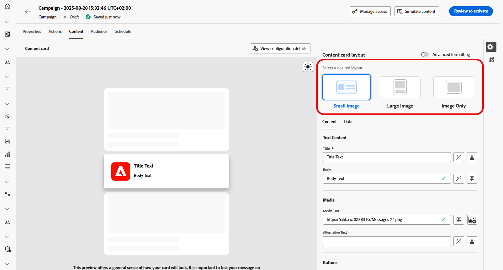
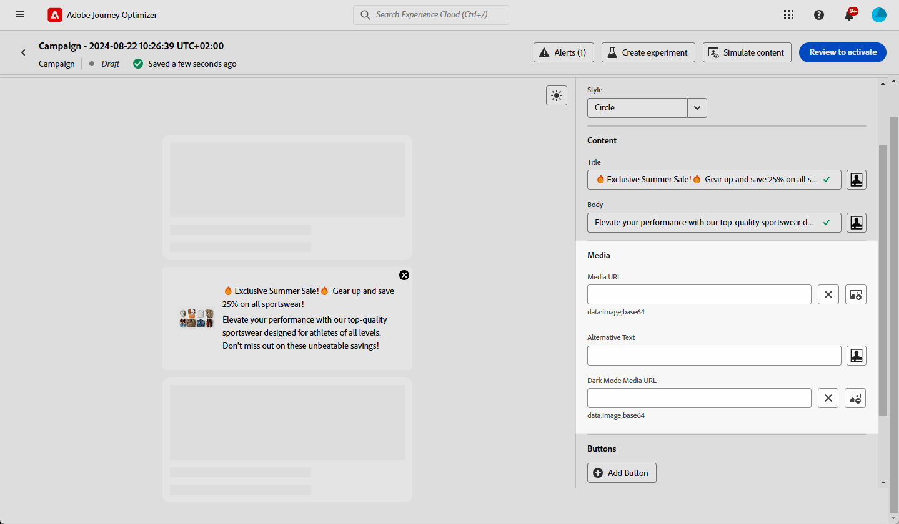
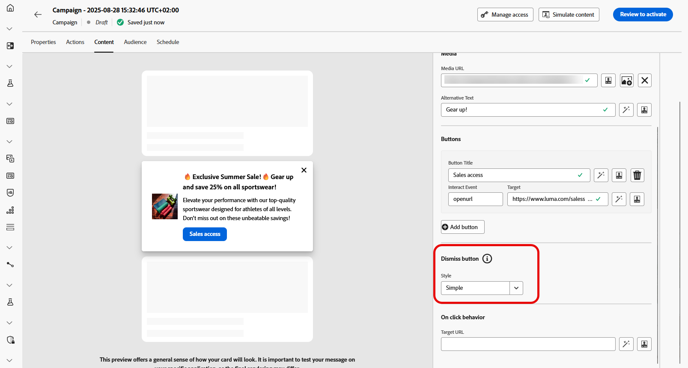
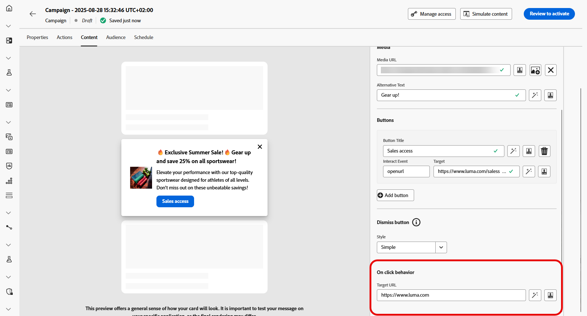
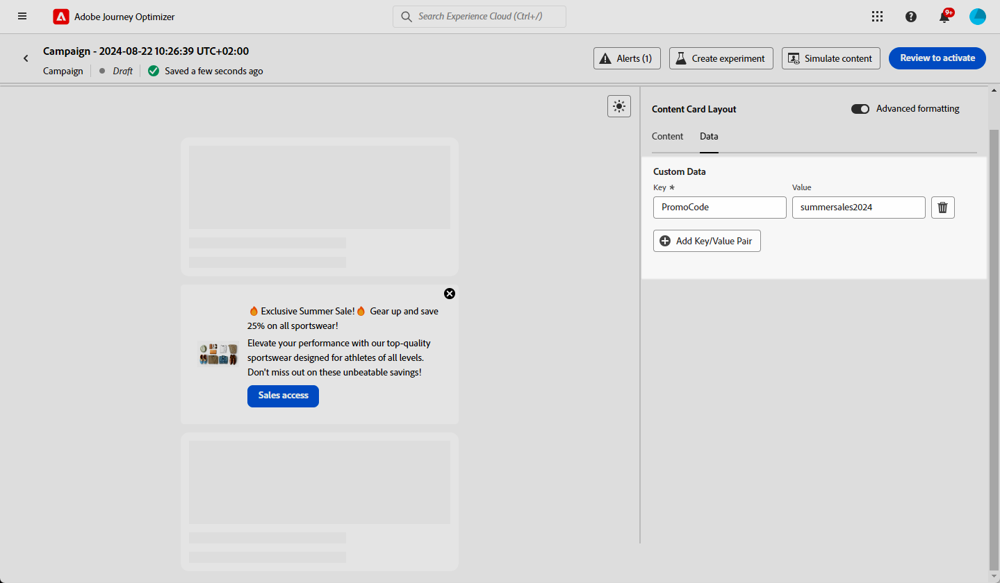

# Design content cards content {#design-content-card}

The authoring construct for Cards provides a form-based authoring experience that provides marketers with basic inputs that can be rendered by developers.

Once your content is defined and personalized, you can review and activate it. Your campaign will be sent according to the set schedule. [Learn more on this page](../campaigns/review-activate-campaign.md).

## Content card layout

From the **[!UICONTROL Content card layout]** section, choose one of the three image layout options based on your messaging requirements.

* **[!UICONTROL Small image]**: Displays a compact image alongside text, ideal for messages where content takes priority over visuals.

  See the Adobe Developer Documentation [for iOS](https://developer.adobe.com/client-sdks/edge/adobe-journey-optimizer/content-card-ui/iOS/templates/smallimage-template) and [for Android](https://developer.adobe.com/client-sdks/edge/adobe-journey-optimizer/content-card-ui/Android/public-classes/state/smallimagecarduistate) to learn more.

* **[!UICONTROL Large image]**: Features a prominent image above or beside the text, making visuals the main focus of your message.

  See the Adobe Developer Documentation [for iOS](https://developer.adobe.com/client-sdks/edge/adobe-journey-optimizer/content-card-ui/iOS/templates/largeimage-template) and [for Android](https://developer.adobe.com/client-sdks/edge/adobe-journey-optimizer/content-card-ui/Android/public-classes/state/largeimagecarduistate) to learn more.

* **[!UICONTROL Image only]**: Shows the image without accompanying text, perfect for visual-driven messages or standalone imagery.

  See the Adobe Developer Documentation [for iOS](https://developer.adobe.com/client-sdks/edge/adobe-journey-optimizer/content-card-ui/iOS/templates/imageonly-template) and [for Android](https://developer.adobe.com/client-sdks/edge/adobe-journey-optimizer/content-card-ui/Android/public-classes/state/imageonlycarduistate) to learn more.

## Scheda Contenuto {#content-tab}

From the **[!UICONTROL Content]** tab, you can customize your content cards by defining content and adding media and action buttons directly from this tab.

### Text content {#title-body}

To compose your message, enter your text in the **[!UICONTROL Title]** and **[!UICONTROL Body]** fields.

If you want to tailor your message further, use the **[!UICONTROL Personalization]** icon to add personalized elements. Per istruzioni dettagliate su come utilizzare le funzionalità di personalizzazione, consulta [questa sezione](../personalization/personalize.md).

### Media {#add-media}

Il campo **[!UICONTROL Media]** consente di migliorare le schede di contenuto aggiungendo supporti, il che può rendere la presentazione più coinvolgente per gli utenti finali.

Per includere i file multimediali, digita l&#39;URL del file multimediale che desideri utilizzare o fai clic sull&#39;icona **[!UICONTROL Seleziona Assets]** per scegliere tra le risorse memorizzate nella libreria Assets. [Ulteriori informazioni sulla gestione delle risorse](../integrations/assets.md).

+++Altre opzioni con formattazione avanzata

Se la **[!UICONTROL modalità di formattazione avanzata]** è attivata, puoi aggiungere un **[!UICONTROL testo alternativo]** per le applicazioni di lettura dello schermo e un&#39;altra risorsa nel campo **[!UICONTROL URL contenuto multimediale in modalità scura]**.

+++

### Pulsanti {#add-buttons}

Aggiungi i pulsanti per consentire agli utenti di interagire con le tue schede di contenuto.

1. Fai clic su **[!UICONTROL Aggiungi pulsante]** per creare un nuovo pulsante di azione.

1. Modifica il campo **[!UICONTROL Titolo]** del pulsante per specificare l&#39;etichetta che verrà visualizzata sul pulsante.

1. Seleziona un **[!UICONTROL evento di interazione]** per definire l&#39;azione che verrà attivata quando gli utenti fanno clic sul pulsante o interagiscono con esso.

1. Nel campo **[!UICONTROL Target]**, immetti l&#39;URL web o il collegamento diretto al quale gli utenti verranno indirizzati dopo aver interagito con il pulsante.

<!--
+++More options with advanced formatting

If the **[!UICONTROL Advanced formatting mode]** is switched on, you can choose for your **[!UICONTROL Buttons]**:

* the **[!UICONTROL Font]**
* the **[!UICONTROL Pt size]**
* the **[!UICONTROL Font Color]**
* the **[!UICONTROL Alignment]**

+++
-->

### Pulsante Ignora {#close-button}

Scegli lo **[!UICONTROL stile]** per il **[!UICONTROL pulsante Ignora]** per personalizzarne l&#39;aspetto.

Puoi scegliere uno dei seguenti stili:

* **[!UICONTROL Nessuno]**
* **[!UICONTROL Semplice]**
* **[!UICONTROL Cerchio]**

<!--
+++More options with advanced formatting

If the **[!UICONTROL Advanced formatting mode]** is switched on, you can choose for your **[!UICONTROL Header]** and **[!UICONTROL Body]**:

* the **[!UICONTROL Font]**
* the **[!UICONTROL Pt size]**
* the **[!UICONTROL Font Color]**
* the **[!UICONTROL Alignment]**
+++
-->

### Comportamento al clic

Nel campo **[!UICONTROL URL di destinazione]**, immetti l&#39;URL web o il collegamento diretto che indirizzerà gli utenti alla destinazione desiderata dopo che interagiranno con la scheda di contenuto. Potrebbe trattarsi di un sito web esterno, di una pagina specifica all’interno dell’app o di qualsiasi altra posizione in cui si desidera che gli utenti vengano indirizzati in base alla loro interazione.

## Scheda Dati

## Dati personalizzati {#custom-data}

Nella sezione **[!UICONTROL Dati personalizzati]**, fai clic su **[!UICONTROL Aggiungi coppia chiave/valore]** per includere le variabili personalizzate nel payload. Queste coppie chiave/valore ti consentono di trasmettere dati aggiuntivi, a seconda della configurazione specifica. Questo ti consente di aggiungere contenuti personalizzati o dinamici, informazioni di tracciamento o qualsiasi altro dato rilevante per la tua configurazione.
