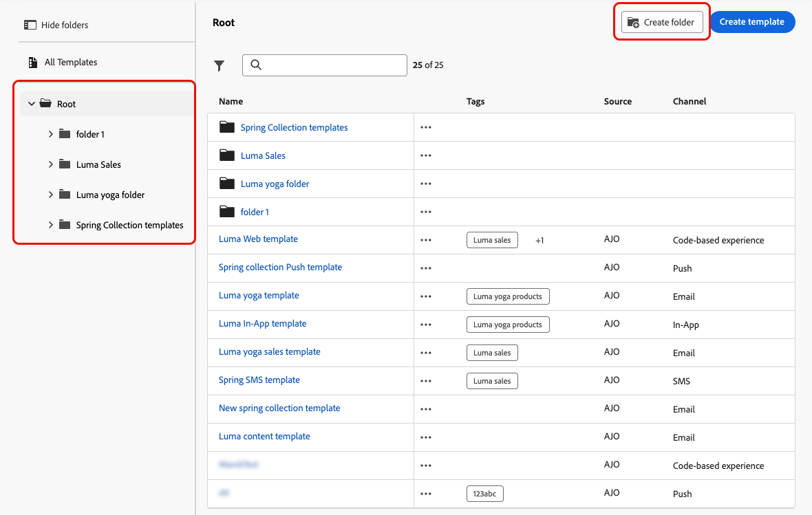

# Accesso e gestione dei modelli di contenuto {#access-manage-templates}

## Accedere ai modelli di contenuto {#access}

Per accedere all&#39;elenco dei modelli di contenuto, selezionare **[!UICONTROL Gestione contenuto]** > **[!UICONTROL Modelli di contenuto]** dal menu a sinistra.

Vengono visualizzati tutti i modelli creati nella sandbox corrente, da un percorso o da una campagna tramite l&#39;opzione **[!UICONTROL Salva come modello]** oppure dal menu **[!UICONTROL Modelli di contenuto]**. [Scopri come creare i modelli](#create-content-templates)

Il riquadro a sinistra consente di organizzare i modelli di contenuto in cartelle. Per impostazione predefinita, vengono visualizzati tutti i modelli. Quando si seleziona una cartella, vengono visualizzati solo i modelli e le cartelle inclusi nella cartella selezionata. [Ulteriori informazioni](#folders)

Per trovare un elemento specifico, inizia a digitare un nome nel campo di ricerca. Quando è selezionata una [cartella](#folders), la ricerca viene applicata a tutti i modelli di contenuto o a tutte le cartelle nel primo livello della gerarchia della cartella<!--(not nested items)-->.

Puoi ordinare i modelli di contenuto in base a:

* Tipo
* Canale
* Data di creazione o modifica
* Tag - [Ulteriori informazioni sui tag](../start/search-filter-categorize.md#tags)

È inoltre possibile scegliere di visualizzare solo gli elementi creati o modificati dall&#39;utente.

>[!NOTE]
>
>A partire da marzo 2025, i modelli di contenuto di tipo HTML sono diventati obsoleti. È comunque possibile accedere ai modelli di contenuto HTML esistenti creati in precedenza in [!DNL Journey Optimizer].

## Utilizzare le cartelle per gestire i modelli di contenuto {#folders}

Per navigare facilmente nei modelli di contenuto, utilizza le cartelle per organizzarli in modo più efficace in una gerarchia strutturata. Questo consente di categorizzare e gestire gli articoli in base alle esigenze dell&#39;organizzazione.

1. Fare clic sul pulsante **[!UICONTROL Tutti i modelli di contenuto]** per visualizzare tutti gli elementi creati in precedenza senza il raggruppamento di cartelle.

1. Fare clic sulla cartella **[!UICONTROL Root]** per visualizzare tutte le cartelle create.

   >[!NOTE]
   >
   >Se non hai ancora creato le cartelle, vengono visualizzati tutti i modelli di contenuto.

1. Fare clic su una cartella all&#39;interno della cartella **[!UICONTROL Root]** per visualizzarne il contenuto.

1. Facendo clic sulla cartella **[!UICONTROL Root]** o su qualsiasi altra cartella, viene visualizzato il pulsante **[!DNL Create folder]**. Selezionala.

   

1. Digitare un nome per la nuova cartella e fare clic su **[!UICONTROL Salva]**. La nuova cartella viene visualizzata all&#39;inizio dell&#39;elenco dei modelli di contenuto all&#39;interno della cartella **[!UICONTROL Root]** o della cartella attualmente selezionata.

1. Puoi fare clic sul pulsante **[!UICONTROL Altre azioni]** per rinominare o eliminare la cartella.

   

1. Utilizzando il pulsante **[!UICONTROL Altre azioni]**, puoi anche spostare il modello di contenuto in un&#39;altra cartella esistente.

   

1. Passa alla cartella appena creata. Ogni nuovo modello di contenuto [creato](create-content-templates.md) da qui viene salvato nella cartella corrente.

   

## Modificare ed eliminare i modelli di contenuto {#edit}

* Per modificare il contenuto di un modello, fai clic sull’elemento desiderato dall’elenco e apporta le modifiche desiderate. È inoltre possibile modificare le proprietà del modello di contenuto facendo clic sul pulsante di modifica accanto al nome del modello.

  

* Per eliminare un modello, seleziona il pulsante **[!UICONTROL Altre azioni]** accanto al modello desiderato, quindi seleziona **[!UICONTROL Elimina]**.

  

>[!NOTE]
>
>Quando si modifica o si elimina un modello, le campagne o i percorsi che includono il contenuto creato utilizzando questo modello non sono interessati.

## [!BADGE Disponibilità limitata]{type=Informative} Visualizza i modelli come miniature {#template-thumbnails}

Selezionare la modalità **[!UICONTROL Visualizzazione griglia]** per visualizzare ogni modello come miniatura.

>[!AVAILABILITY]
>
>Questa funzionalità viene rilasciata in versione a Disponibilità limitata (LA) per un set limitato di clienti.

>[!NOTE]
>
>Le miniature corrette possono essere generate solo per modelli di contenuto e-mail di tipo HTML.

Quando aggiorni il contenuto, attendi alcuni secondi prima che le modifiche vengano riportate nella miniatura.

## Esportare modelli di contenuto in un’altra sandbox {#export}

Journey Optimizer consente di copiare un modello di contenuto da una sandbox a un’altra. Ad esempio, puoi copiare un modello dall’ambiente sandbox di Stage alla sandbox di produzione.

Il processo di copia viene eseguito tramite un **pacchetto di esportazione e importazione** tra le sandbox di origine e di destinazione. Informazioni dettagliate su come esportare oggetti e importarli in una sandbox di destinazione sono disponibili in questa sezione: [Copia oggetti in un&#39;altra sandbox](../configuration/copy-objects-to-sandbox.md)

