# Personalizzare il brand {#brands-personalize}

## Informazioni sul brand {#about-brand}

Utilizza la scheda **[!UICONTROL Informazioni sul brand]** per stabilire l&#39;identità principale del brand, delineandone lo scopo, la personalità, la tagline e altri attributi di definizione.

1. Inizia compilando le informazioni fondamentali per il tuo marchio nella categoria **[!UICONTROL Dettagli chiave]**:

   * **[!UICONTROL Nome kit marchio]**: immettere il nome del kit marchio.

   * **[!UICONTROL Quando utilizzare]**: specificare scenari o contesti in cui applicare il kit del marchio.

   * **[!UICONTROL Nome marchio]**: immettere il nome ufficiale del marchio.

   * **[!UICONTROL Descrizione del marchio]**: fornisci una panoramica di ciò che questo marchio rappresenta.

   * **[!UICONTROL Tagline predefinita]**: aggiungi la tagline principale associata al brand.

     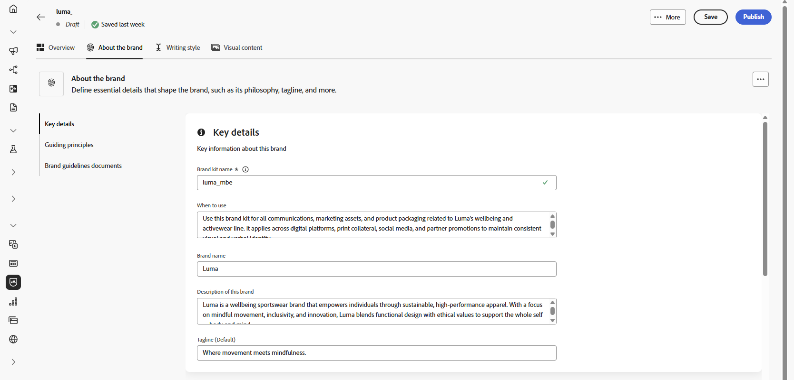

1. Nella categoria **[!UICONTROL Principi guida]**, chiarisci la direzione e la filosofia di base del tuo marchio:

   * **[!UICONTROL Missione]**: descrive in dettaglio lo scopo del tuo marchio.

   * **[!UICONTROL Visione]**: descrive l&#39;obiettivo a lungo termine o lo stato futuro desiderato.

   * **[!UICONTROL Posizionamento sul mercato]**: spiega in che modo il tuo marchio è posizionato sul mercato.

     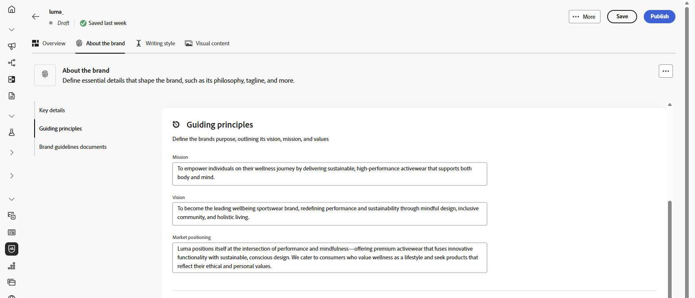

1. Dalla categoria **[!UICONTROL Valori del brand]**, fai clic su  per aggiungere i valori del brand e compilare i dettagli:

   * **[!UICONTROL Valore]**: assegna un nome a un valore del brand di base.

   * **[!UICONTROL Descrizione]**: spiega cosa significa questo valore per il tuo marchio.

   * **[!UICONTROL Comportamenti]**: delinea le azioni o gli atteggiamenti che riflettono questo valore nella pratica.

   * **[!UICONTROL Manifestazioni]**: fornisci esempi di come questo valore è espresso nel branding reale.

     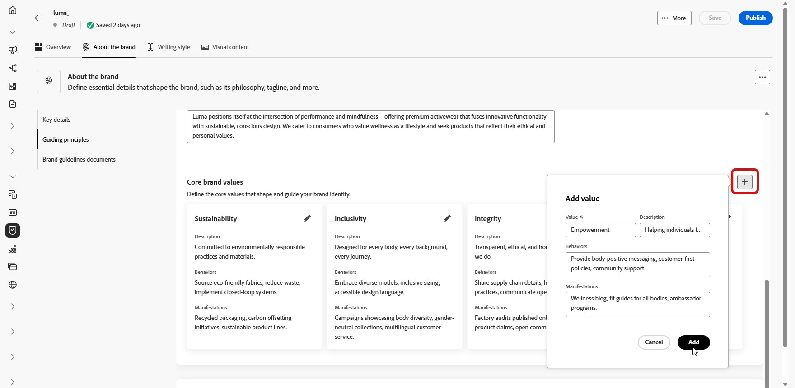

1. Se necessario, fai clic sull&#39;icona per aggiornare o eliminare uno dei valori del tuo marchio principale.

   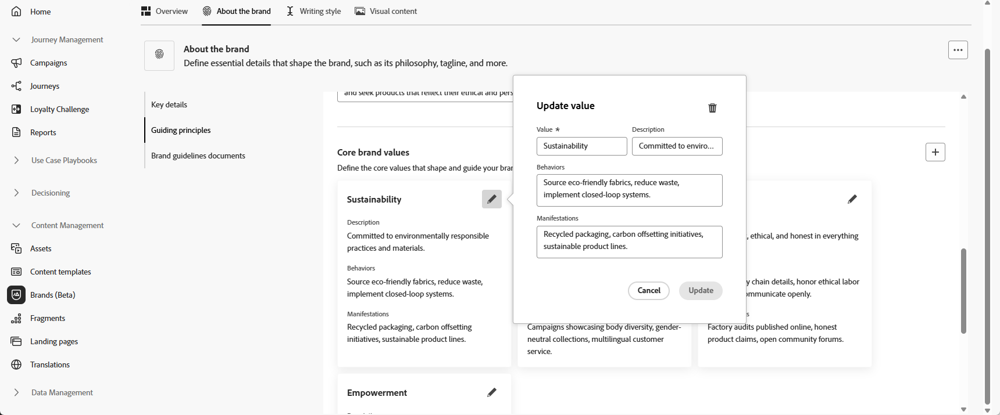

Ora puoi personalizzare ulteriormente il tuo marchio o [pubblicare il tuo marchio](brands.md#create-brand-kit).

## Stile di scrittura {#writing-style}

>[!CONTEXTUALHELP]
>id="ajo_brand_writing_style"
>title="Punteggio di allineamento dello stile di scrittura"
>abstract="La sezione Stile di scrittura definisce gli standard per lingua, formattazione e struttura al fine di garantire contenuti chiari e coerenti. Il punteggio di allineamento, valutato da alto a basso, mostra con quanta efficacia il contenuto segue queste linee guida ed evidenzia le aree da migliorare."

La sezione **[!UICONTROL Stile di scrittura]** descrive gli standard per la scrittura dei contenuti e descrive in dettaglio come utilizzare linguaggio, formattazione e struttura per mantenere chiarezza, coerenza e coerenza in tutti i materiali.

+++ Categoria ed esempi disponibili

<table>
  <thead>
    <tr>
      <th>Categoria</th>
      <th>Sottocategoria</th>
      <th>Esempio di linee guida</th>
      <th>Esempio di esclusioni</th>
    </tr>
  </thead>
  <tbody>
    <tr>
      <td rowspan="4">Standard per la creazione di contenuti</td>
      <td>Standard di messaggistica del marchio</td>
      <td>Innovazione e messaggistica personalizzata.</td>
      <td>Non esagerare con le funzionalità dei prodotti.</td>
    </tr>
    <tr>
      <td>Utilizzo tag</td>
      <td>Posiziona la tagline sotto il logo su tutte le risorse di marketing digitale.</td>
      <td>Non modificare o tradurre la tagline.</td>
    </tr>
    <tr>
      <td>Messaggistica di base</td>
      <td>Enfatizzare la dichiarazione dei principali vantaggi, ad esempio una maggiore produttività.</td>
      <td>Non utilizzare proposte di valore non correlate.</td>
    </tr>
    <tr>
      <td>Standard di denominazione</td>
      <td>Utilizza nomi semplici e descrittivi come "ProScheduler".</td>
      <td>Non utilizzare termini complessi o caratteri speciali.</td>
    </tr>
    <tr>
      <td rowspan="5">Stile di comunicazione del marchio</td>
      <td>Caratteristiche di brand personality</td>
      <td>Amichevole e accessibile.</td>
      <td>Non essere disfattista.</td>
    </tr>
    <tr>
      <td>Meccanica di scrittura</td>
      <td>Mantieni le frasi brevi e di impatto.</td>
      <td>Non usare un gergo eccessivo.</td>
    </tr>
    <tr>
      <td>Tono situazionale</td>
      <td>Mantenere un tono professionale nelle comunicazioni di crisi.</td>
      <td>Non essere sprezzante nelle comunicazioni di supporto.</td>
    </tr>
    <tr>
      <td>Linee guida per la scelta di Word</td>
      <td>Usa parole come "innovativo" e "intelligente".</td>
      <td>Evita parole come "economico" o "hack".</td>
    </tr>
    <tr>
      <td>Standard linguistici</td>
      <td>Segui le convenzioni inglesi americane.</td>
      <td>Non mescolare ortografia britannica con quella americana.</td>
    </tr>
    <tr>
      <td rowspan="3">Standard di conformità legale</td>
      <td>Norme sui marchi</td>
      <td>Utilizza sempre il simbolo ™ o ®.</td>
      <td>Non omettere i simboli legali quando necessario.</td>
    </tr>
    <tr>
      <td>Standard di copyright</td>
      <td>Includi avvisi di copyright sul materiale di marketing.</td>
      <td>Non utilizzare contenuti di terze parti senza autorizzazione.</td>
    </tr>
    <tr>
      <td>Standard disclaimer</td>
      <td>Visualizzare le liberatorie in modo leggibile sulle risorse digitali.</td>
      <td>Non nascondere le liberatoria in aree non visibili.</td>
    </tr>
</table>

+++

 

Per personalizzare lo **[!UICONTROL stile di scrittura]**:

1. Dalla scheda **[!UICONTROL Stile scrittura]**, fare clic su  per aggiungere una linea guida, un&#39;eccezione o un&#39;esclusione.

1. Immettere la linea guida, l&#39;eccezione o l&#39;esclusione. Puoi anche includere **[!UICONTROL Esempi]** per illustrare meglio come deve essere applicato.

   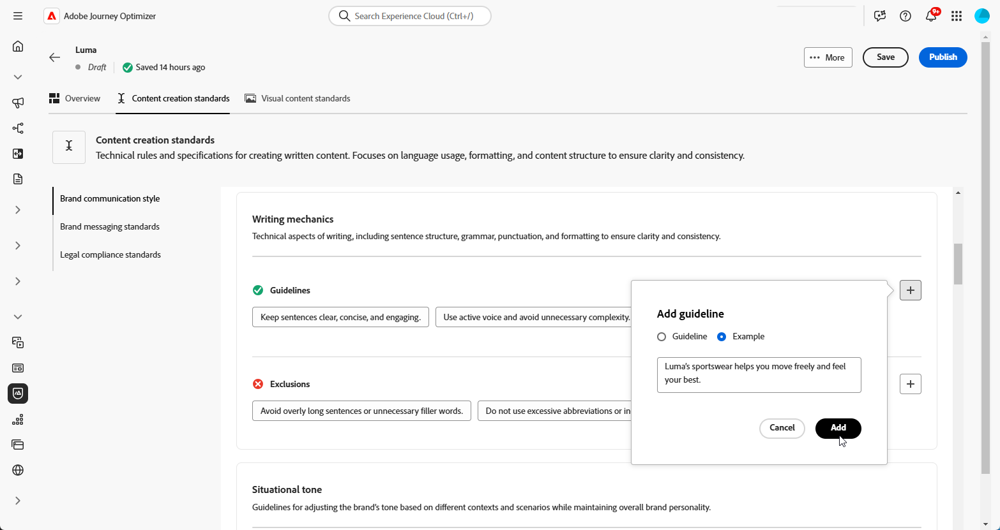

1. Specifica il **contesto di utilizzo** per la linea guida, l&#39;eccezione o l&#39;esclusione:

   * **[!UICONTROL Tipo di canale]**: scegli dove applicare questa linea guida, eccezione o esclusione. Ad esempio, potrebbe essere necessario visualizzare uno stile di scrittura specifico solo nei canali di posta elettronica, mobile, stampa o altri canali di comunicazione.

   * **[!UICONTROL Tipo di elemento]**: specifica a quale elemento di contenuto si applica la regola. Può includere elementi come Intestazioni, Pulsanti, Collegamenti o altri componenti all’interno del contenuto.

     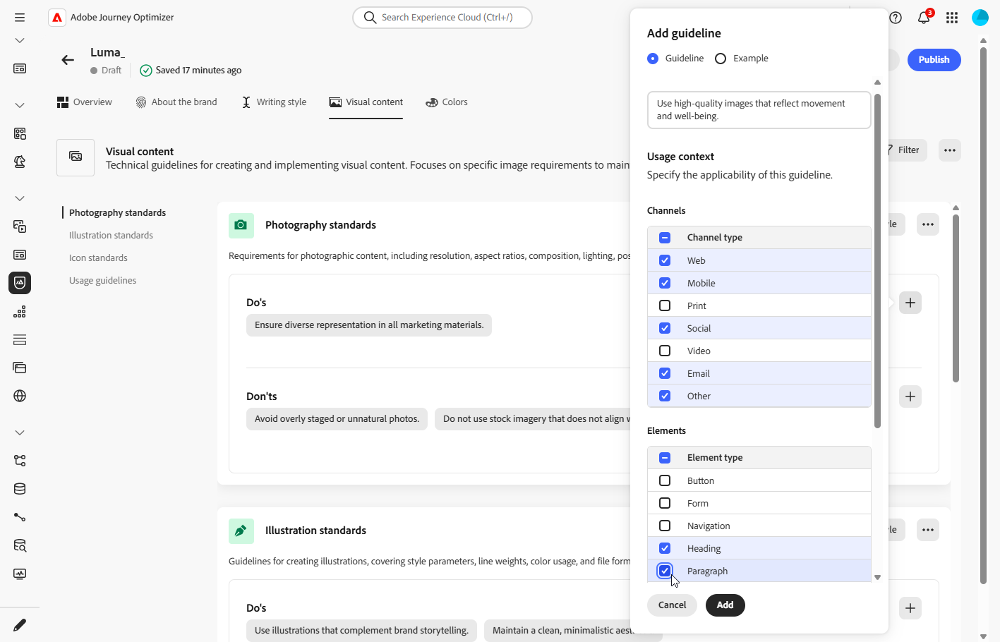

1. Dopo aver impostato la linea guida, l&#39;eccezione o l&#39;esclusione, fai clic su **[!UICONTROL Aggiungi]**.

1. Se necessario, seleziona una linea guida o un’esclusione da aggiornare o eliminare.

1. Fai clic sul  per modificare l&#39;esempio o sull&#39;icona  per eliminarlo.

   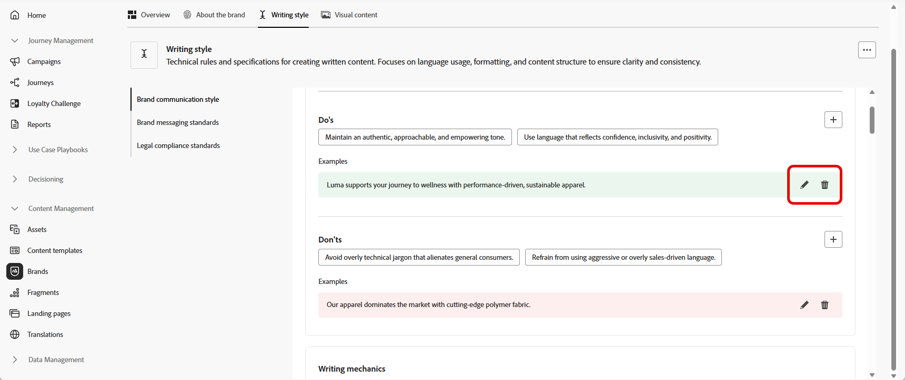

Ora puoi personalizzare ulteriormente il tuo marchio o [pubblicare il tuo marchio](#create-brand-kit).

## Contenuto visivo {#visual-content}

>[!CONTEXTUALHELP]
>id="ajo_brand_imagery"
>title="Punteggio di allineamento del contenuto visivo"
>abstract="Il punteggio di allineamento del contenuto visivo, indica con quanta efficacia il contenuto corrisponde alle linee guida del brand configurate. Con una valutazione da alto a basso, consente di stimare l’allineamento all’instante. Esplora le diverse categorie per identificare le aree da migliorare e individuare gli elementi che potrebbero non rispecchiare il brand."

La sezione **[!UICONTROL Contenuto visivo]** definisce gli standard per le immagini e la progettazione, specificando le specifiche necessarie per mantenere un aspetto del marchio unificato e coerente.

+++ Categorie ed esempi disponibili

<table>
  <thead>
    <tr>
      <th>Categoria</th>
      <th>Esempio di linee guida</th>
      <th>Esempio di esclusioni</th>
    </tr>
  </thead>
  <tbody>
    <tr>
      <td>Standard per la fotografia</td>
      <td>Utilizza l'illuminazione naturale per le riprese in esterni.</td>
      <td>Evita le immagini eccessivamente modificate o con pixel.</td>
    </tr>
    <tr>
      <td>Standard illustrazione</td>
      <td>Utilizza stili puliti e minimalisti.</td>
      <td>Evita di essere troppo complessi.</td>
    </tr>
    <tr>
      <td>Icona standard</td>
      <td>Utilizza un sistema di griglia a 24 px coerente.</td>
      <td>Non combinare le dimensioni delle icone, non utilizzare pesi di traccia incoerenti o non discostarsi dalle regole della griglia.</td>
    </tr>
    <tr>
      <td>Linee guida sull’utilizzo</td>
      <td>Scegliete uno stile di vita che rifletta i clienti reali che usano il prodotto in ambienti professionali.</td>
      <td>Non utilizzare immagini che contraddicono il tono del marchio o che appaiono fuori contesto.</td>
    </tr>
</table>

+++

 

Per personalizzare il **[!UICONTROL contenuto visivo]**:

1. Dalla scheda **[!UICONTROL Contenuto visivo]**, fai clic su  per aggiungere una linea guida, un&#39;esclusione o un esempio.

1. Inserisci la linea guida, l’esclusione o l’esempio.

   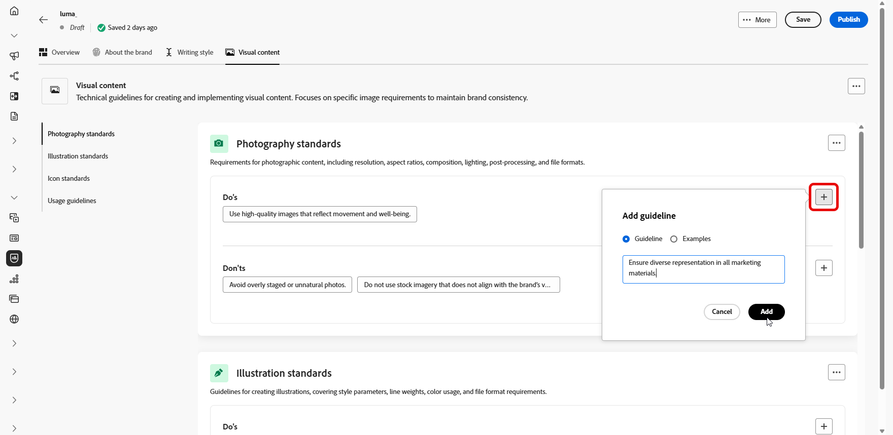

1. Specifica il **contesto di utilizzo** per la linea guida o l&#39;esclusione:

   * **[!UICONTROL Tipo di canale]**: scegli dove applicare questa linea guida, eccezione o esclusione. Ad esempio, potrebbe essere necessario visualizzare uno stile di scrittura specifico solo nei canali di posta elettronica, mobile, stampa o altri canali di comunicazione.

   * **[!UICONTROL Tipo di elemento]**: specifica a quale elemento di contenuto si applica la regola. Può includere elementi come Intestazioni, Pulsanti, Collegamenti o altri componenti all’interno del contenuto.

     

1. Dopo aver impostato la linea guida, l&#39;eccezione o l&#39;esclusione, fai clic su **[!UICONTROL Aggiungi]**.

1. Per aggiungere un&#39;immagine che mostra l&#39;utilizzo corretto, selezionare **[!UICONTROL Esempio]** e fare clic su **[!UICONTROL Seleziona immagine]**. È inoltre possibile aggiungere un’immagine che mostra un utilizzo errato come esempio di esclusione.

   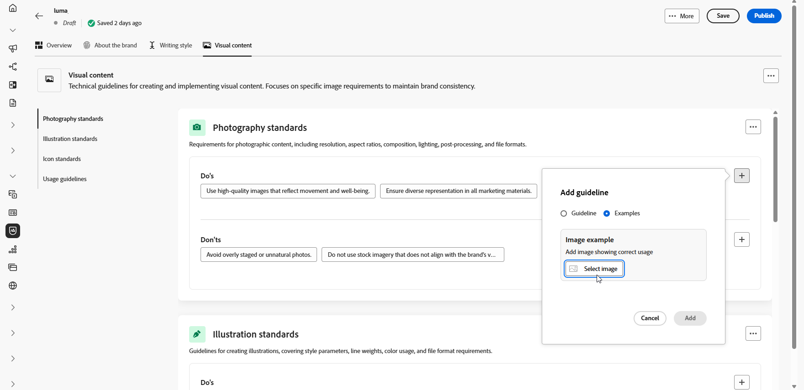

1. Se necessario, seleziona una linea guida o un’esclusione da aggiornare o eliminare.

1. Seleziona un esempio per aggiornarlo, sostituisci l&#39;immagine o fai clic sull&#39;icona per eliminarlo.

   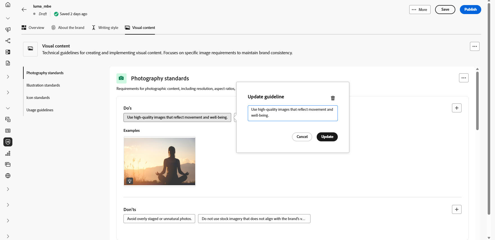

Ora puoi personalizzare ulteriormente il tuo marchio o [pubblicare il tuo marchio](brands.md#create-brand-kit).

<!--
## Colors {#colors}

The **[!UICONTROL Colors]** section the standards for your brand's color system, outlining how colors are selected, organized, and applied across experiences. It ensures consistent use of primary, secondary, accent, and neutral colors to maintain a cohesive, accessible, and recognizable brand identity.

+++ Available categories and examples

<table>
  <thead>
    <tr>
      <th>Category</th>
      <th>Guidelines Example</th>
      <th>Exclusions Example</th>
    </tr>
  </thead>
  <tbody>
    <tr>
      <td>Primary colors</td>
      <td>Use primary brand colors for logos, headers, and main call-to-action elements.</td>
      <td>Do not substitute or modify primary brand colors.</td>
    </tr>
    <tr>
      <td>Secondary colors</td>
      <td>Use secondary colors to support layouts, illustrations, and UI components.</td>
      <td>Do not let secondary colors overpower primary brand colors.</td>
    </tr>
    <tr>
      <td>Accent colors</td>
      <td>Use accent colors sparingly for buttons, links, and alerts.</td>
      <td>Do not use accent colors for large background areas.</td>
    </tr>
    <tr>
      <td>Neutral colors</td>
      <td>Use neutral colors for text, dividers, borders, and subtle UI elements.</td>
      <td>Avoid using neutrals with poor contrast or heavy color casts.</td>
    </tr>
    <tr>
      <td>Background colors</td>
      <td>Use light or neutral backgrounds to ensure readability and visual clarity.</td>
      <td>Do not place text or logos on low-contrast backgrounds.</td>
    </tr>
    <tr>
      <td>Additional colors</td>
      <td>Use additional colors only for data visualization or approved campaigns.</td>
      <td>Do not introduce unapproved or off-brand colors.</td>
    </tr>
    <tr>
      <td>Color scales</td>
      <td>Use approved tints and shades for UI states such as hover, active, and disabled.</td>
      <td>Do not create unofficial shades or gradients.</td>
    </tr>
    <tr>
      <td>Usage guidelines</td>
      <td>Maintain consistent color usage and accessible contrast across all assets.</td>
      <td>Do not mix conflicting palettes or apply colors inconsistently.</td>
    </tr>
</table>

+++

 

To personalize your **[!UICONTROL Colors]**:

1. From the **[!UICONTROL Colors]** tab, click  to add a color, guideline or exclusion. 

1. Enter your color information to define it accurately:

    * **Color name**: Provide a clear, descriptive name to identify the color within your brand system.

    * **Color value**: Choose your color using the hue picker or enter precise values using RGB, HEX, or Pantone name/code to ensure consistency across digital and print assets.

    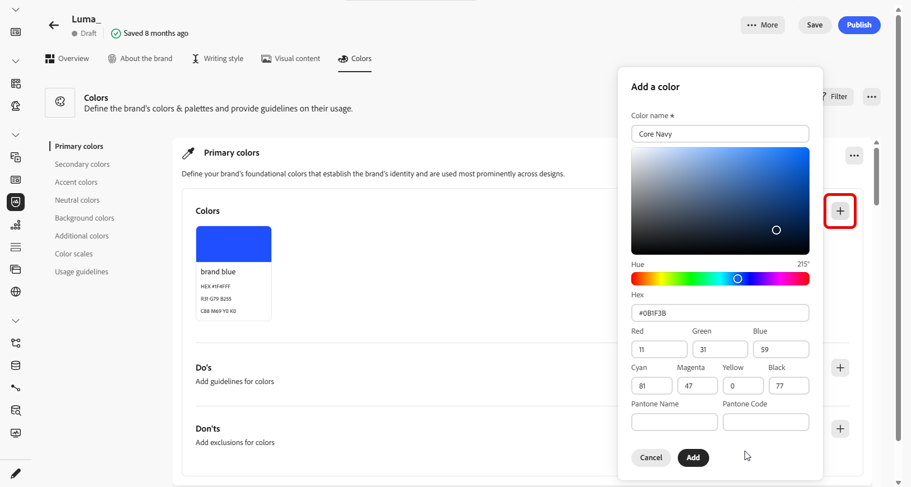

1. Review your selection to confirm accuracy and visual consistency and click **[!UICONTROL Add]** to save your color.

1. Then, enter your guideline or exclusion.

1. Specify the Usage context for your guideline or exclusion:

    * **[!UICONTROL Channel type]**: Choose where this guideline, exception, or exclusion should apply. For example, you may want a specific writing style to appear only in Email, Mobile, Prints, or other communication channels.

    * **[!UICONTROL Element type]**: Specify which content element the rule applies to. This could include elements such as Headings, Buttons, Links, or other components within your content.

      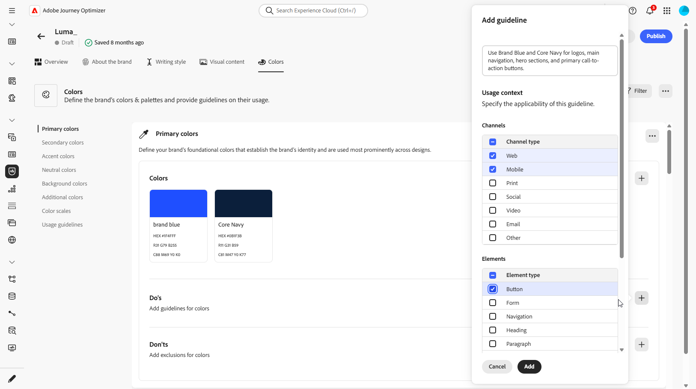
  
1. Once your guideline, exception, or exclusion is set up, click **[!UICONTROL Add]**. 

1. If needed, select one of your guideline or exclusion to update or delete.

1. Select one your guideline or exclusion to update it. Click the icon to delete it. 

    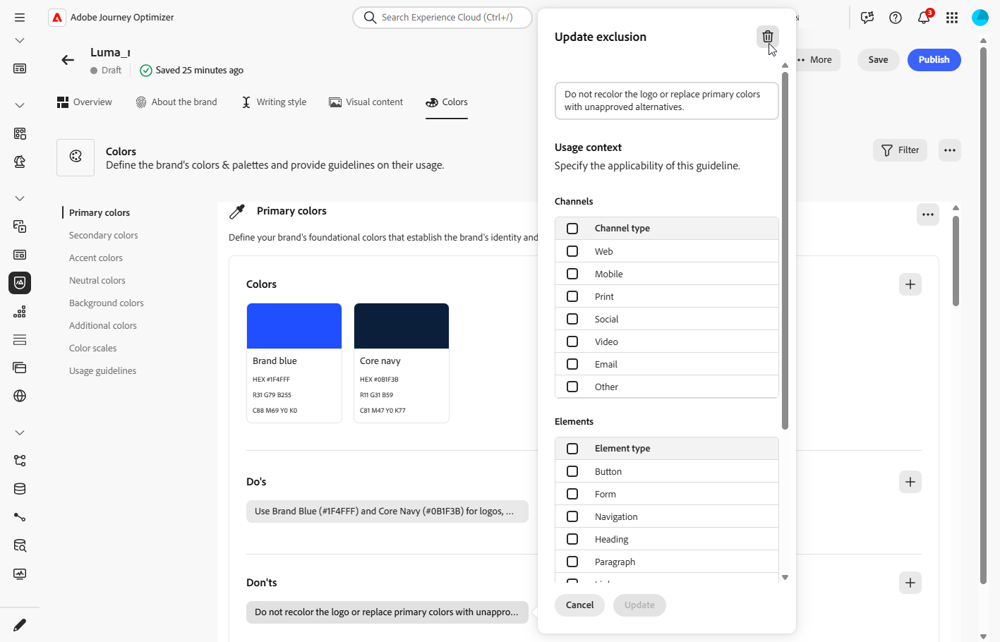

1. Click **[!UICONTROL Add group]** to define additional colors for your brand or to add a color scale group.

You can now further personalize your brand or [publish your brand](brands.md#create-brand-kit).

-->