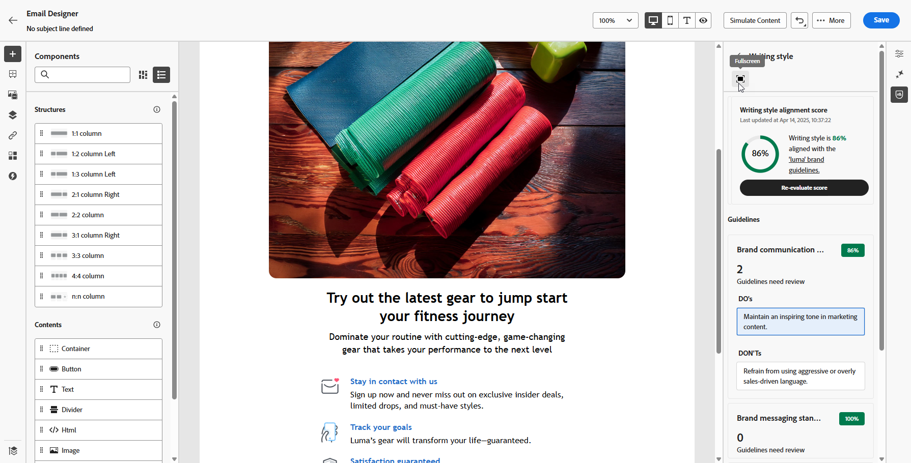
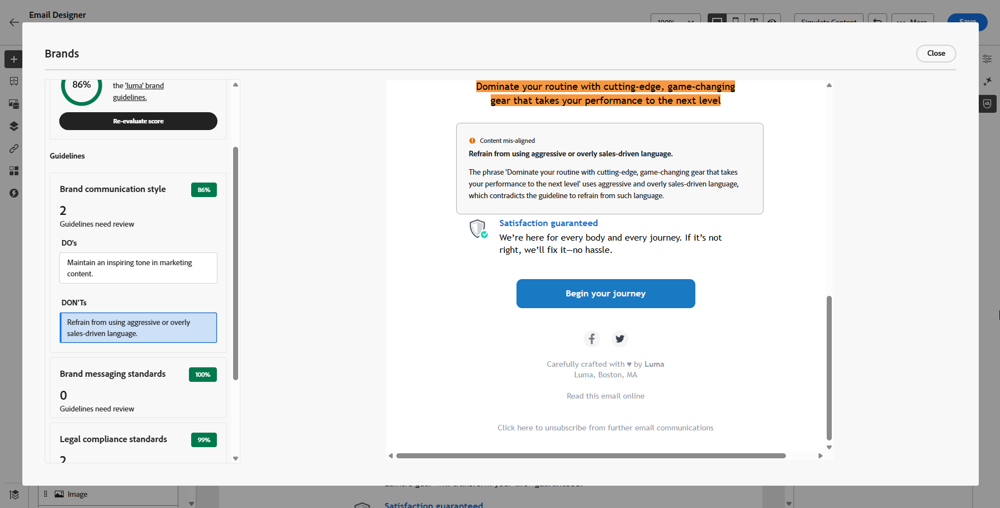

# Allineamento del brand {#brands-score}

>[!CONTEXTUALHELP]
>id="ajo_brand_score"
>title="Punteggio di allineamento del brand"
>abstract="Il punteggio di allineamento del brand misura quanto i contenuti rispettano le rispettive linee guida, garantendo coerenza in termini di colori, font, logo, immagini e stile di scrittura."

>[!CONTEXTUALHELP]
>id="ajo_brand_colors"
>title="Punteggio colori"
>abstract="Punteggio colori"

>[!CONTEXTUALHELP]
>id="ajo_brand_fonts"
>title="Punteggio font"
>abstract="Punteggio font"

>[!CONTEXTUALHELP]
>id="ajo_brand_logos"
>title="Punteggio logo"
>abstract="Punteggio logo"

>[!AVAILABILITY]
>
>Prima di poter utilizzare l&#39;Assistente di intelligenza artificiale in Adobe Journey Optimizer, devi accettare il [contratto utente](https://www.adobe.com/it/legal/licenses-terms/adobe-dx-gen-ai-user-guidelines.html){target="_blank"}. Per ulteriori informazioni, contatta il tuo rappresentante Adobe.

La funzione di Allineamento dei marchi consente di creare, rivedere e gestire contenuti conformi alle linee guida del brand. Garantisce coerenza nel tono, nella messaggistica e nell’identità visiva in tutte le campagne e-mail, fungendo anche da controllo di qualità prima che il contenuto venga pubblicato.

## Convalidare i contenuti con l’allineamento del brand {#validate-content}

Una volta [configurato e pubblicato il brand](brands.md), valuta il tuo punteggio di allineamento del brand direttamente all&#39;interno della tua campagna e-mail per garantire che il contenuto sia allineato alle linee guida del brand:

1. Crea la tua [campagna e-mail](../campaigns/create-campaign.md).

1. Apri il menu **[!UICONTROL Allineamento marchio]** nel Designer e-mail.

   Il contenuto viene valutato automaticamente in base al marchio predefinito. [Scopri come assegnare un marchio predefinito](brands.md).

   

1. Per valutare utilizzando un marchio diverso, selezionalo dal menu a discesa **[!UICONTROL Marchio]** e fai clic su **[!UICONTROL Rivaluta punteggio]**.

   

1. Sfoglia il **Punteggio di allineamento del marchio** (Alto, Medium, Basso) e rivedi il feedback dettagliato.

1. Fai clic sull&#39;icona  per visualizzare ulteriori informazioni sul punteggio.

   

1. Seleziona una linea guida segnalata per visualizzare feedback e suggerimenti specifici.

   

1. Modifica i contenuti in base ai consigli per migliorare l’allineamento del brand.

1. Rivaluta manualmente il contenuto dopo aver apportato modifiche per aggiornare il punteggio di allineamento.

## Video dimostrativo {#video}

Il video seguente mostra come creare e personalizzare i propri marchi per definire chiaramente la propria identità visiva e verbale nelle comunicazioni.

+++ Guarda il video

>[!VIDEO](https://video.tv.adobe.com/v/3470554/?captions=ita&learn=on)

+++
