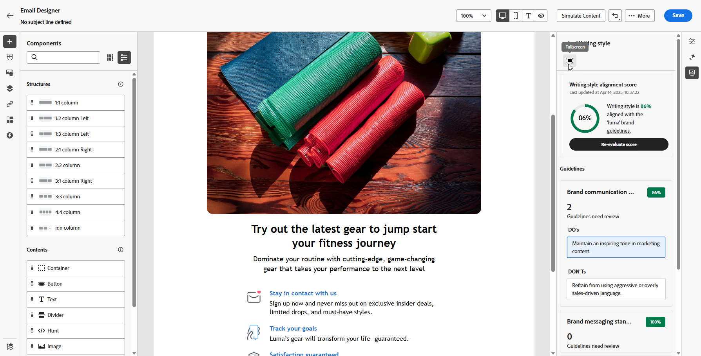

# Allineamento del brand {#brands-score}

>[!CONTEXTUALHELP]
>id="ajo_brand_score"
>title="Punteggio di allineamento del brand"
>abstract="Il punteggio di allineamento del brand misura quanto i contenuti rispettano le rispettive linee guida, garantendo coerenza in termini di colori, font, logo, immagini e stile di scrittura."

>[!CONTEXTUALHELP]
>id="ajo_brand_colors"
>title="Punteggio colori"
>abstract="Punteggio colori"

>[!CONTEXTUALHELP]
>id="ajo_brand_fonts"
>title="Punteggio font"
>abstract="Punteggio font"

>[!CONTEXTUALHELP]
>id="ajo_brand_logos"
>title="Punteggio logo"
>abstract="Punteggio logo"

>[!AVAILABILITY]
>
>Prima di poter utilizzare l&#39;Assistente di intelligenza artificiale in Adobe Journey Optimizer, devi accettare il [contratto utente](https://www.adobe.com/it/legal/licenses-terms/adobe-dx-gen-ai-user-guidelines.html){target="_blank"}. Per ulteriori informazioni, contatta il tuo rappresentante Adobe.

La funzione di Allineamento dei marchi consente di creare, rivedere e gestire contenuti conformi alle linee guida del brand. Garantisce coerenza nel tono, nella messaggistica e nell’identità visiva in tutte le campagne e-mail, fungendo anche da controllo di qualità prima che il contenuto venga pubblicato.

## Convalidare i contenuti con l’allineamento del brand {#validate-content}

Una volta [configurato e pubblicato il brand](brands.md), valuta il tuo punteggio di allineamento del brand direttamente all&#39;interno della tua campagna e-mail per garantire che il contenuto sia allineato alle linee guida del brand:

1. Crea la tua [campagna e-mail](../campaigns/create-campaign.md).

1. Apri il menu **[!UICONTROL Allineamento marchio]** nel Designer e-mail.

   Il contenuto viene valutato automaticamente in base al marchio predefinito. [Scopri come assegnare un marchio predefinito](brands.md).

   

1. Per valutare utilizzando un marchio diverso, selezionalo dal menu a discesa **[!UICONTROL Marchio]** e fai clic su **[!UICONTROL Valuta punteggio]**.

   

1. Sfoglia lo **[!UICONTROL stile di scrittura]** o il **[!UICONTROL contenuto visivo]** per visualizzare ulteriori informazioni sul punteggio.

   

1. Fai clic sull&#39;icona  per visualizzare ulteriori informazioni sul punteggio.

   

1. Seleziona una linea guida segnalata per visualizzare feedback e suggerimenti specifici. L’allineamento del brand valuta le seguenti categorie:

   * **[!UICONTROL Stile scrittura]**:
      * **[!UICONTROL Stile di comunicazione del marchio]**: definisce la personalità e il tono emotivo per garantire una voce coerente del marchio su tutti i canali.
      * **[!UICONTROL Standard di messaggistica del marchio]**: regole strutturali e di formattazione per un efficace testo di marketing e promozionale.
      * **[!UICONTROL Standard di conformità legale]**: garantisce che tutte le comunicazioni siano conformi ai requisiti legali, inclusi il posizionamento di testo e le liste di controllo di conformità.

   * **[!UICONTROL Contenuto visivo]**:
      * **[!UICONTROL Standard per la fotografia]**: requisiti per il contenuto fotografico, inclusi risoluzione, composizione, illuminazione e formati di file.
      * **[!UICONTROL Standard illustrazione]**: parametri di stile, spessore delle linee, utilizzo del colore e requisiti di formato file per le illustrazioni.
      * **[!UICONTROL Standard icona]**: specifiche per la progettazione delle icone, inclusi i sistemi di griglia, lo spessore della traccia e il dimensionamento per l&#39;uniformità.
      * **[!UICONTROL Linee guida per l&#39;utilizzo]**: best practice per la selezione, il posizionamento e il contesto delle immagini per mantenere l&#39;identità del brand.

   

1. Modifica i contenuti in base ai consigli per migliorare l’allineamento del brand.

1. Rivaluta manualmente il contenuto dopo aver apportato modifiche per aggiornare il punteggio di allineamento.

## Convalidare la qualità dei contenuti {#validate-quality}

>[!NOTE]
>
>La valutazione della qualità dei contenuti è indipendente dalle linee guida del brand. Anche se un brand è selezionato nel menu a discesa, le sue linee guida non vengono applicate al controllo di qualità. La selezione del brand è pertinente solo per il punteggio di allineamento del brand.

Oltre all’allineamento del brand, puoi valutare la qualità generale dei contenuti per identificare potenziali problemi di leggibilità, coerenza ed efficacia dei contenuti, indipendentemente dalle linee guida del brand.

Per valutare la qualità dei contenuti:

1. Crea la tua [campagna e-mail](../campaigns/create-campaign.md).

1. Apri il menu **[!UICONTROL Allineamento marchio]** nel Designer e-mail.

   

1. Fai clic su **[!UICONTROL Valuta punteggio]** per generare sia l&#39;allineamento del brand che i punteggi di qualità del contenuto.

   

1. Passa alla scheda **[!UICONTROL Qualità generale]** per rivedere approfondimenti e consigli sulla qualità dei contenuti.

   

1. Fai clic sull&#39;icona  per una visualizzazione dettagliata del punteggio di qualità.

   

1. Seleziona qualsiasi elemento contrassegnato per visualizzare feedback specifici e suggerimenti fruibili per il miglioramento. I punteggi si basano sulle seguenti categorie:

   * **[!UICONTROL Efficacia di CTA]**: valuta il livello di efficacia del call-to-action nel motivare i lettori a intraprendere l&#39;azione desiderata.
   * **[!UICONTROL Oggetto]**: valuta la chiarezza, la rilevanza e la qualità che attira l&#39;attenzione per incoraggiare l&#39;apertura delle e-mail.
   * **[!UICONTROL Leggibilità]**: misura la facilità di comprensione del contenuto da parte dei lettori.
   * **[!UICONTROL Controllo spam]**: identifica i trigger di posta indesiderata comuni che possono influire sul recapito messaggi.
   * **[!UICONTROL Coerenza dei contenuti]**: assicura un flusso fluido dei contenuti e la loro permanenza nell&#39;argomento.
   * **[!UICONTROL Correzione]**: verifica la presenza di problemi di ortografia, grammatica e chiarezza.

   

1. Modifica i contenuti in base ai consigli per migliorarne la leggibilità, la coerenza e la qualità complessiva.

1. Fai clic su **[!UICONTROL Rivaluta il punteggio]** dopo aver apportato modifiche per aggiornare il punteggio di qualità.

## Video introduttivo {#video}

Il video seguente mostra come creare e personalizzare i propri marchi per definire chiaramente la propria identità visiva e verbale nelle comunicazioni.

+++ Guarda il video

>[!VIDEO](https://video.tv.adobe.com/v/3470544/?learn=on)

+++
