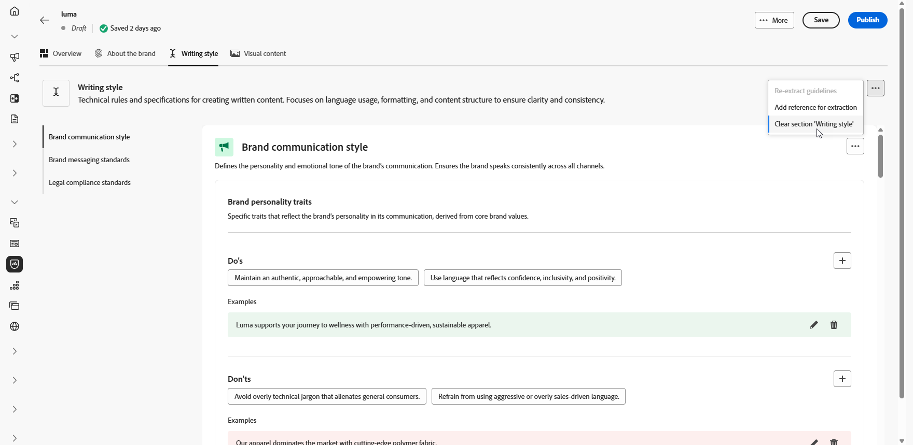
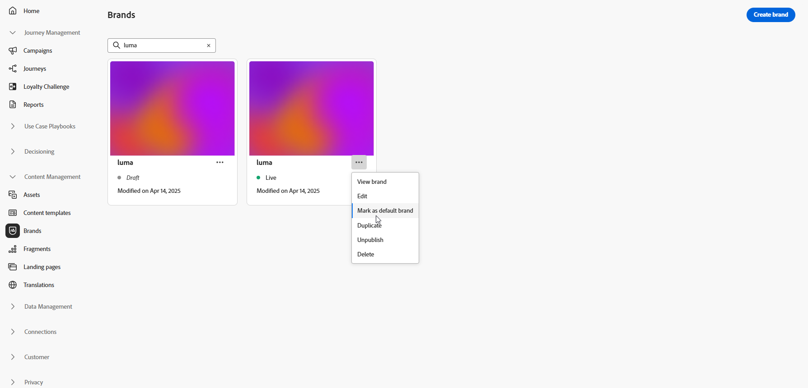
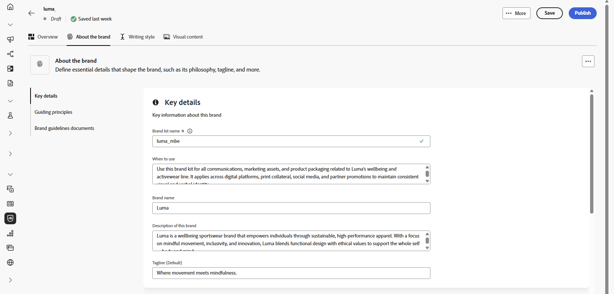
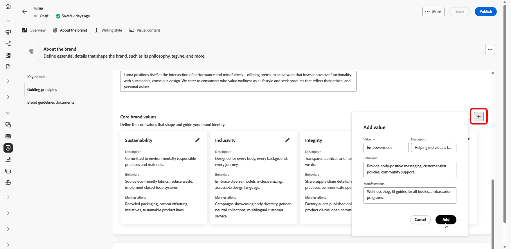

# Creare e gestire i brand personali {#brands}

>[!CONTEXTUALHELP]
>id="ajo_brand_overview"
>title="Introduzione ai brand"
>abstract="Crea e personalizza i tuoi brand per definire la tua identità visiva e verbale unica e allo stesso tempo semplificare la generazione di contenuti che corrispondono allo stile e alla voce del tuo brand."

>[!CONTEXTUALHELP]
>id="ajo_brand_ai_menu"
>title="Selezionare il brand"
>abstract="Scegli il tuo brand per assicurarti che tutti i contenuti generati dall’intelligenza artificiale siano personalizzati in base alle specifiche e alle linee guida del tuo brand."

>[!CONTEXTUALHELP]
>id="ajo_brand_score_overview"
>title="Selezione del brand"
>abstract="Seleziona il tuo brand per assicurarti che i contenuti siano realizzati in conformità con le linee guida, gli standard e l’identità specifici, mantenendo la coerenza e l’integrità del brand."

Le linee guida per il marchio sono un set dettagliato di regole e standard che stabiliscono l’identità visiva e verbale di un marchio. Essi fungono da riferimento per mantenere una rappresentazione coerente del marchio su tutte le piattaforme di marketing e comunicazione.

In [!DNL Journey Optimizer], ora puoi inserire e organizzare manualmente i dettagli del tuo marchio o caricare documenti di linee guida per l&#39;estrazione automatica delle informazioni.

>[!AVAILABILITY]
>
>Prima di poter utilizzare l&#39;Assistente di intelligenza artificiale in Adobe Journey Optimizer, devi accettare il [contratto utente](https://www.adobe.com/it/legal/licenses-terms/adobe-dx-gen-ai-user-guidelines.html){target="_blank"}. Per ulteriori informazioni, contatta il tuo rappresentante Adobe.

## Accedere ai brand {#generative-access}

Per accedere al menu **[!UICONTROL Brands]** in [!DNL Adobe Journey Optimizer], gli utenti devono disporre delle autorizzazioni **[!UICONTROL Manage brand kit]** o **[!UICONTROL Enable AI Assistant]**. [Ulteriori informazioni](../administration/permissions.md)

+++  Scopri come assegnare le autorizzazioni relative al brand

Per assegnare le autorizzazioni per i brand, effettua le seguenti operazioni:

1. Nel prodotto **Autorizzazioni**, passa alla scheda **Ruoli** e seleziona il **Ruolo** desiderato.

1. Fai clic su **Modifica** per modificare le autorizzazioni.

1. Aggiungi la risorsa **Assistente AI**, quindi seleziona **Gestisci brand kit** o **[!UICONTROL Abilita assistente AI]** dal menu a discesa.

   Si noti che l&#39;autorizzazione **[!UICONTROL Abilita Assistente Ia]** fornisce accesso in sola lettura al menu **[!UICONTROL Marchi]**.

   {zoomable="yes"}

1. Fai clic su **Salva** per applicare le modifiche.

   Le autorizzazioni degli utenti già assegnati a questo ruolo verranno aggiornate automaticamente.

1. Per assegnare questo ruolo a nuovi utenti, passa alla scheda **Utenti** nella dashboard **Ruoli** e fai clic su **Aggiungi utente**.

1. Immetti il nome o l’indirizzo e-mail dell’utente o sceglilo dall’elenco e fai clic su **Salva**.

1. Se l’utente non è già stato creato in precedenza, consulta [questa documentazione](https://experienceleague.adobe.com/it/docs/experience-platform/access-control/abac/permissions-ui/users).

+++

## Creazione e gestione del brand {#create-brand-kit}

>[!CONTEXTUALHELP]
>id="ajo_brands_create"
>title="Creare il brand"
>abstract="Inserisci il nome e carica il file delle linee guida del brand. Lo strumento estrarrà automaticamente i dettagli chiave, semplificando il mantenimento dell’identità del brand."

Per creare e gestire la linea guida del brand, puoi inserire i dettagli personalmente o caricare il documento di linee guida del brand per estrarre automaticamente le informazioni:

1. Nel menu **[!UICONTROL Marchi]**, fai clic su **[!UICONTROL Crea marchio]**.

   

1. Immetti un **[!UICONTROL Nome]** per il tuo marchio.

1. Trascina e rilascia o seleziona il file per caricare le linee guida per il brand ed estrarre automaticamente le informazioni rilevanti per il brand. Fai clic su **[!UICONTROL Crea marchio]**.

   Il processo di estrazione delle informazioni ora inizia. Il completamento potrebbe richiedere alcuni minuti.

   

1. I contenuti e gli standard di creazione visiva vengono ora compilati automaticamente. Sfoglia le diverse schede per adattare le informazioni in base alle esigenze. [Ulteriori informazioni](#personalize)

1. Dal menu avanzato di ogni sezione o categoria, puoi aggiungere riferimenti per estrarre automaticamente le informazioni rilevanti sul brand.

   Per rimuovere il contenuto esistente, utilizzare le opzioni **[!UICONTROL Cancella sezione]** o **[!UICONTROL Cancella categoria]**.

   

1. Una volta configurata, fai clic su **[!UICONTROL Salva]**, quindi su **[!UICONTROL Pubblica]** per rendere disponibili le linee guida per il brand in AI Assistant.

1. Per apportare modifiche al tuo marchio pubblicato, fai clic su **[!UICONTROL Modifica marchio]**.

   >[!NOTE]
   >
   >In questo modo viene creata una copia temporanea in modalità di modifica, che sostituisce la versione live pubblicata.

   

1. Dal dashboard **[!UICONTROL Brands]**, apri il menu avanzato facendo clic sull&#39;icona  per:

   * Visualizza marchio
   * Modifica
   * Duplica
   * Pubblicazione
   * Annulla pubblicazione
   * Elimina

   

Le linee guida del brand sono ora accessibili dal menu a discesa **[!UICONTROL Brand]** nell&#39;Assistente di intelligenza artificiale, consentendogli di generare contenuti e risorse in linea con le tue specifiche. [Ulteriori informazioni sull&#39;Assistente IA](gs-generative.md)

### Imposta un marchio predefinito {#default-brand}

Puoi designare un marchio predefinito da applicare automaticamente durante la generazione del contenuto e il calcolo dei punteggi di allineamento durante la creazione della campagna.

Per impostare un marchio predefinito, vai alla dashboard **[!UICONTROL Marchi]**. Apri il menu avanzato facendo clic sull&#39;icona  e seleziona **[!UICONTROL Contrassegna come marchio predefinito]**.

## Personalizzare il brand {#personalize}

### Informazioni sul brand {#about-brand}

Utilizza la scheda **[!UICONTROL Informazioni sul brand]** per stabilire l&#39;identità principale del brand, delineandone lo scopo, la personalità, la tagline e altri attributi di definizione.

1. Inizia compilando le informazioni fondamentali per il tuo marchio nella categoria **[!UICONTROL Dettagli chiave]**:

   * **[!UICONTROL Nome kit marchio]**: immettere il nome del kit marchio.

   * **[!UICONTROL Quando utilizzare]**: specificare scenari o contesti in cui applicare il kit del marchio.

   * **[!UICONTROL Nome marchio]**: immettere il nome ufficiale del marchio.

   * **[!UICONTROL Descrizione del marchio]**: fornisci una panoramica di ciò che questo marchio rappresenta.

   * **[!UICONTROL Tagline predefinita]**: aggiungi la tagline principale associata al brand.

     

1. Nella categoria **[!UICONTROL Principi guida]**, chiarisci la direzione e la filosofia di base del tuo marchio:

   * **[!UICONTROL Missione]**: descrive in dettaglio lo scopo del tuo marchio.

   * **[!UICONTROL Visione]**: descrive l&#39;obiettivo a lungo termine o lo stato futuro desiderato.

   * **[!UICONTROL Posizionamento sul mercato]**: spiega in che modo il tuo marchio è posizionato sul mercato.

     

1. Dalla categoria **[!UICONTROL Valori del brand]**, fai clic su  per aggiungere i valori del brand e compilare i dettagli:

   * **[!UICONTROL Valore]**: assegna un nome a un valore del brand di base.

   * **[!UICONTROL Descrizione]**: spiega cosa significa questo valore per il tuo marchio.

   * **[!UICONTROL Comportamenti]**: delinea le azioni o gli atteggiamenti che riflettono questo valore nella pratica.

   * **[!UICONTROL Manifestazioni]**: fornisci esempi di come questo valore è espresso nel branding reale.

     

1. Se necessario, fai clic sull&#39;icona per aggiornare o eliminare uno dei valori del tuo marchio principale.

   

Ora puoi personalizzare ulteriormente il tuo marchio o [pubblicare il tuo marchio](#create-brand-kit).

### Stile di scrittura {#writing-style}

>[!CONTEXTUALHELP]
>id="ajo_brand_writing_style"
>title="Punteggio di allineamento dello stile di scrittura"
>abstract="La sezione Stile di scrittura definisce gli standard per lingua, formattazione e struttura al fine di garantire contenuti chiari e coerenti. Il punteggio di allineamento, valutato da alto a basso, mostra con quanta efficacia il contenuto segue queste linee guida ed evidenzia le aree da migliorare."

La sezione **[!UICONTROL Stile di scrittura]** descrive gli standard per la scrittura dei contenuti e descrive in dettaglio come utilizzare linguaggio, formattazione e struttura per mantenere chiarezza, coerenza e coerenza in tutti i materiali.

+++ Categoria ed esempi disponibili

<table>
  <thead>
    <tr>
      <th>Categoria</th>
      <th>Sottocategoria</th>
      <th>Esempio di linee guida</th>
      <th>Esempio di esclusioni</th>
    </tr>
  </thead>
  <tbody>
    <tr>
      <td rowspan="4">Standard per la creazione di contenuti</td>
      <td>Standard di messaggistica del marchio</td>
      <td>Innovazione e messaggistica personalizzata.</td>
      <td>Non esagerare con le funzionalità dei prodotti.</td>
    </tr>
    <tr>
      <td>Utilizzo tag</td>
      <td>Posiziona la tagline sotto il logo su tutte le risorse di marketing digitale.</td>
      <td>Non modificare o tradurre la tagline.</td>
    </tr>
    <tr>
      <td>Messaggistica di base</td>
      <td>Enfatizzare la dichiarazione dei principali vantaggi, ad esempio una maggiore produttività.</td>
      <td>Non utilizzare proposte di valore non correlate.</td>
    </tr>
    <tr>
      <td>Standard di denominazione</td>
      <td>Utilizza nomi semplici e descrittivi come "ProScheduler".</td>
      <td>Non utilizzare termini complessi o caratteri speciali.</td>
    </tr>
    <tr>
      <td rowspan="5">Stile di comunicazione del marchio</td>
      <td>Caratteristiche di brand personality</td>
      <td>Amichevole e accessibile.</td>
      <td>Non essere disfattista.</td>
    </tr>
    <tr>
      <td>Meccanica di scrittura</td>
      <td>Mantieni le frasi brevi e di impatto.</td>
      <td>Non usare un gergo eccessivo.</td>
    </tr>
    <tr>
      <td>Tono situazionale</td>
      <td>Mantenere un tono professionale nelle comunicazioni di crisi.</td>
      <td>Non essere sprezzante nelle comunicazioni di supporto.</td>
    </tr>
    <tr>
      <td>Linee guida per la scelta di Word</td>
      <td>Usa parole come "innovativo" e "intelligente".</td>
      <td>Evita parole come "economico" o "hack".</td>
    </tr>
    <tr>
      <td>Standard linguistici</td>
      <td>Segui le convenzioni inglesi americane.</td>
      <td>Non mescolare ortografia britannica con quella americana.</td>
    </tr>
    <tr>
      <td rowspan="3">Standard di conformità legale</td>
      <td>Norme sui marchi</td>
      <td>Utilizza sempre il simbolo ™ o ®.</td>
      <td>Non omettere i simboli legali quando necessario.</td>
    </tr>
    <tr>
      <td>Standard di copyright</td>
      <td>Includi avvisi di copyright sul materiale di marketing.</td>
      <td>Non utilizzare contenuti di terze parti senza autorizzazione.</td>
    </tr>
    <tr>
      <td>Standard disclaimer</td>
      <td>Visualizzare le liberatorie in modo leggibile sulle risorse digitali.</td>
      <td>Non nascondere le liberatoria in aree non visibili.</td>
    </tr>
</table>

+++

 

Per personalizzare lo **[!UICONTROL stile di scrittura]**:

1. Dalla scheda **[!UICONTROL Stile scrittura]**, fare clic su  per aggiungere una linea guida, un&#39;eccezione o un&#39;esclusione.

1. Immettere la linea guida, l&#39;eccezione o l&#39;esclusione. Puoi anche includere **[!UICONTROL Esempi]** per illustrare meglio come deve essere applicato.

   

1. Specifica il contesto di utilizzo per la linea guida, l’eccezione o l’esclusione:

   * **[!UICONTROL Tipo di canale]**: scegli dove applicare questa linea guida, eccezione o esclusione. Ad esempio, potrebbe essere necessario visualizzare uno stile di scrittura specifico solo nei canali di posta elettronica, mobile, stampa o altri canali di comunicazione.

   * **[!UICONTROL Tipo di elemento]**: specifica a quale elemento di contenuto si applica la regola. Può includere elementi come Intestazioni, Pulsanti, Collegamenti o altri componenti all’interno del contenuto.

     

1. Dopo aver impostato la linea guida, l&#39;eccezione o l&#39;esclusione, fai clic su **[!UICONTROL Aggiungi]**.

1. Se necessario, seleziona una linea guida o un’esclusione da aggiornare o eliminare.

1. Fai clic sul  per modificare l&#39;esempio o sull&#39;icona  per eliminarlo.

   

Ora puoi personalizzare ulteriormente il tuo marchio o [pubblicare il tuo marchio](#create-brand-kit).

### Contenuto visivo {#visual-content}

>[!CONTEXTUALHELP]
>id="ajo_brand_imagery"
>title="Punteggio di allineamento del contenuto visivo"
>abstract="Il punteggio di allineamento del contenuto visivo, indica con quanta efficacia il contenuto corrisponde alle linee guida del brand configurate. Con una valutazione da alto a basso, consente di stimare l’allineamento all’instante. Esplora le diverse categorie per identificare le aree da migliorare e individuare gli elementi che potrebbero non rispecchiare il brand."

La sezione **[!UICONTROL Contenuto visivo]** definisce gli standard per le immagini e la progettazione, specificando le specifiche necessarie per mantenere un aspetto del marchio unificato e coerente.

+++ Categorie ed esempi disponibili

<table>
  <thead>
    <tr>
      <th>Categoria</th>
      <th>Esempio di linee guida</th>
      <th>Esempio di esclusioni</th>
    </tr>
  </thead>
  <tbody>
    <tr>
      <td>Standard per la fotografia</td>
      <td>Utilizza l'illuminazione naturale per le riprese in esterni.</td>
      <td>Evita le immagini eccessivamente modificate o con pixel.</td>
    </tr>
    <tr>
      <td>Standard illustrazione</td>
      <td>Utilizza stili puliti e minimalisti.</td>
      <td>Evita di essere troppo complessi.</td>
    </tr>
    <tr>
      <td>Icona standard</td>
      <td>Utilizza un sistema di griglia a 24 px coerente.</td>
      <td>Non combinare le dimensioni delle icone, non utilizzare pesi di traccia incoerenti o non discostarsi dalle regole della griglia.</td>
    </tr>
    <tr>
      <td>Linee guida sull’utilizzo</td>
      <td>Scegliete uno stile di vita che rifletta i clienti reali che usano il prodotto in ambienti professionali.</td>
      <td>Non utilizzare immagini che contraddicono il tono del marchio o che appaiono fuori contesto.</td>
    </tr>
</table>

+++

 

Per personalizzare il **[!UICONTROL contenuto visivo]**:

1. Dalla scheda **[!UICONTROL Contenuto visivo]**, fai clic su  per aggiungere una linea guida, un&#39;esclusione o un esempio.

1. Inserisci la linea guida, l’esclusione o l’esempio.

   

1. Specifica il contesto di utilizzo per la linea guida o l’esclusione:

   * **[!UICONTROL Tipo di canale]**: scegli dove applicare questa linea guida, eccezione o esclusione. Ad esempio, potrebbe essere necessario visualizzare uno stile di scrittura specifico solo nei canali di posta elettronica, mobile, stampa o altri canali di comunicazione.

   * **[!UICONTROL Tipo di elemento]**: specifica a quale elemento di contenuto si applica la regola. Può includere elementi come Intestazioni, Pulsanti, Collegamenti o altri componenti all’interno del contenuto.

     

1. Dopo aver impostato la linea guida, l&#39;eccezione o l&#39;esclusione, fai clic su **[!UICONTROL Aggiungi]**.

1. Per aggiungere un&#39;immagine che mostra l&#39;utilizzo corretto, selezionare **[!UICONTROL Esempio]** e fare clic su **[!UICONTROL Seleziona immagine]**. È inoltre possibile aggiungere un’immagine che mostra un utilizzo errato come esempio di esclusione.

   

1. Se necessario, seleziona una linea guida o un’esclusione da aggiornare o eliminare.

1. Seleziona una linea guida o un’esclusione per aggiornarla. Fai clic sull&#39;icona per eliminarlo.

   

Ora puoi personalizzare ulteriormente il tuo marchio o [pubblicare il tuo marchio](#create-brand-kit).

