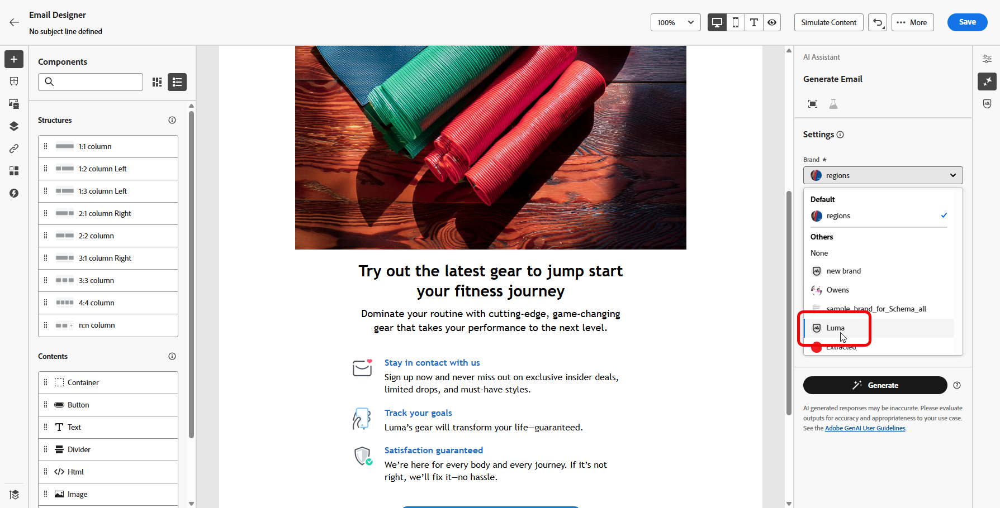

# Creare e gestire i brand {#brands}

>[!AVAILABILITY]
>
>Questa funzionalità viene rilasciata come versione beta privata. Sarà disponibile progressivamente per tutti i clienti nelle prossime versioni.
>

Le linee guida per il marchio sono un set dettagliato di regole e standard che stabiliscono l’identità visiva e verbale di un marchio. Essi fungono da riferimento per mantenere una rappresentazione coerente del marchio su tutte le piattaforme di marketing e comunicazione.

In Journey Optimizer, ora puoi inserire e organizzare manualmente i dettagli del brand o caricare documenti di linee guida per l’estrazione automatica delle informazioni.

## Marchi di accesso {#generative-access}

Per accedere al menu Marchio in Adobe Journey Optimizer, è necessario concedere agli utenti le autorizzazioni **Managed brand kit** o **[!UICONTROL Enable AI Assistant]**. [Ulteriori informazioni](../administration/permissions.md)

+++  Scopri come assegnare le autorizzazioni relative al marchio

1. Nel prodotto **Autorizzazioni**, passa alla scheda **Ruoli** e seleziona il **Ruolo** desiderato.

1. Fai clic su **Modifica** per modificare le autorizzazioni.

1. Aggiungi la risorsa **Assistente AI**, quindi seleziona **Kit marchio gestito** o **[!UICONTROL Abilita assistente AI]** dal menu a discesa.

   Si noti che l&#39;autorizzazione **[!UICONTROL Abilita Assistente Ia]** fornisce accesso in sola lettura al menu Marchi.

   {zoomable="yes"}

1. Fai clic su **Salva** per applicare le modifiche.

   Le autorizzazioni degli utenti già assegnati a questo ruolo verranno aggiornate automaticamente.

1. Per assegnare questo ruolo a nuovi utenti, passa alla scheda **Utenti** nella dashboard **Ruoli** e fai clic su **Aggiungi utente**.

1. Immetti il nome o l’indirizzo e-mail dell’utente o sceglilo dall’elenco e fai clic su **Salva**.

1. Se l’utente non è già stato creato in precedenza, consulta [questa documentazione](https://experienceleague.adobe.com/it/docs/experience-platform/access-control/abac/permissions-ui/users).

+++

## Crea il tuo marchio {#create-brand-kit}

Per creare e gestire le linee guida per i marchi, puoi immettere autonomamente i dettagli oppure caricare il documento sulle linee guida per i marchi in modo che le informazioni vengano estratte automaticamente:

1. Nel menu **[!UICONTROL Marchi]**, fai clic su **[!UICONTROL Aggiungi marchio]**.

   

1. Immetti un **[!UICONTROL Nome]** e una **[!UICONTROL Descrizione]** per la linea guida del brand.

1. Trascina e rilascia o seleziona il file per caricare le linee guida per il brand ed estrarre automaticamente le informazioni rilevanti per il brand. Fai clic su **[!UICONTROL Aggiungi marchio]**.

   Il processo di estrazione delle informazioni ora inizia. Il completamento potrebbe richiedere alcuni minuti.

   

1. I contenuti e gli standard di creazione visiva vengono ora compilati automaticamente. Sfoglia le diverse schede per adattare le informazioni in base alle esigenze.

1. Dagli **[!UICONTROL standard per la creazione di contenuti]**, fai clic su  per aggiungere un&#39;altra linea guida, esempio o esclusione.

   

1. Dai **[!UICONTROL Standard per la creazione visiva]**, fai clic su  per aggiungere un&#39;altra linea guida, esempio o esclusione.

1. Per aggiungere un esempio di immagine, fare clic su **[!UICONTROL Seleziona immagine]**. Puoi anche aggiungere eventuali informazioni errate identificate.

   

1. Una volta configurata, fai clic su **[!UICONTROL Salva]** e quindi su **[!UICONTROL Pubblica]** per rendere disponibili le linee guida dei brand nell&#39;assistente AI.

1. Per apportare modifiche al tuo marchio pubblicato, fai clic su **[!UICONTROL Modifica marchio]**. In questo modo viene creata una copia temporanea in modalità di modifica, che sostituisce la versione live pubblicata.

   

1. Dal dashboard **[!UICONTROL Brands]**, apri il menu avanzato facendo clic sull&#39;icona  per:

   * Visualizza brand
   * Modifica
   * Duplica
   * Pubblica
   * Annulla pubblicazione
   * Elimina

   

Le linee guida del brand sono ora accessibili dal menu a discesa Brands nel menu dell’assistente AI, consentendo di generare contenuti e risorse in linea con le specifiche. [Ulteriori informazioni sull&#39;assistente di IA](gs-generative.md)

