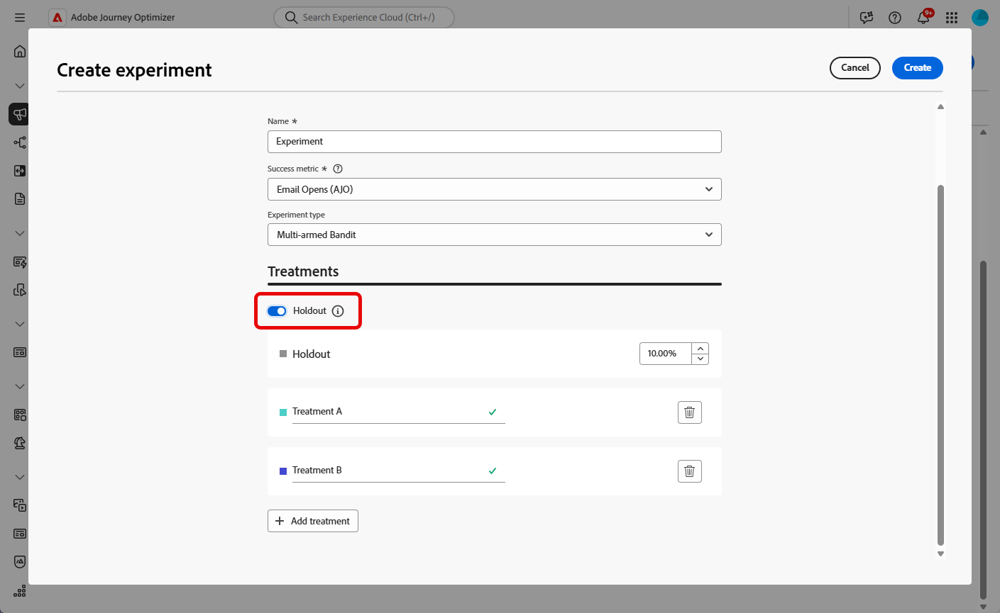
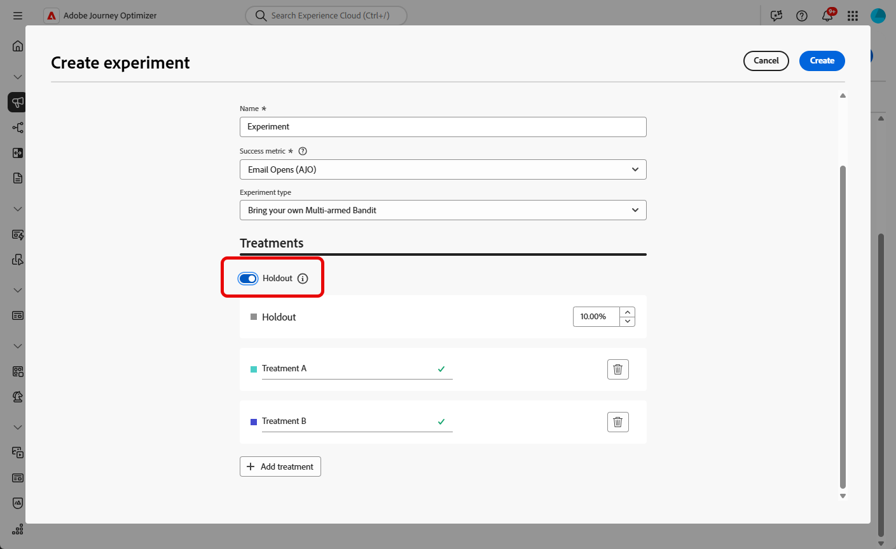
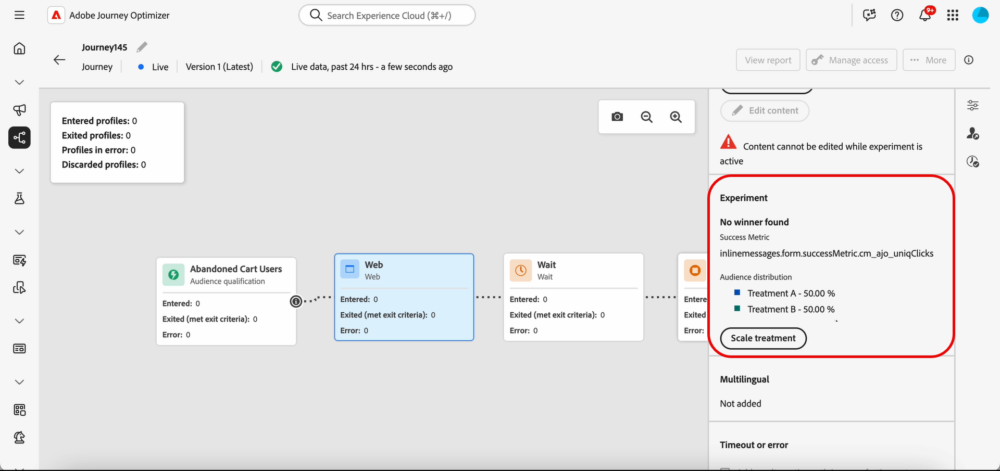

# Creare un esperimento sui contenuti {#content-experiment}

>[!CONTEXTUALHELP]
>id="ajo_campaigns_content_experiment"
>title="Esperimento contenuti"
>abstract="Puoi scegliere di variare il contenuto o l’oggetto del messaggio al fine di definire più trattamenti e determinare la combinazione migliore per il tuo pubblico."

>[!NOTE]
>
>Prima di iniziare con Content Experiment, assicurati che la configurazione del reporting sia impostata per i set di dati personalizzati. Ulteriori informazioni in [questa sezione](../reports/reporting-configuration.md).

L’esperimento sui contenuti di Journey Optimizer consente di definire più trattamenti di consegna per misurare quale offre le migliori prestazioni per il pubblico di destinazione. Puoi scegliere di variare il contenuto o l’oggetto della consegna. Il pubblico di interesse viene allocato in modo casuale a ciascun trattamento per determinare quale funziona meglio in termini di metrica specificata.

Nell’esempio seguente, l’obiettivo di consegna è stato suddiviso in due gruppi, ciascuno dei quali rappresenta il 45% della popolazione target e un gruppo di riserva del 10%, che non riceverà la consegna.

Ogni persona nel pubblico di destinazione riceverà una versione di un’e-mail, con un oggetto che corrisponde a uno dei due seguenti:

* uno promuove direttamente un’offerta del 10% sulla nuova collezione e un’immagine.
* l&#39;altra si limita a pubblicizzare un&#39;offerta speciale senza specificare il 10% di sconto senza alcuna immagine.

L’obiettivo qui è vedere se i destinatari interagiscono con l’e-mail a seconda dell’esperimento ricevuto. Pertanto, sceglieremo **[!UICONTROL Aperture e-mail]** come metrica di obiettivo principale in questo esperimento sui contenuti.

➡️ Scopri come utilizzare gli esperimenti sui contenuti per confrontare le decisioni con il canale di esperienza basato sul codice in [questo caso d&#39;uso](../experience-decisioning/experience-decisioning-uc.md).

## Creare i contenuti {#campaign-experiment}

1. Inizia creando e configurando la tua [campagna](../campaigns/create-campaign.md) o [percorso](../building-journeys/journeys-message.md) in base alle tue esigenze.

1. Dalla finestra **[!UICONTROL Modifica contenuto]**, inizia a personalizzare il trattamento A.

   Per questo trattamento, specificheremo l’offerta speciale direttamente nell’oggetto e aggiungeremo la personalizzazione.

   

1. Crea o importa il contenuto originale e personalizzalo in base alle esigenze.

## Configurare l’esperimento sui contenuti {#configure-experiment}

>[!CONTEXTUALHELP]
>id="ajo_campaigns_content_experiment_dimension"
>title="Dimensione"
>abstract="Scegli la dimensione da monitorare per l’esperimento, ad esempio clic o visualizzazioni specifici di pagine specifiche."

>[!CONTEXTUALHELP]
>id="ajo_campaigns_content_experiment_success_metric"
>title="Metrica di successo"
>abstract="La metrica di successo viene utilizzata per monitorare e valutare il trattamento dalle prestazioni migliori in un esperimento. Assicurati di impostare il set di dati per determinate metriche prima di utilizzarlo."

Per l’esperimento sui contenuti, puoi scegliere tra tre tipi di esperimento:

* **[!UICONTROL Esperimento A/B]**: definisci la suddivisione del traffico tra i trattamenti all&#39;inizio del test. Le prestazioni vengono valutate in base alla metrica principale scelta, l’Experimentation Accelerator, quindi, riporta l’incremento osservato tra i trattamenti.

* **[!UICONTROL Slot machine]**: la suddivisione del traffico tra i trattamenti viene gestita automaticamente. Ogni 7 giorni, le prestazioni sulla metrica principale vengono riviste e i pesi vengono regolati di conseguenza. Il reporting in Experimentation Accelerator continua a mostrare l’Incremento, come test A/B.

* **[!UICONTROL Porta una tua slot machine]**: il traffico suddiviso tra i trattamenti viene gestito automaticamente. Puoi determinare quando e come deve cambiare utilizzando le API dell’esperimento per regolare le allocazioni in tempo reale.

➡️ [Ulteriori informazioni sulla differenza tra esperimenti A/B e Multi-armed bandit](mab-vs-ab.md)

>[!BEGINTABS]

>[!TAB Esperimento A/B]

1. Quando il messaggio è personalizzato, dalla scheda **[!UICONTROL Azioni]** fai clic su **[!UICONTROL Crea esperimento]** per iniziare a configurare l&#39;esperimento sui contenuti.

   

1. Seleziona la **[!UICONTROL metrica di successo]** da impostare per l&#39;esperimento.

   Per questo esempio, seleziona **[!UICONTROL E-mail aperta]** per verificare se i profili aprono le e-mail se il codice promozionale è nella riga dell&#39;oggetto.

   

1. Quando imposti un esperimento utilizzando il canale in-app o web e scegli i **[!UICONTROL clic in entrata]**, i **[!UICONTROL clic in entrata univoci]**, le **[!UICONTROL visualizzazioni di pagina]** o le **[!UICONTROL metriche delle visualizzazioni di pagina univoche]**, il campo **[!UICONTROL dimensioni]** ti consente di monitorare e tenere traccia con precisione dei clic e delle visualizzazioni su pagine specifiche.

   

1. Se hai creato una campagna attivata da API, seleziona **[!UICONTROL Esperimento A/B]** dal menu a discesa **[!UICONTROL Tipo di esperimento]**.

1. Fare clic su **[!UICONTROL Aggiungi trattamento]** per creare il numero di nuovi trattamenti necessario.

   

1. Modifica il **[!UICONTROL Titolo]** del trattamento per differenziarli meglio.

1. Scegli di aggiungere un gruppo **[!UICONTROL Holdout]** alla consegna. Questo gruppo non riceverà alcun contenuto da questa campagna.

   Se passi alla barra di attivazione, riceverai automaticamente il 10% della tua popolazione; se necessario puoi regolare questa percentuale.

   >[!IMPORTANT]
   >
   >Quando un gruppo di sospensione viene utilizzato in un&#39;azione per la sperimentazione di contenuti, l&#39;assegnazione di sospensione si applica solo a tale azione specifica. Al termine dell’azione, i profili nel percorso di sospensione continueranno a scorrere lungo il percorso e potranno ricevere messaggi da altre azioni. Di conseguenza, assicurati che tutti i messaggi successivi non dipendano dalla ricezione di un messaggio da parte di un profilo che potrebbe trovarsi in un gruppo di attesa. In tal caso, potrebbe essere necessario rimuovere l&#39;assegnazione di blocco.

   

1. Puoi quindi scegliere di allocare una percentuale precisa a ogni **[!UICONTROL Trattamento]** o semplicemente attivare la barra di selezione **[!UICONTROL Distribuisci uniformemente]**.

   

1. Abilita l’esperimento di scalabilità automatica per distribuire automaticamente la variante vincente dell’esperimento. [Ulteriori informazioni sulla scalabilità del vincitore](#scale-winner)

   

1. Fai clic su **[!UICONTROL Crea]** quando la configurazione è impostata.

>[!TAB Slot machine]

L’esperimento slot machine è disponibile solo con i seguenti elementi:

* Canali in entrata
* Percorsi unitari
* Campagne attivate da API (sia transazionali che operative)
* Canali in uscita se la pianificazione si ripete

1. Quando il messaggio è personalizzato, dalla scheda **[!UICONTROL Azioni]** fai clic su **[!UICONTROL Crea esperimento]** per iniziare a configurare l&#39;esperimento sui contenuti.

   

1. Seleziona la **[!UICONTROL metrica di successo]** da impostare per l&#39;esperimento.

   Per questo esempio, seleziona **[!UICONTROL E-mail aperta]** per verificare se i profili aprono le e-mail se il codice promozionale è nella riga dell&#39;oggetto.

   

1. Se hai creato una campagna attivata da API, seleziona **[!UICONTROL Slot machine]** dal menu a discesa **[!UICONTROL Tipo esperimento]**.

   

1. Fare clic su **[!UICONTROL Aggiungi trattamento]** per creare il numero di nuovi trattamenti necessario.

   

1. Modifica il **[!UICONTROL Titolo]** del trattamento per differenziarli meglio.

1. Scegli di aggiungere un gruppo **[!UICONTROL Holdout]** alla consegna. Questo gruppo non riceverà alcun contenuto da questa campagna.

   Se passi alla barra di attivazione, riceverai automaticamente il 10% della tua popolazione; se necessario puoi regolare questa percentuale.

   >[!IMPORTANT]
   >
   >Quando un gruppo di sospensione viene utilizzato in un&#39;azione per la sperimentazione di contenuti, l&#39;assegnazione di sospensione si applica solo a tale azione specifica. Al termine dell’azione, i profili nel percorso di sospensione continueranno a scorrere lungo il percorso e potranno ricevere messaggi da altre azioni. Di conseguenza, assicurati che tutti i messaggi successivi non dipendano dalla ricezione di un messaggio da parte di un profilo che potrebbe trovarsi in un gruppo di attesa. In tal caso, potrebbe essere necessario rimuovere l&#39;assegnazione di blocco.

   

>[!TAB Porta un tuo slot machine]

Tieni presente che l’esperimento Bring your own Multi-armed bandit è disponibile solo con quanto segue:

* Canali in entrata
* Percorsi unitari
* Campagne attivate da API (sia transazionali che operative)
* Canali in uscita se la pianificazione si ripete

1. Quando il messaggio è personalizzato, dalla scheda **[!UICONTROL Azioni]** fai clic su **[!UICONTROL Crea esperimento]** per iniziare a configurare l&#39;esperimento sui contenuti.

   

1. Seleziona la **[!UICONTROL metrica di successo]** da impostare per l&#39;esperimento.

   Per questo esempio, seleziona **[!UICONTROL E-mail aperta]** per verificare se i profili aprono le e-mail se il codice promozionale è nella riga dell&#39;oggetto.

   

1. Se hai creato una campagna attivata da API, seleziona **[!UICONTROL Porta un tuo slot machine]** dal menu a discesa **[!UICONTROL Tipo di esperimento]**.

   

1. Fare clic su **[!UICONTROL Aggiungi trattamento]** per creare il numero di nuovi trattamenti necessario.

   

1. Modifica il **[!UICONTROL Titolo]** del trattamento per differenziarli meglio.

1. Scegli di aggiungere un gruppo **[!UICONTROL Holdout]** alla consegna. Questo gruppo non riceverà alcun contenuto da questa campagna.

   Se passi alla barra di attivazione, riceverai automaticamente il 10% della tua popolazione; se necessario puoi regolare questa percentuale.

   >[!IMPORTANT]
   >
   >Quando un gruppo di sospensione viene utilizzato in un&#39;azione per la sperimentazione di contenuti, l&#39;assegnazione di sospensione si applica solo a tale azione specifica. Al termine dell’azione, i profili nel percorso di sospensione continueranno a scorrere lungo il percorso e potranno ricevere messaggi da altre azioni. Di conseguenza, assicurati che tutti i messaggi successivi non dipendano dalla ricezione di un messaggio da parte di un profilo che potrebbe trovarsi in un gruppo di attesa. In tal caso, potrebbe essere necessario rimuovere l&#39;assegnazione di blocco.

   

>[!ENDTABS]

## Progettare i trattamenti {#treatment-experiment}

1. Dalla finestra **[!UICONTROL Modifica contenuto]**, seleziona il trattamento B per modificare il contenuto.

   In questo caso, si sceglie di non specificare l&#39;offerta nella **[!UICONTROL riga oggetto]**.

   

1. Fai clic su **[!UICONTROL Modifica corpo dell&#39;e-mail]** per personalizzare ulteriormente il trattamento B.

   

1. Dopo aver progettato i trattamenti, fai clic su **[!UICONTROL Altre azioni]** per accedere alle opzioni relative ai trattamenti: **[!UICONTROL Rinomina]**, **[!UICONTROL Duplica]** e **[!UICONTROL Elimina]**.

   

1. Se necessario, accedi al menu **[!UICONTROL Impostazioni esperimento]** per modificare la configurazione dei trattamenti.

   

1. Una volta definito il contenuto del messaggio, fai clic sul pulsante **[!UICONTROL Simula contenuto]** per controllare il rendering della consegna e controlla le impostazioni di personalizzazione con i profili di test. [Ulteriori informazioni](../content-management/preview-test.md)

Dopo aver configurato la sperimentazione, puoi seguire il successo della consegna con il tuo rapporto. [Ulteriori informazioni](../reports/campaign-global-report-cja-experimentation.md)

## Ridimensiona il vincitore {#scale-winner}

>[!AVAILABILITY]
>
>La funzione Scala vincitori è attualmente supportata per i seguenti canali:
>
>* Canali in entrata (ad esempio, web, messaggi in-app, esperienza basata su codice) in qualsiasi percorso o campagna.
>* Canali in uscita (ad esempio e-mail, notifica push, SMS) in campagne transazionali attivate da API.

Per &quot;scalare il vincitore&quot; si intende presentare automaticamente o manualmente la variante vincente di un esperimento a tutto il pubblico. Questa funzione assicura che, una volta determinato il vincitore, sia possibile amplificarne la portata e l&#39;efficacia senza monitorare costantemente l&#39;esperimento.

Puoi scegliere tra due modalità:

* **Ridimensionamento automatico**: configura le impostazioni di ridimensionamento automatico durante la creazione dell&#39;esperimento scegliendo il momento e le condizioni per il ridimensionamento del trattamento vincente o un&#39;opzione di fallback se non emerge alcun vincitore.

* **Ridimensionamento manuale**: rivedi manualmente i risultati dell&#39;esperimento e avvia il rollout del trattamento vincente, mantenendo il controllo completo sui tempi e sulle decisioni.

### Ridimensionamento automatico {#autoscaling}

Il ridimensionamento automatico consente di impostare regole predefinite per il momento in cui eseguire il rollout del trattamento vincente o di un fallback, in base ai risultati dell’esperimento.

Si noti che, una volta eseguito il ridimensionamento automatico, il ridimensionamento manuale non è più disponibile.

Per abilitare la scalabilità automatica negli esperimenti:

1. Imposta la campagna o il percorso e configura l’esperimento in base alle esigenze. [Ulteriori informazioni](#configure-experiment)

1. Abilita l’opzione di scalabilità automatica durante la configurazione dell’esperimento.

   

1. Seleziona quando ridimensionare il vincitore:

   * Non appena viene trovato il vincitore.
   * Dopo l’esperimento è attivo per il tempo selezionato.

   Il tempo di ridimensionamento automatico deve essere pianificato prima della data di fine dell’esperimento. Se è impostato per un periodo di tempo successivo alla data di fine, verrà visualizzato un avviso di convalida e la campagna o il percorso non verrà pubblicato.

   

1. Scegli il comportamento di fallback se non viene trovato alcun vincitore in base al tempo di scala:

   * Continua l’esperimento fino alla fine come pianificato.
   * Ridimensionare il trattamento alternativo dopo un tempo specificato.

Una volta soddisfatti tutti i parametri, il trattamento vincente o alternativo viene inviato al pubblico.

### Ridimensionamento manuale {#manual-scaling}

La scalabilità manuale consente di esaminare i risultati dell’esperimento e di decidere quando distribuire il trattamento vincente secondo la propria pianificazione.

Se si ridimensiona manualmente il vincitore prima del tempo di scalabilità automatica programmato, la scalabilità automatica viene annullata.

Per ridimensionare manualmente il vincitore degli esperimenti:

1. Imposta la campagna o il percorso e configura l’esperimento in base alle esigenze. [Ulteriori informazioni](#configure-experiment)

1. Consenti l’esecuzione dell’esperimento fino a quando non viene identificato un vincitore o non viene raggiunta la significatività statistica.

1. Apri il dashboard della campagna o seleziona l’attività del canale nel percorso.

   Rivedi i risultati nel menu **[!UICONTROL Esperimento contenuti]** per identificare il trattamento dalle prestazioni migliori.

   

1. Fai clic su **[!UICONTROL Scala trattamento]** per inviare il trattamento vincente al resto del pubblico.

   

1. Selezionare il trattamento da scalare dal menu a discesa e fare clic su **[!UICONTROL Scala]**.

   

Si noti che la modifica in scala del trattamento può richiedere fino a un’ora. Riceverai una notifica al termine del processo di ridimensionamento manuale.

