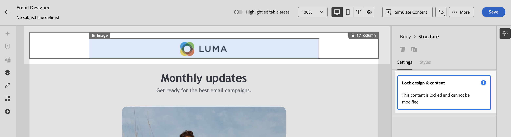

# Bloccare il contenuto nei modelli e-mail {#lock-content-email-templates}

>[!CONTEXTUALHELP]
>id="ajo_locking_governance"
>title="Governance"
>abstract="Attiva la governance per bloccare i contenuti nel modelli, bloccando l’intero modello o strutture e componenti specifici. Questo consente di evitare modifiche o eliminazioni non intenzionali, garantendo un maggiore controllo sulla personalizzazione dei modelli e migliorando l’efficienza e l’affidabilità delle campagne e-mail."

>[!CONTEXTUALHELP]
>id="ajo_locking_mode"
>title="Modalità"
>abstract="Seleziona la modalità di blocco desiderata per il modello. **Blocco dei contenuti** consente di bloccare sezioni specifiche del contenuto all’interno del modello. **Sola lettura** consente di bloccare l’intero contenuto del modello, impedendo eventuali modifiche."

>[!CONTEXTUALHELP]
>id="ajo_locking_content_addition"
>title="Abilitare l’aggiunta di contenuti"
>abstract="Attiva questa opzione per definire ulteriormente il modo in cui gli utenti possono interagire con il modello. Seleziona **Consenti l’aggiunta di struttura e contenuti** per consentire agli utenti di aggiungere strutture tra quelle esistenti e componenti o frammenti di contenuto all’interno di strutture modificabili. **Consenti solo l’aggiunta di contenuti** consente agli utenti di aggiungere componenti o frammenti di contenuto all’interno di strutture modificabili, senza poter aggiungere o duplicare le strutture."

>[!CONTEXTUALHELP]
>id="ajo_email_locking_activated"
>title="Governance abilitata"
>abstract="Il blocco dei contenuti è attivato e impedisce le modifiche."

>[!CONTEXTUALHELP]
>id="ajo_email_locking_read_only"
>title="Sola lettura"
>abstract="Questo contenuto è in sola lettura e non può essere modificato."

Journey Optimizer consente di bloccare il contenuto nei modelli e-mail, bloccando l’intero modello o strutture e componenti specifici. In questo modo è possibile evitare modifiche o eliminazioni non intenzionali, offrendo un maggiore controllo sulla personalizzazione dei modelli e migliorando l’efficienza e l’affidabilità delle campagne e-mail.

>[!IMPORTANT]
>
>Il blocco dei contenuti è una funzione a livello di editor per gli autori e non garantisce che il contenuto rimanga invariato quando viene importato o creato tramite API.

Il blocco del contenuto può essere applicato al livello **struttura** o al livello **componente**. Di seguito sono riportati i principi principali che si applicano a livello di struttura e componente quando si blocca il contenuto nel modello:

* Quando una struttura è bloccata:

   * Anche tutto il contenuto all’interno di tale struttura è bloccato per impostazione predefinita.
   * Nessun contenuto può essere aggiunto alla struttura.
   * Per impostazione predefinita, non è possibile eliminare la struttura. È possibile ignorare questa restrizione abilitando l’opzione &quot;Consenti eliminazione&quot;.
   * I singoli componenti di contenuto all’interno della struttura bloccata possono essere impostati come modificabili.

* Quando una struttura è modificabile (struttura non bloccata):

   * I singoli componenti di contenuto possono essere bloccati all’interno di tale struttura.
   * Per impostazione predefinita, non è possibile eliminare un componente se è bloccato o se è selezionato &quot;Solo blocco di contenuto modificabile&quot;. È possibile ignorare questa restrizione abilitando l’opzione &quot;Consenti eliminazione&quot;.

>[!AVAILABILITY]
>
>Gli utenti autorizzati a creare modelli di contenuto possono abilitare il blocco del contenuto.

➡️ [Scopri questa funzione nel video](#video)

## Bloccare un modello e-mail {#define}

### Abilita blocco del contenuto {#enable}

Puoi abilitare il blocco del contenuto per un modello e-mail direttamente in E-mail Designer, sia che tu stia creando un nuovo modello che ne stia modificando uno esistente. Segui questi passaggi:

1. Apri o crea un modello e-mail e accedi alla schermata di modifica del contenuto nel Designer e-mail.

1. Nel riquadro **[!UICONTROL Corpo]** a destra, attiva l&#39;opzione **[!UICONTROL Governance]**.

1. Dall&#39;elenco a discesa **[!UICONTROL Modalità]**, selezionare la modalità di blocco desiderata per il modello:

   * **[!UICONTROL Blocco del contenuto]**: blocca sezioni specifiche del contenuto all&#39;interno del modello. Per impostazione predefinita, tutte le strutture e i componenti diventano modificabili. Puoi quindi bloccare selettivamente singoli elementi.
   * **[!UICONTROL Sola lettura]**: blocca l&#39;intero contenuto del modello, impedendo eventuali modifiche.

   

1. Se hai selezionato la modalità **[!UICONTROL Blocco contenuto]**, puoi definire ulteriormente il modo in cui gli utenti possono interagire con il modello. Attiva l&#39;opzione **[!UICONTROL Abilita aggiunta contenuto]** e scegli una delle opzioni seguenti:

   * **[!UICONTROL Consenti aggiunta struttura e contenuto]**: gli utenti possono aggiungere strutture tra quelle esistenti e aggiungere componenti di contenuto o frammenti all&#39;interno di strutture modificabili.

   * **[!UICONTROL Consenti solo l&#39;aggiunta di contenuto]**: gli utenti possono aggiungere componenti di contenuto o frammenti all&#39;interno di strutture modificabili, ma non possono aggiungere o duplicare strutture.

1. Dopo aver selezionato la modalità di blocco, puoi definire quali strutture e/o componenti bloccare se hai selezionato la modalità **[!UICONTROL Blocco contenuto]**:

   * [Scopri come bloccare le strutture](#lock-structures)
   * [Scopri come bloccare i componenti](#lock-components)

   Se hai scelto la modalità **[!UICONTROL Sola lettura]**, procedi come di consueto alla finalizzazione e al salvataggio del modello.

Puoi modificare le impostazioni di **[!UICONTROL Governance]** in qualsiasi momento durante la progettazione del modello selezionando il corpo del modello. A questo scopo, fai clic sul collegamento **[!UICONTROL Corpo]** nella barra di navigazione nella parte superiore del riquadro a destra.

### Bloccare le strutture {#lock-structures}

>[!CONTEXTUALHELP]
>id="ajo_locking_structure"
>title="Blocco dei contenuti nella struttura"
>abstract="Per bloccare la struttura nel modello, seleziona **Bloccato** dal menu a discesa **Tipo di blocco**. Per impostazione predefinita, gli utenti non possono eliminare le strutture bloccate. È possibile annullare questa restrizione abilitando l’opzione **[!UICONTROL Consenti eliminazione]**."

Per bloccare una struttura all’interno del modello:

1. Seleziona la struttura da bloccare.

1. Nell&#39;elenco a discesa **[!UICONTROL Blocca tipo]** scegliere **[!UICONTROL Bloccato]**.

   

   >[!NOTE]
   >
   >Per impostazione predefinita, gli utenti non possono eliminare le strutture bloccate. È possibile annullare questa restrizione abilitando l’opzione **[!UICONTROL Consenti eliminazione]**.

Dopo aver bloccato una struttura, non è più possibile duplicare o aggiungere altri componenti o frammenti di contenuto al suo interno. Anche tutti i componenti all’interno di una struttura bloccata vengono bloccati per impostazione predefinita. Per rendere modificabile un componente all’interno di una struttura bloccata:

1. Seleziona il componente da sbloccare.

1. Attiva l&#39;opzione **[!UICONTROL Usa blocco specifico]**.

1. Nell&#39;elenco a discesa **[!UICONTROL Blocca tipo]** scegliere **[!UICONTROL Modificabile]**. Per consentire la modifica del contenuto durante il blocco degli stili, selezionare **[!UICONTROL Solo contenuto modificabile]**. [Scopri come bloccare i componenti](#lock-components)

   

### Bloccare i componenti {#lock-components}

>[!CONTEXTUALHELP]
>id="ajo_locking_component"
>title="Utilizzare un blocco specifico nel componente"
>abstract="Per bloccare un componente nel modello, attiva l’opzione **Usa blocco specifico**. Dall’elenco a discesa **[!UICONTROL Tipo di blocco]**, seleziona l’opzione di blocco preferita: **Solo contenuti modificabili** consente di bloccare gli stili del componente, ma consente la modifica del contenuto, mentre **Bloccato** blocca completamente sia il contenuto che gli stili del componente."

Per bloccare un componente specifico all’interno di una struttura:

1. Selezionare il componente e abilitare l&#39;opzione **[!UICONTROL Usa blocco specifico]** nel riquadro di destra.

1. Dall&#39;elenco a discesa **[!UICONTROL Blocca tipo]**, selezionare l&#39;opzione di blocco preferita:

   

   * **[!UICONTROL Solo contenuto modificabile]**: blocca gli stili del componente ma consente la modifica del contenuto.
   * **[!UICONTROL Bloccato]**: blocco completo del contenuto e degli stili del componente.

   >[!NOTE]
   >
   >Il tipo di blocco **[!UICONTROL Modificabile]** consente agli utenti di modificare un componente, anche all&#39;interno di una struttura bloccata. [Scopri come bloccare le strutture](#lock-structures)

1. Per impostazione predefinita, gli utenti non possono eliminare i componenti bloccati. È possibile abilitare l&#39;eliminazione attivando l&#39;opzione **[!UICONTROL Consenti eliminazione]**.

### Identificare il contenuto bloccato {#identify}

Per identificare facilmente le strutture e i componenti bloccati all&#39;interno del modello, utilizzare la **[!UICONTROL struttura di spostamento]** disponibile nel menu a sinistra. Questo menu fornisce una panoramica visiva di tutti gli elementi del modello, evidenziando gli elementi bloccati con un’icona a forma di lucchetto e gli elementi modificabili con un’icona a forma di matita.

Nell’esempio seguente, la governance è abilitata per il corpo del modello. *La struttura 2* è bloccata con *Il componente 1* è modificabile, mentre *La struttura 3* è completamente bloccata.

## Utilizzare modelli con contenuti bloccati {#use}

>[!CONTEXTUALHELP]
>id="ajo_email_editable_areas"
>title="Evidenziare le aree modificabili"
>abstract="A seconda del tipo di blocco applicato al modello, è possibile eseguire azioni diverse sulle strutture e sui componenti del modello. Per identificare rapidamente tutte le aree modificabili nel modello, attiva l’opzione **[!UICONTROL Evidenzia aree modificabili]**."

Quando si utilizza un modello con contenuto bloccato, nel riquadro di destra viene visualizzato un messaggio.

A seconda del tipo di blocco applicato al modello, è possibile eseguire azioni diverse sulle strutture e sui componenti del modello. Per identificare rapidamente tutte le aree modificabili nel modello, attiva l’opzione **[!UICONTROL Evidenzia aree modificabili]**.

Ad esempio, nel modello seguente, tutte le aree sono modificabili ad eccezione dell’immagine superiore che è stata bloccata, il che significa che non è possibile modificarla o rimuoverla.

Informazioni dettagliate sui diversi tipi di blocco che è possibile applicare sono disponibili nelle sezioni seguenti:

* [Bloccare le strutture](#lock-structures)
* [Bloccare i componenti](#lock-components)

Di seguito sono riportati alcuni esempi di edizioni e-mail e delle configurazioni di blocco del contenuto associate che sono state configurate:

| Tipo di blocco del contenuto | Configurazione del modello | Edizione e-mail |
| ------- | ------- | ------- |
| Modello di contenuto di sola lettura | {zoomable="yes"} | {zoomable="yes"} |
| Il contenuto completo è modificabile, ma gli utenti non possono aggiungere alcuna struttura o componente | {zoomable="yes"} | {zoomable="yes"} |
| Struttura bloccata che non può essere eliminata | {zoomable="yes"} | {zoomable="yes"} |
| Componente con stili bloccati che non può essere eliminato. Gli utenti possono solo modificare il contenuto. | {zoomable="yes"} | {zoomable="yes"} |
| Componente modificabile in una struttura bloccata. | {zoomable="yes"} | {zoomable="yes"} |

## Video dimostrativo {#video}

Scopri come bloccare il contenuto nei modelli e-mail.

>[!VIDEO](https://video.tv.adobe.com/v/3451615?captions=ita&quality=12)
