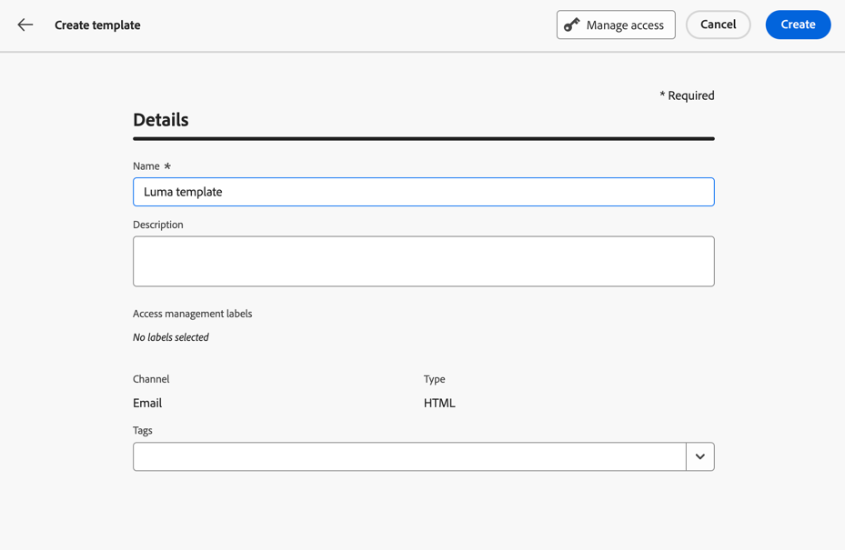
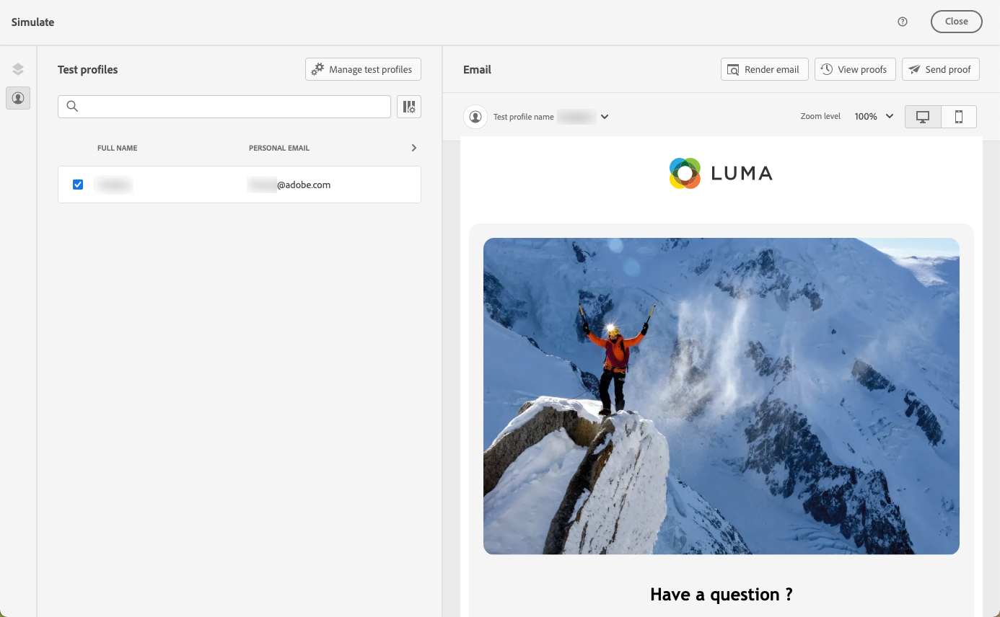

# Utilizzare i modelli di contenuto {#content-templates}

Per un processo di progettazione accelerato e migliorato, puoi creare modelli autonomi per riutilizzare facilmente i contenuti personalizzati in [!DNL Journey Optimizer] campagne e percorsi.

Questa funzionalità consente agli utenti orientati ai contenuti di lavorare su modelli al di fuori di campagne o percorsi. Gli utenti marketing possono quindi riutilizzare e adattare questi modelli di contenuto autonomo all’interno dei propri percorsi o campagne.

>[!NOTE]
>
>Attualmente solo il **email** sono supportati i modelli di contenuto.

Ad esempio, un utente all’interno dell’azienda è solo responsabile dei contenuti e quindi non ha accesso a campagne o percorsi. Tuttavia, questo utente può creare un modello e-mail che gli esperti marketing della tua organizzazione potranno selezionare per l’utilizzo in tutte le e-mail come punto di partenza.

Puoi anche creare e gestire modelli di contenuto utilizzando le API. Per ulteriori informazioni, consulta [Documentazione delle API di Journey Optimizer](https://developer.adobe.com/journey-optimizer-apis/references/content/){target="_blank"}.

➡️ [Scopri come creare e utilizzare i modelli in questo video](#video-templates)

>[!CAUTION]
>
>Per creare, modificare ed eliminare i modelli di contenuto, è necessario disporre del **[!DNL Manage library items]** autorizzazione inclusa nel **[!DNL Content Library Manager]** profilo di prodotto. [Ulteriori informazioni](../administration/ootb-product-profiles.md#content-library-manager)

## Accedere ai modelli e gestirli {#access-manage-templates}

Per accedere all&#39;elenco dei modelli di contenuto, selezionare **[!UICONTROL Gestione dei contenuti]** > **[!UICONTROL Modelli di contenuto]** dal menu a sinistra.

Tutti i modelli creati nella sandbox corrente, da un percorso o da una campagna utilizzando [Salva come modello](#save-as-template) opzione, dal menu **[!UICONTROL Modelli di contenuto]** menu -.

Puoi ordinare i modelli di contenuto in base alla data di creazione o di modifica. È inoltre possibile scegliere di visualizzare solo gli elementi creati o modificati.

Per modificare il contenuto di un modello, fai clic sull’elemento desiderato dall’elenco e seleziona **[!UICONTROL Modifica contenuto]**.

Per eliminare un modello, seleziona l’icona del cestino accanto al modello desiderato.

>[!NOTE]
>
>Quando un modello viene modificato o eliminato, non influisce sulle campagne o sui percorsi, comprese le e-mail create utilizzando questo modello.

## Creare modelli di contenuto {#create-content-templates}

>[!CONTEXTUALHELP]
>id="ajo_create_template"
>title="Definire un modello di contenuto personalizzato"
>abstract="Crea da zero un modello personalizzato autonomo per rendere i contenuti riutilizzabili in più percorsi e campagne."

Esistono due modi per creare modelli di contenuto:

* Creare un modello di contenuto da zero utilizzando la barra a sinistra **[!UICONTROL Modelli di contenuto]** menu. [Scopri come](#create-template-from-scratch)

* Durante la progettazione di un’e-mail all’interno di una campagna o di un percorso, salva il contenuto dell’e-mail come modello. [Scopri come](#save-as-template)

Una volta salvato, il modello di contenuto è disponibile per l’utilizzo in una campagna o in un percorso. Creato da zero o da un messaggio e-mail precedente, ora puoi utilizzare questo modello per creare qualsiasi [email](../email/get-started-email-design.md) entro [!DNL Journey Optimizer]. [Scopri come](../email/use-email-templates.md)

>[!NOTE]
>
>* Le modifiche apportate ai modelli di contenuto non vengono propagate a campagne o percorsi, sia che siano live o bozze.
>
>* Allo stesso modo, quando i modelli vengono utilizzati in una campagna o in un percorso, eventuali modifiche apportate al contenuto della campagna e del percorso non influiscono sul modello di contenuto utilizzato in precedenza.

### Crea modello da zero {#create-template-from-scratch}

Per creare un modello di contenuto da zero, effettua le seguenti operazioni.

1. Accedere all’elenco dei modelli di contenuto tramite **[!UICONTROL Gestione dei contenuti]** > **[!UICONTROL Modelli di contenuto]** menu a sinistra.

1. Seleziona **[!UICONTROL Crea modello]**.

1. Compila i dettagli del modello.

   

   >[!NOTE]
   >
   >Attualmente solo il **E-mail** channel e **HTML** sono supportati.

1. Per assegnare etichette di utilizzo dei dati personalizzate o di base al modello, seleziona **[!UICONTROL Gestisci accesso]**. [Ulteriori informazioni su OLAC (Object Level Access Control)](../administration/object-based-access.md).

1. Seleziona o crea tag Adobe Experience Platform da **[!UICONTROL Tag]** per categorizzare il modello e migliorare la ricerca. [Ulteriori informazioni](../start/search-filter-categorize.md#tags)

1. Clic **[!UICONTROL Crea]** e scegli come progettare il modello tra le diverse opzioni:

   * [Creare un messaggio e-mail da zero](../email/content-from-scratch.md) tramite l’interfaccia di E-mail Designer.

   * [Codice o copia-incolla raw HTML](../email/code-content.md) direttamente in E-mail Designer.

   * [Importa contenuto HTML esistente](../email/existing-content.md) da un file o da una cartella .zip.

   * Utilizza il contenuto esistente da un elenco di modelli incorporati o personalizzati. I passaggi per utilizzare un modello di contenuto in un messaggio e-mail sono descritti in [questa sezione](../email/use-email-templates.md).

   

1. Il [E-mail Designer](../email/get-started-email-design.md) visualizzazioni. Modifica il contenuto in base alle esigenze, come faresti per qualsiasi e-mail all’interno di un percorso o di una campagna, in base all’opzione selezionata.

   Se necessario, puoi testare il contenuto. [Scopri come](#test-template)

1. Quando il modello è pronto, fai clic su **[!UICONTROL Salva]**.

1. Se necessario, fai clic sulla freccia accanto al nome del modello per tornare al **[!UICONTROL Dettagli]** e modificare il modello.

   

Questo modello è ora pronto per essere utilizzato quando crei un messaggio e-mail in [!DNL Journey Optimizer]. [Scopri come](../email/use-email-templates.md)

### Salva come modello {#save-as-template}

>[!CONTEXTUALHELP]
>id="ajo_messages_depecrated_inventory"
>title="Scopri come effettuare la migrazione dei messaggi"
>abstract="Il 25 luglio 2022 il menu Messaggi è stato rimosso e i messaggi vengono ora creati direttamente da un percorso. Per riutilizzare i messaggi precedenti nei percorsi, devi salvarli come modelli."

Durante la progettazione di un’ [email](../email/get-started-email-design.md) in una campagna o in un percorso, puoi salvare il contenuto delle e-mail per riutilizzarlo in futuro. Per farlo, segui la procedura indicata di seguito.

1. In E-mail Designer, fai clic sui puntini di sospensione in alto a destra dello schermo.

1. Seleziona **[!UICONTROL Salva come modello di contenuto]** dal menu a discesa.

   

1. Aggiungi un nome e una descrizione per questo modello.

   

1. Per assegnare etichette di utilizzo dei dati personalizzate o di base al modello, seleziona **[!UICONTROL Gestisci accesso]**. [Ulteriori informazioni](../administration/object-based-access.md).

1. Seleziona o crea un tag Adobe Experience Platform da **Tag** per categorizzare il modello. [Ulteriori informazioni](../start/search-filter-categorize.md#tags)

1. Fai clic su **[!UICONTROL Salva]**.

1. Il modello viene salvato in **[!UICONTROL Modelli di contenuto]** , accessibile dalla [!DNL Journey Optimizer] menu dedicato. Diventa un modello di contenuto autonomo accessibile, modificato ed eliminato come qualsiasi altro elemento dell’elenco. [Ulteriori informazioni](#access-manage-templates)

Ora puoi utilizzare questo modello per creare qualsiasi [email](../email/get-started-email-design.md) entro [!DNL Journey Optimizer]. [Scopri come](../email/use-email-templates.md)

>[!NOTE]
>
>Eventuali modifiche a tale nuovo modello non vengono propagate all’e-mail da cui provengono. Allo stesso modo, quando il contenuto originale viene modificato all’interno dell’e-mail, il nuovo modello non viene modificato.

## Test del modello di contenuto {#test-template}

Puoi testare il rendering di qualsiasi modello di contenuto e-mail, creato da zero o da un messaggio e-mail. A questo scopo, segui i passaggi riportati qui sotto.

1. Accedere all’elenco dei modelli di contenuto tramite **[!UICONTROL Gestione dei contenuti]** > **[!UICONTROL Modelli di contenuto]** e selezionare un modello.

1. Clic **[!UICONTROL Modifica contenuto]** dal **[!UICONTROL Proprietà modello]**.

1. Clic **[!UICONTROL Simula contenuto]** e seleziona un profilo di test per controllare il rendering delle e-mail. È possibile scegliere la visualizzazione su desktop o dispositivo mobile. [Ulteriori informazioni](../content-management/preview-test.md)

   

1. Puoi inviare una bozza per testare il contenuto e farla approvare da alcuni utenti interni prima di utilizzarla in un percorso o in una campagna.

   * A tale scopo, fare clic sul pulsante **[!UICONTROL Invia bozza]** e seguire i passaggi descritti in [questa sezione](../content-management/proofs.md).

   * Prima di inviare la bozza, è necessario selezionare [superficie e-mail](../configuration/channel-surfaces.md) che verranno utilizzati per testare il contenuto.

     

>[!CAUTION]
>
>Il tracciamento attuale non è supportato durante il test dei modelli di contenuto e-mail, il che significa che gli eventi di tracciamento, i parametri UTM e i collegamenti alle pagine di destinazione non saranno efficaci nelle bozze inviate da un modello. Per verificare il tracciamento: [utilizzare il modello di contenuto](../email/use-email-templates.md) in un messaggio e-mail e [invia una bozza](../content-management/preview-test.md#send-proofs).

## Video introduttivo {#video-templates}

Scopri come creare, modificare e utilizzare i modelli di contenuto in [!DNL Journey Optimizer].

>[!VIDEO](https://video.tv.adobe.com/v/3413743/?quality=12)
